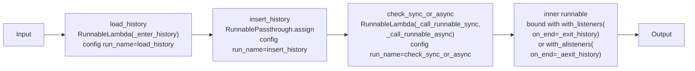
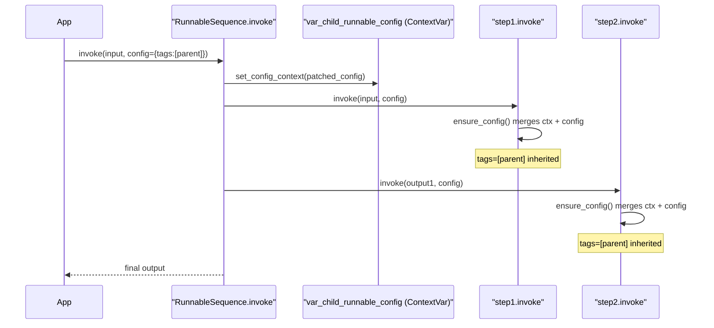

```

Internally this creates `RunnableAssign(RunnableParallel(kwargs))`.

### RunnablePick

`runnable.pick(keys)` appends a `RunnablePick` to the chain, filtering the output dict to only the specified key(s).

Sources: [libs/core/langchain_core/runnables/passthrough.py:74-420](), [libs/core/langchain_core/runnables/base.py:709-817]()

---

## RunnableWithFallbacks

`RunnableWithFallbacks` wraps a primary `Runnable` with one or more fallbacks. On exception, fallbacks are tried in order.

Created via `runnable.with_fallbacks(fallbacks, ...)`:

```python
model = primary_llm.with_fallbacks(
    [backup_llm_1, backup_llm_2],
    exceptions_to_handle=(RateLimitError, APIConnectionError),
)
```

| Constructor parameter | Type | Description |
|---|---|---|
| `runnable` | `Runnable` | Primary runnable to attempt first |
| `fallbacks` | `Sequence[Runnable]` | Ordered alternatives |
| `exceptions_to_handle` | `tuple[type[Exception], ...]` | Which exceptions trigger fallback |
| `exception_key` | `str \| None` | If set, the caught exception is injected into the input dict under this key before passing to the next fallback |

Sources: [libs/core/langchain_core/runnables/fallbacks.py:36-300]()

---

## RunnableWithMessageHistory

`RunnableWithMessageHistory` wraps an inner `Runnable` to automatically manage `BaseChatMessageHistory` — loading history before invocation and saving new messages after.

It extends `RunnableBindingBase` (not `RunnableSerializable` directly) and uses `with_listeners` on the inner runnable to hook `_exit_history` / `_aexit_history` onto the completion event.

### Constructor

| Parameter | Type | Description |
|---|---|---|
| `runnable` | `Runnable` | The chain to wrap |
| `get_session_history` | `Callable[..., BaseChatMessageHistory]` | Returns a history object for given session params |
| `input_messages_key` | `str \| None` | Key in input dict containing new user messages |
| `output_messages_key` | `str \| None` | Key in output dict containing AI response messages |
| `history_messages_key` | `str \| None` | Key to inject loaded history into input dict |
| `history_factory_config` | `list[ConfigurableFieldSpec]` | Config fields forwarded to `get_session_history` (default: `session_id`) |

### Invocation

The session key must be passed at runtime via `configurable`:

```python
chain_with_history.invoke(
    {"question": "What is cosine?"},
    config={"configurable": {"session_id": "user-123"}},
)
```

### Internal pipeline

**RunnableWithMessageHistory internal chain structure**



Sources: [libs/core/langchain_core/runnables/history.py:38-404]()

---

## RunnableConfig

`RunnableConfig` is a `TypedDict` (with `total=False`) defined in `libs/core/langchain_core/runnables/config.py`. It is the standard way to thread execution settings through a chain call.

### Fields

| Field | Type | Default | Description |
|---|---|---|---|
| `tags` | `list[str]` | `[]` | Labels for this run and all sub-runs; used for filtering in `astream_events` |
| `metadata` | `dict[str, Any]` | `{}` | Key-value pairs attached to the trace |
| `callbacks` | `Callbacks` | `None` | List of `BaseCallbackHandler` objects or a `CallbackManager` |
| `run_name` | `str` | class name | Name shown in LangSmith traces |
| `run_id` | `uuid.UUID \| None` | auto-generated | Unique ID for the top-level run |
| `max_concurrency` | `int \| None` | executor default | Max parallel workers in `batch` / `RunnableParallel` |
| `recursion_limit` | `int` | `25` | Max recursive chain depth (`DEFAULT_RECURSION_LIMIT`) |
| `configurable` | `dict[str, Any]` | `{}` | Runtime overrides for fields declared with `configurable_fields` |

### Config propagation

A `ContextVar` named `var_child_runnable_config` automatically propagates config down the call stack without explicit parameter threading. `ensure_config()` merges this inherited config with any explicitly passed config.

**RunnableConfig propagation through a chain call**



### Config utilities

| Function | Description |
|---|---|
| `ensure_config(config)` | Fills missing fields with defaults; merges with `var_child_runnable_config` |
| `merge_configs(*configs)` | Tags are unioned; metadata and `configurable` dicts are merged; last non-default `recursion_limit` wins |
| `patch_config(config, **overrides)` | Returns a new config with specific fields replaced |
| `get_config_list(config, length)` | Expands a single config to a per-input list for `batch` |

Sources: [libs/core/langchain_core/runnables/config.py:49-641]()

---

## Streaming Event APIs

### astream_log

`astream_log` yields `RunLogPatch` objects (JSON Patch operations). Accumulated patches reconstruct a `RunLog` with a `RunState` snapshot.

| Type | Description |
|---|---|
| `RunLogPatch` | List of JSON Patch ops; `+` operator accumulates into `RunLog` |
| `RunLog` | Subclass of `RunLogPatch`; holds current `RunState` |
| `RunState` | `id`, `streamed_output`, `final_output`, `name`, `type`, `logs` |
| `LogEntry` | Per-sub-run: `id`, `name`, `type`, `tags`, `metadata`, `streamed_output`, `final_output`, `start_time`, `end_time` |

Sources: [libs/core/langchain_core/tracers/log_stream.py:40-207]()

### astream_events

`astream_events` (version `"v1"` or `"v2"`) is the recommended streaming API for observing lifecycle events. It yields `StreamEvent` typed dicts powered by `_AstreamEventsCallbackHandler` in `event_stream.py`.

Each `StreamEvent` contains:

| Field | Type | Description |
|---|---|---|
| `event` | `str` | e.g. `"on_chain_start"`, `"on_chat_model_stream"`, `"on_tool_end"` |
| `name` | `str` | Component name |
| `run_id` | `str` | UUID of this run |
| `parent_ids` | `list[str]` | UUIDs of ancestor runs (v2 only) |
| `tags` | `list[str]` | Tags on this run |
| `metadata` | `dict` | Metadata on this run |
| `data` | `EventData` | Payload — contains `input`, `output`, `chunk`, or `error` |

**Event name patterns by component type:**

| Component | Events emitted |
|---|---|
| `RunnableSequence`, `RunnableLambda`, etc. | `on_chain_start`, `on_chain_stream`, `on_chain_end` |
| `BaseChatModel` | `on_chat_model_start`, `on_chat_model_stream`, `on_chat_model_end` |
| `BaseLLM` | `on_llm_start`, `on_llm_stream`, `on_llm_end` |
| `BaseTool` | `on_tool_start`, `on_tool_end`, `on_tool_error` |
| `BaseRetriever` | `on_retriever_start`, `on_retriever_end`, `on_retriever_error` |

Filtering parameters: `include_names`, `include_types`, `include_tags`, `exclude_names`, `exclude_types`, `exclude_tags`.

Sources: [libs/core/langchain_core/tracers/event_stream.py:58-200](), [libs/core/langchain_core/runnables/schema.py:1-120]()

---

## Modifier Methods

All `Runnable` objects inherit these builder methods, each returning a new `Runnable` without mutating the original:

| Method | Returns | Description |
|---|---|---|
| `bind(**kwargs)` | `RunnableBinding` | Pre-bind keyword args passed to `invoke` at call time |
| `with_config(config)` | `RunnableBinding` | Pre-set a default `RunnableConfig` |
| `with_retry(stop_after_attempt, wait_exponential_jitter, retry_if_exception_type)` | `RunnableRetry` | Wrap with configurable retry logic |
| `with_fallbacks(fallbacks, exceptions_to_handle)` | `RunnableWithFallbacks` | Add ordered fallback chains |
| `with_listeners(on_start, on_end, on_error)` | `RunnableBinding` | Attach sync lifecycle callbacks |
| `with_alisteners(on_start, on_end, on_error)` | `RunnableBinding` | Attach async lifecycle callbacks |
| `with_types(input_type, output_type)` | `RunnableBinding` | Override inferred type annotations |
| `configurable_fields(**fields)` | `RunnableConfigurableFields` | Expose named fields as runtime-configurable |
| `configurable_alternatives(field, **alternatives)` | `RunnableConfigurableAlternatives` | Expose alternative implementations selectable at runtime |
| `map()` | `RunnableEach` | Wrap to apply the runnable to each element of a list input |

Sources: [libs/core/langchain_core/runnables/base.py:618-820](), [libs/core/langchain_core/runnables/configurable.py:49-350]()

---

## Configurable Fields

`configurable_fields` allows specific Pydantic fields of a `RunnableSerializable` subclass to be overridden at runtime via `RunnableConfig.configurable`.

```python
llm = FakeListLLM(responses=["a"]).configurable_fields(
    responses=ConfigurableField(
        id="llm_responses",
        name="LLM Responses",
        description="Override responses",
    )
)
result = llm.with_config(configurable={"llm_responses": ["custom"]}).invoke("...")
```

### ConfigurableField types

| Type | Description |
|---|---|
| `ConfigurableField` | Free-form override of any type |
| `ConfigurableFieldSingleOption` | Restricts to a named set of values (radio buttons) |
| `ConfigurableFieldMultiOption` | Restricts to a named set of values (checkboxes) |

All types share:

| Attribute | Description |
|---|---|
| `id` | Key used in `configurable` dict |
| `name` | Human-readable label |
| `description` | Human-readable description |
| `is_shared` | If `True`, this field is shared across all instances in a chain (not prefixed with step name) |

### configurable_alternatives

`configurable_alternatives(field, **alternatives)` exposes alternative implementations selectable by a single `configurable` key:

```python
llm = base_llm.configurable_alternatives(
    ConfigurableField(id="llm"),
    fast=fast_llm,
    smart=smart_llm,
)