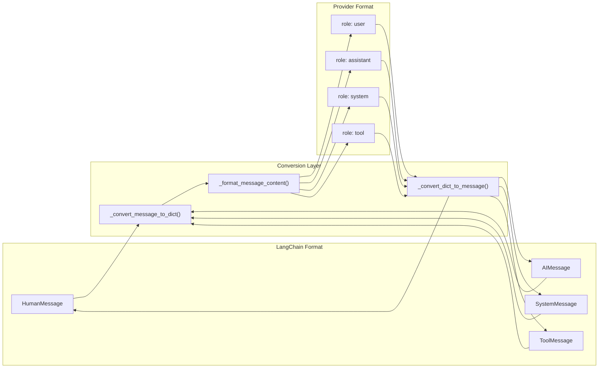
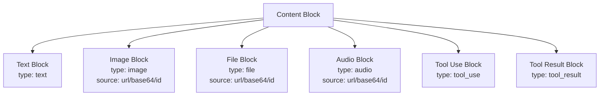
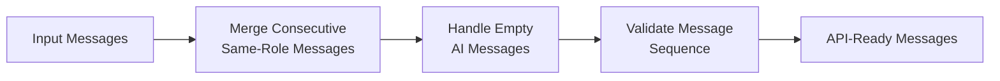
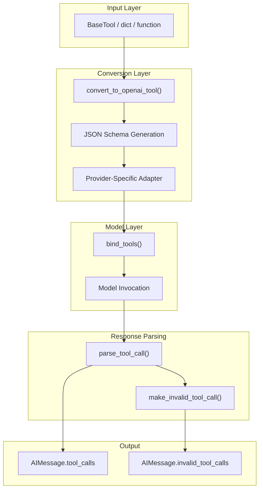
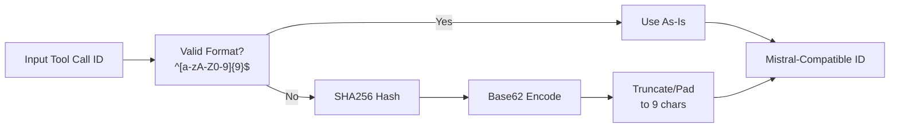
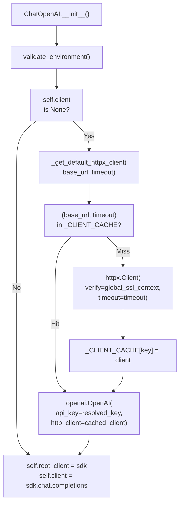

## Purpose and Scope

This page documents the common implementation patterns used across all LangChain provider integrations. These patterns ensure consistency, reliability, and maintainability across the ecosystem.

**Core patterns covered:**
1. **Client initialization with authentication** - Cached HTTP clients with SSL verification
2. **API key resolution** - Environment variables, direct strings, and callables
3. **Streaming response handling** - Chunk aggregation and usage metadata
4. **Usage metadata tracking** - Token counts and provider-specific details
5. **Error handling strategies** - Provider-specific error enhancement

**Key implementation classes and functions:**

| Pattern | Primary Functions/Classes | Files |
|---------|--------------------------|-------|
| Client initialization | `_get_default_httpx_client()`, `_CLIENT_CACHE` | `_client_utils.py` |
| API key resolution | `secret_from_env()`, `_resolve_sync_and_async_api_keys()` | `chat_models/base.py`, `_client_utils.py` |
| Message conversion | `_convert_message_to_dict()`, `_convert_dict_to_message()` | `chat_models.py` |
| Streaming | `_stream()`, `_astream()`, chunk aggregation via `+` operator | `chat_models/base.py` |
| Usage metadata | `UsageMetadata`, `InputTokenDetails`, `OutputTokenDetails` | Response parsing |
| Error handling | `_handle_*_bad_request()`, context-specific exceptions | `chat_models/base.py` |

**Related pages:**
- See pages 3.1-3.4 for provider-specific implementations
- See page 2.2 for `BaseChatModel` interface
- See page 5.1 for standard test requirements

**Sources:**
- [libs/partners/openai/langchain_openai/chat_models/base.py:1-200]()
- [libs/partners/anthropic/langchain_anthropic/chat_models.py:1-100]()
- [libs/partners/openai/langchain_openai/chat_models/_client_utils.py]()

---

## Message Conversion Architecture

All provider integrations implement bidirectional message conversion between LangChain's standardized message format and provider-specific API formats.



### Message Conversion Functions

Each provider implements three core conversion functions:

| Function | Purpose | Common Signatures |
|----------|---------|-------------------|
| `_convert_message_to_dict()` | Convert LangChain message to API dict | `(BaseMessage) -> dict` |
| `_convert_dict_to_message()` | Convert API dict to LangChain message | `(dict) -> BaseMessage` |
| `_format_message_content()` | Format content blocks for API | `(Any) -> Any` |

**Sources:**
- [libs/partners/openai/langchain_openai/chat_models/base.py:160-225]()
- [libs/partners/openai/langchain_openai/chat_models/base.py:288-365]()
- [libs/partners/anthropic/langchain_anthropic/chat_models.py:410-651]()
- [libs/partners/mistralai/langchain_mistralai/chat_models.py:144-201]()

### Content Block Handling

Content blocks represent multimodal data (text, images, files, audio) in a standardized format. Each provider must convert between LangChain's standard content blocks and its native format.

#### Standard Content Block Types



#### Provider-Specific Conversions

**OpenAI:**
- Handles `image_url` blocks with data URIs
- Filters out unsupported block types (e.g., `tool_use`, `thinking`)
- Converts data content blocks via `convert_to_openai_data_block()`

**Anthropic:**
- Formats image blocks with source types: `base64`, `url`, `file`
- Converts file blocks to document blocks
- Preserves `cache_control`, `citations`, and `thinking` blocks

**Mistral:**
- Uses OpenAI-compatible format
- Handles thinking blocks for reasoning models

**Sources:**
- [libs/partners/openai/langchain_openai/chat_models/base.py:227-285]()
- [libs/partners/anthropic/langchain_anthropic/chat_models.py:284-407]()
- [libs/partners/mistralai/langchain_mistralai/chat_models.py:203-285]()

### Message Merging and Preprocessing

Some providers require preprocessing steps before sending messages to the API.



**Anthropic's `_merge_messages()` pattern:**
- Merges consecutive `HumanMessage` and `ToolMessage` into single messages
- Converts `ToolMessage` to `HumanMessage` with `tool_result` content blocks
- Required because Anthropic's API expects alternating user/assistant messages

**OpenAI's preprocessing:**
- Handles dual API support (Chat Completions vs Responses API)
- Filters content blocks based on API version
- Manages `previous_response_id` for conversation continuation

**Sources:**
- [libs/partners/anthropic/langchain_anthropic/chat_models.py:236-281]()
- [libs/partners/openai/langchain_openai/chat_models/base.py:1584-1667]()

---

## Tool Calling Standardization

Tool calling follows a consistent pattern across all providers, with provider-specific adaptations.



### Tool Binding Implementation

All providers implement `bind_tools()` with similar signatures:

```python
def bind_tools(
    self,
    tools: Sequence[dict | type | Callable | BaseTool],
    *,
    tool_choice: Optional[Union[dict, str, Literal["auto", "any"], bool]] = None,
    **kwargs: Any,
) -> Runnable[LanguageModelInput, BaseMessage]:
```

**Common patterns:**
1. Convert tools to provider format using `convert_to_openai_tool()` or provider-specific converter
2. Handle built-in tools (e.g., Anthropic's `computer_use`, `web_search`)
3. Set `tool_choice` parameter for forcing tool usage
4. Return `RunnableBinding` with tools in kwargs

**Sources:**
- [libs/partners/openai/langchain_openai/chat_models/base.py:1775-1852]()
- [libs/partners/anthropic/langchain_anthropic/chat_models.py:1420-1510]()
- [libs/partners/mistralai/langchain_mistralai/chat_models.py:674-753]()
- [libs/partners/groq/langchain_groq/chat_models.py:451-517]()

### Tool Call ID Handling

Different providers have different requirements for tool call IDs:

| Provider | ID Requirements | Conversion Strategy |
|----------|----------------|---------------------|
| **OpenAI** | Any string | Use as-is |
| **Anthropic** | Any string | Use as-is |
| **Mistral** | 9-char alphanumeric (a-zA-Z0-9) | Hash and base62 encode if invalid |
| **Groq** | Any string | Use as-is |

**Mistral's Tool Call ID Conversion:**



**Sources:**
- [libs/partners/mistralai/langchain_mistralai/chat_models.py:86-142]()

### Built-in Tool Support

Anthropic provides several built-in tools that are passed through directly without conversion:

| Built-in Tool Prefix | Beta Header | Purpose |
|---------------------|-------------|---------|
| `computer_*` | `computer-use-2025-11-24` | Computer control |
| `web_search_*` | N/A | Web search |
| `web_fetch_*` | `web-fetch-2025-09-10` | Web fetching |
| `code_execution_*` | `code-execution-2025-08-25` | Code execution |
| `bash_*` | N/A | Bash execution |
| `text_editor_*` | N/A | Text editing |
| `mcp_toolset` | `mcp-client-2025-11-20` | MCP tools |
| `memory_*` | `context-management-2025-06-27` | Memory management |
| `tool_search_*` | `advanced-tool-use-2025-11-20` | Tool search |

**Detection pattern:**

```python
def _is_builtin_tool(tool: Any) -> bool:
    if not isinstance(tool, dict):
        return False
    tool_type = tool.get("type")
    if not tool_type or not isinstance(tool_type, str):
        return False
    return any(tool_type.startswith(prefix) for prefix in _BUILTIN_TOOL_PREFIXES)
```

**Sources:**
- [libs/partners/anthropic/langchain_anthropic/chat_models.py:134-187]()

---

## Client Initialization with Authentication

Provider integrations use a consistent pattern for HTTP client initialization with caching and SSL verification. This reduces connection overhead and ensures secure communication.

**Diagram: Client Initialization Flow with `_CLIENT_CACHE`**



**Sources:**
- [libs/partners/openai/langchain_openai/chat_models/_client_utils.py]()
- [libs/partners/openai/langchain_openai/chat_models/base.py:973-1010]()
- [libs/partners/anthropic/langchain_anthropic/_client_utils.py]()

### Implementation Steps

**Step 1: Create `_client_utils.py` module**

Define client cache and factory function:

```python