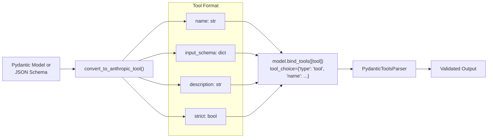

def with_structured_output(
    schema: dict | type,
    *,
    include_raw: bool = False,
    method: Literal["function_calling"] = "function_calling",
    **kwargs: Any,
) -> Runnable:
```

**Key Differences from OpenAI:**

1. **No Native JSON Schema**: Anthropic doesn't have a native `json_schema` response format
2. **Tool Calling Default**: Always uses `method="function_calling"`
3. **Strict Schema Validation**: Supports `strict=True` parameter for enhanced validation

Sources: [libs/partners/anthropic/langchain_anthropic/chat_models.py:1100-1300]()

### Tool Conversion Process



Sources: [libs/partners/anthropic/langchain_anthropic/chat_models.py:1100-1300](), [libs/partners/anthropic/langchain_anthropic/chat_models.py:99-122]()

## Mistral Implementation

### with_structured_output Method

Mistral supports both native JSON mode and tool-based approaches:

```python