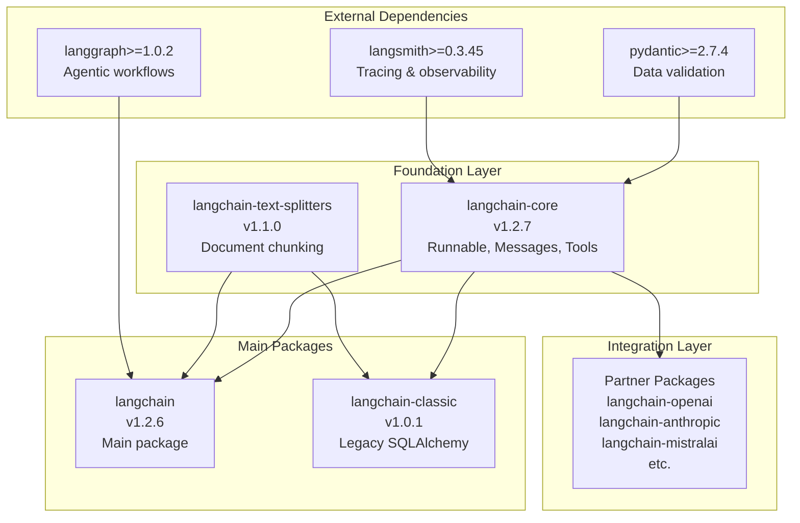
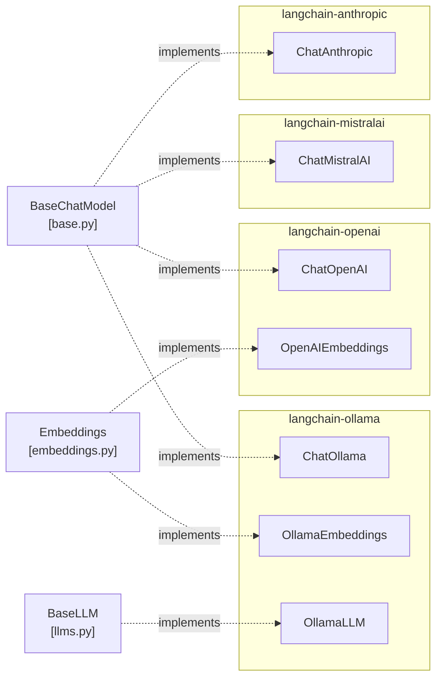
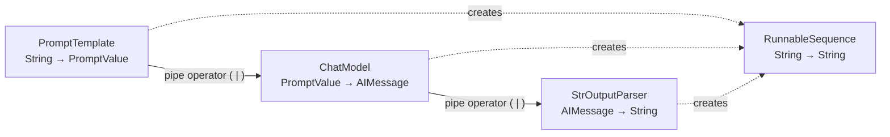

## Purpose and Scope

LangChain is a modular framework for building applications with Large Language Models (LLMs) through composability. The repository implements a foundational abstraction layer that enables developers to chain together LLM calls, tools, retrievers, and other components into complex workflows. This document covers the core architecture, package structure, and foundational abstractions that make up the LangChain ecosystem.

For details on specific provider integrations (OpenAI, Anthropic, etc.), see [Provider Integrations](#3). For application development patterns including agents and middleware, see [Application Development](#4). For testing infrastructure, see [Testing and Quality Assurance](#5).

Sources: [libs/core/pyproject.toml:6-7](), [libs/langchain_v1/pyproject.toml:6-7]()

---

## Architecture at a Glance



**Package Dependency Structure**

The repository follows a layered architecture where `langchain-core` provides base abstractions that all other packages depend on. The main `langchain` package (v1.2.6) integrates with LangGraph for agentic capabilities, while `langchain-classic` (v1.0.1) maintains backward compatibility with older SQLAlchemy-based patterns.

Sources: [libs/core/pyproject.toml:1-23](), [libs/langchain_v1/pyproject.toml:1-18](), [libs/langchain/pyproject.toml:1-23]()

---

## Package Ecosystem

### Core Package Structure

| Package | Version | Purpose | Key Dependencies |
|---------|---------|---------|------------------|
| `langchain-core` | 1.2.7 | Base abstractions: `Runnable`, `BaseMessage`, `BaseTool` | `pydantic>=2.7.4`, `langsmith>=0.3.45`, `tenacity>=8.1.0` |
| `langchain` | 1.2.6 | Main package with LangGraph integration | `langchain-core>=1.2.7`, `langgraph>=1.0.2` |
| `langchain-classic` | 1.0.1 | Legacy support with SQLAlchemy | `langchain-core>=1.2.5`, `SQLAlchemy>=1.4.0` |
| `langchain-text-splitters` | 1.1.0 | Document chunking utilities | `langchain-core>=1.2.0` |

**Version Coordination**: All packages require Python >=3.10.0, <4.0.0. The core package uses strict version pinning for critical dependencies like Pydantic (>=2.7.4, <3.0.0) to ensure API stability.

Sources: [libs/core/pyproject.toml:12-23](), [libs/langchain_v1/pyproject.toml:12-18](), [libs/langchain/pyproject.toml:12-23](), [libs/text-splitters/pyproject.toml:12-16]()

### Partner Integration Architecture



**Optional Dependencies**: The main `langchain` package defines optional dependencies for each provider (e.g., `langchain[openai]`, `langchain[anthropic]`), allowing users to install only the integrations they need.

Sources: [libs/langchain_v1/pyproject.toml:20-37](), [libs/langchain/pyproject.toml:25-42]()

---

## The Runnable Interface

### Core Abstraction

The `Runnable[Input, Output]` interface is the foundational abstraction enabling LangChain's composability. Every component—language models, tools, retrievers, prompts—implements this interface, providing consistent methods for invocation, streaming, and batching.

```mermaid
graph TB
    Runnable["Runnable&lt;Input, Output&gt;<br/>[runnables/base.py:124]"]
    
    subgraph "Invocation Methods"
        invoke["invoke(input, config)<br/>→ Output"]
        ainvoke["ainvoke(input, config)<br/>→ Output"]
        batch["batch(inputs, config)<br/>→ list[Output]"]
        abatch["abatch(inputs, config)<br/>→ list[Output]"]
    end
    
    subgraph "Streaming Methods"
        stream["stream(input, config)<br/>→ Iterator[Output]"]
        astream["astream(input, config)<br/>→ AsyncIterator[Output]"]
        astream_events["astream_events(input)<br/>→ AsyncIterator[StreamEvent]"]
    end
    
    subgraph "Composition Primitives"
        pipe["pipe(*others)<br/>Creates RunnableSequence"]
        parallel["RunnableParallel<br/>Concurrent execution"]
        lambda["RunnableLambda<br/>Wraps functions"]
    end
    
    Runnable --> invoke
    Runnable --> ainvoke
    Runnable --> batch
    Runnable --> abatch
    Runnable --> stream
    Runnable --> astream
    Runnable --> astream_events
    Runnable --> pipe
    Runnable --> parallel
    Runnable --> lambda
```



**Key Methods**:
- `invoke()` / `ainvoke()`: Transform a single input into an output (lines 821-865)
- `batch()` / `abatch()`: Process multiple inputs efficiently (lines 867-1001)
- `stream()` / `astream()`: Stream output as it's produced (lines 1248-1427)
- `pipe()` / `|` operator: Chain runnables sequentially (lines 660-707)

Sources: [libs/core/langchain_core/runnables/base.py:124-256](), [libs/core/langchain_core/runnables/base.py:821-1427]()

### Composition with LCEL



The pipe operator (`|`) or `pipe()` method creates a `RunnableSequence` that executes components in order. The `RunnableParallel` (created with dict literals) executes multiple runnables concurrently with the same input.

**Example Pattern**:
```python