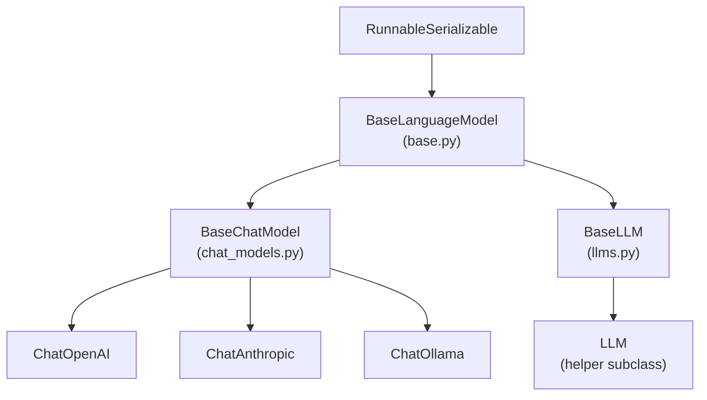
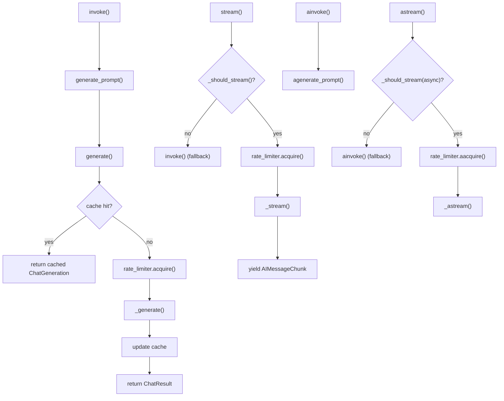
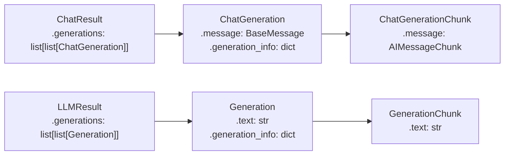

This page documents the abstract base classes and factory functions that define how language models are integrated in LangChain: `BaseLanguageModel`, `BaseChatModel`, `BaseLLM`, and the `init_chat_model` factory. It covers the class hierarchy, abstract methods implementors must provide, and runtime features such as caching, rate limiting, streaming control, and output versioning.

For the `Runnable` base interface that all language models inherit, see [2.1](#2.1). For specific partner integrations (OpenAI, Anthropic, etc.), see [3.1](#3.1) and [3.2](#3.2). For provider-agnostic patterns across integrations, see [3.5](#3.5).

---

## Class Hierarchy

All language model wrappers inherit from `BaseLanguageModel`, which itself extends `RunnableSerializable`. Two concrete branches exist:

- **`BaseChatModel`** — accepts structured message lists and returns `AIMessage`. Used by all modern providers.
- **`BaseLLM`** — accepts raw strings and returns `str`. Used by older completion-style APIs.

**Language Model Inheritance**



Sources: [libs/core/langchain_core/language_models/base.py:139-141](), [libs/core/langchain_core/language_models/chat_models.py:246-294](), [libs/core/langchain_core/language_models/llms.py:292-296]()

---

## BaseLanguageModel

Defined in [libs/core/langchain_core/language_models/base.py:139-373]().

`BaseLanguageModel` is a generic abstract class parameterized by its output type (`AIMessage` for chat models, `str` for LLMs). It defines fields and utilities shared by all model wrappers.

### Fields

| Field | Type | Default | Description |
|---|---|---|---|
| `cache` | `BaseCache \| bool \| None` | `None` | Response caching. `True` = global cache, `False` = no cache, `None` = use global if set, `BaseCache` instance = that cache. |
| `verbose` | `bool` | global setting | Whether to print response text. |
| `callbacks` | `Callbacks` | `None` | Callbacks attached to all runs from this instance. |
| `tags` | `list[str] \| None` | `None` | Tags added to all run traces. |
| `metadata` | `dict[str, Any] \| None` | `None` | Metadata added to all run traces. |
| `custom_get_token_ids` | `Callable[[str], list[int]] \| None` | `None` | Optional custom tokenizer for token counting. |

Sources: [libs/core/langchain_core/language_models/base.py:148-174]()

### Token Counting Methods

| Method | Description |
|---|---|
| `get_token_ids(text)` | Returns ordered list of token IDs. Uses `custom_get_token_ids` if set, otherwise falls back to GPT-2 tokenizer. |
| `get_num_tokens(text)` | Returns the count of tokens in `text`. |
| `get_num_tokens_from_messages(messages, tools)` | Returns total token count across a list of `BaseMessage` objects. |

The fallback tokenizer (`_get_token_ids_default_method`) uses the GPT-2 tokenizer from the `transformers` package and emits a warning noting that counts may be inaccurate for non-GPT-2 models. Provider subclasses should override these methods with model-specific tokenizers.

Sources: [libs/core/langchain_core/language_models/base.py:307-373]()

### Abstract Methods

`BaseLanguageModel` requires subclasses to implement:

- `generate_prompt(prompts, stop, callbacks, **kwargs) -> LLMResult`
- `agenerate_prompt(prompts, stop, callbacks, **kwargs) -> LLMResult`
- `with_structured_output(schema, **kwargs) -> Runnable` (optional, raises `NotImplementedError` by default)

### Type Aliases

| Alias | Value | Description |
|---|---|---|
| `LanguageModelInput` | `PromptValue \| str \| Sequence[MessageLikeRepresentation]` | Accepted input types |
| `LanguageModelOutput` | `BaseMessage \| str` | Output type |
| `LanguageModelLike` | `Runnable[LanguageModelInput, LanguageModelOutput]` | Duck-type for anything that behaves like a model |

Sources: [libs/core/langchain_core/language_models/base.py:122-132]()

---

## BaseChatModel

Defined in [libs/core/langchain_core/language_models/chat_models.py:246-]().

`BaseChatModel` extends `BaseLanguageModel[AIMessage]`. Partner integrations subclass this and implement a small set of methods.

### Additional Fields

| Field | Type | Default | Description |
|---|---|---|---|
| `rate_limiter` | `BaseRateLimiter \| None` | `None` | Controls request throughput. Called with `acquire()`/`aacquire()` before each API call during streaming. |
| `disable_streaming` | `bool \| Literal["tool_calling"]` | `False` | Controls when streaming is bypassed (see below). |
| `output_version` | `str \| None` | env `LC_OUTPUT_VERSION` | Content format stored in `AIMessage`. `'v1'` = standardized blocks; `'v0'` = provider-specific. |
| `profile` | `ModelProfile \| None` | `None` | Beta. Model capability profile (context window, supported modalities, etc.). Auto-loaded from partner package if available. |

Sources: [libs/core/langchain_core/language_models/chat_models.py:296-358]()

### Abstract Methods for Implementors

Custom chat models must implement `_generate`. All others are optional.

| Method | Required | Signature | Description |
|---|---|---|---|
| `_generate` | **Yes** | `(messages, stop, run_manager, **kwargs) -> ChatResult` | Core invocation logic. |
| `_llm_type` | **Yes** (property) | `-> str` | Unique string identifier for logging. |
| `_identifying_params` | No (property) | `-> Mapping[str, Any]` | Model parameters for tracing. |
| `_stream` | No | `(messages, stop, run_manager, **kwargs) -> Iterator[ChatGenerationChunk]` | Sync streaming. |
| `_agenerate` | No | `(messages, stop, run_manager, **kwargs) -> ChatResult` | Native async generation. |
| `_astream` | No | `(messages, stop, run_manager, **kwargs) -> AsyncIterator[ChatGenerationChunk]` | Async streaming. |

Sources: [libs/core/langchain_core/language_models/chat_models.py:280-294]()

**Method dispatch and call flow**



Sources: [libs/core/langchain_core/language_models/chat_models.py:388-733]()

### Streaming Control: `disable_streaming`

The `_should_stream` method [libs/core/langchain_core/language_models/chat_models.py:439-477]() decides whether to use the streaming API for a given call. The `disable_streaming` field controls this:

| Value | Effect |
|---|---|
| `False` (default) | Always use streaming if `_stream`/`_astream` is implemented. |
| `True` | Always bypass streaming; `stream()`/`astream()` fall back to `invoke()`/`ainvoke()`. |
| `"tool_calling"` | Bypass streaming only when a `tools` keyword argument is provided. |

Additionally, if a `_StreamingCallbackHandler` is present in the active callback managers, streaming will be activated even if not explicitly requested.

Sources: [libs/core/langchain_core/language_models/chat_models.py:299-315](), [libs/core/langchain_core/language_models/chat_models.py:439-477]()

### Output Versioning: `output_version`

The `output_version` field controls the format of content stored in `AIMessage.content` for streamed responses. When set to `'v1'`, the `_update_message_content_to_blocks` utility is called on each chunk to rewrite content into a standardized block format consistent with `AIMessage.content_blocks`. The `'v0'` format preserves provider-specific content representations. This can also be set via the environment variable `LC_OUTPUT_VERSION`.

Sources: [libs/core/langchain_core/language_models/chat_models.py:317-338]()

### Caching Behavior

Caching applies at the `generate()` level (not streaming). The cache key is built by `_get_llm_string()`, which serializes the model configuration and call parameters. On a cache hit, stored `ChatGeneration` objects are returned; on a cache miss, `_generate()` is called and the result is stored.

For cached responses, the `total_cost` field in `usage_metadata` is set to `0` [libs/core/langchain_core/language_models/chat_models.py:740-778]().

Sources: [libs/core/langchain_core/language_models/chat_models.py:830-843](), [libs/core/tests/unit_tests/language_models/chat_models/test_cache.py:42-101]()

### Declarative Methods

| Method | Description |
|---|---|
| `bind_tools(tools, **kwargs)` | Returns a new Runnable that always passes `tools` to the model. |
| `with_structured_output(schema, **kwargs)` | Returns a chain that coerces model output to `schema`. Must be implemented by subclasses. |
| `with_retry(**kwargs)` | Wraps the model with retry logic (inherited from `Runnable`). |
| `with_fallbacks(fallbacks, **kwargs)` | Wraps the model with fallback models on failure. |
| `configurable_fields(**kwargs)` | Makes specified init fields configurable at runtime. |
| `configurable_alternatives(which, **kwargs)` | Makes the model swappable at runtime. |

### LangSmith Tracing Parameters

`_get_ls_params()` produces a `LangSmithParams` dict for tracing. It auto-extracts `model`/`model_name`, `temperature`, and `max_tokens` from instance attributes or kwargs. The `ls_model_type` is always `'chat'` for `BaseChatModel`.

The `LangSmithParams` TypedDict is defined in [libs/core/langchain_core/language_models/base.py:49-72]().

---

## BaseLLM

Defined in [libs/core/langchain_core/language_models/llms.py:292-]().

`BaseLLM` extends `BaseLanguageModel[str]`. It accepts and returns plain strings. Its `invoke()` returns `str`; its `stream()` yields `str` chunks.

### Abstract Methods

| Method | Required | Description |
|---|---|---|
| `_generate(prompts, stop, run_manager, **kwargs) -> LLMResult` | **Yes** | Takes a list of string prompts and returns an `LLMResult`. |
| `_stream(prompt, stop, run_manager, **kwargs) -> Iterator[GenerationChunk]` | No | Sync streaming. Raises `NotImplementedError` by default. |
| `_agenerate(prompts, stop, run_manager, **kwargs) -> LLMResult` | No | Async generation. Defaults to running `_generate` in a thread executor. |
| `_astream(prompt, stop, run_manager, **kwargs) -> AsyncIterator[GenerationChunk]` | No | Async streaming. Defaults to wrapping `_stream` in an executor. |

The `LLM` helper class (a concrete subclass of `BaseLLM`) simplifies implementation by exposing a single `_call(prompt, stop, run_manager, **kwargs) -> str` method.

### Batch Behavior

`BaseLLM.batch()` overrides the default `Runnable` batching behavior. If `max_concurrency` is not set in the config, it calls `generate_prompt()` once with all prompts (enabling providers that support native batching). If `max_concurrency` is set, it splits inputs into chunks and processes them sequentially.

Sources: [libs/core/langchain_core/language_models/llms.py:416-461]()

---

## init_chat_model Factory

Defined in [libs/langchain_v1/langchain/chat_models/base.py:208-488]().

`init_chat_model` is the primary entry point for provider-agnostic model initialization. It is exported from the `langchain` package as `langchain.chat_models.init_chat_model`.

### Behavior Overview

```mermaid
flowchart TD
    call["init_chat_model(model, model_provider, configurable_fields, ...)"]
    parse["_parse_model(model, model_provider)"]
    infer["_attempt_infer_model_provider(model_name)"]
    registry["_BUILTIN_PROVIDERS lookup"]
    creator["_get_chat_model_creator(provider)"]
    fixed["return BaseChatModel instance"]
    configurable["return _ConfigurableModel instance"]

    call --> has_configurable{"configurable_fields set?"}
    has_configurable -- "no (and model given)" --> parse
    parse --> infer
    infer --> registry
    registry --> creator
    creator --> fixed

    has_configurable -- "yes (or no model given)" --> configurable
```

Sources: [libs/langchain_v1/langchain/chat_models/base.py:208-499]()

### Parameters

| Parameter | Type | Description |
|---|---|---|
| `model` | `str \| None` | Model name, optionally prefixed with `provider:` (e.g. `"openai:gpt-4o"`). |
| `model_provider` | `str \| None` | Explicit provider key. Inferred from model name if omitted. |
| `configurable_fields` | `None \| "any" \| list[str] \| tuple[str, ...]` | Which fields can be overridden at runtime via `RunnableConfig`. |
| `config_prefix` | `str \| None` | Prefix for configurable keys, e.g. `"foo"` makes `model` configurable as `"foo_model"`. |
| `**kwargs` | `Any` | Passed directly to the provider's chat model constructor (e.g. `temperature`, `max_tokens`). |

### Provider Inference

The `_attempt_infer_model_provider` function [libs/langchain_v1/langchain/chat_models/base.py:502-566]() maps model name prefixes to providers:

| Model prefix | Inferred provider |
|---|---|
| `gpt-`, `o1`, `o3`, `chatgpt`, `text-davinci` | `openai` |
| `claude` | `anthropic` |
| `command` | `cohere` |
| `accounts/fireworks` | `fireworks` |
| `gemini` | `google_vertexai` |
| `amazon.`, `anthropic.`, `meta.` | `bedrock` |
| `mistral`, `mixtral` | `mistralai` |
| `deepseek` | `deepseek` |
| `grok` | `xai` |
| `sonar` | `perplexity` |
| `solar` | `upstage` |

The `provider:model` format (e.g. `"anthropic:claude-opus-4-1"`) is also parsed directly and takes precedence over inference.

### The `_BUILTIN_PROVIDERS` Registry

`_BUILTIN_PROVIDERS` [libs/langchain_v1/langchain/chat_models/base.py:38-98]() is a `dict` mapping provider keys to `(module_path, class_name, creator_func)` tuples. It is used by `_get_chat_model_creator()` (LRU-cached) to import and instantiate the appropriate class on first use.

| Provider key | Module | Class |
|---|---|---|
| `openai` | `langchain_openai` | `ChatOpenAI` |
| `anthropic` | `langchain_anthropic` | `ChatAnthropic` |
| `azure_openai` | `langchain_openai` | `AzureChatOpenAI` |
| `google_vertexai` | `langchain_google_vertexai` | `ChatVertexAI` |
| `groq` | `langchain_groq` | `ChatGroq` |
| `mistralai` | `langchain_mistralai` | `ChatMistralAI` |
| `ollama` | `langchain_ollama` | `ChatOllama` |
| `deepseek` | `langchain_deepseek` | `ChatDeepSeek` |
| `xai` | `langchain_xai` | `ChatXAI` |
| `perplexity` | `langchain_perplexity` | `ChatPerplexity` |
| `fireworks` | `langchain_fireworks` | `ChatFireworks` |
| _(and more)_ | | |

### Return Types

| Condition | Return type |
|---|---|
| `model` given, `configurable_fields` is `None` | A fully-initialized `BaseChatModel` instance. |
| `model` not given (or `configurable_fields` set) | A `_ConfigurableModel` that defers initialization until `invoke()` is called with a config. |

### `_ConfigurableModel`

`_ConfigurableModel` [libs/langchain_v1/langchain/chat_models/base.py:607-]() is a `Runnable` that acts as a proxy. It stores default parameters and a queue of deferred declarative operations (e.g. `bind_tools`, `with_structured_output`). On each `invoke()`/`stream()` call, it:

1. Merges default config with runtime `config["configurable"]` values.
2. Instantiates the appropriate `BaseChatModel` via `_init_chat_model_helper`.
3. Replays queued declarative operations on the model.
4. Forwards the call to the resulting model.

This design allows calling `bind_tools()` or `with_structured_output()` on a configurable model before the provider is known.

**Security note:** Setting `configurable_fields="any"` allows runtime override of fields like `api_key` and `base_url`. Use explicit field lists when accepting untrusted configurations.

Sources: [libs/langchain_v1/langchain/chat_models/base.py:607-659](), [libs/langchain_v1/tests/unit_tests/chat_models/test_chat_models.py:114-236]()

---

## Output Types

**Generation wrapper types used internally**



`BaseChatModel` produces `ChatResult` internally; public `invoke()` unwraps this to return the `AIMessage` directly. The streaming methods yield `AIMessageChunk` objects.

Sources: [libs/core/langchain_core/language_models/chat_models.py:54-63]()

---

## Implementing a Custom Chat Model

Minimum required implementation:

```
class MyChatModel(BaseChatModel):
    model: str

    @property
    def _llm_type(self) -> str:
        return "my-chat-model"

    def _generate(
        self,
        messages: list[BaseMessage],
        stop: list[str] | None = None,
        run_manager: CallbackManagerForLLMRun | None = None,
        **kwargs: Any,
    ) -> ChatResult:
        # Call your API here
        response_text = call_my_api(messages)
        return ChatResult(
            generations=[ChatGeneration(message=AIMessage(content=response_text))]
        )
```

To add streaming, implement `_stream` yielding `ChatGenerationChunk` objects wrapping `AIMessageChunk`. To add async, implement `_agenerate` and/or `_astream`.

Sources: [libs/core/langchain_core/language_models/chat_models.py:280-294](), [libs/core/tests/unit_tests/language_models/chat_models/test_base.py:186-215]()

---

## Fake Models for Testing

`langchain_core` ships several fake implementations for unit tests:

| Class | Module | Description |
|---|---|---|
| `FakeListChatModel` | `fake_chat_models.py` | Cycles through a list of string responses. |
| `FakeMessagesListChatModel` | `fake_chat_models.py` | Cycles through a list of `BaseMessage` responses. |
| `FakeChatModel` | `fake_chat_models.py` | Always returns `"fake response"`. |
| `GenericFakeChatModel` | `fake_chat_models.py` | Accepts an `Iterator[AIMessage]`; streams by splitting on word boundaries. |
| `ParrotFakeChatModel` | (exported from `language_models`) | Returns the last message in the input unchanged. |
| `FakeListLLM` | `fake_llms.py` | `BaseLLM` equivalent of `FakeListChatModel`. |

Sources: [libs/core/langchain_core/language_models/fake_chat_models.py:21-390]()