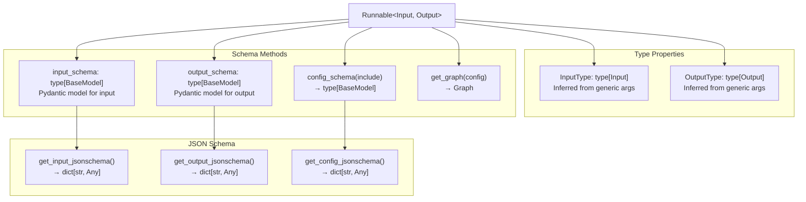
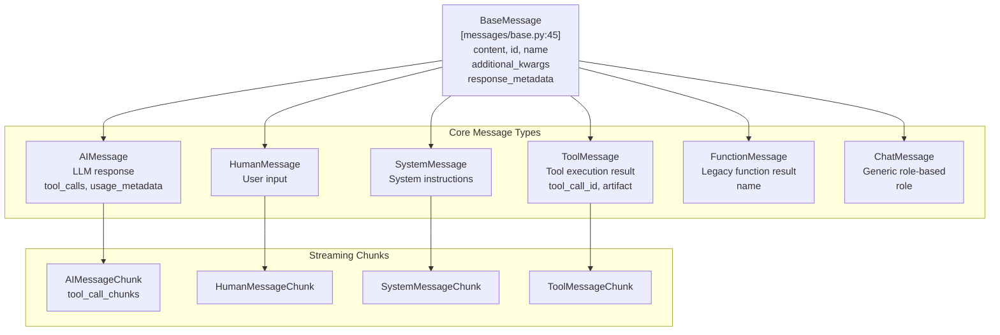
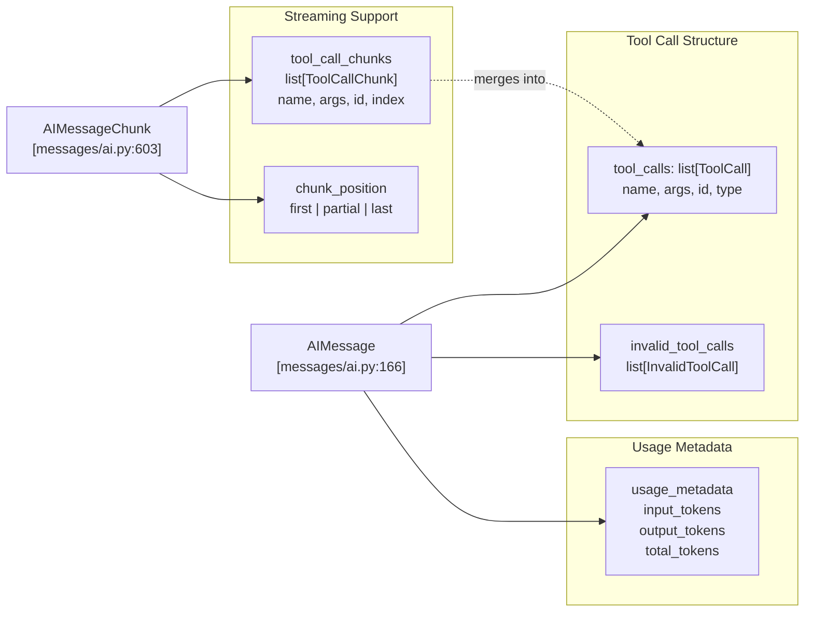
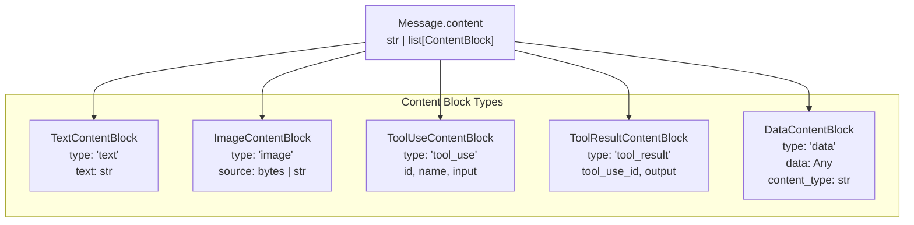
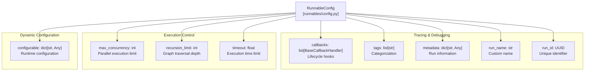
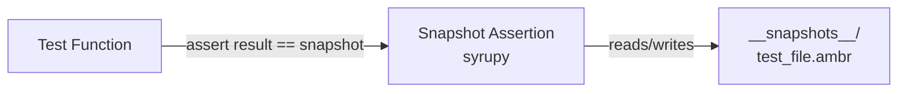
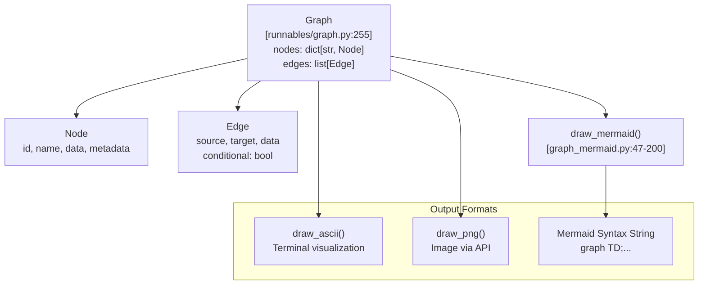
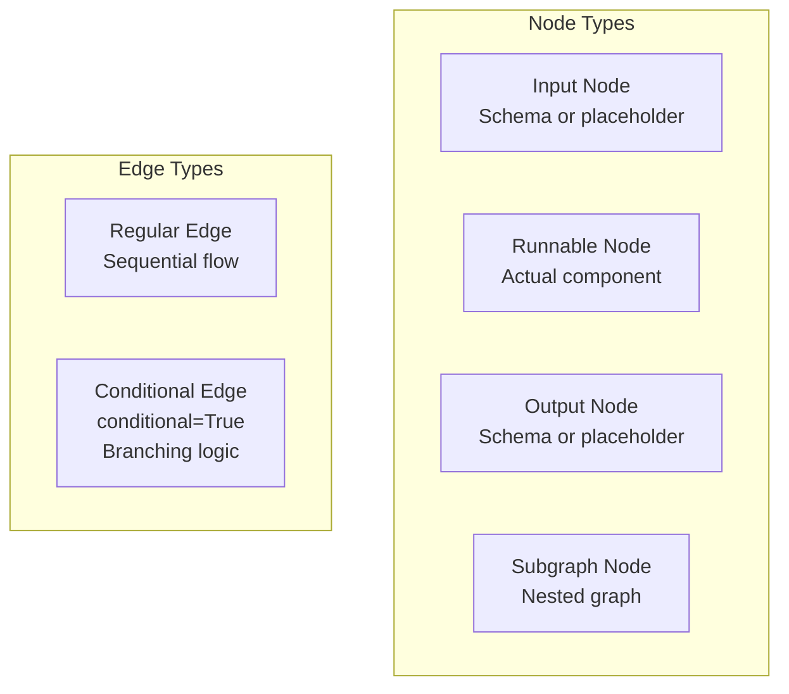
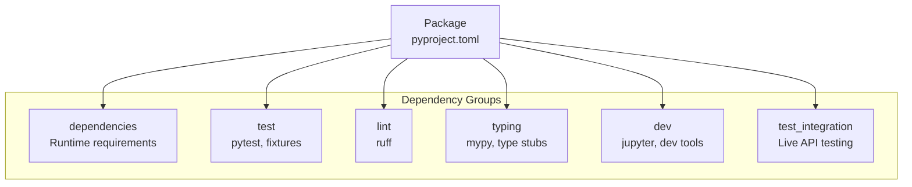

parallel_chain = RunnableLambda(lambda x: x + 1) | {
    "mul_2": RunnableLambda(lambda x: x * 2),
    "mul_5": RunnableLambda(lambda x: x * 5),
}
parallel_chain.invoke(1)  # Returns {'mul_2': 4, 'mul_5': 10}
```

Sources: [libs/core/langchain_core/runnables/base.py:618-707](), [libs/core/langchain_core/runnables/base.py:173-188]()

### Schema Introspection



The `Runnable` interface exposes type information and JSON schemas for introspection, enabling automatic validation and UI generation. The `get_graph()` method returns a visual representation of the computation graph.

Sources: [libs/core/langchain_core/runnables/base.py:300-603](), [libs/core/langchain_core/runnables/graph.py:1-300]()

---

## Message System

### Message Type Hierarchy



All messages inherit from `BaseMessage`, which provides core fields like `content`, `id`, `name`, `additional_kwargs`, and `response_metadata`. The chunk variants support streaming by implementing addition operators for merging partial results.

Sources: [libs/core/langchain_core/messages/base.py:45-200](), [libs/core/langchain_core/messages/ai.py:1-50](), [libs/core/langchain_core/messages/utils.py:83-96]()

### AIMessage and Tool Calling



`AIMessage` represents LLM responses and includes:
- `tool_calls`: Successfully parsed tool invocations with structured arguments (line 166)
- `invalid_tool_calls`: Failed parsing attempts preserved for debugging (line 176)
- `usage_metadata`: Token usage information (input, output, total) (line 180)

Sources: [libs/core/langchain_core/messages/ai.py:166-200](), [libs/core/langchain_core/messages/ai.py:603-800](), [libs/core/langchain_core/messages/tool.py:1-100]()

### Message Content Blocks



Messages support rich content through typed content blocks. The system handles text, images (as base64 or URLs), tool use/results, and arbitrary data with MIME types.

Sources: [libs/core/langchain_core/messages/content.py:1-200](), [libs/core/langchain_core/messages/utils.py:42-43]()

### Message Utilities

Key utility functions in `langchain_core.messages.utils`:

| Function | Purpose | Location |
|----------|---------|----------|
| `convert_to_messages()` | Convert various representations to `BaseMessage` objects | [utils.py:327-600]() |
| `convert_to_openai_messages()` | Transform to OpenAI API format | [utils.py:678-850]() |
| `filter_messages()` | Filter messages by type, name, or ID | [utils.py:930-1100]() |
| `merge_message_runs()` | Consolidate consecutive messages of same type | [utils.py:1115-1200]() |
| `trim_messages()` | Truncate message history to token limit | [utils.py:1280-1500]() |
| `get_buffer_string()` | Serialize messages to string | [utils.py:101-168]() |

Sources: [libs/core/langchain_core/messages/utils.py:101-1500]()

---

## Configuration and Callbacks

### RunnableConfig



`RunnableConfig` controls execution behavior and observability. All `invoke()`, `batch()`, and `stream()` methods accept an optional `config` parameter.

Sources: [libs/core/langchain_core/runnables/config.py:1-200]()

### Callback System

```mermaid
graph TB
    BaseCallbackHandler["BaseCallbackHandler<br/>[callbacks/base.py]"]
    
    subgraph "Chain Lifecycle"
        on_chain_start["on_chain_start(serialized, inputs)"]
        on_chain_end["on_chain_end(outputs)"]
        on_chain_error["on_chain_error(error)"]
    end
    
    subgraph "LLM Lifecycle"
        on_llm_start["on_llm_start(serialized, prompts)"]
        on_llm_new_token["on_llm_new_token(token)<br/>Streaming"]
        on_llm_end["on_llm_end(response: LLMResult)"]
        on_llm_error["on_llm_error(error)"]
    end
    
    subgraph "Tool Lifecycle"
        on_tool_start["on_tool_start(serialized, input_str)"]
        on_tool_end["on_tool_end(output)"]
        on_tool_error["on_tool_error(error)"]
    end
    
    subgraph "Retriever Lifecycle"
        on_retriever_start["on_retriever_start(query)"]
        on_retriever_end["on_retriever_end(documents)"]
        on_retriever_error["on_retriever_error(error)"]
    end
    
    BaseCallbackHandler --> on_chain_start
    BaseCallbackHandler --> on_chain_end
    BaseCallbackHandler --> on_chain_error
    BaseCallbackHandler --> on_llm_start
    BaseCallbackHandler --> on_llm_new_token
    BaseCallbackHandler --> on_llm_end
    BaseCallbackHandler --> on_llm_error
    BaseCallbackHandler --> on_tool_start
    BaseCallbackHandler --> on_tool_end
    BaseCallbackHandler --> on_tool_error
    BaseCallbackHandler --> on_retriever_start
    BaseCallbackHandler --> on_retriever_end
    BaseCallbackHandler --> on_retriever_error
```



Callbacks provide hooks into execution lifecycle for logging, monitoring, and debugging. Built-in handlers include:
- `ConsoleCallbackHandler`: Prints events to stdout
- `StdOutCallbackHandler`: Basic stdout logging
- `LangChainTracer`: Sends traces to LangSmith

Sources: [libs/core/langchain_core/callbacks/base.py:1-500](), [libs/core/langchain_core/callbacks/manager.py:1-300]()

---

## Testing Infrastructure

### Test Organization

The repository uses `pytest` with specialized plugins and fixtures:

| Test Type | Location | Purpose |
|-----------|----------|---------|
| Unit Tests | `tests/unit_tests/` | Fast, isolated component tests |
| Integration Tests | `tests/integration_tests/` | Tests with live API calls |
| Compile Tests | Marker: `@pytest.mark.compile` | Validate code compiles without execution |

**Test Markers** (defined in `pyproject.toml`):
- `requires`: Mark tests requiring specific libraries (line 131)
- `compile`: Placeholder tests that compile but don't run (line 132)

Sources: [libs/core/pyproject.toml:128-136](), [libs/langchain_v1/pyproject.toml:163-170]()

### Snapshot Testing



The codebase uses `syrupy` for snapshot testing, storing expected outputs in `__snapshots__/` directories with `.ambr` extension. This ensures schema changes and graph representations remain stable.

Sources: [libs/core/tests/unit_tests/runnables/__snapshots__/test_runnable.ambr:1-500](), [libs/core/tests/unit_tests/runnables/test_runnable.py:24]()

### Mock Implementations

Key fake implementations for testing:

| Class | Purpose | Location |
|-------|---------|----------|
| `FakeListLLM` | Deterministic LLM with predefined responses | [language_models/fake.py]() |
| `FakeListChatModel` | Chat model with predefined messages | [language_models/fake_chat_models.py]() |
| `FakeStreamingListLLM` | Streaming LLM for testing async | [language_models/fake.py]() |
| `FakeRetriever` | Returns fixed documents | [tests/unit_tests/runnables/test_runnable.py:209-221]() |
| `FakeTracer` | Records execution with deterministic UUIDs | [tests/unit_tests/runnables/test_runnable.py:101-183]() |

Sources: [libs/core/tests/unit_tests/runnables/test_runnable.py:36-41](), [libs/core/tests/unit_tests/runnables/test_runnable.py:101-221]()

---

## Graph Visualization

### Mermaid Graph Generation



Every `Runnable` can generate a graph representation via `get_graph()`. The graph system supports:
- Subgraphs for nested components
- Conditional edges for branching logic
- Node styling and metadata
- Multiple output formats (Mermaid, ASCII, PNG)

**Graph Configuration**:
- `curve_style`: Edge curve style (linear, basis, etc.) (line 54)
- `node_styles`: Custom colors for node types (line 55)
- `frontmatter_config`: Mermaid theme customization (line 57)

Sources: [libs/core/langchain_core/runnables/graph.py:255-400](), [libs/core/langchain_core/runnables/graph_mermaid.py:47-200]()

### Node and Edge Types



Nodes contain the runnable component or schema, while edges define data flow. Subgraph nodes allow hierarchical organization with the `:` separator in node IDs (e.g., `parent:child:grandchild`).

Sources: [libs/core/langchain_core/runnables/graph.py:63-100](), [libs/core/langchain_core/runnables/graph_mermaid.py:115-186]()

---

## Build System and Dependencies

### Package Build Configuration

All packages use `hatchling` as the build backend with consistent structure:

```toml
[build-system]
requires = ["hatchling"]
build-backend = "hatchling.build"
```

**Dependency Management**: The repository uses `uv.lock` files for deterministic dependency resolution. Each package has its own lock file pinning exact versions of all transitive dependencies.

Sources: [libs/core/pyproject.toml:1-3](), [libs/langchain_v1/pyproject.toml:1-3](), [libs/core/uv.lock:1-20]()

### Dependency Groups



Dependency groups separate concerns:
- Production dependencies are minimal and version-pinned
- Test dependencies include `pytest>=8.0.0`, `syrupy>=4.0.2`, `pytest-asyncio`, `pytest-mock`
- Lint uses `ruff>=0.14.11` for formatting and linting
- Typing uses `mypy>=1.19.1` with type stubs

Sources: [libs/core/pyproject.toml:34-64](), [libs/langchain_v1/pyproject.toml:48-68]()

### Code Quality Configuration

**Ruff Configuration** (linting and formatting):
- Selects all rules with targeted ignores (line 85)
- Enforces Google-style docstrings (line 115)
- Bans relative imports (line 112)
- Configures runtime-evaluated base classes for Pydantic (line 108)

**MyPy Configuration** (type checking):
- Strict mode enabled (line 74)
- Pydantic plugin configured (line 73)
- Deprecated decorator checking (line 75)

Sources: [libs/core/pyproject.toml:72-123](), [libs/langchain_v1/pyproject.toml:88-138]()

---

## Summary

LangChain's architecture centers on three foundational concepts:

1. **Composability**: The `Runnable` interface provides a uniform API (`invoke`, `stream`, `batch`) across all components, enabling arbitrary composition through the pipe operator.

2. **Type Safety**: Pydantic-based schema validation ensures type correctness at runtime, with automatic JSON schema generation for introspection and tooling.

3. **Modularity**: The core package provides base abstractions, while partner packages implement provider-specific integrations. The main package orchestrates these with LangGraph for complex agentic workflows.

The message system handles rich content (text, images, structured data) and tool interactions, while the callback system provides observability. The build system uses modern Python tooling (hatchling, uv, ruff, mypy) for consistent development experience across all packages.

Sources: [libs/core/langchain_core/runnables/base.py:124-256](), [libs/core/langchain_core/messages/base.py:45-200](), [libs/core/pyproject.toml:1-137]()