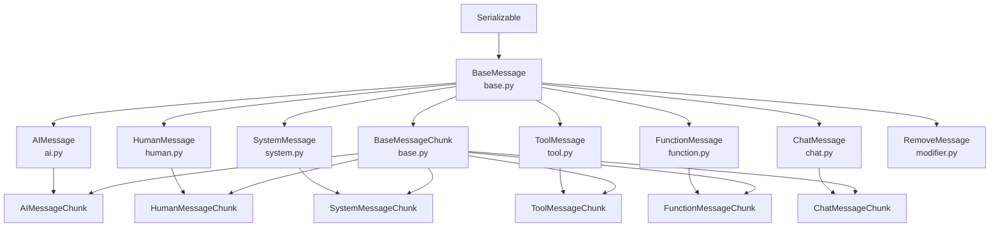
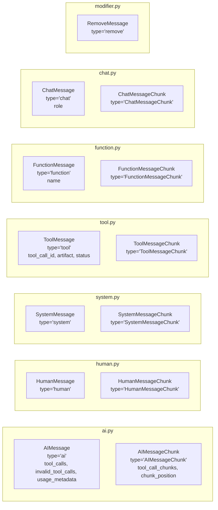
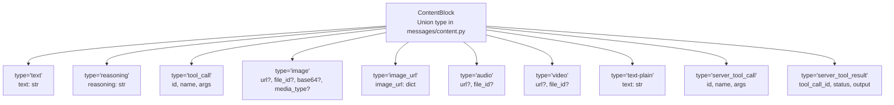
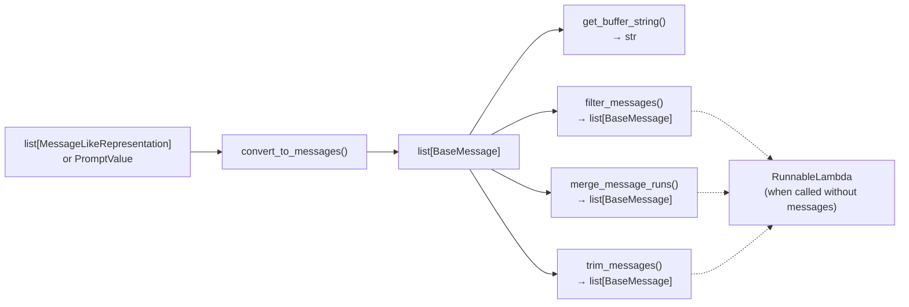
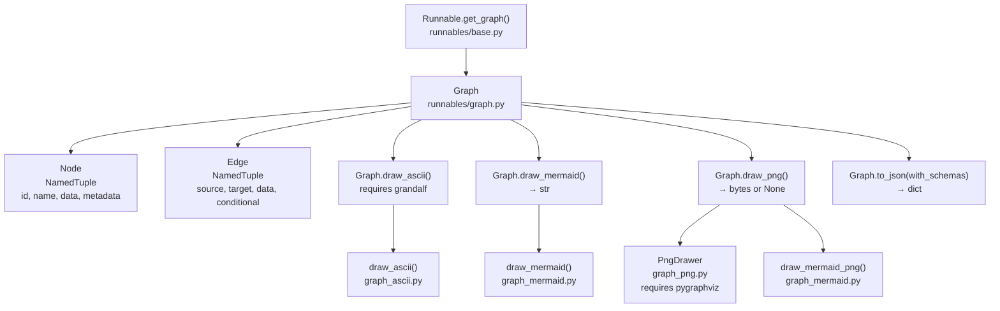

This page documents the message system in `langchain-core`: all `BaseMessage` subclasses, their streaming chunk variants, the content block types they carry, token usage metadata, and the utility functions for transforming and trimming message sequences. It also covers the Runnable graph visualization system used to inspect pipeline structure.

For prompt templates that produce messages, see [Prompt Templates](#2.5). For chat model interfaces that generate and consume messages, see [Language Models and Chat Models](#2.2). For tool call mechanics, see [Tools and Function Calling](#2.3).

---

## Message Class Hierarchy

All message classes live in `libs/core/langchain_core/messages/`. `BaseMessage` is the common root, inheriting from `Serializable` (from `langchain_core/load/serializable.py`). Each concrete type has a paired `*Chunk` variant used during streaming; chunk classes use multiple inheritance, with the corresponding concrete type as their first parent in MRO, followed by `BaseMessageChunk`.

**Figure: Inheritance structure of all message types**



Sources: [libs/core/langchain_core/messages/base.py:93-400](), [libs/core/langchain_core/messages/ai.py:160-350](), [libs/core/langchain_core/messages/tool.py:26-100](), [libs/core/langchain_core/messages/modifier.py:1-30]()

---

## BaseMessage

Defined in [libs/core/langchain_core/messages/base.py:93-400](). It is a Pydantic model with `extra="allow"`, meaning providers can add fields without breaking deserialization.

**Fields:**

| Field | Type | Default | Description |
|-------|------|---------|-------------|
| `content` | `str \| list[str \| dict]` | required | Message body. A plain string or a list of content blocks. |
| `type` | `str` | required | Discriminator for deserialization. Each subclass sets a `Literal` value. |
| `additional_kwargs` | `dict` | `{}` | Provider-specific extra payload (e.g., raw function call output). |
| `response_metadata` | `dict` | `{}` | Response-level metadata: headers, logprobs, model name, token counts. |
| `name` | `str \| None` | `None` | Optional human-readable name. |
| `id` | `str \| None` | `None` | Unique identifier. Numbers are coerced to strings. |

**Key properties and methods:**

- **`content_blocks`** — Returns `list[ContentBlock]`. Parses raw `content` into normalized typed content block dicts. Subclasses override this to apply provider-specific translation (see [Content Blocks](#content-blocks)).
- **`text`** — Returns a `TextAccessor` (a `str` subclass). Concatenates all text content blocks. Supports both `message.text` (property, preferred) and legacy `message.text()` (method call, deprecated since 1.0.0, to be removed in 2.0.0).
- **`pretty_repr(html=False)`** — Human-readable formatted string for display.
- **`pretty_print()`** — Prints `pretty_repr()` to stdout.

`TextAccessor` ([libs/core/langchain_core/messages/base.py:47-90]()) is a `str` subclass that emits a `LangChainDeprecationWarning` when called as a method.

Sources: [libs/core/langchain_core/messages/base.py:1-400]()

---

## Concrete Message Types

The `type` field value is the serialization discriminator. The `AnyMessage` type alias in `libs/core/langchain_core/messages/utils.py` assembles these into a Pydantic discriminated union using `_get_type` as the discriminator callable.

**Figure: Concrete types mapped to their discriminator values and source files**



Sources: [libs/core/langchain_core/messages/utils.py:86-101](), [libs/core/langchain_core/messages/ai.py:160-185](), [libs/core/langchain_core/messages/tool.py:26-90]()

### AIMessage

`AIMessage` is the primary output of any chat model invocation ([libs/core/langchain_core/messages/ai.py:160-350]()).

Extra fields beyond `BaseMessage`:

| Field | Type | Description |
|-------|------|-------------|
| `tool_calls` | `list[ToolCall]` | Parsed, structured tool call requests |
| `invalid_tool_calls` | `list[InvalidToolCall]` | Tool calls that failed argument parsing |
| `usage_metadata` | `UsageMetadata \| None` | Token counts (see [UsageMetadata](#usagemetadata)) |

`ToolCall`, `InvalidToolCall`, and `ToolCallChunk` are `TypedDict`s defined in `langchain_core/messages/tool.py`:

| Type | Fields |
|------|--------|
| `ToolCall` | `name: str`, `args: dict`, `id: str \| None`, `type: "tool_call"` |
| `InvalidToolCall` | `name: str \| None`, `args: str \| None`, `id: str \| None`, `error: str \| None`, `type: "invalid_tool_call"` |
| `ToolCallChunk` | `name: str \| None`, `args: str \| None`, `id: str \| None`, `index: int \| None`, `type: "tool_call_chunk"` |

`AIMessage.content_blocks` is an overridden property that applies provider-specific translators: it checks `response_metadata["output_version"]` and `response_metadata["model_provider"]` before falling back to the base class best-effort parsing.

A `_backwards_compat_tool_calls` model validator (run in `mode="before"`) automatically promotes `additional_kwargs["tool_calls"]` (legacy OpenAI format) to `tool_calls`/`invalid_tool_calls`.

### HumanMessage

Represents user input. Has no extra fields beyond `BaseMessage`. Accepts `example: bool` as an extra field for few-shot examples.

### SystemMessage

Represents a system-level instruction. No extra fields. The role string `"developer"` (OpenAI's newer format) is converted to a `SystemMessage` with `additional_kwargs["__openai_role__"] = "developer"`.

### ToolMessage

Carries the result of a tool invocation back to the model ([libs/core/langchain_core/messages/tool.py:26-90]()).

| Field | Type | Default | Description |
|-------|------|---------|-------------|
| `tool_call_id` | `str` | required | Links this result to the originating `ToolCall` |
| `artifact` | `Any` | `None` | Full tool output not sent to the model (e.g., binary data) |
| `status` | `"success" \| "error"` | `"success"` | Outcome of the tool invocation |

`ToolMessage` also inherits from `ToolOutputMixin`. If a `BaseTool` returns an object that is not a `ToolOutputMixin` instance, LangChain automatically wraps it in a `ToolMessage`.

### FunctionMessage

Legacy type for the original OpenAI function calling API. Carries a `name: str` field. Prefer `ToolMessage` for all new code.

### ChatMessage

Accepts an arbitrary `role: str`, useful for providers or scenarios that define roles outside the standard set.

### RemoveMessage

Defined in [libs/core/langchain_core/messages/modifier.py:8-30](). Used exclusively by LangGraph to signal that the message with the matching `id` should be deleted from stored conversation history. It has no content requirement.

---

## Chunk Types and Streaming

During streaming, models yield `*Chunk` instances. `BaseMessageChunk` adds the `__add__` operator for accumulation:

```
chunk_a + chunk_b + chunk_c  →  AIMessageChunk (fully accumulated)
```

**Merging rules when adding chunks:**

| Field | Merge Strategy |
|-------|---------------|
| `content` (string) | Concatenated |
| `content` (list) | Items merged by `index` key via `merge_lists` |
| `additional_kwargs` | Deep-merged via `merge_dicts` |
| `usage_metadata` integers | Summed |
| `tool_call_chunks` | Merged by `index` field |
| `id` | Provider-assigned ID > LangChain run ID (`lc_run--*`) > `None` |
| `response_metadata` | Deep-merged |

`AIMessageChunk` adds two fields not on `AIMessage`:
- `tool_call_chunks: list[ToolCallChunk]` — partially streamed tool call arguments
- `chunk_position: Literal["last"] | None` — marks the final chunk in a stream

`AIMessageChunk.tool_calls` (property) parses `tool_call_chunks` on the fly when the arguments string is valid JSON.

To convert a fully-accumulated chunk to its non-chunk equivalent, use `message_chunk_to_message(chunk)`. It calls `chunk.__class__.__mro__[1]` (the non-chunk parent class) with the chunk's fields, excluding `type` and `tool_call_chunks`.

Sources: [libs/core/langchain_core/messages/base.py:350-500](), [libs/core/langchain_core/messages/ai.py:400-600](), [libs/core/langchain_core/utils/_merge.py:1-230](), [libs/core/tests/unit_tests/test_messages.py:49-210]()

---

## Content Blocks

When `content` is a list, each element is a string or a content block dict. The `content_blocks` property on `BaseMessage` normalizes the raw list into typed `ContentBlock` dicts from `langchain_core.messages.content`. Provider-specific translators in `langchain_core/messages/block_translators/` are applied first.

**Figure: Content block types and their key dict fields**



**Provider-specific block translators** (in `langchain_core/messages/block_translators/`):

| File | Handles |
|------|---------|
| `openai.py` | OpenAI Chat Completions content format |
| `anthropic.py` | Anthropic `tool_use`, `tool_result` blocks |
| `bedrock_converse.py` | AWS Bedrock Converse API format |
| `google_genai.py` | Google GenAI content format |
| `langchain_v0.py` | Legacy LangChain v0 multimodal format |

`is_data_content_block(block)` in `langchain_core.messages.content` returns `True` for blocks that contain binary data (those with a `base64` field or a `data:` URL).

Sources: [libs/core/langchain_core/messages/base.py:199-350](), [libs/core/langchain_core/messages/ai.py:243-300](), [libs/core/langchain_core/messages/utils.py:104-244]()

---

## UsageMetadata

`UsageMetadata` is a `TypedDict` defined in [libs/core/langchain_core/messages/ai.py:104-157](). It provides a provider-agnostic token count representation, attached to `AIMessage.usage_metadata`.

| Field | Type | Required | Description |
|-------|------|----------|-------------|
| `input_tokens` | `int` | Yes | Total input/prompt tokens |
| `output_tokens` | `int` | Yes | Total output/completion tokens |
| `total_tokens` | `int` | Yes | `input_tokens + output_tokens` |
| `input_token_details` | `InputTokenDetails` | No | Breakdown of input token types |
| `output_token_details` | `OutputTokenDetails` | No | Breakdown of output token types |

`InputTokenDetails` (partial `TypedDict`, [libs/core/langchain_core/messages/ai.py:38-72]()):

| Field | Description |
|-------|-------------|
| `audio` | Audio input tokens |
| `cache_creation` | Tokens that caused a cache miss (new cache created) |
| `cache_read` | Tokens served from cache (cache hit) |

`OutputTokenDetails` (partial `TypedDict`, [libs/core/langchain_core/messages/ai.py:74-102]()):

| Field | Description |
|-------|-------------|
| `audio` | Audio output tokens |
| `reasoning` | Internal chain-of-thought tokens (e.g., OpenAI o1, Anthropic extended thinking) |

When `AIMessageChunk` instances are added together, all integer fields in `usage_metadata` are summed (handled in `AIMessageChunk.__add__`).

---

## Type Aliases

### AnyMessage

Defined in [libs/core/langchain_core/messages/utils.py:86-101](). A Pydantic discriminated union covering all concrete message and chunk types. The discriminator reads the `type` field from either a dict or a message object via `_get_type`.

```python
AnyMessage = Annotated[
    Annotated[AIMessage, Tag("ai")]
    | Annotated[HumanMessage, Tag("human")]
    | Annotated[ChatMessage, Tag("chat")]
    | Annotated[SystemMessage, Tag("system")]
    | Annotated[FunctionMessage, Tag("function")]
    | Annotated[ToolMessage, Tag("tool")]
    | Annotated[AIMessageChunk, Tag("AIMessageChunk")]
    # ... all chunk types ...
    ,
    Field(discriminator=Discriminator(_get_type)),
]
```

### MessageLikeRepresentation

Defined in [libs/core/langchain_core/messages/utils.py:578-581](). Covers all formats `convert_to_messages` accepts:

```
MessageLikeRepresentation = BaseMessage | list[str] | tuple[str, str] | str | dict[str, Any]
```

| Input Format | Example | Resulting Message |
|-------------|---------|-------------------|
| `BaseMessage` instance | `HumanMessage("hi")` | Passed through as-is |
| `str` | `"hi"` | `HumanMessage(content="hi")` |
| `tuple[str, str]` | `("human", "hi")` | `HumanMessage(content="hi")` |
| `tuple[str, list]` | `("ai", [...])` | `AIMessage(content=[...])` |
| `dict` with `role` key | `{"role": "user", "content": "hi"}` | `HumanMessage(content="hi")` |
| `dict` with `type` key | `{"type": "ai", "content": "..."}` | `AIMessage(content="...")` |

Role aliases: `"user"` → `HumanMessage`, `"assistant"` → `AIMessage`, `"developer"` → `SystemMessage` with `additional_kwargs["__openai_role__"] = "developer"`.

---

## Message Utility Functions

All utilities are in [libs/core/langchain_core/messages/utils.py]() and re-exported from `langchain_core.messages`.

The `@_runnable_support` decorator ([libs/core/langchain_core/messages/utils.py:784-802]()) makes each decorated function dual-mode:
- Called **with** a message sequence → returns the result directly.
- Called **without** a message sequence (only kwargs) → returns a `RunnableLambda` composable in a chain.

**Figure: Data flow through utility functions**



Sources: [libs/core/langchain_core/messages/utils.py:784-1600]()

### `get_buffer_string`

[libs/core/langchain_core/messages/utils.py:287-507]()

Converts a message list to a single string. Supports two formats controlled by the `format` parameter.

| Parameter | Default | Description |
|-----------|---------|-------------|
| `messages` | required | `Sequence[BaseMessage]` to serialize |
| `human_prefix` | `"Human"` | Prefix for `HumanMessage` |
| `ai_prefix` | `"AI"` | Prefix for `AIMessage` |
| `system_prefix` | `"System"` | Prefix for `SystemMessage` |
| `function_prefix` | `"Function"` | Prefix for `FunctionMessage` |
| `tool_prefix` | `"Tool"` | Prefix for `ToolMessage` |
| `message_separator` | `"\n"` | String placed between messages |
| `format` | `"prefix"` | `"prefix"` or `"xml"` |

**Prefix format** produces `"Role: content"` lines joined by `message_separator`.

**XML format** produces `<message type="role">content</message>` elements:
- All content is escaped via `xml.sax.saxutils.escape()`.
- Attribute values are escaped via `xml.sax.saxutils.quoteattr()`.
- `AIMessage` with tool calls uses a nested `<content>` + `<tool_call id=... name=...>` structure.
- Blocks containing base64 data (`base64` field or `data:` URLs) are omitted.
- `text-plain` content and server tool arguments are truncated at 500 characters.

### `filter_messages`

[libs/core/langchain_core/messages/utils.py:805-947]()

Returns a filtered subset of messages. With no inclusion criteria, all messages not matched by an exclusion criterion are returned.

| Parameter | Type | Description |
|-----------|------|-------------|
| `include_names` | `Sequence[str]` | Keep only messages with these `name` values |
| `exclude_names` | `Sequence[str]` | Drop messages with these `name` values |
| `include_types` | `Sequence[str \| type[BaseMessage]]` | Keep only these message types |
| `exclude_types` | `Sequence[str \| type[BaseMessage]]` | Drop these message types |
| `include_ids` | `Sequence[str]` | Keep only messages with these `id` values |
| `exclude_ids` | `Sequence[str]` | Drop messages with these `id` values |
| `exclude_tool_calls` | `Sequence[str] \| bool` | `True` to drop all tool-call-related messages, or a list of `tool_call_id` strings to drop selectively |

When `exclude_tool_calls` is a list of IDs:
- Matching entries are removed from `AIMessage.tool_calls`. If all tool calls are removed, the entire `AIMessage` is dropped.
- Anthropic-style `tool_use` content blocks with matching `id` are also removed.
- `ToolMessage` objects whose `tool_call_id` matches are dropped entirely.

### `merge_message_runs`

[libs/core/langchain_core/messages/utils.py:950-1100]()

Merges consecutive messages of the same type into a single message.

| Parameter | Default | Description |
|-----------|---------|-------------|
| `messages` | required | Input message sequence |
| `chunk_separator` | `"\n"` | String inserted between merged string contents |

Behavior:
- If both messages have `str` content, they are joined with `chunk_separator`.
- If either has list content, the merged result is a list.
- `tool_calls` lists are concatenated.
- `response_metadata` from the first message is preserved.
- `ToolMessage` objects are **never merged** (each has a unique `tool_call_id`).

### `trim_messages`

[libs/core/langchain_core/messages/utils.py:1100-1500]()

Trims a message list to fit within a token budget.

| Parameter | Type | Description |
|-----------|------|-------------|
| `messages` | required | Input message sequence |
| `max_tokens` | `int` | Token budget ceiling |
| `token_counter` | `Callable \| BaseLanguageModel \| "approximate"` | Counting function, a model with `get_num_tokens_from_messages`, or the string `"approximate"` (uses `count_tokens_approximately`) |
| `strategy` | `"first" \| "last"` | Retain first N or last N tokens |
| `allow_partial` | `bool` | If `True`, partially include a message that spans the boundary |
| `include_system` | `bool` | Always retain the first `SystemMessage` when using `strategy="last"` |
| `start_on` | `str \| type[BaseMessage] \| None` | Discard leading messages until one of this type is found |
| `end_on` | `str \| type[BaseMessage] \| None` | Discard trailing messages after the last message of this type |
| `text_splitter` | `Callable[[str], list[str]] \| TextSplitter \| None` | Splits text for partial message trimming; defaults to whitespace splitting |

When `allow_partial=True` and a message straddles the token boundary:
- String content is split using `text_splitter` and only the fitting portion is kept.
- List content is trimmed at the block level.

Sources: [libs/core/tests/unit_tests/messages/test_utils.py:272-753]()

### `convert_to_messages`

[libs/core/langchain_core/messages/utils.py:735-752]()

Coerces a `PromptValue` or any `Iterable[MessageLikeRepresentation]` to `list[BaseMessage]`. See [MessageLikeRepresentation](#messagelikerepresentation) for the full set of accepted formats.

### Serialization Utilities

| Function | Signature | Description |
|----------|-----------|-------------|
| `messages_to_dict` | `(list[BaseMessage]) → list[dict]` | Serialize messages for storage |
| `messages_from_dict` | `(list[dict]) → list[BaseMessage]` | Deserialize stored messages |
| `message_chunk_to_message` | `(BaseMessageChunk) → BaseMessage` | Convert accumulated chunk to full message via `chunk.__class__.__mro__[1]` |

Sources: [libs/core/langchain_core/messages/utils.py:510-576]()

---

## Runnable Graph Visualization

Every `Runnable` exposes `get_graph()` which returns a `Graph` object representing the computational pipeline. This is the mechanism behind `chain.get_graph().draw_mermaid()`.

**Figure: Graph visualization component relationships**



Sources: [libs/core/langchain_core/runnables/graph.py:1-650](), [libs/core/langchain_core/runnables/graph_mermaid.py:1-499]()

### `Graph`

A `@dataclass` in [libs/core/langchain_core/runnables/graph.py:252-650](). Fields:
- `nodes: dict[str, Node]`
- `edges: list[Edge]`

Key methods:

| Method | Returns | Description |
|--------|---------|-------------|
| `add_node(data, id, metadata)` | `Node` | Add a node; `data` is a `Runnable` or Pydantic model class |
| `add_edge(source, target, data, conditional)` | `Edge` | Add a directed edge |
| `remove_node(node)` | `None` | Remove node and all incident edges |
| `first_node()` | `Node \| None` | Unique node with no incoming edges |
| `last_node()` | `Node \| None` | Unique node with no outgoing edges |
| `trim_first_node()` | `None` | Remove first node if it has exactly one outgoing edge |
| `trim_last_node()` | `None` | Remove last node if it has exactly one incoming edge |
| `reid()` | `Graph` | Return new graph replacing UUID-based node IDs with readable names |
| `extend(graph, prefix)` | `tuple[Node, Node]` | Merge a subgraph; `prefix` is prepended to node IDs with `:` separator |
| `to_json(with_schemas)` | `dict` | Serialize to `{"nodes": [...], "edges": [...]}` |
| `draw_ascii()` | `str` | ASCII art diagram via `grandalf` |
| `draw_mermaid(...)` | `str` | Mermaid flowchart syntax string |
| `draw_png(...)` | `bytes \| None` | PNG image bytes |

### `Node` and `Edge`

`Node` is a `NamedTuple` ([libs/core/langchain_core/runnables/graph.py:93-126]()):

| Field | Type | Description |
|-------|------|-------------|
| `id` | `str` | Unique identifier (UUID hex or readable name) |
| `name` | `str` | Display name |
| `data` | `type[BaseModel] \| Runnable \| None` | Associated schema class or Runnable |
| `metadata` | `dict \| None` | Optional metadata (e.g., `{"__interrupt": "before"}`) |

`Edge` is a `NamedTuple` ([libs/core/langchain_core/runnables/graph.py:63-91]()):

| Field | Type | Description |
|-------|------|-------------|
| `source` | `str` | Source node ID |
| `target` | `str` | Target node ID |
| `data` | `Stringifiable \| None` | Optional edge label |
| `conditional` | `bool` | Renders as dashed line (`-.->`) in Mermaid |

### Mermaid Drawing

`Graph.draw_mermaid()` delegates to `draw_mermaid()` in [libs/core/langchain_core/runnables/graph_mermaid.py:45-253]().

| Parameter | Default | Description |
|-----------|---------|-------------|
| `with_styles` | `True` | Include `classDef` CSS style declarations |
| `curve_style` | `CurveStyle.LINEAR` | Edge curve style |
| `node_colors` | `NodeStyles()` | Fill colors for `default`, `first`, and `last` CSS classes |
| `wrap_label_n_words` | `9` | Words per line in edge labels (inserts `<br>`) |
| `frontmatter_config` | `None` | Mermaid YAML frontmatter dict (theme, look, etc.) |

`CurveStyle` enum values include `LINEAR`, `BASIS`, `CARDINAL`, `CATMULL_ROM`, `STEP`, `STEP_AFTER`, `STEP_BEFORE`, and others.

`NodeStyles` is a `@dataclass` with string fields `default`, `first`, `last` holding CSS style declarations.

Subgraphs are formed automatically from nodes whose IDs contain colons: `"parent:child"` becomes node `child` inside subgraph `parent`.

Node IDs with special characters (colons, spaces, unicode) are sanitized by `_to_safe_id()` ([libs/core/langchain_core/runnables/graph_mermaid.py:255-266]()), which replaces each non-alphanumeric character with `\xx` (lowercase hex codepoint).

### PNG Rendering

`draw_mermaid_png()` in [libs/core/langchain_core/runnables/graph_mermaid.py:277-498]() renders Mermaid syntax to PNG bytes. The `MermaidDrawMethod` enum controls the backend:

| Value | Backend | Dependency |
|-------|---------|------------|
| `MermaidDrawMethod.API` | `mermaid.ink` public API | `requests` |
| `MermaidDrawMethod.PYPPETEER` | Headless browser | `pyppeteer` |

The API method supports `max_retries` and `retry_delay` for transient failures, and `base_url` to point at a self-hosted Mermaid.INK instance.

`Graph.draw_png()` without a `MermaidDrawMethod` uses `PngDrawer` in [libs/core/langchain_core/runnables/graph_png.py](), which requires `pygraphviz`.

Sources: [libs/core/langchain_core/runnables/graph.py:252-650](), [libs/core/langchain_core/runnables/graph_mermaid.py:1-499](), [libs/core/langchain_core/runnables/graph_ascii.py:1-200](), [libs/core/langchain_core/runnables/graph_png.py:1-150](), [libs/core/tests/unit_tests/runnables/test_graph.py:1-350]()