This page documents the concrete middleware implementations available in LangChain. These implementations extend the base `AgentMiddleware` class to provide specific capabilities like error handling, resource management, human oversight, and specialized tools. For information about the middleware architecture and hook system, see [Agent Creation and Middleware Architecture](#4.1).

## Overview of Available Middleware

The following table summarizes the built-in middleware implementations and their primary hooks:

| Middleware | Primary Hook | Purpose |
|------------|--------------|---------|
| `ModelFallbackMiddleware` | `wrap_model_call` | Try alternative models on errors |
| `ModelRetryMiddleware` | `wrap_model_call` | Retry failed model calls with backoff |
| `ToolRetryMiddleware` | `wrap_tool_call` | Retry failed tool calls with backoff |
| `ModelCallLimitMiddleware` | `before_model` | Track and limit model call counts |
| `ToolCallLimitMiddleware` | `after_model` | Track and limit tool call counts |
| `ContextEditingMiddleware` | `wrap_model_call` | Prune messages when token limits exceeded |
| `HumanInTheLoopMiddleware` | `after_model` | Interrupt for human approval of tool calls |
| `LLMToolSelectorMiddleware` | `wrap_model_call` | Filter tools using LLM before model call |
| `TodoListMiddleware` | `wrap_model_call`, tools | Provide task planning capabilities |
| `LLMToolEmulator` | `wrap_tool_call` | Emulate tool execution with LLM |
| `ShellToolMiddleware` | tools | Provide persistent shell session tool |

Sources: [libs/langchain_v1/langchain/agents/middleware/__init__.py:1-82]()

## Middleware Implementation Patterns

```mermaid
graph TB
    subgraph "Model Call Interceptors"
        ModelFallback["ModelFallbackMiddleware"]
        ModelRetry["ModelRetryMiddleware"]
        ContextEdit["ContextEditingMiddleware"]
        ToolSelect["LLMToolSelectorMiddleware"]
    end
    
    subgraph "Tool Call Interceptors"
        ToolRetry["ToolRetryMiddleware"]
        ToolEmulator["LLMToolEmulator"]
    end
    
    subgraph "Hook-Based Controllers"
        HITL["HumanInTheLoopMiddleware"]
        ModelLimit["ModelCallLimitMiddleware"]
        ToolLimit["ToolCallLimitMiddleware"]
        Todo["TodoListMiddleware"]
    end
    
    subgraph "Tool Providers"
        Shell["ShellToolMiddleware"]
        TodoTool["TodoListMiddleware.tools"]
    end
    
    WrapModel["wrap_model_call<br/>(request, handler)"]
    WrapTool["wrap_tool_call<br/>(request, handler)"]
    BeforeModel["before_model<br/>(state, runtime)"]
    AfterModel["after_model<br/>(state, runtime)"]
    ToolsAttr["middleware.tools"]
    
    ModelFallback --> WrapModel
    ModelRetry --> WrapModel
    ContextEdit --> WrapModel
    ToolSelect --> WrapModel
    
    ToolRetry --> WrapTool
    ToolEmulator --> WrapTool
    
    HITL --> AfterModel
    ModelLimit --> BeforeModel
    ToolLimit --> AfterModel
    Todo --> WrapModel
    Todo --> AfterModel
    
    Shell --> ToolsAttr
    TodoTool --> ToolsAttr
```



Sources: [libs/langchain_v1/langchain/agents/middleware/types.py:380-798](), [libs/langchain_v1/langchain/agents/factory.py:943-961]()

## Reliability and Error Handling

### ModelFallbackMiddleware

Automatically tries alternative models when the primary model fails. Models are attempted in sequence until one succeeds or all fail.

**Key Implementation Details**:
- Located in [libs/langchain_v1/langchain/agents/middleware/model_fallback.py:1-139]()
- Implements `wrap_model_call` to intercept model execution
- Accepts both model identifier strings (e.g., `"openai:gpt-4o-mini"`) and `BaseChatModel` instances
- Re-raises the last exception if all models fail

```python
# Example from model_fallback.py
def wrap_model_call(self, request, handler):
    try:
        return handler(request)  # Try primary model
    except Exception as e:
        last_exception = e
    
    for fallback_model in self.models:
        try:
            return handler(request.override(model=fallback_model))
        except Exception as e:
            last_exception = e
    
    raise last_exception
```

**State Schema**: Uses base `AgentState[ResponseT]` - no custom state fields required.

Sources: [libs/langchain_v1/langchain/agents/middleware/model_fallback.py:24-139]()

### ModelRetryMiddleware

Retries failed model calls with configurable exponential backoff. Similar to `ToolRetryMiddleware` but operates on model calls.

**Key Features**:
- Configurable retry count, backoff factor, and delay bounds
- Selective retry on specific exception types via `retry_on` parameter
- Jitter support to avoid thundering herd
- Custom error handling via `on_failure` parameter

**Retry Logic** (shared with `ToolRetryMiddleware`):
- Delay calculation: `initial_delay * (backoff_factor ** retry_number)`
- Capped at `max_delay`
- Optional jitter: ±25% randomization

Sources: [libs/langchain_v1/langchain/agents/middleware/model_retry.py:1-151]() (referenced but not provided in files)

### ToolRetryMiddleware

Retries failed tool calls using the same exponential backoff logic as `ModelRetryMiddleware`.

**Key Implementation Details**:
- Located in [libs/langchain_v1/langchain/agents/middleware/tool_retry.py:1-278]()
- Implements `wrap_tool_call` and `awrap_tool_call`
- Can target specific tools via `tools` parameter (accepts `BaseTool` instances or tool name strings)
- Supports custom error message formatting via `on_failure` callable

```python