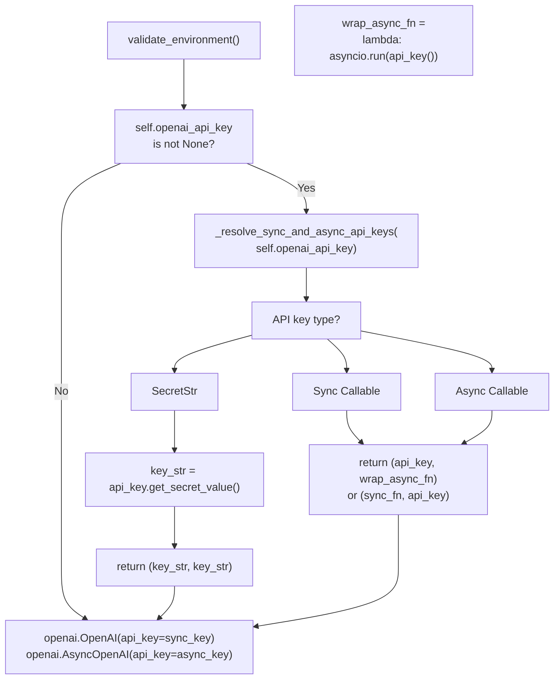

_CLIENT_CACHE: dict[tuple[Optional[str], Optional[float]], httpx.Client] = {}

def _get_default_httpx_client(
    base_url: Optional[str],
    timeout: Optional[float],
) -> httpx.Client:
    """Get or create cached httpx.Client."""
    cache_key = (base_url, timeout)
    
    if cache_key not in _CLIENT_CACHE:
        _CLIENT_CACHE[cache_key] = httpx.Client(
            base_url=base_url,
            timeout=timeout,
            verify=global_ssl_context,
        )
    
    return _CLIENT_CACHE[cache_key]
```

**Step 2: Initialize clients in `validate_environment()` validator**

```python
# In your ChatModel class
from pydantic import model_validator

@model_validator(mode="after")
def validate_environment(self) -> Self:
    """Initialize API clients with caching."""
    if not self.client:
        # Get cached httpx client
        http_client = self.http_client or _get_default_httpx_client(
            self.base_url, self.timeout
        )
        
        # Create provider SDK client
        self.root_client = ProviderSDK(
            api_key=self.api_key,
            base_url=self.base_url,
            http_client=http_client,
            max_retries=self.max_retries,
        )
        self.client = self.root_client.chat.completions
    
    # Same for async client
    if not self.async_client:
        async_http_client = self.http_async_client or _get_default_async_httpx_client(
            self.base_url, self.timeout
        )
        self.root_async_client = ProviderAsyncSDK(...)
        self.async_client = self.root_async_client.chat.completions
    
    return self
```

**Cache key strategy:**

| Configuration | Caching Behavior |
|--------------|------------------|
| Same `base_url` and `timeout` | Reuse cached client |
| Different `base_url` | Create new client |
| Different `timeout` | Create new client |
| Custom `http_client` provided | Skip cache, use provided |

**Sources:**
- [libs/partners/openai/langchain_openai/chat_models/_client_utils.py]()
- [libs/partners/openai/langchain_openai/chat_models/base.py:879-1001]()
- [libs/partners/anthropic/langchain_anthropic/_client_utils.py]()

## API Key Resolution

All provider integrations support multiple API key sources, resolved during model initialization.

**Diagram: API Key Resolution in `validate_environment()`**



### Supported API Key Patterns

| Pattern | Configuration | Resolution Location |
|---------|---------------|-------------------|
| Environment variable | `secret_from_env("OPENAI_API_KEY")` | Field default_factory |
| Direct string | `ChatOpenAI(api_key="sk-...")` | Converted to `SecretStr` |
| Sync callable | `ChatOpenAI(api_key=get_key)` | Called in `OpenAI()` constructor |
| Async callable | `ChatOpenAI(api_key=async_get_key)` | Called in `AsyncOpenAI()` constructor |

### Implementation Pattern

```python
# Field definition with environment variable fallback
openai_api_key: SecretStr | None | Callable[[], str] | Callable[[], Awaitable[str]] = Field(
    alias="api_key",
    default_factory=secret_from_env("OPENAI_API_KEY", default=None)
)

# Resolution in validate_environment()
if self.openai_api_key is not None:
    sync_api_key_value, async_api_key_value = _resolve_sync_and_async_api_keys(
        self.openai_api_key
    )
    
    self.root_client = openai.OpenAI(
        api_key=sync_api_key_value,
        http_client=http_client,
    )
    
    self.root_async_client = openai.AsyncOpenAI(
        api_key=async_api_key_value,
        http_client=async_http_client,
    )
```

**Sources:**
- [libs/partners/openai/langchain_openai/chat_models/base.py:581-633]()
- [libs/partners/openai/langchain_openai/chat_models/_client_utils.py:96-161]()
- [libs/partners/openai/langchain_openai/chat_models/base.py:1015-1021]()

### SSL and Proxy Configuration

**SSL setup:**

```python
import ssl
import certifi