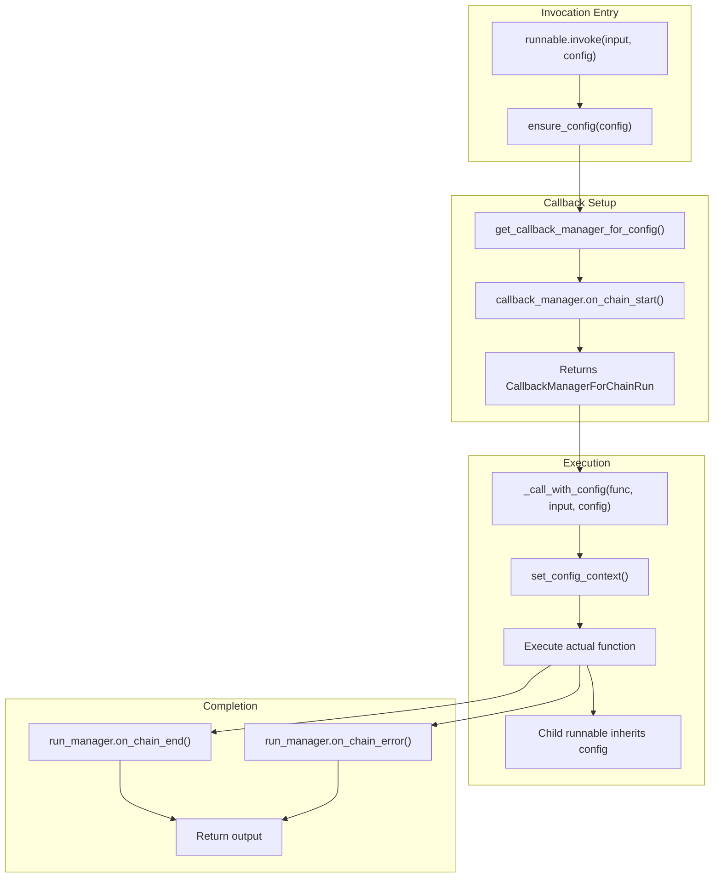

```

**Sources:** [libs/core/langchain_core/callbacks/file.py:21-150]()

## Custom Callback Implementation

Custom handlers extend `BaseCallbackHandler` and implement relevant callback methods.

### Basic Custom Handler

```python
from langchain_core.callbacks import BaseCallbackHandler
from langchain_core.outputs import LLMResult

class TokenCountHandler(BaseCallbackHandler):
    """Counts tokens across LLM calls."""
    
    def __init__(self):
        self.total_tokens = 0
    
    def on_llm_start(self, serialized, prompts, **kwargs):
        """Called when LLM starts."""
        print(f"LLM started with {len(prompts)} prompts")
    
    def on_llm_end(self, response: LLMResult, **kwargs):
        """Called when LLM ends."""
        if response.llm_output and "token_usage" in response.llm_output:
            tokens = response.llm_output["token_usage"]["total_tokens"]
            self.total_tokens += tokens
            print(f"Used {tokens} tokens (total: {self.total_tokens})")
    
    def on_llm_error(self, error: BaseException, **kwargs):
        """Called when LLM errors."""
        print(f"LLM error: {error}")
```

**Sources:** [libs/core/langchain_core/callbacks/base.py:238-547]()

### Async Handler

For async operations, implement async versions of callback methods:

```python
class AsyncTokenCountHandler(BaseCallbackHandler):
    async def on_llm_start(self, serialized, prompts, **kwargs):
        await some_async_logging(prompts)
    
    async def on_llm_end(self, response: LLMResult, **kwargs):
        await some_async_metric_tracking(response)
```

The system handles both sync and async handlers gracefully, running sync handlers in executors when called from async context.

**Sources:** [libs/core/langchain_core/callbacks/manager.py:368-417]()

### Handler Configuration

Handlers have configuration options:

- `raise_error: bool = False` - Whether to raise exceptions or log warnings
- `run_inline: bool = False` - Whether to run inline (before other handlers) in async context
- `ignore_llm: bool = False` - Skip LLM events
- `ignore_chain: bool = False` - Skip chain events
- `ignore_agent: bool = False` - Skip agent events
- `ignore_retriever: bool = False` - Skip retriever events
- `ignore_retry: bool = False` - Skip retry events

**Sources:** [libs/core/langchain_core/callbacks/base.py:397-547]()

## Integration with Runnables

All `Runnable` objects support callbacks through config. The `_call_with_config` method handles callback integration:



**Sources:** [libs/core/langchain_core/runnables/base.py:674-847](), [libs/core/langchain_core/runnables/config.py:187-213]()

The `_call_with_config` method:
1. Gets or creates `CallbackManager` from config
2. Calls `on_chain_start` with runnable metadata
3. Sets config context via `set_config_context`
4. Executes the wrapped function
5. Calls `on_chain_end` on success or `on_chain_error` on failure
6. Returns output or raises exception

This pattern ensures all Runnables participate in callback tracking automatically, with proper hierarchy and context propagation.

**Sources:** [libs/core/langchain_core/runnables/base.py:674-847]()