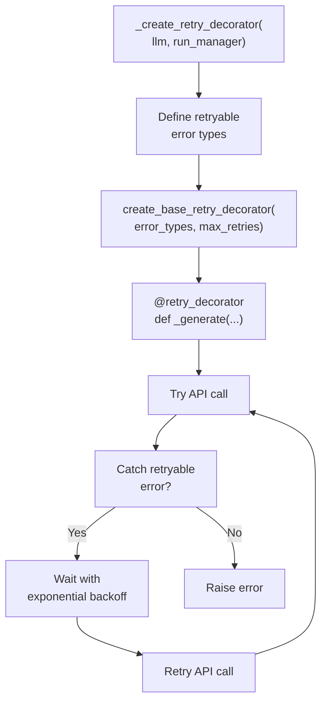
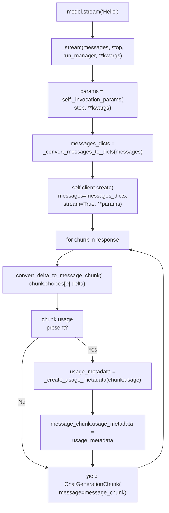

client = httpx.Client(verify=global_ssl_context)
```

**Proxy support:**

```python
# In validate_environment()
if self.proxy and not self.http_client:
    self.http_client = httpx.Client(
        proxy=self.proxy,
        verify=global_ssl_context
    )
```

**Sources:**
- [libs/partners/openai/langchain_openai/chat_models/base.py:137-139]()
- [libs/partners/openai/langchain_openai/chat_models/base.py:955-966]()

---

## Error Handling Strategies

Provider integrations implement specialized error handlers that enhance error messages with actionable guidance.

**Diagram: Error Handler Pattern in `_generate()`**

```mermaid
graph LR
    GenerateCall["_generate(messages,<br/>stop, run_manager, **kwargs)"]
    TryBlock["try:<br/>  response = self.client.create(...)"]
    
    CatchBadRequest["except<br/>openai.BadRequestError as e"]
    CatchAPIError["except<br/>openai.APIError as e"]
    
    HandleBadRequest["_handle_openai_bad_request(e)"]
    HandleAPIError["_handle_openai_api_error(e)"]
    
    CheckMessage["Check e.message<br/>for patterns"]
    
    ContextOverflow["'context_length_exceeded'<br/>in str(e)?"]
    StructuredOutput["'json_schema' not supported<br/>in e.message?"]
    InvalidSchema["'Invalid schema'<br/>in e.message?"]
    
    RaiseContext["raise OpenAIContextOverflowError(<br/>message=e.message,<br/>response=e.response)"]
    
    WarnStructured["warnings.warn(<br/>'Use method=\"function_calling\"')"]
    WarnSchema["warnings.warn(<br/>'Update your schema')"]
    
    Reraise["raise e"]
    
    GenerateCall --> TryBlock
    TryBlock --> CatchBadRequest
    TryBlock --> CatchAPIError
    
    CatchBadRequest --> HandleBadRequest
    CatchAPIError --> HandleAPIError
    
    HandleBadRequest --> CheckMessage
    CheckMessage --> ContextOverflow
    CheckMessage --> StructuredOutput
    CheckMessage --> InvalidSchema
    
    ContextOverflow -->|Yes| RaiseContext
    ContextOverflow -->|No| StructuredOutput
    
    StructuredOutput -->|Yes| WarnStructured
    StructuredOutput -->|No| InvalidSchema
    
    InvalidSchema -->|Yes| WarnSchema
    InvalidSchema -->|No| Reraise
    
    WarnStructured --> Reraise
    WarnSchema --> Reraise
```

### Common Error Enhancement Patterns

| Error Pattern | Detection | Enhancement | Exception Type |
|--------------|-----------|-------------|----------------|
| Context overflow | `"context_length_exceeded"` in error | Raise `ContextOverflowError` | `OpenAIContextOverflowError` |
| Unsupported feature | `"json_schema not supported"` | Suggest `method="function_calling"` | `BadRequestError` + warning |
| Invalid schema | `"Invalid schema"` | Point to documentation | `BadRequestError` + warning |
| Rate limiting | `429` status code | Handled by retry decorator | Automatic retry |
| Empty messages | `"at least one message required"` | Warn about system-only input | `BadRequestError` + warning |

### Implementation Example

```python
def _handle_openai_bad_request(e: openai.BadRequestError) -> None:
    """Enhance OpenAI error messages with helpful guidance."""
    if (
        "context_length_exceeded" in str(e)
        or "Input tokens exceed the configured limit" in e.message
    ):
        raise OpenAIContextOverflowError(
            message=e.message, response=e.response, body=e.body
        ) from e
    
    if "'response_format' of type 'json_schema' is not supported" in e.message:
        message = (
            "This model does not support OpenAI's structured output feature. "
            'Specify `method="function_calling"` instead.'
        )
        warnings.warn(message)
        raise e
    
    # Re-raise unchanged for unknown errors
    raise
```

**Sources:**
- [libs/partners/openai/langchain_openai/chat_models/base.py:495-534]()
- [libs/partners/anthropic/langchain_anthropic/chat_models.py:750-765]()
- [libs/partners/openai/langchain_openai/chat_models/base.py:487-493]()

### Implementation Steps

**Step 1: Define error handler function**

```python
def _handle_provider_bad_request(e: ProviderBadRequestError) -> None:
    """Enhance error messages with helpful guidance."""
    if "structured output not supported" in e.message:
        warnings.warn(
            "This model does not support structured output. "
            'Use method="function_calling" instead.',
            stacklevel=2
        )
        raise e
    elif "invalid schema" in e.message:
        warnings.warn(
            "Invalid schema for structured output. "
            "Check the provider's schema documentation.",
            stacklevel=2
        )
        raise e
    # Re-raise other errors unchanged
    raise
```

**Step 2: Wrap API calls with error handling**

```python
def _generate(
    self,
    messages: List[BaseMessage],
    stop: Optional[List[str]] = None,
    run_manager: Optional[CallbackManagerForLLMRun] = None,
    **kwargs: Any,
) -> ChatResult:
    """Generate response with error handling."""
    try:
        response = self.client.create(
            model=self.model_name,
            messages=self._convert_messages(messages),
            **kwargs
        )
        return self._create_chat_result(response)
    except ProviderBadRequestError as e:
        _handle_provider_bad_request(e)
    except Exception as e:
        # Log unexpected errors
        logger.error(f"Unexpected error: {e}")
        raise
```

**Common error scenarios to handle:**

| Error Pattern | User-Friendly Message | Example |
|--------------|----------------------|---------|
| Unsupported feature | "Model X doesn't support Y. Use Z instead." | Structured output unavailable |
| Invalid input | "Invalid schema/format. Check documentation." | Bad JSON schema |
| Empty messages | "At least one message required." | System-only input |
| Rate limits | "Rate limited. Retry with backoff." | 429 errors |

**Sources:**
- [libs/partners/openai/langchain_openai/chat_models/base.py:452-474]()
- [libs/partners/anthropic/langchain_anthropic/chat_models.py:713-720]()

## Retry Logic Pattern

Implement exponential backoff for transient failures using `create_base_retry_decorator`.

**Diagram: Retry Decorator Pattern**



### Implementation Steps

**Step 1: Define retry decorator factory**

```python
from langchain_core.language_models.llms import create_base_retry_decorator
from typing import Optional, Callable, Any

def _create_retry_decorator(
    llm: ChatYourProvider,
    run_manager: Optional[CallbackManagerForLLMRun] = None,
) -> Callable[[Any], Any]:
    """Create retry decorator for transient errors."""
    # Define which errors should trigger retries
    retryable_errors = [
        httpx.RequestError,  # Network errors
        httpx.StreamError,   # Streaming errors
        httpx.TimeoutException,  # Timeout errors
    ]
    
    return create_base_retry_decorator(
        error_types=retryable_errors,
        max_retries=llm.max_retries,
        run_manager=run_manager
    )
```

**Step 2: Apply decorator to generation methods**

```python
def _generate(
    self,
    messages: List[BaseMessage],
    stop: Optional[List[str]] = None,
    run_manager: Optional[CallbackManagerForLLMRun] = None,
    **kwargs: Any,
) -> ChatResult:
    """Generate with automatic retries."""
    # Create retry decorator
    retry_decorator = _create_retry_decorator(self, run_manager)
    
    # Wrap the API call
    @retry_decorator
    def _generate_with_retry(**kwargs: Any) -> ChatResult:
        response = self.client.create(**kwargs)
        return self._create_chat_result(response)
    
    # Execute with retries
    return _generate_with_retry(
        model=self.model_name,
        messages=self._convert_messages(messages),
        stop=stop,
        **kwargs
    )
```

**Retry behavior:**

| Attempt | Wait Time | Notes |
|---------|-----------|-------|
| 1 | 0s | Initial attempt |
| 2 | ~1s | First retry after exponential backoff |
| 3 | ~2s | Second retry |
| 4+ | ~4s, 8s, ... | Continues up to `max_retries` |

**SDK built-in retry vs custom:**

| Approach | When to Use |
|----------|-------------|
| SDK built-in (OpenAI, Anthropic) | Provider SDK handles retries automatically via `max_retries` param |
| Custom decorator (Mistral, others) | No SDK retry support; implement using `create_base_retry_decorator` |

**Sources:**
- [libs/partners/mistralai/langchain_mistralai/chat_models.py:102-110]()
- [libs/partners/anthropic/langchain_anthropic/chat_models.py:784-786]()

---

## Streaming Response Handling

Provider integrations implement streaming through `_stream()` and `_astream()` methods, yielding `AIMessageChunk` instances that can be aggregated.

**Diagram: Streaming Flow in `ChatOpenAI._stream()`**



**Sources:**
- [libs/partners/openai/langchain_openai/chat_models/base.py:1334-1456]()
- [libs/partners/openai/langchain_openai/chat_models/base.py:403-457]()

### Chunk Aggregation Pattern

All providers support chunk aggregation using the `+` operator:

```python