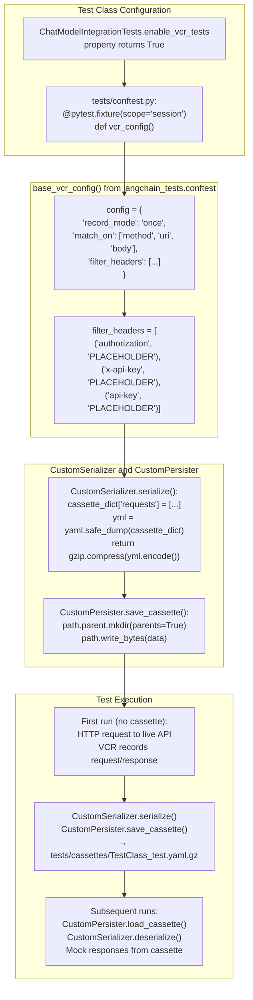

@pytest.mark.compile
def test_placeholder() -> None:
    """Placeholder test to verify integration tests compile."""
    pass
```

**Sources**: [.github/workflows/_compile_integration_test.yml:9-53](), [libs/standard-tests/pyproject.toml:106-112]()

## VCR Testing for Deterministic HTTP Tests

The `langchain-tests` package provides VCR (Video Cassette Recorder) support via the `base_vcr_config()` fixture ([libs/standard-tests/langchain_tests/conftest.py:56-88]()) for recording HTTP interactions to cassette files, enabling deterministic tests without live API calls.

### VCR Configuration

Title: VCR Cassette Recording and Replay Flow



**Sources**: [libs/standard-tests/langchain_tests/conftest.py:20-88](), [libs/standard-tests/langchain_tests/integration_tests/chat_models.py:222-229](), [libs/standard-tests/langchain_tests/integration_tests/chat_models.py:594-738]()

### Custom Serializer Implementation

The `CustomSerializer` class ([libs/standard-tests/langchain_tests/conftest.py:20-53]()) uses `yaml.safe_load` instead of `yaml.load` to prevent arbitrary code execution, and applies gzip compression:

```python