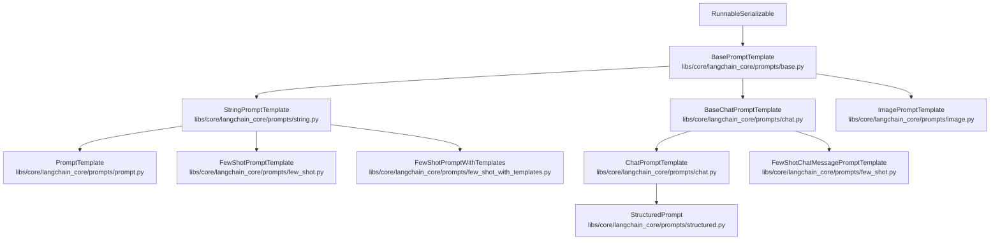
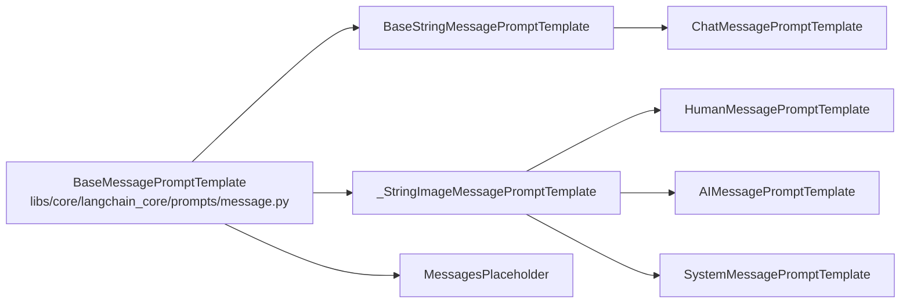

This page documents the prompt template system in `langchain-core`, covering all classes and mechanisms for constructing structured inputs to language models. Prompt templates are `Runnable` components (see [Runnable Interface and LCEL](#2.1)) that accept a dictionary of variables and return a `PromptValue`. For information about the message types that prompt templates produce, see [Messages and Content Handling](#2.4).

---

## Overview

Prompt templates bridge raw string templates and the structured `BaseMessage` objects that chat models expect. The template system supports three distinct areas:

- **String templates** — produce a plain `StringPromptValue` (for completion-style LLMs)
- **Chat templates** — produce a `ChatPromptValue` containing a list of `BaseMessage` objects
- **Few-shot templates** — wrap examples around a core template

All template classes inherit from `BasePromptTemplate`, which itself extends `RunnableSerializable`. This means every template supports `.invoke()`, `.ainvoke()`, `.batch()`, etc., and can be composed with other Runnables via the `|` operator.

---

## Class Hierarchy

**Prompt template inheritance tree**



Sources: [libs/core/langchain_core/prompts/base.py:39-41](), [libs/core/langchain_core/prompts/string.py:311-313](), [libs/core/langchain_core/prompts/prompt.py:24-26](), [libs/core/langchain_core/prompts/chat.py:690-692](), [libs/core/langchain_core/prompts/few_shot.py:120-122](), [libs/core/langchain_core/prompts/structured.py:28-29]()

---

## BasePromptTemplate

**File:** [libs/core/langchain_core/prompts/base.py:39-471]()

`BasePromptTemplate` is the abstract root. All templates carry these shared fields:

| Field | Type | Description |
|---|---|---|
| `input_variables` | `list[str]` | Variable names that **must** be supplied at format time |
| `optional_variables` | `list[str]` | Variable names that may be omitted (auto-inferred from `MessagesPlaceholder(optional=True)`) |
| `partial_variables` | `Mapping[str, Any]` | Pre-filled values; can be callables `() -> str` |
| `input_types` | `dict[str, Any]` | Type annotations for each variable; used for input schema generation |
| `output_parser` | `BaseOutputParser \| None` | Optional parser to attach to the prompt |
| `metadata` | `dict \| None` | Passed into tracing runs |
| `tags` | `list[str] \| None` | Passed into tracing runs |

### Key methods

| Method | Description |
|---|---|
| `invoke(input, config)` | Validates variables and calls `format_prompt`; runs as a `"prompt"` run type |
| `ainvoke(input, config)` | Async version |
| `format_prompt(**kwargs)` | Abstract; returns a `PromptValue` |
| `format(**kwargs)` | Abstract; returns a formatted `str` (or typed value) |
| `partial(**kwargs)` | Returns a new template with some variables pre-filled |
| `save(file_path)` | Serializes to `.json` or `.yaml` |

The `_validate_input` method enforces that all `input_variables` are present in the incoming dict, and raises a descriptive `KeyError` with a hint about escaping literal braces if a variable appears to be mistakenly unescaped.

Sources: [libs/core/langchain_core/prompts/base.py:39-471]()

---

## Template Formats

The `PromptTemplateFormat` type alias is defined as `Literal["f-string", "mustache", "jinja2"]` in [libs/core/langchain_core/prompts/string.py:30]().

| Format | Syntax | Notes |
|---|---|---|
| `f-string` | `{variable}` | Default; uses Python's `str.Formatter`. Attribute access (`{obj.attr}`) and indexing (`{obj[0]}`) are **blocked** for security. |
| `mustache` | `{{variable}}` | Implemented via `langchain_core.utils.mustache`; supports sections (`{{#section}}`), inverted sections, and dot-path traversal through `dict`/`list` only |
| `jinja2` | `{{ variable }}` | Requires `pip install jinja2`; uses `SandboxedEnvironment`. Do **not** accept jinja2 templates from untrusted sources. |

The `get_template_variables(template, template_format)` function in [libs/core/langchain_core/prompts/string.py:256-308]() extracts variable names from any format. This is called automatically at construction time to populate `input_variables`.

### Mustache specifics

For mustache, `get_template_variables` returns only **top-level** keys: `{{user.name}}` registers `user`, not `user.name`. The `mustache_schema(template)` function in [libs/core/langchain_core/prompts/string.py:158-194]() generates a Pydantic model with nested structure derived from the full template parse tree, used to produce accurate JSON schema for mustache prompts.

Sources: [libs/core/langchain_core/prompts/string.py:1-383](), [libs/core/langchain_core/utils/mustache.py:1-600]()

---

## PromptTemplate

**File:** [libs/core/langchain_core/prompts/prompt.py:24-313]()

`PromptTemplate` is the primary single-string template. It adds:

| Field | Type | Default | Description |
|---|---|---|---|
| `template` | `str` | required | The template string |
| `template_format` | `PromptTemplateFormat` | `"f-string"` | Format engine to use |
| `validate_template` | `bool` | `False` | If `True`, validates variable consistency at init |

### Construction

```python
# From a string (preferred)
pt = PromptTemplate.from_template("Answer the question: {question}")

# From a file
pt = PromptTemplate.from_file("prompt.txt")

# With partial variables
pt = PromptTemplate.from_template(
    "You are {name}. Answer: {question}",
    partial_variables={"name": "Alice"}
)
```

### `format(**kwargs) -> str`

Calls the appropriate formatter (`DEFAULT_FORMATTER_MAPPING[self.template_format]`) after merging partial variables.

### `__add__` operator

Two `PromptTemplate` objects of the same format can be concatenated with `+`. The result is a new `PromptTemplate` whose `template` is the concatenation and whose `input_variables` is the union.

Sources: [libs/core/langchain_core/prompts/prompt.py:24-313]()

---

## ChatPromptTemplate

**File:** [libs/core/langchain_core/prompts/chat.py:789-1617]()

`ChatPromptTemplate` is the primary entry point for chat model prompting. It holds a list of `messages` which can be any of: a `BaseMessagePromptTemplate`, a concrete `BaseMessage`, or another `BaseChatPromptTemplate`.

### Construction

`ChatPromptTemplate` accepts messages in several formats:

| Input form | Result |
|---|---|
| `("system", "text {var}")` | `SystemMessagePromptTemplate` |
| `("human", "text {var}")` or `("user", ...)` | `HumanMessagePromptTemplate` |
| `("ai", "text {var}")` or `("assistant", ...)` | `AIMessagePromptTemplate` |
| `("placeholder", "{var}")` | `MessagesPlaceholder(variable_name="var", optional=True)` |
| `(MessageClass, "text {var}")` | Wraps in appropriate template for that class |
| `BaseMessage(content="...")` | Stored as a static message |
| `BaseMessagePromptTemplate` | Stored directly |
| `str` | Shorthand for `("human", str)` |

The `_convert_to_message_template` function [libs/core/langchain_core/prompts/chat.py]() handles all these conversions.

`ChatPromptTemplate.from_messages(messages, template_format)` is the class method constructor used most commonly.

### Input variable inference

`input_variables` is inferred automatically from the messages: the constructor collects `input_variables` from each `BaseMessagePromptTemplate` and `BaseChatPromptTemplate` in the list, excluding any variables that appear in `partial_variables` or belong to optional `MessagesPlaceholder` entries.

### `format_messages(**kwargs) -> list[BaseMessage]`

Iterates over each message in `self.messages` and calls `format_messages(**kwargs)` on each, concatenating results.

### Convenience operators

- `template[0]` / `template[1:]` — indexing and slicing return sub-templates
- `template.append(msg)` — appends a message (any `MessageLikeRepresentation`)
- `template.extend(msgs)` — extends with multiple messages
- `template1 + template2` — concatenates two templates

Sources: [libs/core/langchain_core/prompts/chat.py:789-1617]()

---

## Message Prompt Templates

These are the building blocks that `ChatPromptTemplate` uses internally.

**Message template class map**



Sources: [libs/core/langchain_core/prompts/chat.py:52-688]()

### `MessagesPlaceholder`

[libs/core/langchain_core/prompts/chat.py:52-217]()

A special template that expects a variable to already contain a list of messages (or tuples convertible to messages via `convert_to_messages`).

| Field | Default | Description |
|---|---|---|
| `variable_name` | required | Name of the key that will contain the message list |
| `optional` | `False` | If `True`, missing variable returns `[]`; also registers the variable as an optional input |
| `n_messages` | `None` | If set, truncates to the last N messages |

When `optional=True`, the variable is added to `partial_variables` with a default of `[]`, so it does not appear in `input_variables`.

### `BaseStringMessagePromptTemplate`

[libs/core/langchain_core/prompts/chat.py:225-351]()

Abstract base for message templates backed by a `StringPromptTemplate`. The `prompt` field holds a `PromptTemplate`. The `from_template(template, template_format, partial_variables)` classmethod is the standard way to create these.

### `_StringImageMessagePromptTemplate`

[libs/core/langchain_core/prompts/chat.py:396-661]()

Used for `HumanMessagePromptTemplate`, `AIMessagePromptTemplate`, and `SystemMessagePromptTemplate`. Handles both plain string templates and **multipart** templates (lists containing text blocks and `image_url` blocks). When `template` is a list, each element becomes either a `PromptTemplate`, an `ImagePromptTemplate`, or a `DictPromptTemplate` inside the `prompt` field.

### Concrete message template classes

| Class | Produces | `_msg_class` |
|---|---|---|
| `HumanMessagePromptTemplate` | `HumanMessage` | `HumanMessage` |
| `AIMessagePromptTemplate` | `AIMessage` | `AIMessage` |
| `SystemMessagePromptTemplate` | `SystemMessage` | `SystemMessage` |
| `ChatMessagePromptTemplate` | `ChatMessage` | — (uses `role` field) |

Sources: [libs/core/langchain_core/prompts/chat.py:52-688]()

---

## Partial Variables

Partial variables allow some variables to be pre-filled so they do not need to be supplied at every invocation.

Two mechanisms exist:

1. **At construction** — pass `partial_variables={"var": value}` to any template constructor
2. **After construction** — call `template.partial(var=value)` which returns a **new** template with updated `partial_variables` and `input_variables`

Partial variable values can be **callables** (zero-argument functions). They are called each time formatting happens, which makes them suitable for dynamic values like timestamps.

```python
import datetime
prompt = PromptTemplate.from_template(
    "Today is {date}. Question: {question}",
    partial_variables={"date": lambda: datetime.date.today().isoformat()}
)
# Only `question` appears in prompt.input_variables
```

Sources: [libs/core/langchain_core/prompts/base.py:279-300](), [libs/core/langchain_core/prompts/prompt.py:248-312]()

---

## Few-Shot Prompt Templates

### `FewShotPromptTemplate`

**File:** [libs/core/langchain_core/prompts/few_shot.py:120-252]()

Extends `StringPromptTemplate`. Renders a list of examples into a string prompt.

| Field | Type | Description |
|---|---|---|
| `examples` | `list[dict] \| None` | Static list of example dicts |
| `example_selector` | `BaseExampleSelector \| None` | Dynamic example selection (mutually exclusive with `examples`) |
| `example_prompt` | `PromptTemplate` | Template applied to each example dict |
| `prefix` | `str` | Text prepended before examples |
| `suffix` | `str` | Text appended after examples |
| `example_separator` | `str` | Separator between prefix, examples, and suffix; default `"\n\n"` |
| `template_format` | `"f-string" \| "jinja2"` | Format for prefix/suffix (not examples) |

The `format(**kwargs)` method:
1. Merges partial variables
2. Calls `_get_examples(**kwargs)` (or `_aget_examples` for async)
3. Formats each example with `example_prompt`
4. Joins prefix + example strings + suffix with `example_separator`
5. Applies the formatter to the final combined string

### `FewShotChatMessagePromptTemplate`

**File:** [libs/core/langchain_core/prompts/few_shot.py:255-393]()

Extends `BaseChatPromptTemplate`. Renders example dicts into a list of `BaseMessage` objects using a `ChatPromptTemplate` as the `example_prompt`.

### `FewShotPromptWithTemplates`

**File:** [libs/core/langchain_core/prompts/few_shot_with_templates.py:18-230]()

A variant where `prefix` and `suffix` are themselves `StringPromptTemplate` objects rather than raw strings. Variables from the prefix and suffix templates are merged into the top-level `input_variables`.

Sources: [libs/core/langchain_core/prompts/few_shot.py:1-393](), [libs/core/langchain_core/prompts/few_shot_with_templates.py:1-231]()

---

## StructuredPrompt

**File:** [libs/core/langchain_core/prompts/structured.py:28-184]()

> **Beta**: This class is decorated with `@beta()`.

`StructuredPrompt` extends `ChatPromptTemplate` and couples a prompt with an output schema. When piped to a language model using `|` or `.pipe()`, it automatically calls `model.with_structured_output(self.schema_, **self.structured_output_kwargs)` instead of passing the model through directly.

| Field | Type | Description |
|---|---|---|
| `schema_` | `dict \| type` | A Pydantic model class or OpenAI-style function schema dict |
| `structured_output_kwargs` | `dict` | Extra kwargs forwarded to `with_structured_output` |

```python
class OutputSchema(BaseModel):
    name: str
    value: int

prompt = StructuredPrompt(
    [("human", "Extract info from: {text}")],
    OutputSchema
)
chain = prompt | chat_model