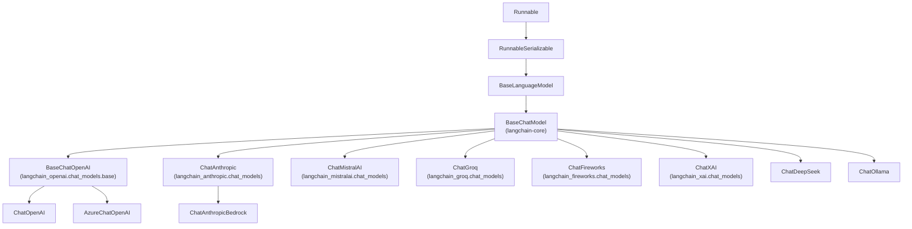
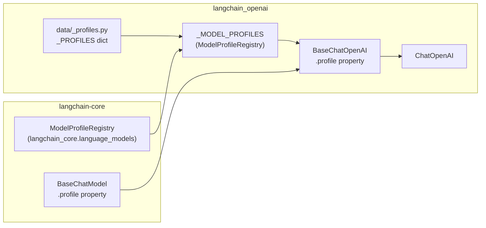

This section documents the **partner packages** in the LangChain monorepo — independently versioned Python packages under `libs/partners/` that implement the abstractions defined in `langchain-core`. Each partner package connects one external AI provider (or a category of providers) to the common `Runnable`-based interface.

This page gives an overview of the available integrations and the shared architectural pattern they follow. Detailed documentation for each integration group is in the child pages:

- Chat models from OpenAI and Anthropic → see [3.1](#3.1)
- Chat models from Mistral, Groq, Fireworks, xAI, DeepSeek, and Perplexity → see [3.2](#3.2)
- Ollama (local models) → see [3.3](#3.3)
- Vector stores (Chroma) → see [3.4](#3.4)
- Provider-agnostic patterns and `init_chat_model` → see [3.5](#3.5)

For the core abstractions that all partner packages implement (`BaseChatModel`, `Embeddings`, `VectorStore`, `BaseTool`), see [2](#2).

---

## Partner Package Catalog

Each partner package has an independent version, its own `pyproject.toml`, and depends on `langchain-core` but not on `langchain` itself.

| Package | PyPI name | Primary classes | Provider SDK | Location |
|---|---|---|---|---|
| langchain-openai | `langchain-openai` | `ChatOpenAI`, `AzureChatOpenAI`, `OpenAIEmbeddings` | `openai>=2.20.0` | `libs/partners/openai/` |
| langchain-anthropic | `langchain-anthropic` | `ChatAnthropic`, `ChatAnthropicBedrock` | `anthropic>=0.78.0` | `libs/partners/anthropic/` |
| langchain-mistralai | `langchain-mistralai` | `ChatMistralAI`, `MistralAIEmbeddings` | `httpx`, `httpx-sse` | `libs/partners/mistralai/` |
| langchain-groq | `langchain-groq` | `ChatGroq` | `groq>=0.30.0` | `libs/partners/groq/` |
| langchain-fireworks | `langchain-fireworks` | `ChatFireworks` | `fireworks-ai` | `libs/partners/fireworks/` |
| langchain-xai | `langchain-xai` | `ChatXAI` | (OpenAI-compatible) | `libs/partners/xai/` |
| langchain-deepseek | `langchain-deepseek` | `ChatDeepSeek` | (OpenAI-compatible) | `libs/partners/deepseek/` |
| langchain-huggingface | `langchain-huggingface` | `HuggingFaceEmbeddings`, `ChatHuggingFace` | `huggingface-hub`, optional `transformers` | `libs/partners/huggingface/` |
| langchain-chroma | `langchain-chroma` | `Chroma` | `chromadb` | `libs/partners/chroma/` |
| langchain-ollama | `langchain-ollama` | `ChatOllama`, `OllamaLLM`, `OllamaEmbeddings` | `ollama` | `libs/partners/ollama/` |

Sources: [libs/partners/openai/pyproject.toml](), [libs/partners/anthropic/pyproject.toml](), [libs/partners/mistralai/pyproject.toml](), [libs/partners/groq/pyproject.toml](), [libs/partners/fireworks/pyproject.toml](), [libs/partners/xai/pyproject.toml](), [libs/partners/deepseek/pyproject.toml](), [libs/partners/huggingface/pyproject.toml]()

---

## Architecture: How Partner Packages Implement Core Interfaces

All chat model partner classes inherit from `BaseChatModel` in `langchain-core`. The partner class fills in the abstract methods (`_generate`, `_stream`, `_agenerate`, `_astream`) using the provider's SDK, while `BaseChatModel` handles the `Runnable` plumbing (batching, streaming dispatch, callback firing, caching).

**Class hierarchy: Chat models**

Sources: [libs/partners/openai/langchain_openai/chat_models/base.py:546-554](), [libs/partners/anthropic/langchain_anthropic/chat_models.py:766-797](), [libs/partners/mistralai/langchain_mistralai/chat_models.py:1-83](), [libs/partners/groq/langchain_groq/chat_models.py:85-120](), [libs/partners/fireworks/langchain_fireworks/chat_models.py:1-40](), [libs/partners/xai/langchain_xai/chat_models.py:1-30]()

---

## Common Constructor Parameters

All partner chat models share a common set of constructor parameters, drawn from the `BaseChatModel` contract. Provider-specific parameters extend this base set.

| Parameter | Description | Common across |
|---|---|---|
| `model` / `model_name` | Model identifier string | All |
| `temperature` | Sampling temperature | All |
| `max_tokens` | Maximum output tokens | All |
| `api_key` | Provider API key (reads from env by default) | All cloud providers |
| `base_url` | Override API endpoint URL | OpenAI, Groq, xAI, DeepSeek |
| `max_retries` | Number of retries on transient failures | All |
| `timeout` | Request timeout | All |
| `streaming` | Enable streaming output | All |
| `model_kwargs` | Pass-through for extra provider parameters | Most |
| `reasoning_effort` | Control reasoning token budget | OpenAI (o-series), Groq |
| `reasoning_format` | Format of reasoning output | Groq |

Sources: [libs/partners/openai/langchain_openai/chat_models/base.py:556-908](), [libs/partners/anthropic/langchain_anthropic/chat_models.py:799-900](), [libs/partners/groq/langchain_groq/chat_models.py:85-200]()

---

## Common Interface Methods

Every partner chat model inherits and exposes these methods through `BaseChatModel` / `Runnable`:

| Method | Description |
|---|---|
| `invoke(input)` / `ainvoke(input)` | Single synchronous / async call |
| `stream(input)` / `astream(input)` | Streaming sync / async call |
| `batch(inputs)` / `abatch(inputs)` | Parallel invocations |
| `bind_tools(tools)` | Bind a list of tools to the model |
| `with_structured_output(schema)` | Parse responses into a Pydantic model or dict |
| `with_config(config)` | Attach a `RunnableConfig` |
| `with_retry(...)` | Add retry logic |
| `with_fallbacks(fallbacks)` | Add fallback models |

For `Runnable` interface details, see [2.1](#2.1). For `bind_tools` and `with_structured_output`, see [2.3](#2.3) and [2.2](#2.2).

---

## Model Profiles

Partner packages that support model profiles register them in a `_PROFILES` dict (e.g., `libs/partners/openai/langchain_openai/data/_profiles.py`). These profiles are loaded into a `ModelProfileRegistry` instance cast to the `_MODEL_PROFILES` module-level variable and used to set per-model defaults such as `max_output_tokens`, whether `structured_output` is supported, and `tool_calling` capability.

**Model profile data flow**

The same pattern appears in `langchain_anthropic/data/_profiles.py`, `langchain_mistralai/data/_profiles.py`, and `langchain_groq/data/_profiles.py`.

Sources: [libs/partners/openai/langchain_openai/chat_models/base.py:141-158](), [libs/partners/anthropic/langchain_anthropic/chat_models.py:76-93](), [libs/partners/mistralai/langchain_mistralai/chat_models.py:94-99](), [libs/partners/groq/langchain_groq/chat_models.py:77-83]()

---

## Message Format Conversion

Each partner package contains private conversion functions that translate between LangChain's `BaseMessage` types and the provider's wire format. These are not part of the public API but are central to how each integration works.

| Partner | Conversion functions | Location |
|---|---|---|
| OpenAI | `_convert_message_to_dict`, `_convert_dict_to_message`, `_convert_delta_to_message_chunk` | `langchain_openai/chat_models/base.py` |
| Anthropic | `_format_messages`, `_merge_messages`, `_format_data_content_block` | `langchain_anthropic/chat_models.py` |
| Mistral | `_convert_mistral_chat_message_to_message`, `_convert_message_to_mistral_chat_message` | `langchain_mistralai/chat_models.py` |
| Groq | (mirrors OpenAI format) | `langchain_groq/chat_models.py` |

Sources: [libs/partners/openai/langchain_openai/chat_models/base.py:172-455](), [libs/partners/anthropic/langchain_anthropic/chat_models.py:239-687](), [libs/partners/mistralai/langchain_mistralai/chat_models.py:144-200]()

---

## OpenAI-Compatible Providers

Several partners expose OpenAI-compatible APIs. Their LangChain classes extend or mirror `BaseChatOpenAI` patterns but are distinct packages to handle provider-specific response fields:

- `ChatXAI` (`langchain-xai`) — connects to xAI's Grok models via OpenAI-compatible endpoint
- `ChatDeepSeek` (`langchain-deepseek`) — connects to DeepSeek API; handles `reasoning_content` in responses
- `ChatFireworks` (`langchain-fireworks`) — connects to Fireworks AI

> **Note:** Pointing `ChatOpenAI`'s `base_url` at these providers is explicitly discouraged by the OpenAI package. The docstring at [libs/partners/openai/langchain_openai/chat_models/base.py:1-12]() states that `BaseChatOpenAI` only handles official OpenAI API response fields. Use the dedicated partner package for full provider support.

---

## Testing

All partner packages include two test layers:

1. **Unit tests** — mock the provider SDK, test message conversion, parameter handling, and model initialization. Located at `libs/partners/<name>/tests/unit_tests/`.
2. **Integration tests** — make real API calls. Located at `libs/partners/<name>/tests/integration_tests/`. Require provider API keys at runtime.

All partner packages are expected to pass the standard test suites from `langchain-tests`. For details on how these suites work, see [5.1](#5.1).

Sources: [libs/partners/openai/tests/unit_tests/chat_models/test_base.py:1-84](), [libs/partners/anthropic/tests/unit_tests/test_chat_models.py:1-40](), [libs/partners/anthropic/tests/integration_tests/test_chat_models.py:1-50]()

---

## Subpage Guide

| Subpage | Covers |
|---|---|
| [3.1 — OpenAI and Anthropic](#3.1) | `ChatOpenAI`, `AzureChatOpenAI`, `OpenAIEmbeddings`, `ChatAnthropic`, Responses API, thinking/reasoning, MCP tools |
| [3.2 — Mistral, Groq, Fireworks, and others](#3.2) | `ChatMistralAI`, `ChatGroq`, `ChatFireworks`, `ChatXAI`, `ChatDeepSeek`, `ChatPerplexity`, `reasoning_format` |
| [3.3 — Ollama](#3.3) | `ChatOllama`, `OllamaLLM`, `OllamaEmbeddings`, local model management |
| [3.4 — Vector Stores](#3.4) | `VectorStore` interface, `Chroma` integration, similarity search, collection management |
| [3.5 — Integration Patterns](#3.5) | `init_chat_model`, `init_embeddings`, `_BUILTIN_PROVIDERS`, provider-agnostic code patterns |