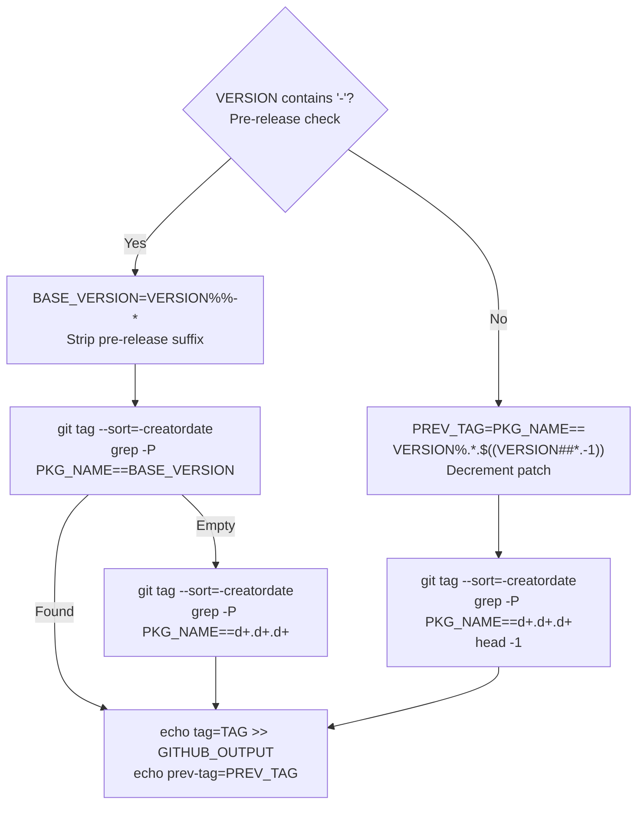

test-pypi-publish:
  permissions:
    id-token: write  # For trusted publishing
    
mark-release:
  permissions:
    contents: write  # For creating GitHub releases
```

**Rationale** (from comments in workflow):
> "We want to keep this build stage *separate* from the release stage, so that there's no sharing of permissions between them. Otherwise, a malicious `build` step (e.g. via a compromised dependency) could get access to our GitHub or PyPI credentials."

**Sources:** [.github/workflows/_release.yml:44-75]()

### Version Extraction and Tag Management

**Version extraction** (Stage 1 - `build` job):
```python
# From check-version step (inline Python)
import tomllib
with open("pyproject.toml", "rb") as f:
    data = tomllib.load(f)
pkg_name = data["project"]["name"]
version = data["project"]["version"]
# Writes to GITHUB_OUTPUT: pkg-name={pkg_name}\nversion={version}
```

**Build artifacts:**
- `uv build` generates wheel and sdist in `{working-directory}/dist/`
- `actions/upload-artifact@v6` uploads as artifact named `dist`

**Sources:** [.github/workflows/_release.yml:56-98]()

**Tag determination logic** (Stage 2):



**Sources:** [.github/workflows/_release.yml:116-171]()

### Pre-Release Checks

The `pre-release-checks` stage performs extensive validation:

**1. Import test from distribution:**
```bash
uv venv
VIRTUAL_ENV=.venv uv pip install dist/*.whl
IMPORT_NAME="$(echo "$PKG_NAME" | sed s/-/_/g | sed s/_official//g)"
uv run python -c "import $IMPORT_NAME; print(dir($IMPORT_NAME))"
```

**2. Prerelease dependency check:**
```bash
uv run python $GITHUB_WORKSPACE/.github/scripts/check_prerelease_dependencies.py pyproject.toml
```

Blocks release if dependencies specify prerelease versions (e.g., `>=1.0.0a1`) unless the package itself is a prerelease. Prevents accidentally shipping packages that depend on unstable versions.

**3. Unit tests:**
```bash
make tests
```

**4. Minimum version testing:**
```bash