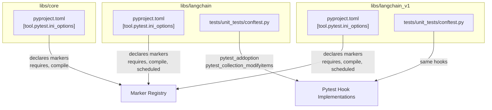
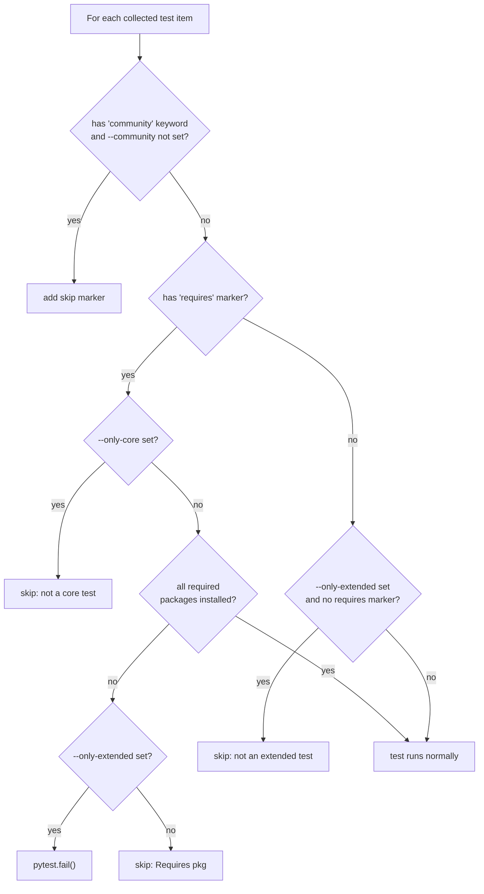
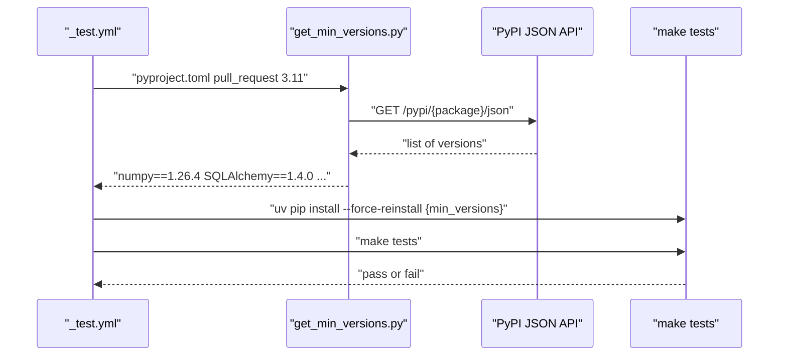
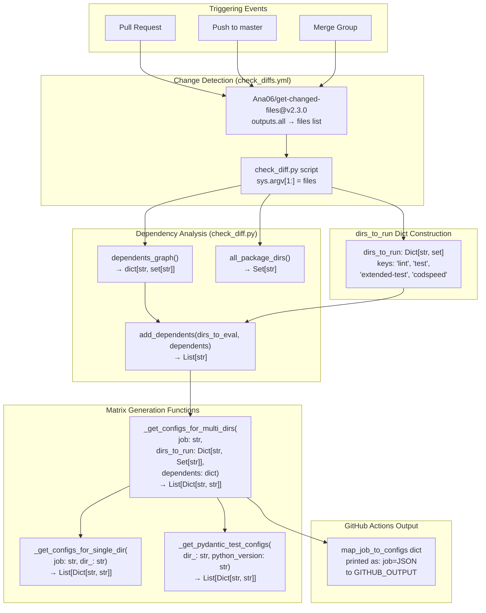
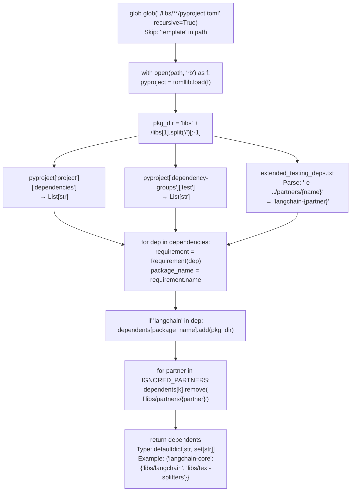
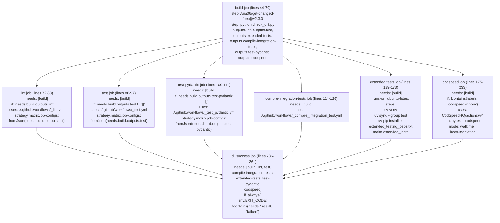
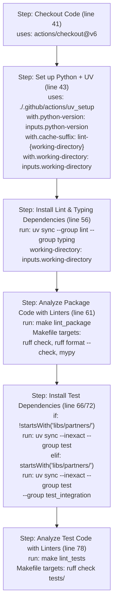
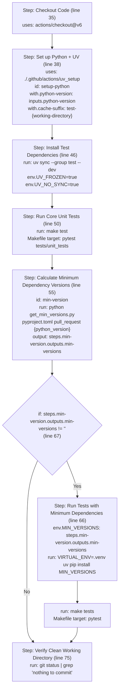
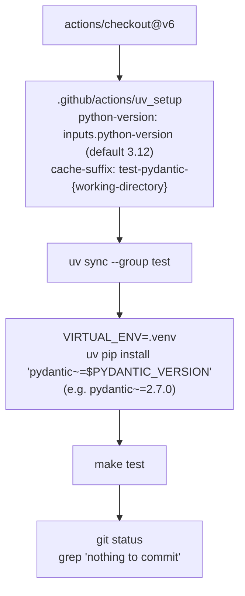

This page documents the pytest setup used across the LangChain monorepo: custom markers, command-line options, `conftest.py` patterns, dependency enforcement tests, and the minimum-version compatibility testing script. This information is relevant to anyone writing, running, or debugging tests in any package under `libs/`.

For information on the standard test suites (`ChatModelUnitTests`, `VectorStoreIntegrationTests`, etc.) see page [5.1](). For how tests are triggered in CI, see page [5.3]().

---

## Overview of pytest Configuration Locations

Each package in the monorepo has its own `pyproject.toml` containing a `[tool.pytest.ini_options]` section. These are not inherited; each package configures pytest independently. The `conftest.py` files provide shared fixtures and hook implementations.

**Pytest configuration diagram:**



Sources: [libs/core/pyproject.toml:141-149](), [libs/langchain/pyproject.toml:225-237](), [libs/langchain_v1/pyproject.toml:185-197](), [libs/langchain/tests/unit_tests/conftest.py:1-99]()

---

## `[tool.pytest.ini_options]` Across Packages

The table below summarizes the key differences in pytest configuration per package.

| Setting | `langchain-core` | `langchain` | `langchain_v1` |
|---|---|---|---|
| `addopts` | `--snapshot-warn-unused --strict-markers --strict-config --durations=5` | same + `-vv` | same + `-vv` |
| `asyncio_mode` | `auto` | `auto` | `auto` |
| `asyncio_default_fixture_loop_scope` | `function` | _(not set)_ | _(not set)_ |
| Markers | `requires`, `compile` | `requires`, `compile`, `scheduled` | `requires`, `compile`, `scheduled` |
| Filtered warnings | `LangChainBetaWarning` | `LangChainBetaWarning`, `LangChainDeprecationWarning`, `LangChainPendingDeprecationWarning` | same as `langchain` |

Sources: [libs/core/pyproject.toml:141-149](), [libs/langchain/pyproject.toml:225-237](), [libs/langchain_v1/pyproject.toml:185-197]()

### `--strict-markers`

All packages use `--strict-markers`, meaning any test decorated with an unregistered marker will cause pytest to error at collection time. Every marker must be explicitly declared in `[tool.pytest.ini_options]` under `markers`.

### `--strict-config`

Causes pytest to error if unknown `[tool.pytest.ini_options]` keys are found in the config. This prevents silent misconfigurations.

### `asyncio_mode = "auto"`

All packages use `pytest-asyncio` in `auto` mode — async test functions do not require explicit `@pytest.mark.asyncio` decoration.

---

## Registered Pytest Markers

**Marker-to-purpose diagram:**

```mermaid
graph LR
    requires["@pytest.mark.requires(\"pkg\")"]
    compile_m["@pytest.mark.compile"]
    scheduled["@pytest.mark.scheduled"]

    requires -->|"skip if pkg not importable"| pytest_collection_modifyitems
    compile_m -->|"used by _compile_integration_test.yml\npytest -m compile"| CI["CI Compile Check"]
    scheduled -->|"filtered in scheduled CI runs"| ScheduledCI["Scheduled Testing Jobs"]
```

Sources: [libs/langchain/pyproject.toml:227-231](), [libs/langchain_v1/pyproject.toml:187-191](), [libs/core/pyproject.toml:143-146](), [.github/workflows/_compile_integration_test.yml:52-53]()

| Marker | Packages | Purpose |
|---|---|---|
| `requires` | core, langchain, langchain_v1, partners | Skip a test if a named Python package is not installed |
| `compile` | core, langchain, langchain_v1, partners | Placeholder marker for integration tests; used to verify tests can be imported without running them |
| `scheduled` | langchain, langchain_v1 | Marks tests that should only run during scheduled (nightly) CI |

---

## `conftest.py` Patterns

### Location

Each test subdirectory can have its own `conftest.py`. The primary one for custom hook implementations lives at:

- [libs/langchain/tests/unit_tests/conftest.py]()

An equivalent is present in `langchain_v1`.

### `pytest_addoption`

[libs/langchain/tests/unit_tests/conftest.py:9-28]()

Adds three command-line flags to pytest:

| Flag | Type | Default | Effect |
|---|---|---|---|
| `--only-extended` | `store_true` | `False` | Only run tests that have a `requires` marker |
| `--only-core` | `store_true` | `False` | Only run tests with no `requires` marker |
| `--community` | `store_true` | `False` | Enable tests marked with `community` keyword |

These flags are mutually exclusive: passing both `--only-extended` and `--only-core` raises a `ValueError`.

### `pytest_collection_modifyitems`

[libs/langchain/tests/unit_tests/conftest.py:31-99]()

This hook runs after test collection and handles three behaviors:

**1. `requires` marker — package availability check**

```
@pytest.mark.requires("some_package")
def test_something(): ...
```

For each test with this marker, the hook calls `importlib.util.find_spec(pkg)` for each named package. If any package is not installed:
- Default behavior: the test is skipped with reason `Requires pkg: \`{pkg}\``
- With `--only-extended`: `pytest.fail()` is called (the package should be present)
- With `--only-core`: the test is skipped regardless

Results of `find_spec` are cached in `required_pkgs_info: dict[str, bool]` to avoid repeated lookups.

**2. `community` keyword — opt-in community tests**

Tests tagged with `community` in their keywords are skipped unless `--community` is passed.

**3. `--only-extended` / `--only-core` filter**

- `--only-core`: Any test that has a `requires` marker is skipped.
- `--only-extended`: Any test without a `requires` marker is skipped.

**Flow diagram for `pytest_collection_modifyitems`:**



Sources: [libs/langchain/tests/unit_tests/conftest.py:31-99]()

---

## Dependency Enforcement Tests

[libs/langchain/tests/unit_tests/test_dependencies.py]()

These unit tests act as a guard against accidentally adding new required or test dependencies to `libs/langchain/pyproject.toml`.

### `test_required_dependencies`

Reads `pyproject.toml` via the `uv_conf` fixture, parses `project.dependencies`, and asserts the exact set of required package names matches a hardcoded allowlist:

```
PyYAML, SQLAlchemy, async-timeout, langchain-core,
langchain-text-splitters, langsmith, pydantic, requests
```

### `test_test_group_dependencies`

Reads `dependency-groups.test` from `pyproject.toml` and asserts the exact set of test-group package names. This prevents contributors from adding non-infrastructure packages (e.g. `boto3`, `azure`) to the test group.

### `uv_conf` fixture

[libs/langchain/tests/unit_tests/test_dependencies.py:16-20]()

A session-scoped pytest fixture that reads and returns the parsed `pyproject.toml` as a dict. The fixture is parameterless and loads the file relative to the test file's location via `pathlib.Path`.

---

## Minimum-Version Testing

The CI system tests each package against both the current and the minimum allowed versions of key dependencies. This catches regressions where code works with the latest dependencies but breaks with versions at the lower bound of the declared specifier.

### `get_min_versions.py`

[.github/scripts/get_min_versions.py]()

This script accepts a `pyproject.toml` path, a context (`pull_request` or `release`), and a Python version string. It returns a space-separated string of `package==version` pinned to the minimum compatible version.

**Key functions:**

| Function | Purpose |
|---|---|
| `get_pypi_versions(package_name)` | Fetches all published versions from PyPI JSON API |
| `get_minimum_version(package_name, spec_string)` | Returns the lowest published version satisfying the specifier |
| `get_min_version_from_toml(toml_path, versions_for, python_version)` | Orchestrates the above for all packages in `MIN_VERSION_LIBS` |

**`MIN_VERSION_LIBS`** — the packages for which minimum versions are always checked:

```
langchain-core, langchain, langchain-text-splitters, numpy, SQLAlchemy
```

**`SKIP_IF_PULL_REQUEST`** — packages skipped during PR checks (only tested on release), because simultaneous development across packages would otherwise cause false failures:

```
langchain-core, langchain-text-splitters, langchain
```

### How the Script Is Invoked in CI

**In `_test.yml`** [.github/workflows/_test.yml:56-72]():

```
python .github/scripts/get_min_versions.py pyproject.toml pull_request {python_version}
```

The output is captured as `min-versions`. If non-empty, `uv pip install --force-reinstall $MIN_VERSIONS` is run and then `make tests` is executed again.

**In `_release.yml`** [.github/workflows/_release.yml:317-336]():

Same logic but uses `release` context — so `langchain-core` and friends are also tested at their minimum versions.

**Minimum-version testing flow:**



Sources: [.github/scripts/get_min_versions.py](), [.github/workflows/_test.yml:56-72](), [.github/workflows/_release.yml:317-336]()

---

## Test Plugin Dependencies

The `test` dependency group in each package specifies which pytest plugins are used. The table below lists the plugins consistently used across core packages.

| Plugin | Purpose |
|---|---|
| `pytest-asyncio` | `asyncio_mode = "auto"` — runs async tests without explicit markers |
| `pytest-mock` | `mocker` fixture for mocking |
| `pytest-socket` | Network socket blocking in unit tests |
| `pytest-xdist` | Parallel test execution with `-n` flag |
| `syrupy` | Snapshot testing (`--snapshot-warn-unused`) |
| `pytest-watcher` | File-watching re-runner for development |
| `freezegun` | Time mocking in tests |
| `blockbuster` | Detects blocking calls in async code (used in `langchain_v1`) |
| `pytest-benchmark` / `pytest-codspeed` | Performance benchmarking (used in `langchain-core`) |

Sources: [libs/core/pyproject.toml:60-77](), [libs/langchain/pyproject.toml:66-91](), [libs/langchain_v1/pyproject.toml:62-75]()

---

## Summary: Marker and Option Flow

```mermaid
graph TD
    subgraph "pyproject.toml"
        MarkerDecl["markers = [requires, compile, scheduled]"]
        AddOpts["addopts = --strict-markers --strict-config ..."]
    end

    subgraph "conftest.py"
        AddOption["pytest_addoption()\n--only-extended\n--only-core\n--community"]
        ModifyItems["pytest_collection_modifyitems()\nskip / fail logic"]
    end

    subgraph "Test Files"
        RequiresMark["@pytest.mark.requires(\"pkg\")"]
        CompileMark["@pytest.mark.compile"]
        ScheduledMark["@pytest.mark.scheduled"]
    end

    subgraph "CI Workflows"
        TestYml["_test.yml: make test"]
        CompileYml["_compile_integration_test.yml: pytest -m compile"]
        ScheduledJob["scheduled jobs"]
    end

    MarkerDecl --> ModifyItems
    AddOption --> ModifyItems
    RequiresMark --> ModifyItems
    CompileMark --> CompileYml
    ScheduledMark --> ScheduledJob
    ModifyItems --> TestYml
```

Sources: [libs/langchain/tests/unit_tests/conftest.py](), [libs/core/pyproject.toml:141-149](), [libs/langchain/pyproject.toml:225-237](), [.github/workflows/_compile_integration_test.yml:52-53]()

# CI/CD and Testing Infrastructure


This page documents the CI/CD workflow architecture for the LangChain monorepo, focusing on how `check_diffs.yml` orchestrates test execution, how `check_diff.py` performs dependency analysis and generates dynamic test matrices, and how reusable workflows (`_lint.yml`, `_test.yml`, `_test_pydantic.yml`, `_compile_integration_test.yml`) execute tests efficiently.

For information about the specific test suites and testing patterns (e.g., `ChatModelIntegrationTests`, VCR caching), see page 5.1 (Standard Testing Framework). This page focuses on the CI orchestration layer.

---

## Overview

The CI/CD system optimizes test execution in a monorepo environment where changes to core packages affect multiple dependent packages. The architecture consists of:

1. **`check_diffs.yml`**: Main workflow that detects changes and orchestrates all CI jobs
2. **`check_diff.py`**: Python script that analyzes dependencies and generates test matrices
3. **Reusable workflows**: Modular workflow files for linting, testing, and compilation
4. **`get_min_versions.py`**: Resolves minimum compatible dependency versions
5. **Dependency groups**: Organized via `[dependency-groups]` in `pyproject.toml`

**Key optimizations:**
- Tests only affected packages based on file changes
- Includes dependent packages automatically when core components change
- Validates against minimum supported dependency versions
- Tests across Python 3.10-3.14 and Pydantic 2.x versions
- Caches dependencies per package and Python version

**Sources:** [.github/workflows/check_diffs.yml:1-262](), [.github/scripts/check_diff.py:1-341]()

---

## Smart Test Selection System

### Architecture Overview

The smart test selection system analyzes git diffs to determine which directories need testing, linting, or building. This optimization is critical for CI performance in a monorepo with 15+ packages.

**Diagram: Smart Test Selection Pipeline - Function Call Flow**



**Sources:** [.github/workflows/check_diffs.yml:44-70](), [.github/scripts/check_diff.py:225-341]()

### Dependency Graph Construction

The `dependents_graph()` function at [.github/scripts/check_diff.py:63-113]() constructs a mapping of package → dependents by parsing all `pyproject.toml` files and `extended_testing_deps.txt` files.

**Diagram: `dependents_graph()` Function Implementation**



**Implementation details:**

- **Package discovery**: `glob.glob("./libs/**/pyproject.toml", recursive=True)` at [.github/scripts/check_diff.py:70]() with exclusions at line 59: `if "libs/cli" not in path and "libs/standard-tests" not in path`
- **Template filtering**: `if "template" in path: continue` at [.github/scripts/check_diff.py:72]()
- **Package directory extraction**: `pkg_dir = "libs" + "/".join(path.split("libs")[1].split("/")[:-1])` at [.github/scripts/check_diff.py:78]()
- **Dependency parsing**: `requirement = Requirement(dep)` from `packaging.requirements` at [.github/scripts/check_diff.py:83-84]()
- **Langchain filtering**: `if "langchain" in dep:` at [.github/scripts/check_diff.py:85]() - only tracks LangChain packages as dependencies
- **Editable dependencies**: Parses `-e ../partners/{partner}` format at [.github/scripts/check_diff.py:96-102](), converts to `langchain-{partner}`
- **Partner filtering**: `IGNORED_PARTNERS = ["huggingface", "prompty"]` at [.github/scripts/check_diff.py:44-52](), removed via loop at lines 109-112
- **Return type**: `defaultdict(set)` initialized at [.github/scripts/check_diff.py:68]()

**Sources:** [.github/scripts/check_diff.py:63-113]()

### File-to-Package Mapping

The script maps changed files to affected packages using path-based rules:

| File Pattern | Action | Packages Affected |
|-------------|--------|------------------|
| `.github/workflows/*`, `.github/actions/*`, `.github/scripts/check_diff.py` | `dirs_to_run["extended-test"].update(LANGCHAIN_DIRS)` | `libs/core`, `libs/text-splitters`, `libs/langchain`, `libs/langchain_v1` |
| `libs/core/*` | `dirs_to_run["codspeed"].add("libs/core")` | `libs/core` (+ dependents if not `IGNORE_CORE_DEPENDENTS=False`) |
| `libs/standard-tests/*` | Add to `dirs_to_run["lint"]` and `dirs_to_run["test"]` | `libs/partners/mistralai`, `libs/partners/openai`, `libs/partners/anthropic`, `libs/partners/fireworks`, `libs/partners/groq` |
| `libs/partners/{partner}/*` | `dirs_to_run["test"].add(f"libs/partners/{partner}")` | `libs/partners/{partner}` |
| `libs/cli/*` | `dirs_to_run["lint"].add("libs/cli")` and `dirs_to_run["test"].add("libs/cli")` | `libs/cli` |

**Special handling for `LANGCHAIN_DIRS` list:**

When files change in core packages (`libs/core`, `libs/text-splitters`, `libs/langchain`, `libs/langchain_v1`), the script adds that directory and all subsequent directories in the list to extended tests. This ensures cascading dependency testing.

**Sources:** [.github/scripts/check_diff.py:242-314]()

### Matrix Configuration Generation

For each job type, the `_get_configs_for_single_dir(job: str, dir_: str)` function at [.github/scripts/check_diff.py:129-143]() generates a matrix of configurations specifying `working-directory` and `python-version`:

```python
# From _get_configs_for_single_dir() at line 129
if job == "test-pydantic":
    return _get_pydantic_test_configs(dir_)

if job == "codspeed":
    py_versions = ["3.13"]
elif dir_ == "libs/core":
    py_versions = ["3.10", "3.11", "3.12", "3.13", "3.14"]
elif dir_ in {"libs/partners/chroma"}:
    py_versions = ["3.10", "3.13"]
else:
    py_versions = ["3.10", "3.14"]

return [{"working-directory": dir_, "python-version": py_v} for py_v in py_versions]
```

**Pydantic version testing** via `_get_pydantic_test_configs()` at [.github/scripts/check_diff.py:146-198]() generates a more complex matrix:

1. Parse `uv.lock` files to extract `package["version"]` for package with `package["name"] == "pydantic"`
2. Call `get_min_version_from_toml(pyproject_path, "release", python_version, include=["pydantic"])` to get minimum Pydantic version
3. Calculate `min_pydantic_minor = max(int(dir_min_pydantic_minor), int(core_min_pydantic_minor))`
4. Calculate `max_pydantic_minor = min(int(dir_max_pydantic_minor), int(core_max_pydantic_minor))`
5. Generate configs: `[{"working-directory": dir_, "pydantic-version": f"2.{v}.0", "python-version": python_version} for v in range(min_pydantic_minor, max_pydantic_minor + 1)]`

**Sources:** [.github/scripts/check_diff.py:129-198]()

---

## Test Execution Workflows

### Workflow Orchestration in `check_diffs.yml`

The `check_diffs.yml` workflow at [.github/workflows/check_diffs.yml:1-262]() orchestrates all CI jobs:

**Diagram: `check_diffs.yml` Job Orchestration and Dependencies**



**Concurrency control** at [.github/workflows/check_diffs.yml:30-32]():
```yaml
concurrency:
  group: ${{ github.workflow }}-${{ github.ref }}
  cancel-in-progress: true
```

Cancels in-progress runs when new commits are pushed to the same PR, optimizing CI resource usage.

**Sources:** [.github/workflows/check_diffs.yml:14-262]()

### Lint Workflow (`_lint.yml`)

The `_lint.yml` reusable workflow at [.github/workflows/_lint.yml:1-82]() runs quality checks using `ruff` and `mypy`:

**Diagram: `_lint.yml` Step-by-Step Execution Flow**



**Environment configuration** at [.github/workflows/_lint.yml:25-31]():
```yaml
env:
  RUFF_OUTPUT_FORMAT: github  # Enables inline PR annotations
  UV_FROZEN: "true"            # Respects uv.lock versions
```

**Dependency groups used:**
- `--group lint`: Contains `ruff>=0.14.11,<0.15.0` (see `pyproject.toml`)
- `--group typing`: Contains `mypy>=1.19.1,<1.20.0`, type stubs
- `--group test`: Required for linting test code (imports test utilities)
- `--group test_integration`: Partner packages only, for linting integration tests

**Makefile targets:**
- `lint_package`: Runs `ruff check` and `ruff format --check` on package source
- `lint_tests`: Runs `ruff check` and `ruff format --check` on test code

**Sources:** [.github/workflows/_lint.yml:1-82]()

### Unit Test Workflow (`_test.yml`)

The `_test.yml` reusable workflow at [.github/workflows/_test.yml:1-86]() runs unit tests with both current and minimum dependency versions:

**Diagram: `_test.yml` Step-by-Step Execution with Min Version Testing**



**Key implementation details:**

- **Dual testing strategy**: Tests with current `uv.lock` versions at [.github/workflows/_test.yml:46-53](), then with minimum versions at [.github/workflows/_test.yml:66-73]()
- **Timeout**: `timeout-minutes: 20` on `ubuntu-latest` runner
- **Environment**: `UV_FROZEN="true"` (respect lockfile), `UV_NO_SYNC="true"` (skip auto-sync) at [.github/workflows/_test.yml:22-23]()
- **Conditional min version testing**: Only runs if `steps.min-version.outputs.min-versions != ''` at [.github/workflows/_test.yml:67]()
- **Dependency group**: `--group test` contains `pytest>=7.0.0,<9.0.0` and other test dependencies

**Sources:** [.github/workflows/_test.yml:1-86]()

### Pydantic Version Testing (`_test_pydantic.yml`)

The `_test_pydantic.yml` reusable workflow at [.github/workflows/_test_pydantic.yml:1-74]() validates compatibility across Pydantic 2.x versions:

**Diagram: `_test_pydantic.yml` Execution Flow**



**Job configuration:**
- **Python version**: Default `3.12` (input `inputs.python-version` at [.github/workflows/_test_pydantic.yml:12-16]())
- **Pydantic version**: Specified by matrix input `inputs.pydantic-version` at [.github/workflows/_test_pydantic.yml:17-20]()

**Installation logic** at [.github/workflows/_test_pydantic.yml:52-56]():
```bash
VIRTUAL_ENV=.venv uv pip install "pydantic~=$PYDANTIC_VERSION"
```

The `~=` operator installs the specified minor version (e.g., `~=2.7.0` allows `>=2.7.0, <2.8.0`).

**Matrix generation:** The matrix is generated by `_get_pydantic_test_configs()` at [.github/scripts/check_diff.py:146-198](), which determines the Pydantic version range from `uv.lock` and `pyproject.toml` minimum versions.

**Sources:** [.github/workflows/_test_pydantic.yml:1-74](), [.github/scripts/check_diff.py:146-198]()

### Integration Test Compilation

The `_compile_integration_test.yml` workflow verifies that integration tests can be imported without syntax errors:

```bash
uv run pytest -m compile tests/integration_tests
```

This catches issues like:
- Import errors
- Syntax errors
- Missing dependencies
- Typos in test files

**Sources:** [.github/workflows/_compile_integration_test.yml:1-66]()

### Extended Tests

Extended tests run for core packages (`libs/core`, `libs/text-splitters`, `libs/langchain`, `libs/langchain_v1`) and install additional dependencies:

```bash
uv venv
uv sync --group test
VIRTUAL_ENV=.venv uv pip install -r extended_testing_deps.txt
VIRTUAL_ENV=.venv make extended_tests
```

**Purpose:** Tests requiring additional dependencies beyond standard test group. Examples:
- Partner package integrations (via `-e ../partners/{name}` in `extended_testing_deps.txt`)
- Specific database drivers or optional backends
- Features requiring heavy external dependencies

**Extended test invocation:**
```bash
VIRTUAL_ENV=.venv make extended_tests
# Typically runs: pytest tests/unit_tests with extended deps available
```

**Sources:** [.github/workflows/check_diffs.yml:129-173]()

### CodSpeed Benchmarks

CodSpeed benchmarks run on packages with changed files (unless labeled `codspeed-ignore`):

```bash