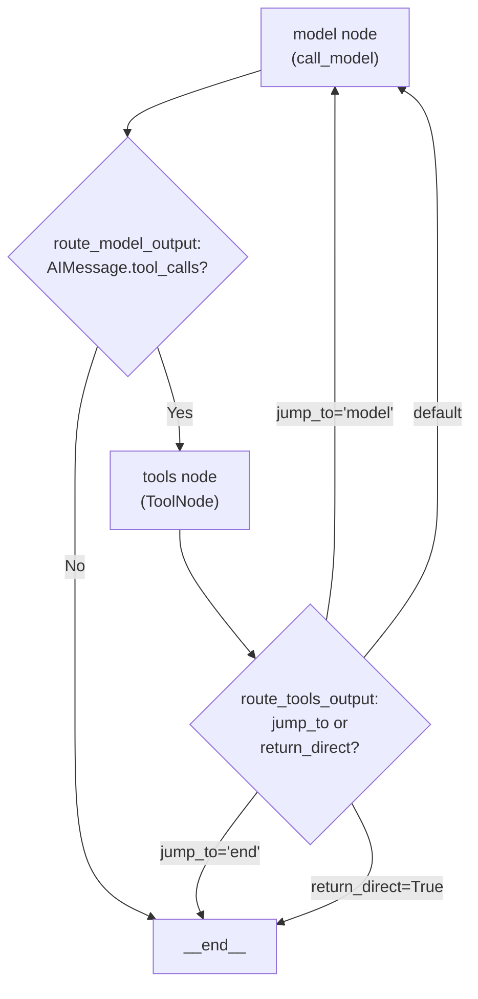

```

Each `ToolCall` in `AIMessage.tool_calls` passes through the composed wrapper chain independently, allowing per-call retry, validation, or modification.

The `ToolNode` applies the composed wrapper to each tool invocation:
- Sync path: Uses `wrap_tool_call` composition
- Async path: Uses `awrap_tool_call` composition

**Sources:** [libs/langchain_v1/langchain/agents/factory.py:433-476](), [libs/langchain_v1/langchain/agents/factory.py:479-540](), [libs/langchain_v1/langchain/agents/factory.py:740-767]()

## Tool Execution Loop

### Tool Node and Execution Flow

The tool execution loop is implemented through conditional edges between nodes in the `StateGraph`:



The tool execution involves several key steps:

1. **Tool Call Detection**: Check if `AIMessage.tool_calls` is non-empty in `route_model_output`
2. **Tool Node Invocation**: Execute `ToolNode` with composed `wrap_tool_call`/`awrap_tool_call` handlers
3. **Message Appending**: `ToolNode` adds `ToolMessage` results to state
4. **Loop Decision**: `route_tools_output` determines next node based on `jump_to`, `return_direct`, or defaults to model

**Sources:** [libs/langchain_v1/langchain/agents/factory.py:1088-1149](), [libs/langchain_v1/langchain/agents/factory.py:1151-1246]()

### ToolNode Structure

The `ToolNode` is instantiated with composed middleware wrappers:

```python