max_retries: int = 2  # Attempts after initial call
retry_on: RetryOn = (Exception,)  # Tuple of exception types or callable
on_failure: OnFailure = "continue"  # "continue", "error", or callable
backoff_factor: float = 2.0
initial_delay: float = 1.0
max_delay: float = 60.0
jitter: bool = True
```

**Tool Filtering**: When `tools` parameter is specified, only those tools are retried. The middleware extracts tool names from both string identifiers and `BaseTool.name` attributes [libs/langchain_v1/langchain/agents/middleware/tool_retry.py:147-151]().

Sources: [libs/langchain_v1/langchain/agents/middleware/tool_retry.py:30-278](), [libs/langchain_v1/langchain/agents/middleware/_retry.py:1-100]() (referenced)

## Resource Management

### ModelCallLimitMiddleware

Tracks model call counts at both thread and run levels, enforcing configurable limits.

**State Schema**: `ModelCallLimitState` extends `AgentState` with:

| Field | Type | Reducer | Purpose |
|-------|------|---------|---------|
| `thread_model_call_count` | `int` | Default | Persisted across runs |
| `run_model_call_count` | `int` | `UntrackedValue` | Reset each run |

**Implementation Flow**:

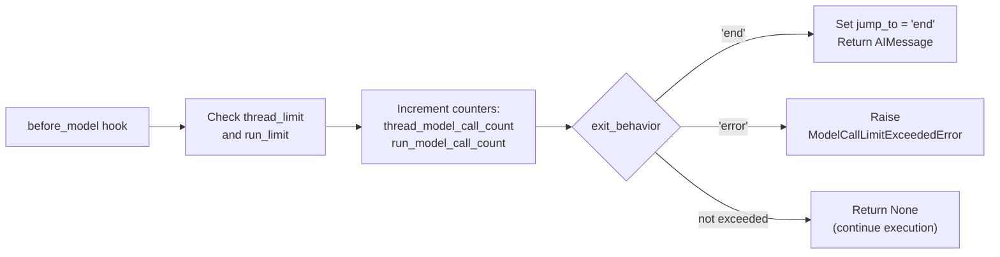

**Key Code References**:
- State schema: [libs/langchain_v1/langchain/agents/middleware/model_call_limit.py:24-35]()
- Before hook implementation: [libs/langchain_v1/langchain/agents/middleware/model_call_limit.py:156-215]()
- Jump-to-end uses `@hook_config(can_jump_to=["end"])` decorator: [libs/langchain_v1/langchain/agents/middleware/model_call_limit.py:147-151]()

Sources: [libs/langchain_v1/langchain/agents/middleware/model_call_limit.py:1-229]()

### ToolCallLimitMiddleware

Tracks tool call counts per tool name, enforcing limits at both thread and run levels.

**State Schema**: `ToolCallLimitState` extends `AgentState` with:

| Field | Type | Purpose |
|-------|------|---------|
| `thread_tool_call_count` | `dict[str, int]` | Maps tool name to count (persisted) |
| `run_tool_call_count` | `dict[str, int]` | Maps tool name to count (ephemeral) |

The special key `'__all__'` is used for global tool call tracking across all tools.

**Exit Behaviors**:

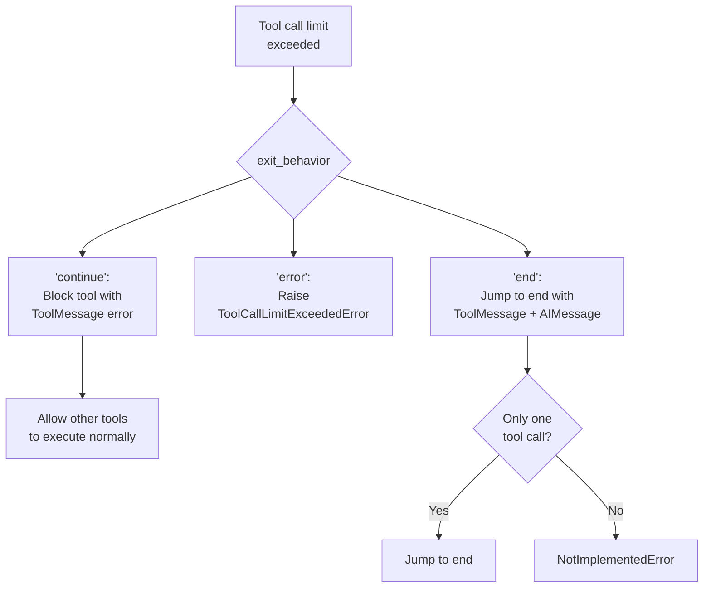

**Implementation Details**:
- Uses `after_model` hook to inspect `AIMessage.tool_calls` [libs/langchain_v1/langchain/agents/middleware/tool_call_limit.py:199-272]()
- Supports per-tool limits via `tools` parameter (dict mapping tool names to limits)
- Global limits applied to all tools via `thread_limit` and `run_limit` without `tools` parameter
- Error messages use `_build_tool_message_content()` for model feedback and `_build_final_ai_message_content()` for user feedback [libs/langchain_v1/langchain/agents/middleware/tool_call_limit.py:52-102]()

Sources: [libs/langchain_v1/langchain/agents/middleware/tool_call_limit.py:1-452]()

### ContextEditingMiddleware

Automatically prunes tool results from message history when token counts exceed configured thresholds.

**Edit Strategies**:

Currently supports `ClearToolUsesEdit` which mirrors Anthropic's `clear_tool_uses_20250919` behavior:

```python
@dataclass
class ClearToolUsesEdit(ContextEdit):
    trigger: int = 100_000          # Token count threshold
    clear_at_least: int = 0         # Minimum tokens to reclaim
    keep: int = 3                    # Recent tool results to preserve
    clear_tool_inputs: bool = False # Clear args from AIMessage.tool_calls
    exclude_tools: Sequence[str] = () # Tools to never clear
    placeholder: str = "[cleared]"   # Replacement text
```

**Implementation Flow**:

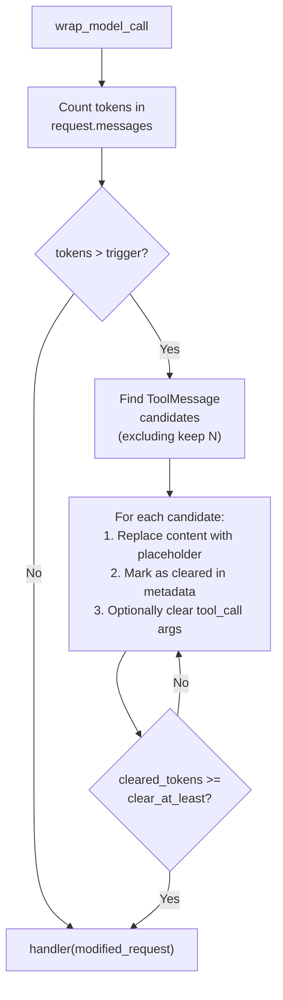

**Token Counting Methods**:
- `"approximate"`: Uses `count_tokens_approximately()` (fast, less accurate)
- `"model"`: Uses `model.get_num_tokens_from_messages()` (slower, more accurate)

**Message Modifications**: Cleared `ToolMessage` instances have metadata tracking:
```python
response_metadata = {
    "context_editing": {
        "cleared": True,
        "strategy": "clear_tool_uses"
    }
}
```

Sources: [libs/langchain_v1/langchain/agents/middleware/context_editing.py:1-299]()

## Human Oversight and Control

### HumanInTheLoopMiddleware

Interrupts agent execution to request human approval, editing, or rejection of tool calls.

**Decision Flow**:

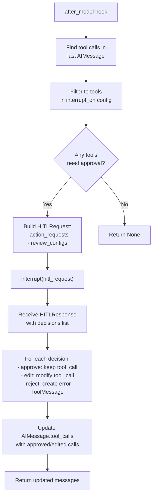

**Configuration Types**:

```python
# InterruptOnConfig from human_in_the_loop.py
interrupt_on = {
    "tool_name": True,  # All decisions allowed
    "tool_name": False,  # Auto-approve (no interrupt)
    "tool_name": InterruptOnConfig(
        allowed_decisions=["approve", "edit", "reject"],
        description="Static string or callable",
        args_schema={}  # For edit validation
    )
}
```

**Key Data Structures**:

| Type | Purpose | Fields |
|------|---------|--------|
| `HITLRequest` | Sent to human via `interrupt()` | `action_requests`, `review_configs` |
| `ActionRequest` | Individual tool call for review | `name`, `args`, `description` |
| `ReviewConfig` | Validation rules | `action_name`, `allowed_decisions`, `args_schema` |
| `HITLResponse` | Human's response | `decisions` list |
| `Decision` | Per-action decision | `ApproveDecision`, `EditDecision`, or `RejectDecision` |

**Decision Processing**: [libs/langchain_v1/langchain/agents/middleware/human_in_the_loop.py:246-286]()
- `approve`: Tool call executed as-is
- `edit`: `tool_call.args` and `tool_call.name` replaced with `edited_action` values
- `reject`: Creates `ToolMessage` with `status="error"` and human-provided message

Sources: [libs/langchain_v1/langchain/agents/middleware/human_in_the_loop.py:1-388]()

## Tool Selection and Optimization

### LLMToolSelectorMiddleware

Uses an LLM to filter tools before the main model call, reducing token usage when many tools are available.

**Selection Process**:

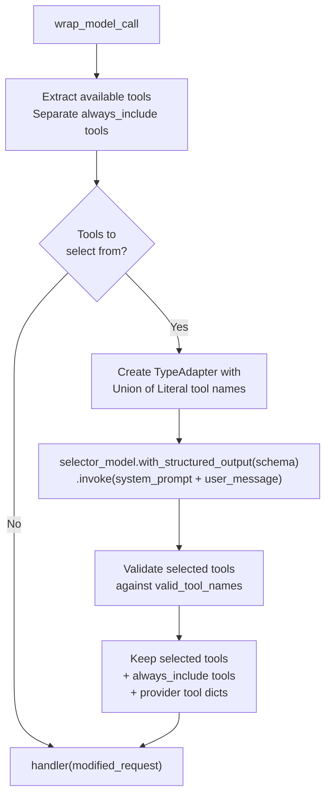

**Dynamic Schema Generation**:

The middleware creates a structured output schema where each tool name becomes a `Literal` type with its description:

```python
# From tool_selection.py:66-78
literals = [
    Annotated[Literal[tool.name], Field(description=tool.description)]
    for tool in tools
]
selected_tool_type = Union[tuple(literals)]

class ToolSelectionResponse(TypedDict):
    tools: Annotated[list[selected_tool_type], Field(description="...")]
```

**Configuration Options**:

| Parameter | Type | Default | Purpose |
|-----------|------|---------|---------|
| `model` | `str \| BaseChatModel \| None` | Agent's model | Model for selection |
| `system_prompt` | `str` | Default instructions | Selection guidance |
| `max_tools` | `int \| None` | None | Limit on selected tools |
| `always_include` | `list[str] \| None` | `[]` | Tools always included |

**Tool Filtering**: When `max_tools` is set, only the first N selected tools are used. The `always_include` tools don't count against this limit [libs/langchain_v1/langchain/agents/middleware/tool_selection.py:232-272]().

Sources: [libs/langchain_v1/langchain/agents/middleware/tool_selection.py:1-351]()

## Planning and Task Management

### TodoListMiddleware

Provides todo list management capabilities through a `write_todos` tool and system prompt injection.

**Components**:

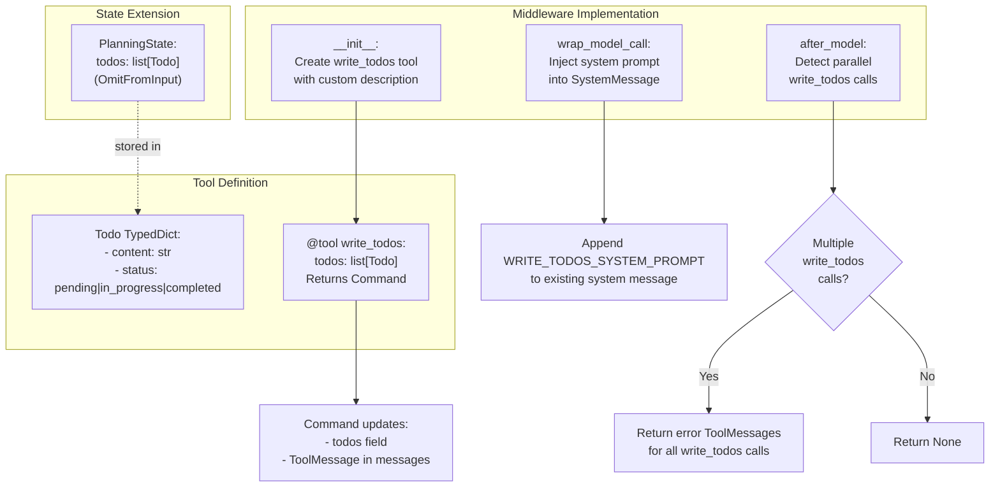

**System Prompt Injection**: [libs/langchain_v1/langchain/agents/middleware/todo.py:201-226]()

The middleware appends `WRITE_TODOS_SYSTEM_PROMPT` to the existing system message content blocks, ensuring todo usage guidance is always present.

**Parallel Call Prevention**: [libs/langchain_v1/langchain/agents/middleware/todo.py:256-305]()

The `after_model` hook counts `write_todos` tool calls in the last `AIMessage`. If multiple calls are detected, it returns error `ToolMessage` instances explaining that parallel calls are not allowed, since `write_todos` replaces the entire todo list.

**State Schema**: `PlanningState` extends `AgentState` with:
```python
todos: Annotated[NotRequired[list[Todo]], OmitFromInput]
```

The `OmitFromInput` annotation means users don't need to provide initial todos when invoking the agent.

Sources: [libs/langchain_v1/langchain/agents/middleware/todo.py:1-328]()

## Testing and Development

### LLMToolEmulator

Emulates tool execution using an LLM instead of actually running the tool, useful for testing without external dependencies.

**Emulation Flow**:

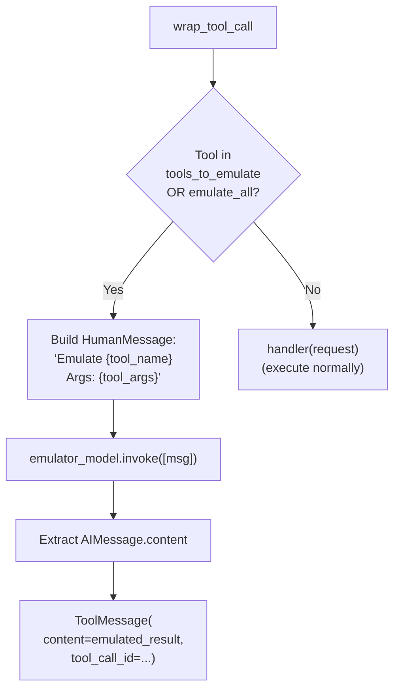

**Configuration**:

```python
def __init__(
    self,
    *,
    tools: list[str | BaseTool] | None = None,  # None = emulate ALL
    model: str | BaseChatModel | None = None,   # Default: claude-sonnet
)
```

**Tool Selection Logic**:
- `tools=None`: Emulate all tools (`emulate_all=True`)
- `tools=[]`: Emulate no tools (pass through all)
- `tools=["tool1", tool2_instance]`: Emulate only specified tools

The middleware extracts tool names from both string identifiers and `BaseTool.name` attributes [libs/langchain_v1/langchain/agents/middleware/tool_emulator.py:86-100]().

Sources: [libs/langchain_v1/langchain/agents/middleware/tool_emulator.py:1-163]()

## Specialized Tools

### ShellToolMiddleware

Provides a persistent shell session as a tool, with configurable execution policies for security.

**Architecture**:

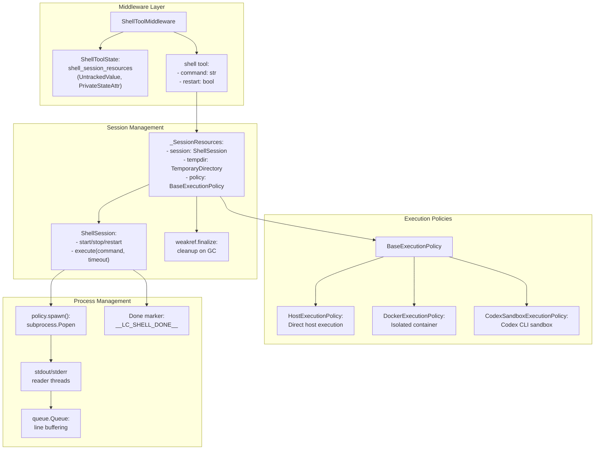

**Key Implementation Details**:

**State Extension**: [libs/langchain_v1/langchain/agents/middleware/shell_tool.py:100-110]()
```python
class ShellToolState(AgentState[ResponseT]):
    shell_session_resources: NotRequired[
        Annotated[_SessionResources | None, UntrackedValue, PrivateStateAttr]
    ]
```

The `UntrackedValue` channel type ensures session resources are not persisted in checkpoints, and `PrivateStateAttr` omits them from input/output schemas.

**Command Execution**: [libs/langchain_v1/langchain/agents/middleware/shell_tool.py:217-238]()

Commands are executed with a unique marker appended to detect completion:
1. Write command + newline
2. Write `printf '__LC_SHELL_DONE__<uuid> %s\n' $?`
3. Collect output until marker appears with exit code
4. Handle timeout by restarting session

**Output Truncation**: [libs/langchain_v1/langchain/agents/middleware/shell_tool.py:246-325]()

Results are returned as `CommandExecutionResult` with fields:
- `output`: Collected stdout/stderr (stderr prefixed with `[stderr]`)
- `exit_code`: Shell exit code or `None` if timed out
- `timed_out`: Boolean indicating timeout
- `truncated_by_lines`: Exceeded `max_output_lines`
- `truncated_by_bytes`: Exceeded `max_output_bytes`
- `total_lines`, `total_bytes`: Full output size metrics

**Execution Policies**:

| Policy | Use Case | Implementation |
|--------|----------|----------------|
| `HostExecutionPolicy` | Trusted environments (already containerized) | Direct `subprocess.Popen()` |
| `DockerExecutionPolicy` | Strong isolation requirements | Spawns separate Docker container |
| `CodexSandboxExecutionPolicy` | Codex CLI available | Reuses Codex sandbox |

**Resource Cleanup**: [libs/langchain_v1/langchain/agents/middleware/shell_tool.py:71-97]()

The `_SessionResources` dataclass uses `weakref.finalize` to ensure cleanup even if middleware is garbage collected without explicit shutdown:
- Sends `exit` command to shell
- Waits for process termination (with timeout)
- Force kills if necessary
- Cleans up temporary directory

**Security Features**:
- Configurable workspace root directory
- Execution policy isolation (Docker, Codex)
- Output redaction via `RedactionRule` system
- Command timeout enforcement
- PII detection support via integration with `PIIMiddleware`

Sources: [libs/langchain_v1/langchain/agents/middleware/shell_tool.py:1-804](), [libs/langchain_v1/langchain/agents/middleware/_execution.py:1-100]() (referenced), [libs/langchain_v1/langchain/agents/middleware/_redaction.py:1-100]() (referenced)

## Middleware Composition

Multiple middleware instances compose through the hook system, with ordering determined by their position in the `middleware` list passed to `create_agent()`.

**Hook Execution Order**:

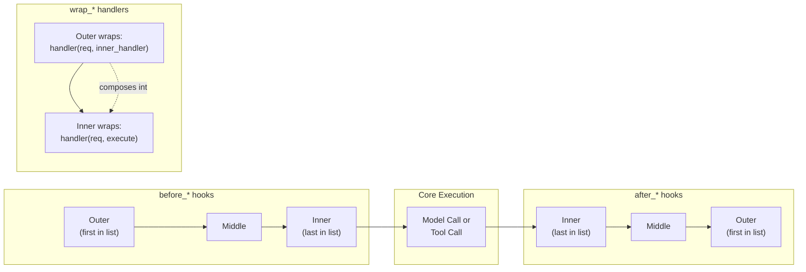

**Composition Examples from Tests**:

The snapshot tests show how middleware layers stack:

[libs/langchain_v1/tests/unit_tests/agents/__snapshots__/test_middleware_agent.ambr:71-119]() demonstrates:
- 10 middleware with `before_model` create a chain: `NoopTen → NoopEleven → model`
- 10 middleware with `after_model` create reverse chain: `model → NoopEleven → NoopTen`

**Jump Behavior Composition**: [libs/langchain_v1/tests/unit_tests/agents/__snapshots__/test_middleware_agent.ambr:2-29]()

When multiple middleware use `@hook_config(can_jump_to=["end"])`:
- Graph shows conditional edges from each hook node to `__end__`
- Only the hook that actually sets `jump_to="end"` in state will trigger the jump

Sources: [libs/langchain_v1/langchain/agents/factory.py:219-308]() (wrap_model_call composition), [libs/langchain_v1/langchain/agents/factory.py:561-671]() (wrap_tool_call composition), [libs/langchain_v1/tests/unit_tests/agents/__snapshots__/test_middleware_agent.ambr:1-485]()

# Structured Output and Response Formats


This document explains how LangChain implements structured output from language models, enabling applications to receive responses that conform to specific schemas rather than free-form text. This system provides type-safe, validated outputs from LLMs across different provider implementations.

For information about tool calling and function schemas, see [Tools and Function Calling](#2.3). For agent-level configuration, see [Configuration and Runtime Control](#4.4).

## Overview

Structured output allows language models to return responses in a defined format (typically JSON) that matches a specified schema. This is essential for:

- **Type Safety**: Ensuring responses match expected data structures
- **Validation**: Automatic validation of LLM outputs against schemas
- **Consistency**: Reliable parsing across different model providers
- **Integration**: Easy integration with downstream systems expecting specific formats

The system supports three primary strategies for obtaining structured outputs, automatically selecting the appropriate method based on model capabilities.

Sources: [libs/langchain_v1/langchain/agents/factory.py:44-54](), [libs/langchain_v1/langchain/agents/structured_output.py]()

## Core Architecture

### Structured Output Strategy System

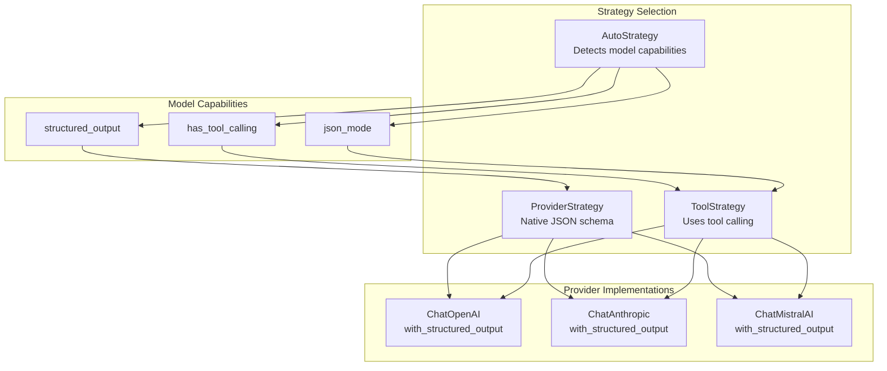

Sources: [libs/langchain_v1/langchain/agents/structured_output.py](), [libs/langchain_v1/langchain/agents/factory.py:44-54]()

### ResponseFormat Configuration

The `ResponseFormat` class defines how structured outputs are requested:

| Field | Type | Description |
|-------|------|-------------|
| `schema` | `type[ResponseT]` or `dict` | Pydantic model or JSON schema defining the output structure |
| `strategy` | `StructuredOutputStrategy` | Strategy to use (Auto, Tool, or Provider) |
| `name` | `str` | Optional name for the response format |
| `description` | `str` | Optional description to guide the model |

Sources: [libs/langchain_v1/langchain/agents/structured_output.py]()

## Strategy Implementations

### AutoStrategy

The `AutoStrategy` automatically selects the best method based on model capabilities. It checks the model's profile for supported features and chooses accordingly:

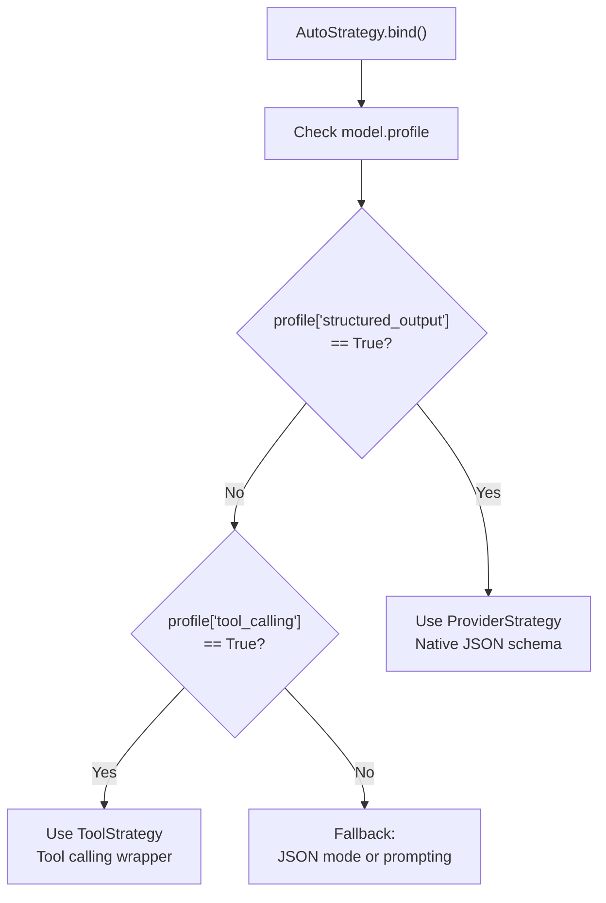

The strategy resolution occurs at binding time, allowing the agent to adapt to different model capabilities without code changes.

Sources: [libs/langchain_v1/langchain/agents/structured_output.py]()

### ToolStrategy

The `ToolStrategy` uses the model's tool-calling capabilities to enforce structured output. The schema is converted to a tool definition, and the model is forced to call that tool:

**Key Implementation Points:**

1. **Schema Conversion**: Pydantic models or JSON schemas are converted to OpenAI tool format
2. **Tool Choice**: `tool_choice` is set to force calling the specific tool
3. **Response Parsing**: Tool call arguments are extracted and validated

Sources: [libs/partners/openai/langchain_openai/chat_models/base.py:1200-1400](), [libs/partners/anthropic/langchain_anthropic/chat_models.py:800-1000]()

### ProviderStrategy

The `ProviderStrategy` uses native provider support for structured outputs (e.g., OpenAI's `response_format` with `json_schema` type):

**Provider-Specific Implementations:**

| Provider | Method | Parameter |
|----------|--------|-----------|
| OpenAI | `response_format` | `{"type": "json_schema", "json_schema": {...}}` |
| Anthropic | Prompt engineering | System message with schema |
| Mistral | `response_format` | `{"type": "json_object"}` |

Sources: [libs/partners/openai/langchain_openai/chat_models/base.py:1300-1350](), [libs/partners/anthropic/langchain_anthropic/chat_models.py:1100-1200]()

## OpenAI Implementation

### with_structured_output Method

The `ChatOpenAI.with_structured_output` method supports multiple approaches:

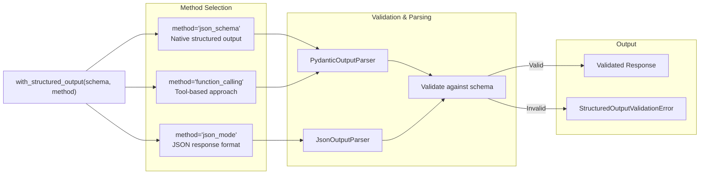

**Method Comparison:**

| Method | OpenAI Support | Reliability | Use Case |
|--------|----------------|-------------|----------|
| `json_schema` | GPT-4o and later | Highest | Production applications |
| `function_calling` | GPT-3.5+, GPT-4+ | High | Broad compatibility |
| `json_mode` | GPT-3.5+, GPT-4+ | Medium | Simple JSON extraction |

Sources: [libs/partners/openai/langchain_openai/chat_models/base.py:1200-1500]()

### Response Format Conversion

The `_convert_to_openai_response_format` function transforms schemas into OpenAI's format:

```python