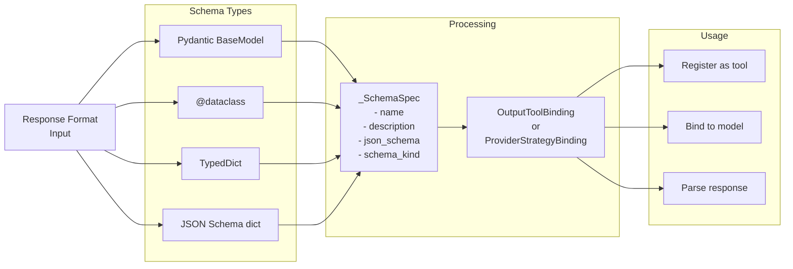
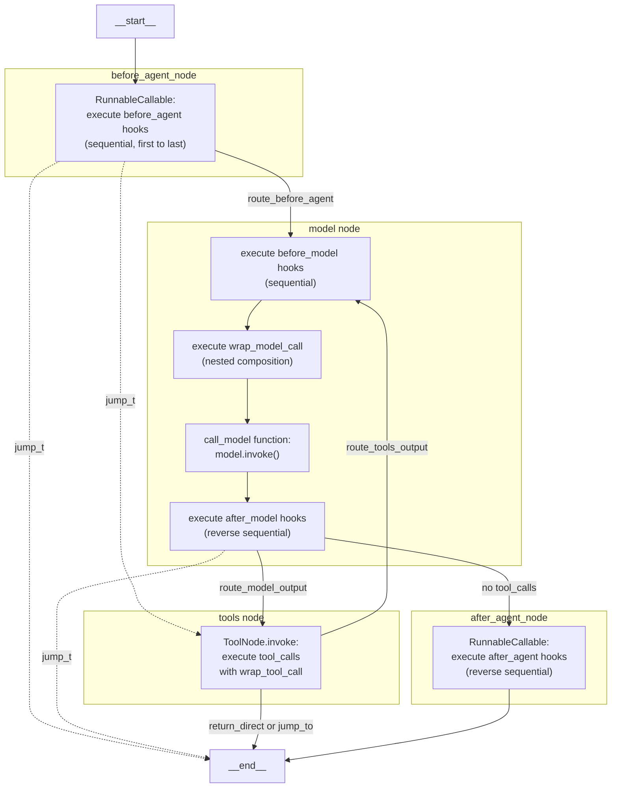

{
    "response_format": {
        "type": "json_schema",
        "json_schema": {
            "name": "WeatherResponse",
            "schema": {...},  # Full JSON schema
            "strict": True    # Provider-side validation
        }
    }
}
```

Processing flow:
1. Schema converted to `_SchemaSpec` with JSON schema generation
2. `to_model_kwargs()` creates provider-specific format (OpenAI format shown above)
3. Model is bound with kwargs: `model.bind(**strategy.to_model_kwargs())`
4. Response parsed via `ProviderStrategyBinding.parse(ai_message)`

**Sources:** [libs/langchain_v1/langchain/agents/structured_output.py:256-301](), [libs/langchain_v1/langchain/agents/factory.py:1022-1047]()

### Schema Processing



**Sources:** [libs/langchain_v1/langchain/agents/structured_output.py:104-178](), [libs/langchain_v1/langchain/agents/structured_output.py:288-361]()

## Graph Structure and Conditional Edges

### StateGraph Construction

The `create_agent` function builds a `StateGraph` with node functions and conditional edges:



Node Functions:
| Node Name | Function | Middleware Hooks |
|-----------|----------|------------------|
| `before_agent_node` | Runs `before_agent` hooks | Sequential (first to last) |
| `model` | Calls model with middleware | `before_model`, `wrap_model_call`, `after_model` |
| `tools` | Executes tool calls | Uses `wrap_tool_call` composition |
| `after_agent_node` | Runs `after_agent` hooks | Reverse sequential (last to first) |

**Sources:** [libs/langchain_v1/langchain/agents/factory.py:866-1296]()

### Conditional Edge Logic

The routing is implemented through two key functions in the graph:

**`route_model_output`** (after model node):
```python
# Determines if tools should be called
def route_model_output(state: AgentState) -> Literal["tools", "__end__"]:
    if jump_to := state.get("jump_to"):
        return jump_to
    
    last_message = state["messages"][-1]
    if isinstance(last_message, AIMessage) and last_message.tool_calls:
        return "tools"
    
    return "__end__"
```

**`route_tools_output`** (after tools node):
```python