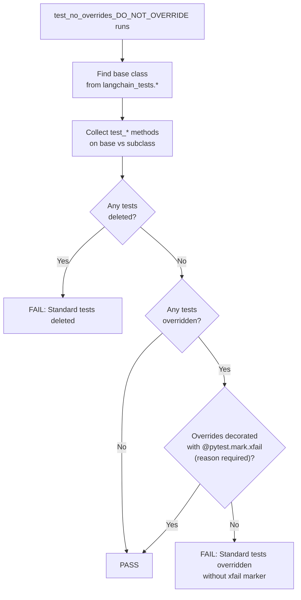
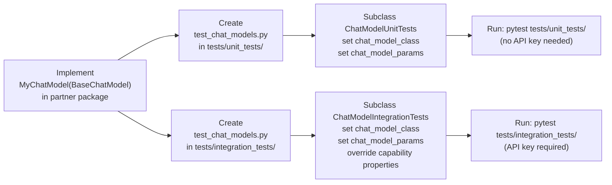

This page documents the `langchain-tests` package (`libs/standard-tests/`), which provides reusable pytest test suites for validating LangChain integrations against the `langchain-core` interfaces. It covers the class hierarchy, what each suite tests, the `test_no_overrides` enforcement mechanism, and how to implement these suites for a new integration.

For information about pytest markers, conftest patterns, and CI infrastructure used to run these tests, see [Pytest Configuration and Fixtures](#5.2) and [CI/CD and Testing Infrastructure](#5.3).

---

## Package Overview

The `langchain-tests` package is published as `langchain-tests` on PyPI and is an independent, installable package that partner packages depend on for their test suites. It depends only on `langchain-core` at runtime.

**Package location:** `libs/standard-tests/`
**PyPI name:** `langchain-tests`
**Current version:** 1.1.5 ([libs/standard-tests/pyproject.toml:24]())

Key dependencies declared in [libs/standard-tests/pyproject.toml:26-39]():

| Dependency | Purpose |
|---|---|
| `langchain-core` | Core interface types (`BaseChatModel`, `VectorStore`, etc.) |
| `pytest` | Test runner |
| `pytest-asyncio` | Async test support |
| `syrupy` | Snapshot testing |
| `pytest-socket` | Network access control in unit tests |
| `pytest-benchmark` / `pytest-codspeed` | Benchmarking |
| `vcrpy` / `pytest-recording` | HTTP cassette recording for benchmarks |
| `numpy` | Deterministic fake embeddings |
| `httpx` | Downloading multimodal test assets |

---

## Class Hierarchy

All test suites share a common root class. The hierarchy separates shared configuration (properties) from actual test methods by splitting each component type into a base class and concrete unit/integration subclasses.

**Test suite class hierarchy diagram:**

```mermaid
graph TD
    BaseStandardTests["BaseStandardTests\n(langchain_tests/base.py)\ntest_no_overrides_DO_NOT_OVERRIDE"]

    ChatModelTests["ChatModelTests\n(unit_tests/chat_models.py)\nProperties: has_tool_calling,\nhas_structured_output,\nsupports_image_inputs, etc.\nFixtures: model, my_adder_tool"]
    ChatModelUnitTests["ChatModelUnitTests\n(unit_tests/chat_models.py)\ntest_init, test_bind_tools_strict,\ntest_standard_params, etc."]
    ChatModelIntegrationTests["ChatModelIntegrationTests\n(integration_tests/chat_models.py)\ntest_invoke, test_stream,\ntest_tool_calling, test_structured_output, etc."]

    EmbeddingsTests["EmbeddingsTests\n(unit_tests/embeddings.py)\nProperties: embeddings_class,\nembedding_model_params\nFixtures: model"]
    EmbeddingsUnitTests["EmbeddingsUnitTests\n(unit_tests/embeddings.py)\ntest_init, test_init_from_env"]
    EmbeddingsIntegrationTests["EmbeddingsIntegrationTests\n(integration_tests/embeddings.py)\ntest_embed_query,\ntest_embed_documents,\ntest_aembed_query, etc."]

    ToolsTests["ToolsTests\n(unit_tests/tools.py)\nProperties: tool_constructor,\ntool_constructor_params,\ntool_invoke_params_example\nFixtures: tool"]
    ToolsUnitTests["ToolsUnitTests\n(unit_tests/tools.py)\ntest_init, test_has_name,\ntest_has_input_schema,\ntest_input_schema_matches_invoke_params"]
    ToolsIntegrationTests["ToolsIntegrationTests\n(integration_tests/tools.py)\ntest_invoke_matches_output_schema,\ntest_async_invoke_matches_output_schema"]

    VectorStoreIntegrationTests["VectorStoreIntegrationTests\n(integration_tests/vectorstores.py)\ntest_add_documents,\ntest_deleting_documents,\ntest_similarity_search, etc."]

    BaseStoreSyncTests["BaseStoreSyncTests\n(integration_tests/base_store.py)\nmget/mset/mdelete/yield_keys tests"]
    BaseStoreAsyncTests["BaseStoreAsyncTests\n(integration_tests/base_store.py)\namget/amset/amdelete/ayield_keys tests"]

    SyncCacheTestSuite["SyncCacheTestSuite\n(integration_tests/cache.py)\ntest_cache_is_empty,\ntest_update_cache, etc."]
    AsyncCacheTestSuite["AsyncCacheTestSuite\n(integration_tests/cache.py)\nasync variants of cache tests"]

    RetrieversIntegrationTests["RetrieversIntegrationTests\n(integration_tests/retrievers.py)\ntest_invoke_returns_documents,\ntest_k_constructor_param, etc."]

    BaseStandardTests --> ChatModelTests
    ChatModelTests --> ChatModelUnitTests
    ChatModelTests --> ChatModelIntegrationTests

    BaseStandardTests --> EmbeddingsTests
    EmbeddingsTests --> EmbeddingsUnitTests
    EmbeddingsTests --> EmbeddingsIntegrationTests

    BaseStandardTests --> ToolsTests
    ToolsTests --> ToolsUnitTests
    ToolsTests --> ToolsIntegrationTests

    BaseStandardTests --> VectorStoreIntegrationTests
    BaseStandardTests --> BaseStoreSyncTests
    BaseStandardTests --> BaseStoreAsyncTests
    BaseStandardTests --> SyncCacheTestSuite
    BaseStandardTests --> AsyncCacheTestSuite
    BaseStandardTests --> RetrieversIntegrationTests
```



Sources: [libs/standard-tests/langchain_tests/base.py](), [libs/standard-tests/langchain_tests/unit_tests/chat_models.py](), [libs/standard-tests/langchain_tests/integration_tests/chat_models.py](), [libs/standard-tests/langchain_tests/unit_tests/embeddings.py](), [libs/standard-tests/langchain_tests/integration_tests/embeddings.py](), [libs/standard-tests/langchain_tests/unit_tests/tools.py](), [libs/standard-tests/langchain_tests/integration_tests/tools.py](), [libs/standard-tests/langchain_tests/integration_tests/vectorstores.py](), [libs/standard-tests/langchain_tests/integration_tests/base_store.py](), [libs/standard-tests/langchain_tests/integration_tests/cache.py](), [libs/standard-tests/langchain_tests/integration_tests/retrievers.py]()

---

## BaseStandardTests and the `test_no_overrides` Mechanism

All test suites inherit from `BaseStandardTests` in [libs/standard-tests/langchain_tests/base.py]().

The most important feature of this base class is the `test_no_overrides_DO_NOT_OVERRIDE` method ([libs/standard-tests/langchain_tests/base.py:7-62]()). This test runs automatically in every subclass and enforces the contract that integration authors cannot silently change the behavior of standard tests.

**How it works:**

1. It traverses the MRO of the subclass to find the first base class whose module starts with `langchain_tests.`.
2. It collects all `test_*` methods on both the subclass and the base.
3. It asserts that no base test methods have been deleted from the subclass.
4. It asserts that no base test methods have been overridden — unless the override is decorated with `@pytest.mark.xfail(reason="...")`.



Sources: [libs/standard-tests/langchain_tests/base.py:7-62]()

The only allowed escape hatch is `@pytest.mark.xfail(reason="...")`. The `reason` is required and documents why the standard behavior is not yet achievable for that integration:

```python
@pytest.mark.xfail(reason="ChatParrotLink doesn't implement bind_tools method")
def test_unicode_tool_call_integration(self, model, ...):
    ...
```

See [libs/standard-tests/tests/unit_tests/test_custom_chat_model.py:36-43]() for a real example.

---

## Chat Model Test Suites

### ChatModelTests (shared base)

`ChatModelTests` ([libs/standard-tests/langchain_tests/unit_tests/chat_models.py:42-273]()) defines shared properties and fixtures used by both unit and integration test classes.

**Required abstract property:**

| Property | Type | Description |
|---|---|---|
| `chat_model_class` | `type[BaseChatModel]` | The class under test |

**Optional overrideable properties:**

| Property | Default | Controls |
|---|---|---|
| `chat_model_params` | `{}` | Constructor kwargs for the model |
| `standard_chat_model_params` | `{"temperature": 0, "max_tokens": 100, ...}` | Standard kwargs always applied |
| `has_tool_calling` | auto-detected via `bind_tools` override | Whether tool calling tests run |
| `has_tool_choice` | auto-detected via `tool_choice` param in `bind_tools` | Whether forced tool choice tests run |
| `has_structured_output` | auto-detected | Whether structured output tests run |
| `structured_output_kwargs` | `{}` | Extra kwargs for `with_structured_output()` |
| `supports_json_mode` | `False` | Whether JSON mode tests run |
| `supports_image_inputs` | `False` | Image multimodal tests |
| `supports_image_urls` | `False` | URL-based image tests |
| `supports_pdf_inputs` | `False` | PDF multimodal tests |
| `supports_audio_inputs` | `False` | Audio multimodal tests |
| `supports_image_tool_message` | `False` | Image content in `ToolMessage` |
| `supports_pdf_tool_message` | `False` | PDF content in `ToolMessage` |
| `returns_usage_metadata` | `True` | `UsageMetadata` validation |
| `supports_anthropic_inputs` | `False` | Anthropic-format content blocks |
| `supported_usage_metadata_details` | `{"invoke": [], "stream": []}` | Token detail types expected |
| `supports_model_override` | `True` | Runtime model name override via kwargs |
| `model_override_value` | `None` | Alternative model name for override tests |
| `enable_vcr_tests` | `False` | VCR-based benchmarking tests |

The `model` pytest fixture ([libs/standard-tests/langchain_tests/unit_tests/chat_models.py:67-77]()) merges `standard_chat_model_params`, `chat_model_params`, and any parametrize-injected extras.

Sources: [libs/standard-tests/langchain_tests/unit_tests/chat_models.py:42-273]()

---

### ChatModelUnitTests

`ChatModelUnitTests` ([libs/standard-tests/langchain_tests/unit_tests/chat_models.py:276-end]()) runs without a live API. Tests are executed with `pytest-socket` blocking network access.

Selected tests included:

| Test method | What it validates |
|---|---|
| `test_init` | Constructor doesn't raise |
| `test_init_from_env` | Model reads API keys from env vars (if `init_from_env_params` set) |
| `test_standard_params` | `temperature`, `max_tokens`, `timeout`, `stop`, `max_retries` accepted |
| `test_serialization` | `dumpd(model)` / `load(dumpd(model))` round-trip works |
| `test_bind_tools_strict` | `bind_tools(..., strict=True)` doesn't raise (if tools supported) |
| `test_structured_output` | `with_structured_output` with Pydantic schema doesn't raise |

Sources: [libs/standard-tests/langchain_tests/unit_tests/chat_models.py:276-end]()

---

### ChatModelIntegrationTests

`ChatModelIntegrationTests` ([libs/standard-tests/langchain_tests/integration_tests/chat_models.py:173-end]()) makes live API calls. Tests cover the full surface area of `BaseChatModel`.

Selected tests included:

| Test method | What it validates |
|---|---|
| `test_invoke` | `model.invoke("Hello")` returns `AIMessage` with non-empty content |
| `test_ainvoke` | `await model.ainvoke("Hello")` works |
| `test_stream` | `model.stream(...)` yields `AIMessageChunk` objects, last chunk has `chunk_position='last'` |
| `test_astream` | `model.astream(...)` async variant |
| `test_tool_calling` | Model calls `magic_function` with correct args when bound |
| `test_tool_call_no_args` | Tool with no parameters works |
| `test_structured_output` | Returns a valid Pydantic/TypedDict/JSON schema object |
| `test_json_mode` | `with_structured_output(method='json_mode')` (if `supports_json_mode`) |
| `test_usage_metadata` | `AIMessage.usage_metadata` has `input_tokens`, `output_tokens`, `total_tokens` |
| `test_image_inputs` | Handles `ImageContentBlock` and `image_url` blocks (if `supports_image_inputs`) |
| `test_pdf_inputs` | Handles `FileContentBlock` with `application/pdf` (if `supports_pdf_inputs`) |
| `test_audio_inputs` | Handles `AudioContentBlock` (if `supports_audio_inputs`); downloads from wikimedia.org |
| `test_invoke_with_model_override` | `model.invoke("Hello", model=override_model)` (if `supports_model_override`) |
| `test_stream_time` | Benchmarks streaming latency (if `enable_vcr_tests`) |

Sources: [libs/standard-tests/langchain_tests/integration_tests/chat_models.py:173-end]()

---

## VectorStoreIntegrationTests

`VectorStoreIntegrationTests` ([libs/standard-tests/langchain_tests/integration_tests/vectorstores.py:21-end]()) tests the `VectorStore` interface from `langchain-core`.

**Required fixture:**

```
vectorstore() -> VectorStore  # must yield an EMPTY store
```

**Optional overrideable properties:**

| Property | Default | Controls |
|---|---|---|
| `has_sync` | `True` | Whether sync tests run |
| `has_async` | `True` | Whether async tests run |
| `has_get_by_ids` | `True` | Whether `get_by_ids` tests run |

**`get_embeddings()` static method** returns a `DeterministicFakeEmbedding(size=6)`, which uses numpy for deterministic embeddings without needing a real embedding model ([libs/standard-tests/langchain_tests/integration_tests/vectorstores.py:123-136]()).

Selected tests included:

| Test method | What it validates |
|---|---|
| `test_vectorstore_is_empty` | Fixture yields an empty store |
| `test_add_documents` | Documents added and similarity search returns them; original objects not mutated |
| `test_deleting_documents` | `delete([id])` removes document |
| `test_deleting_bulk_documents` | `delete([id1, id2])` removes multiple documents |
| `test_delete_missing_content` | Deleting nonexistent ID does not raise |
| `test_add_documents_with_ids_is_idempotent` | Adding same IDs twice does not duplicate |
| `test_add_documents_by_id_with_mutation` | Adding existing ID updates content |
| `test_get_by_ids` | `get_by_ids` returns documents in same order as IDs |
| `test_get_by_ids_missing` | `get_by_ids` with nonexistent IDs returns `[]` |
| `test_vectorstore_is_empty_async` | Async equivalents of above |

Sources: [libs/standard-tests/langchain_tests/integration_tests/vectorstores.py:21-end]()

---

## Embeddings Test Suites

`EmbeddingsTests` is the shared base. It declares the `embeddings_class` abstract property and the `model` fixture.

### EmbeddingsUnitTests

([libs/standard-tests/langchain_tests/unit_tests/embeddings.py:34-137]())

| Test | What it validates |
|---|---|
| `test_init` | Model can be instantiated with `embedding_model_params` |
| `test_init_from_env` | API keys loaded from env vars (if `init_from_env_params` set) |

### EmbeddingsIntegrationTests

([libs/standard-tests/langchain_tests/integration_tests/embeddings.py:8-119]())

| Test | What it validates |
|---|---|
| `test_embed_query` | Returns `list[float]`; length consistent across inputs |
| `test_embed_documents` | Returns `list[list[float]]`; all same dimension |
| `test_aembed_query` | Async variant |
| `test_aembed_documents` | Async variant |

Sources: [libs/standard-tests/langchain_tests/unit_tests/embeddings.py](), [libs/standard-tests/langchain_tests/integration_tests/embeddings.py]()

---

## Tools Test Suites

`ToolsTests` defines the `tool_constructor`, `tool_constructor_params`, and `tool_invoke_params_example` properties and the `tool` fixture.

### ToolsUnitTests

([libs/standard-tests/langchain_tests/unit_tests/tools.py:58-125]())

| Test | What it validates |
|---|---|
| `test_init` | Tool can be constructed |
| `test_init_from_env` | Env-based init (if `init_from_env_params` set) |
| `test_has_name` | `tool.name` is non-empty |
| `test_has_input_schema` | `tool.get_input_schema()` returns a schema |
| `test_input_schema_matches_invoke_params` | `tool_invoke_params_example` is valid per the schema |

### ToolsIntegrationTests

([libs/standard-tests/langchain_tests/integration_tests/tools.py:9-94]())

| Test | What it validates |
|---|---|
| `test_invoke_matches_output_schema` | `tool.invoke(ToolCall(...))` returns valid `ToolMessage.content` |
| `test_async_invoke_matches_output_schema` | `await tool.ainvoke(ToolCall(...))` |
| `test_invoke_no_tool_call` | `tool.invoke(tool_invoke_params_example)` doesn't raise |
| `test_async_invoke_no_tool_call` | Async variant |

Sources: [libs/standard-tests/langchain_tests/unit_tests/tools.py](), [libs/standard-tests/langchain_tests/integration_tests/tools.py]()

---

## BaseStore Test Suites

`BaseStoreSyncTests` and `BaseStoreAsyncTests` ([libs/standard-tests/langchain_tests/integration_tests/base_store.py]()) are generic over value type `V`.

**Required fixtures:**

| Fixture | Description |
|---|---|
| `kv_store` | An empty `BaseStore[str, V]` |
| `three_values` | A tuple of three example `V` values |

Both suites test `mget`, `mset`, `mdelete`, `yield_keys` (sync) and `amget`, `amset`, `amdelete`, `ayield_keys` (async), including:
- Empty store verification
- CRUD operations
- Idempotent writes
- Bulk delete
- Delete of missing keys (must not raise)
- Key iteration with prefix

Sources: [libs/standard-tests/langchain_tests/integration_tests/base_store.py]()

---

## Cache Test Suites

`SyncCacheTestSuite` and `AsyncCacheTestSuite` ([libs/standard-tests/langchain_tests/integration_tests/cache.py]()) test the `BaseCache` interface.

**Required fixture:** `cache() -> BaseCache` (must be empty)

Tests: `test_cache_is_empty`, `test_update_cache`, `test_cache_still_empty`, `test_clear_cache`, `test_cache_miss`, `test_cache_hit`, `test_update_cache_with_multiple_generations`.

Sources: [libs/standard-tests/langchain_tests/integration_tests/cache.py]()

---

## Retrievers Integration Tests

`RetrieversIntegrationTests` ([libs/standard-tests/langchain_tests/integration_tests/retrievers.py:13-182]()) tests `BaseRetriever`.

**Required properties:** `retriever_constructor`, `retriever_query_example`.

| Test | What it validates |
|---|---|
| `test_k_constructor_param` | Retriever returns `k` docs when constructed with `k=3` vs `k=1` |
| `test_invoke_with_k_kwarg` | `invoke("query", k=N)` returns `N` docs |
| `test_invoke_returns_documents` | `invoke(...)` returns `list[Document]` |
| `test_ainvoke_returns_documents` | Async variant |

Sources: [libs/standard-tests/langchain_tests/integration_tests/retrievers.py]()

---

## Implementing the Suites for a New Integration

The pattern is consistent across all suite types. Below is a summary using chat models as the primary example.

**Implementing a new integration test flow:**



**Minimal unit test implementation:**

```python
from langchain_tests.unit_tests import ChatModelUnitTests
from my_package.chat_models import MyChatModel

class TestMyChatModelUnit(ChatModelUnitTests):
    @property
    def chat_model_class(self):
        return MyChatModel

    @property
    def chat_model_params(self):
        return {"model": "model-001", "temperature": 0}
```

**Minimal integration test implementation:**

```python
from langchain_tests.integration_tests import ChatModelIntegrationTests
from my_package.chat_models import MyChatModel

class TestMyChatModelIntegration(ChatModelIntegrationTests):
    @property
    def chat_model_class(self):
        return MyChatModel

    @property
    def chat_model_params(self):
        return {"model": "model-001", "temperature": 0}
```

See [libs/standard-tests/tests/unit_tests/test_custom_chat_model.py]() and [libs/standard-tests/tests/unit_tests/custom_chat_model.py]() for a reference implementation using `ChatParrotLink`.

**VectorStore example:**

```python
from langchain_tests.integration_tests.vectorstores import VectorStoreIntegrationTests
from langchain_chroma import Chroma

class TestChromaStandard(VectorStoreIntegrationTests):
    @pytest.fixture()
    def vectorstore(self):
        store = Chroma(embedding_function=self.get_embeddings())
        try:
            yield store
        finally:
            store.delete_collection()
```

Sources: [libs/standard-tests/langchain_tests/integration_tests/vectorstores.py:40-98](), [libs/standard-tests/tests/unit_tests/test_custom_chat_model.py](), [libs/standard-tests/tests/unit_tests/test_basic_tool.py]()

---

## VCR Cassette Configuration

For benchmarking and reproducible integration tests, `langchain-tests` includes VCR support via `pytest-recording` and `vcrpy`. Configuration lives in [libs/standard-tests/langchain_tests/conftest.py]().

**Key exports:**

| Symbol | Description |
|---|---|
| `base_vcr_config()` | Returns default VCR config dict with `record_mode='once'`, auth header filtering, and standard cassette directory |
| `CustomSerializer` | Serializes cassettes as gzip-compressed YAML (avoids unsafe YAML loading) |
| `CustomPersister` | Persists/loads compressed cassettes |
| `_BASE_FILTER_HEADERS` | Redacts `authorization`, `x-api-key`, `api-key` headers from cassettes |

To enable VCR tests in a chat model suite, set `enable_vcr_tests = True` on the test class and add a `vcr_config` session fixture in `tests/conftest.py` that calls `base_vcr_config()` and optionally extends it.

The `cassette_library_dir` defaults to `"tests/cassettes"` and cassettes use `.yaml` extension by default (`.yaml.gz` when using `CustomSerializer`).

Sources: [libs/standard-tests/langchain_tests/conftest.py](), [libs/standard-tests/langchain_tests/integration_tests/chat_models.py:594-739]()

---

## Module Layout

```mermaid
graph TD
    pkg["langchain_tests/"]
    base["base.py\nBaseStandardTests"]
    init["__init__.py"]
    conftest["conftest.py\nbase_vcr_config, CustomSerializer,\nCustomPersister"]
    unit["unit_tests/"]
    integ["integration_tests/"]
    uchat["chat_models.py\nChatModelTests\nChatModelUnitTests"]
    uembed["embeddings.py\nEmbeddingsTests\nEmbeddingsUnitTests"]
    utool["tools.py\nToolsTests\nToolsUnitTests"]
    ichat["chat_models.py\nChatModelIntegrationTests"]
    ivs["vectorstores.py\nVectorStoreIntegrationTests"]
    iembed["embeddings.py\nEmbeddingsIntegrationTests"]
    itool["tools.py\nToolsIntegrationTests"]
    ibs["base_store.py\nBaseStoreSyncTests\nBaseStoreAsyncTests"]
    icache["cache.py\nSyncCacheTestSuite\nAsyncCacheTestSuite"]
    iret["retrievers.py\nRetrieversIntegrationTests"]
    iidx["indexer.py\nDocumentIndexerTestSuite\nAsyncDocumentIndexTestSuite"]

    pkg --> base
    pkg --> init
    pkg --> conftest
    pkg --> unit
    pkg --> integ
    unit --> uchat
    unit --> uembed
    unit --> utool
    integ --> ichat
    integ --> ivs
    integ --> iembed
    integ --> itool
    integ --> ibs
    integ --> icache
    integ --> iret
    integ --> iidx
```



Sources: [libs/standard-tests/langchain_tests/base.py](), [libs/standard-tests/langchain_tests/__init__.py](), [libs/standard-tests/langchain_tests/conftest.py](), [libs/standard-tests/langchain_tests/unit_tests/chat_models.py](), [libs/standard-tests/langchain_tests/unit_tests/embeddings.py](), [libs/standard-tests/langchain_tests/unit_tests/tools.py](), [libs/standard-tests/langchain_tests/integration_tests/chat_models.py](), [libs/standard-tests/langchain_tests/integration_tests/vectorstores.py](), [libs/standard-tests/langchain_tests/integration_tests/embeddings.py](), [libs/standard-tests/langchain_tests/integration_tests/tools.py](), [libs/standard-tests/langchain_tests/integration_tests/base_store.py](), [libs/standard-tests/langchain_tests/integration_tests/cache.py](), [libs/standard-tests/langchain_tests/integration_tests/retrievers.py](), [libs/standard-tests/langchain_tests/integration_tests/indexer.py]()