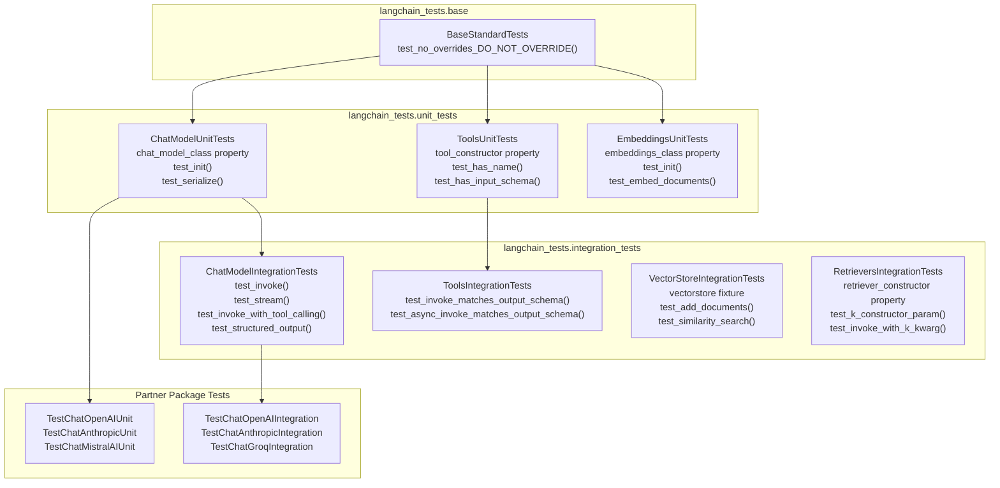
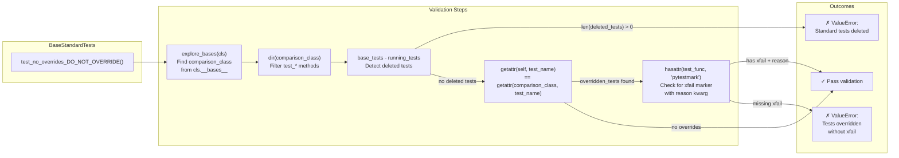

The LangChain repository employs a comprehensive testing infrastructure that ensures consistency, quality, and compatibility across its modular package ecosystem. This infrastructure consists of three main components: (1) a standardized testing framework in the `langchain-tests` package that defines interface compliance tests for integrations, (2) an intelligent CI/CD pipeline that selectively runs tests based on changed files, and (3) multi-dimensional testing strategies that verify compatibility across Python versions, Pydantic versions, and dependency ranges.

This page documents the testing architecture, test execution workflows, and quality gates. For information about the release process that follows successful testing, see [Release Process and Workflows](#6.3).

## Standard Testing Framework

The `langchain-standard-tests` package ([libs/standard-tests/pyproject.toml:6]()) provides abstract base test classes in the `langchain_tests` module that integration packages inherit to verify compliance with LangChain's core abstractions. This ensures all implementations of `BaseChatModel`, `BaseTool`, `VectorStore`, and other abstractions expose consistent interfaces.

### Test Class Hierarchy

Title: Standard Test Class Inheritance Structure



**Sources**: [libs/standard-tests/langchain_tests/base.py:1-63](), [libs/standard-tests/langchain_tests/unit_tests/chat_models.py:42-274](), [libs/standard-tests/langchain_tests/integration_tests/chat_models.py:173-739](), [libs/standard-tests/langchain_tests/unit_tests/tools.py:17-56](), [libs/standard-tests/langchain_tests/integration_tests/vectorstores.py:21-98](), [libs/standard-tests/langchain_tests/integration_tests/retrievers.py:13-144]()

### Test Override Protection

The `BaseStandardTests.test_no_overrides_DO_NOT_OVERRIDE` method ([libs/standard-tests/langchain_tests/base.py:7-62]()) prevents integration packages from silently overriding standard tests. If a test must be skipped, implementers must use `@pytest.mark.xfail(reason="...")`.

Title: Test Override Detection Algorithm



**Sources**: [libs/standard-tests/langchain_tests/base.py:7-62]()

### Configurable Test Properties

Integration test classes expose boolean properties that control which features are tested. For example, `ChatModelIntegrationTests` provides:

| Property | Default | Purpose |
|----------|---------|---------|
| `has_tool_calling` | Auto-detected | Whether `bind_tools` is implemented |
| `has_tool_choice` | Auto-detected | Whether `tool_choice` parameter is supported |
| `has_structured_output` | Auto-detected | Whether `with_structured_output` is implemented |
| `supports_json_mode` | `False` | Whether JSON mode is supported |
| `supports_image_inputs` | `False` | Whether image content blocks are supported |
| `supports_audio_inputs` | `False` | Whether audio content blocks are supported |
| `returns_usage_metadata` | `True` | Whether `usage_metadata` is populated |
| `enable_vcr_tests` | `False` | Whether to enable VCR cassette tests |

**Sources**: [libs/standard-tests/langchain_tests/unit_tests/chat_models.py:94-274](), [libs/standard-tests/langchain_tests/integration_tests/chat_models.py:226-739]()

### Example Test Implementation

The example below shows how partner packages implement the test base classes. The `ChatParrotLink` custom model ([libs/standard-tests/tests/unit_tests/custom_chat_model.py:18-149]()) demonstrates the pattern:

```python