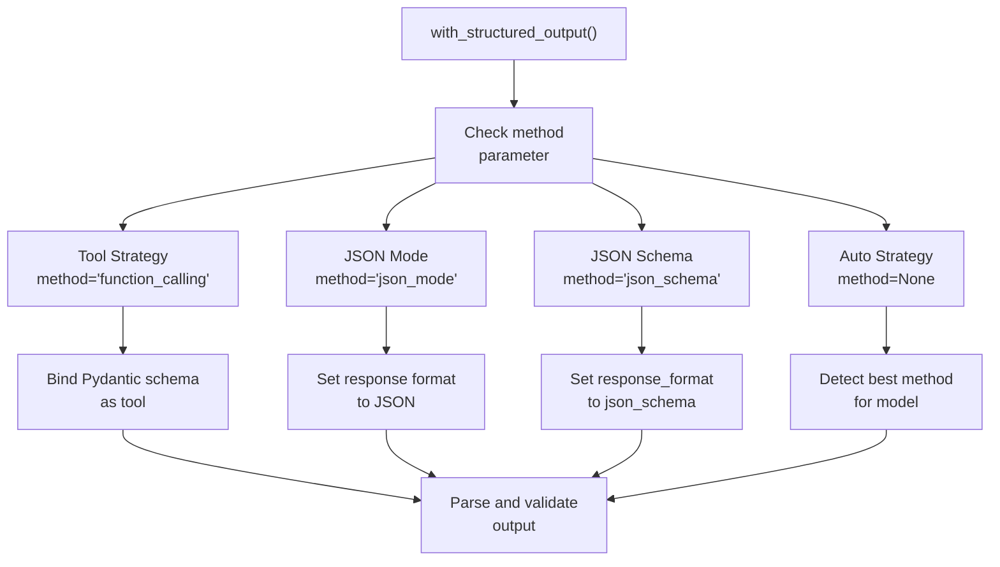

@pytest.mark.vcr()
def test_invoke(self, model: BaseChatModel) -> None:
    # First run: records HTTP to cassette file
    # Subsequent runs: replays from cassette
    response = model.invoke("Hello")
    assert isinstance(response, AIMessage)
```

Cassettes are stored in `tests/integration_tests/cassettes/` and committed to git for CI reproducibility.

**Sources:**
- [libs/standard-tests/langchain_tests/integration_tests/chat_models.py:173-541]()
- [libs/standard-tests/langchain_tests/unit_tests/chat_models.py:42-180]()
- [libs/partners/openai/tests/unit_tests/chat_models/test_base.py]()
- [libs/partners/anthropic/tests/integration_tests/test_chat_models.py]()

---

## Structured Output Strategies

Providers support multiple strategies for generating structured output:



### Strategy Comparison

| Strategy | When to Use | Validation | Error Handling |
|----------|------------|------------|----------------|
| **function_calling** | Most compatible | Strict Pydantic | Retry on validation error |
| **json_mode** | Simple schemas, older models | Manual parsing | String validation |
| **json_schema** | OpenAI/providers with native support | Native schema validation | Provider-enforced |
| **auto** | Default, best automatic detection | Strategy-dependent | Strategy-dependent |

**OpenAI implementation:**

```python
def with_structured_output(
    self,
    schema: Union[dict, Type],
    *,
    method: Literal["function_calling", "json_mode", "json_schema"] = "json_schema",
    **kwargs: Any,
) -> Runnable:
    if method == "json_schema":
        # Use OpenAI's native structured output
        return self.bind(response_format={"type": "json_schema", "json_schema": schema})
    elif method == "function_calling":
        # Use tool calling
        return self.bind_tools([schema], tool_choice="any")
    elif method == "json_mode":
        # Use JSON mode
        return self.bind(response_format={"type": "json_object"})
```

**Sources:**
- [libs/partners/openai/langchain_openai/chat_models/base.py:1915-2053]()
- [libs/partners/anthropic/langchain_anthropic/chat_models.py:1604-1731]()

### Provider-Specific Features

**Anthropic:**
- `method="tool"` - Uses tool calling
- Native support for extended thinking with prompt caching

**Groq:**
- Supports reasoning models with thinking content
- `method="json_object"` for JSON mode

**Mistral:**
- Limited structured output support
- Falls back to tool calling

**Sources:**
- [libs/partners/anthropic/langchain_anthropic/chat_models.py:1604-1731]()
- [libs/partners/groq/langchain_groq/chat_models.py:611-730]()

---

## Package Structure and Dependencies

### Standard Package Layout

All partner packages follow a consistent structure:

```
libs/partners/{provider}/
├── langchain_{provider}/
│   ├── __init__.py
│   ├── chat_models.py          # Chat model implementation
│   ├── _client_utils.py        # HTTP client management
│   ├── _compat.py              # Compatibility layer
│   └── data/
│       └── _profiles.py        # Model profiles
├── tests/
│   ├── unit_tests/
│   │   └── test_chat_models.py
│   └── integration_tests/
│       └── test_chat_models.py
├── pyproject.toml
└── uv.lock
```

### Dependency Patterns

**Core dependencies:**

```toml
[project]
dependencies = [
    "langchain-core>=1.1.0,<2.0.0",
    "{provider-sdk}>=X.Y.Z,<N.0.0",
]

[dependency-groups]
test = [
    "langchain-tests",
    "langchain-core",
    "pytest>=7.3.0,<8.0.0",
    "pytest-asyncio>=0.21.1,<1.0.0",
]
```

**Sources:**
- [libs/partners/openai/pyproject.toml:14-18]()
- [libs/partners/anthropic/pyproject.toml:14-18]()
- [libs/partners/mistralai/pyproject.toml:14-20]()
- [libs/partners/groq/pyproject.toml:14-17]()

### Model Profiles

All providers should define model profiles in `data/_profiles.py`:

```python
from langchain_core.language_models import ModelProfileRegistry

_PROFILES: ModelProfileRegistry = {
    "gpt-4": {
        "max_input_tokens": 8192,
        "max_output_tokens": 4096,
        "tool_calling": True,
        "structured_output": False,
    },
    "gpt-5": {
        "max_input_tokens": 272000,
        "max_output_tokens": 64000,
        "tool_calling": True,
        "structured_output": True,
    },
}
```

Profiles are accessed via:

```python
def _get_default_model_profile(model_name: str) -> ModelProfile:
    default = _MODEL_PROFILES.get(model_name) or {}
    return default.copy()
```

**Sources:**
- [libs/partners/openai/langchain_openai/data/_profiles.py]()
- [libs/partners/anthropic/langchain_anthropic/data/_profiles.py]()

---

## Common Implementation Checklist

When implementing a new provider integration, ensure:

### Required Methods

- [ ] `_generate()` and `_agenerate()` - Core generation methods
- [ ] `_stream()` and `_astream()` - Streaming methods
- [ ] `_convert_message_to_dict()` - LangChain → Provider format
- [ ] `_convert_dict_to_message()` - Provider → LangChain format
- [ ] `bind_tools()` - Tool binding (if supported)
- [ ] `with_structured_output()` - Structured output (if supported)

### Configuration

- [ ] Model profiles in `data/_profiles.py`
- [ ] HTTP client caching
- [ ] SSL certificate configuration
- [ ] API key management (env var + explicit)
- [ ] Proxy support
- [ ] Retry configuration

### Testing

- [ ] Unit tests inheriting from `ChatModelUnitTests`
- [ ] Integration tests inheriting from `ChatModelIntegrationTests`
- [ ] Feature flags configured appropriately
- [ ] VCR cassettes for deterministic tests
- [ ] Do not override `test_no_overrides_DO_NOT_OVERRIDE`

### Documentation

- [ ] Docstrings for public methods
- [ ] Usage examples in class docstring
- [ ] Model profile documentation
- [ ] Provider-specific parameter documentation

**Sources:**
- [libs/standard-tests/langchain_tests/integration_tests/chat_models.py:173-541]()
- [libs/standard-tests/langchain_tests/unit_tests/chat_models.py:42-180]()