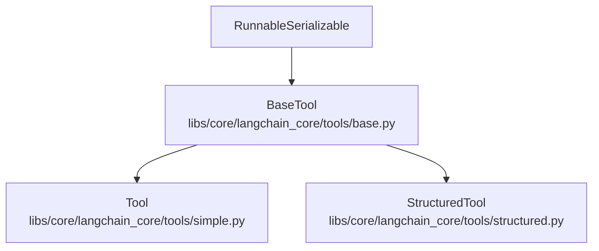
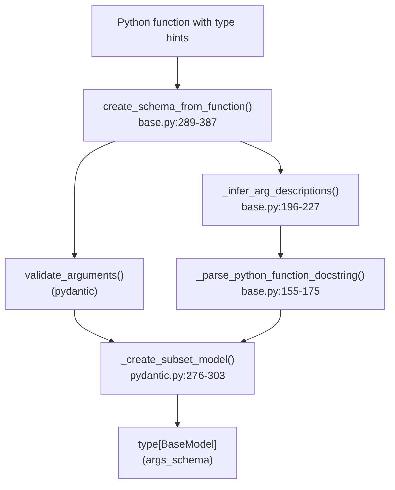
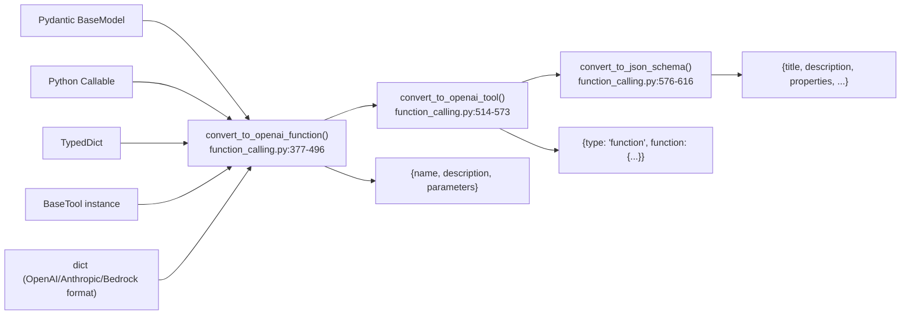
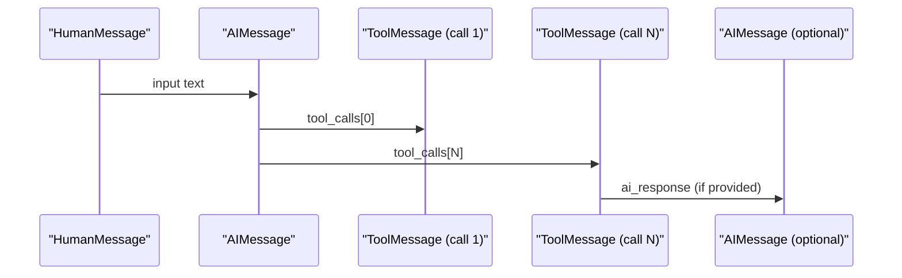
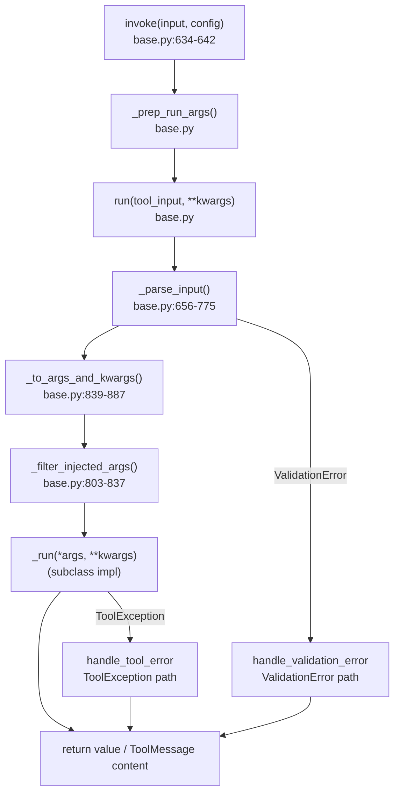

This page documents the tool abstraction layer in `langchain-core`: the `BaseTool` class hierarchy, the `@tool` decorator, error handling, injected arguments, and the utilities that convert tools and Python objects into provider-compatible function-calling schemas. For information about how language models bind and invoke tools (e.g., `bind_tools`, `with_structured_output`), see page [2.2](). For how agents orchestrate tool execution, see page [4.1]().

---

## Tool Class Hierarchy

All tools in LangChain extend `BaseTool`, which itself extends `RunnableSerializable`. This means every tool participates in the LCEL pipeline and exposes `invoke`, `ainvoke`, `batch`, and `stream` methods.

**Class Hierarchy Diagram**



Sources: [libs/core/langchain_core/tools/base.py:405-411](), [libs/core/langchain_core/tools/simple.py:31-34](), [libs/core/langchain_core/tools/structured.py:40-43]()

| Class | Description | Input |
|---|---|---|
| `BaseTool` | Abstract base. Defines the tool contract. | `str \| dict \| ToolCall` |
| `Tool` | Single-input tool wrapping a plain callable. | Single `str` argument |
| `StructuredTool` | Multi-argument tool with full schema inference. | Dict of named arguments |

---

## BaseTool

`BaseTool` is defined in [libs/core/langchain_core/tools/base.py:405-411](). Subclasses must implement `_run` and optionally `_arun`.

### Key Fields

| Field | Type | Default | Description |
|---|---|---|---|
| `name` | `str` | required | Unique tool identifier shown to the model |
| `description` | `str` | required | How/when/why the model should use this tool |
| `args_schema` | `ArgsSchema \| None` | `None` | Pydantic `BaseModel` subclass or JSON schema dict |
| `return_direct` | `bool` | `False` | If `True`, agent stops looping after this tool runs |
| `handle_tool_error` | `bool \| str \| Callable` | `False` | How to handle `ToolException` |
| `handle_validation_error` | `bool \| str \| Callable` | `False` | How to handle `ValidationError` |
| `response_format` | `Literal["content", "content_and_artifact"]` | `"content"` | Controls how the return value maps to a `ToolMessage` |
| `extras` | `dict[str, Any] \| None` | `None` | Provider-specific configuration (e.g., Anthropic `cache_control`) |
| `callbacks` | `Callbacks` | `None` | Callbacks fired during execution |
| `tags` | `list[str] \| None` | `None` | Metadata tags for this tool's runs |
| `metadata` | `dict[str, Any] \| None` | `None` | Metadata dict for this tool's runs |

Sources: [libs/core/langchain_core/tools/base.py:446-531]()

### Abstract Methods

```
_run(self, *args, **kwargs) -> Any          # required
_arun(self, *args, **kwargs) -> Any         # optional; defaults to thread-executor wrapping _run
```

The `run_manager: CallbackManagerForToolRun | None` parameter can be added to `_run` to enable tracing via the callback system.

Sources: [libs/core/langchain_core/tools/base.py:777-801]()

### `args` Property and `tool_call_schema`

- `args` returns the JSON schema properties dict for the tool's inputs (derived from `args_schema` or inferred from `_run`).
- `tool_call_schema` returns a version of the input schema with injected arguments excluded — this is what gets sent to the language model.

Sources: [libs/core/langchain_core/tools/base.py:567-609]()

---

## Tool (Simple)

`Tool` is defined in [libs/core/langchain_core/tools/simple.py:31-163](). It wraps a single-string-input callable.

```python
Tool(name="search", func=my_func, description="Searches the web.")
Tool.from_function(func, name="search", description="Searches the web.")
```

- `func: Callable[..., str] | None` — synchronous implementation
- `coroutine: Callable[..., Awaitable[str]] | None` — async implementation

When neither `args_schema` is provided nor a structured function signature is used, `args` returns `{"tool_input": {"type": "string"}}` for backwards compatibility.

Sources: [libs/core/langchain_core/tools/simple.py:59-70]()

---

## StructuredTool

`StructuredTool` accepts multiple named arguments with full schema inference. Defined in [libs/core/langchain_core/tools/structured.py:40-271]().

### `from_function` Classmethod

```python
StructuredTool.from_function(
    func=None,
    coroutine=None,
    name=None,          # defaults to func.__name__
    description=None,   # defaults to func.__doc__
    return_direct=False,
    args_schema=None,   # if None and infer_schema=True, inferred from signature
    infer_schema=True,
    response_format="content",
    parse_docstring=False,
    error_on_invalid_docstring=False,
)
```

When `infer_schema=True` and no `args_schema` is given, the schema is generated by `create_schema_from_function` in [libs/core/langchain_core/tools/base.py:289-387]().

Sources: [libs/core/langchain_core/tools/structured.py:132-252]()

---

## The `@tool` Decorator

The `tool` function in [libs/core/langchain_core/tools/convert.py:76-390]() converts Python callables or `Runnable` objects into `BaseTool` instances. It supports multiple calling patterns:

### Usage Patterns

```python
# 1. Bare decorator — name inferred from function
@tool
def search_api(query: str) -> str:
    """Search the API."""
    ...

# 2. Named decorator
@tool("search")
def search_api(query: str) -> str:
    """Search the API."""
    ...

# 3. With keyword arguments
@tool(return_direct=True, parse_docstring=True)
def search_api(query: str) -> str:
    """Search the API.

    Args:
        query: The search query string.
    """
    ...

# 4. response_format for artifact output
@tool(response_format="content_and_artifact")
def fetch_data(url: str) -> tuple[str, dict]:
    """Fetch and return data."""
    return "summary", {"full": "data"}

# 5. From a Runnable
tool("my_tool", runnable)
```

### Decorator Parameters

| Parameter | Type | Default | Description |
|---|---|---|---|
| `name_or_callable` | `str \| Callable \| None` | — | Tool name or function to wrap |
| `description` | `str \| None` | `None` | Overrides function docstring |
| `return_direct` | `bool` | `False` | Stop agent loop after this tool |
| `args_schema` | `ArgsSchema \| None` | `None` | Explicit schema (overrides inference) |
| `infer_schema` | `bool` | `True` | Infer schema from type hints |
| `response_format` | `str` | `"content"` | `"content"` or `"content_and_artifact"` |
| `parse_docstring` | `bool` | `False` | Parse Google-style docstring for arg descriptions |
| `error_on_invalid_docstring` | `bool` | `True` | Raise on malformed docstrings when `parse_docstring=True` |
| `extras` | `dict \| None` | `None` | Provider-specific extra configuration |

When `infer_schema=True`, the decorator produces a `StructuredTool`. When `infer_schema=False`, it produces a plain `Tool`.

Sources: [libs/core/langchain_core/tools/convert.py:76-390]()

---

## Schema Inference

**Schema Inference Flow**



Sources: [libs/core/langchain_core/tools/base.py:289-387]()

`create_schema_from_function` uses Pydantic's `validate_arguments` to create an intermediate model from the function signature, then `_create_subset_model` produces a clean schema by filtering out internal arguments (`run_manager`, `callbacks`) and injected arguments.

The `ArgsSchema` type alias is:

```python
ArgsSchema = TypeBaseModel | dict[str, Any]
```

It accepts:
- Pydantic v2 `BaseModel` subclass
- Pydantic v1 `BaseModel` subclass (via `pydantic.v1`)
- A raw JSON schema `dict`

Sources: [libs/core/langchain_core/tools/base.py:400-402]()

---

## Error Handling

### `ToolException`

`ToolException` in [libs/core/langchain_core/tools/base.py:390-397]() is raised inside `_run` to signal a recoverable error. Unlike other exceptions, it does not propagate to the caller — instead it is handled by the `handle_tool_error` configuration and returned as a string observation.

Non-`ToolException` exceptions always propagate normally.

### `handle_tool_error`

Controls what happens when `_run` raises `ToolException`:

| Value | Behavior |
|---|---|
| `False` (default) | `ToolException` propagates as an unhandled exception |
| `True` | Returns `"Tool execution error"` |
| `str` | Returns that string literal |
| `Callable[[ToolException], str]` | Calls the function with the exception, returns result |

### `handle_validation_error`

Controls what happens when input validation fails (Pydantic `ValidationError`):

| Value | Behavior |
|---|---|
| `False` (default) | `ValidationError` propagates |
| `True` | Returns `"Tool input validation error"` |
| `str` | Returns that string literal |
| `Callable[[ValidationError \| ValidationErrorV1], str]` | Calls the function |

Sources: [libs/core/langchain_core/tools/base.py:499-505](), [libs/core/tests/unit_tests/test_tools.py:787-813]()

---

## `response_format`

The `response_format` field on `BaseTool` controls how the tool's return value is interpreted when constructing a `ToolMessage`:

- **`"content"`** (default): The return value is used directly as the message content.
- **`"content_and_artifact"`**: The return value must be a 2-tuple `(content, artifact)`. `content` becomes the message text; `artifact` is stored separately on the `ToolMessage` for downstream use without sending it back to the model.

Sources: [libs/core/langchain_core/tools/base.py:507-513]()

---

## Injected Arguments

Injected arguments are function parameters that are populated at runtime by the framework rather than by the language model. They are hidden from the `tool_call_schema` (and from the model), but are passed when the tool is invoked.

**Injected Argument Types**

```mermaid
classDiagram
    class "InjectedToolArg" {
        <<Annotation marker>>
        Hides field from model schema
    }
    class "InjectedToolCallId" {
        <<Subclass of InjectedToolArg>>
        Injects tool_call_id from ToolCall
    }
    class "RunnableConfig" {
        <<Special parameter>>
        Injected by parameter name matching
    }
    "InjectedToolCallId" --|> "InjectedToolArg"
```

Sources: [libs/core/langchain_core/tools/base.py:54-64](), [libs/core/tests/unit_tests/test_tools.py:54-64]()

### `InjectedToolArg`

Mark any parameter with `Annotated[T, InjectedToolArg()]` to exclude it from the schema presented to the model. The value must be injected by the caller (e.g., an agent framework) when invoking the tool.

### `InjectedToolCallId`

A specialization of `InjectedToolArg` that automatically populates the parameter with the `tool_call_id` from the incoming `ToolCall`. This is needed when a tool must send follow-up `ToolMessage` objects referencing the same call ID.

When a tool contains `InjectedToolCallId`, the tool **must** be invoked via a full `ToolCall` dict with an `"id"` field, not a plain string or dict.

### `RunnableConfig` Injection

If a tool function has a parameter typed as `RunnableConfig`, LangChain will inject the current run config into it automatically. The parameter name can be anything; it is identified by type annotation.

```python
from langchain_core.runnables import RunnableConfig

@tool
def my_tool(query: str, config: RunnableConfig) -> str:
    """Look up something."""
    # config.get("configurable") is accessible here
    ...
```

Sources: [libs/core/langchain_core/tools/structured.py:254-263](), [libs/core/tests/unit_tests/test_tools.py:1091-1148]()

---

## Function Calling Conversion Utilities

These utilities are in [libs/core/langchain_core/utils/function_calling.py]() and convert various Python objects into provider-compatible schemas.

**Conversion Utility Map**



Sources: [libs/core/langchain_core/utils/function_calling.py:377-616]()

### `convert_to_openai_function`

```python
convert_to_openai_function(function, *, strict=None) -> dict
```

Accepts any of:
- `dict` — already in OpenAI, Anthropic (`name`+`input_schema`), Bedrock (`toolSpec`), or JSON schema (`title`) format
- `type[BaseModel]` — Pydantic model
- `TypedDict` subclass
- `BaseTool` instance
- `Callable` — plain Python function

Returns a `FunctionDescription` dict with keys `name`, `description` (optional), `parameters` (optional).

If `strict=True`, adds `"strict": true` and sets `additionalProperties: false` recursively, making all parameters required.

### `convert_to_openai_tool`

```python
convert_to_openai_tool(tool, *, strict=None) -> dict
```

Wraps `convert_to_openai_function` output in `{"type": "function", "function": ...}`. Also handles OpenAI's built-in tool types (`file_search`, `code_interpreter`, `web_search_preview`, `image_generation`, `mcp`, `computer_use_preview`) by returning them unchanged.

### `convert_to_json_schema`

```python
convert_to_json_schema(schema, *, strict=None) -> dict
```

Returns a JSON schema dict with `title`, `description`, and the full property schema. Inverse direction from `convert_to_openai_function`.

### Input Format Detection

`convert_to_openai_function` automatically detects format:

| Input shape | Detected as |
|---|---|
| `{"name": ..., "input_schema": ...}` | Anthropic format |
| `{"toolSpec": ...}` | Amazon Bedrock Converse format |
| `{"name": ..., ...}` | OpenAI function format |
| `{"title": ..., ...}` | JSON schema with title |
| `type[BaseModel]` | Pydantic model |
| `TypedDict` subclass | TypedDict |
| `BaseTool` instance | LangChain tool |
| `Callable` | Python function |

Sources: [libs/core/langchain_core/utils/function_calling.py:377-470]()

---

## `tool_example_to_messages`

```python
tool_example_to_messages(
    input: str,
    tool_calls: list[BaseModel],
    tool_outputs: list[str] | None = None,
    *,
    ai_response: str | None = None,
) -> list[BaseMessage]
```

Defined in [libs/core/langchain_core/utils/function_calling.py:619-722](). Marked `@beta`.

Converts a single (input, expected_output) example into a sequence of messages suitable for few-shot prompting with tool-calling models:

1. `HumanMessage` — contains the input text
2. `AIMessage` — contains synthetic tool call(s) derived from the Pydantic model instances
3. One `ToolMessage` per tool call — confirms the tool was called correctly

If `ai_response` is provided, a final `AIMessage` with that content is appended.

**Message sequence produced by `tool_example_to_messages`**



Sources: [libs/core/langchain_core/utils/function_calling.py:619-722]()

---

## Converting a Runnable to a Tool

The `convert_runnable_to_tool` function in [libs/core/langchain_core/tools/convert.py:419-476]() and the `Runnable.as_tool()` method wrap any `Runnable` as a `BaseTool`.

```python
convert_runnable_to_tool(
    runnable,
    args_schema=None,
    name=None,
    description=None,
    arg_types=None,
)
```

- If the runnable's input schema has type `"string"`, a `Tool` is returned.
- Otherwise, a `StructuredTool` is returned using the runnable's input schema.

Sources: [libs/core/langchain_core/tools/convert.py:419-476]()

---

## Full Tool Execution Flow

**Tool Invocation Flow**



Sources: [libs/core/langchain_core/tools/base.py:634-900]()