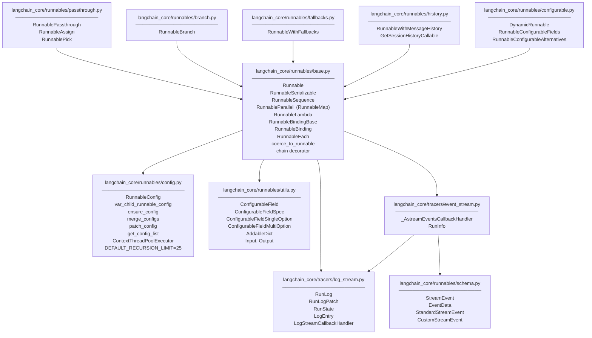

llm.with_config(configurable={"llm": "fast"}).invoke("...")
```

Sources: [libs/core/langchain_core/runnables/configurable.py:49-350](), [libs/core/langchain_core/runnables/utils.py:450-600]()

---

## Module Map

**Files and types in the LCEL implementation**



Sources: [libs/core/langchain_core/runnables/base.py:1-100](), [libs/core/langchain_core/runnables/config.py:1-50](), [libs/core/langchain_core/runnables/passthrough.py:1-50](), [libs/core/langchain_core/runnables/branch.py:1-40](), [libs/core/langchain_core/runnables/fallbacks.py:1-35](), [libs/core/langchain_core/runnables/history.py:1-40](), [libs/core/langchain_core/runnables/configurable.py:1-48](), [libs/core/langchain_core/runnables/utils.py:1-50](), [libs/core/langchain_core/runnables/schema.py:1-120](), [libs/core/langchain_core/tracers/log_stream.py:1-40](), [libs/core/langchain_core/tracers/event_stream.py:1-56]()