```

The `pipe` method overrides the default to intercept the first element and replace it with `others[0].with_structured_output(...)`. If the first element is not a language model (no `with_structured_output` method), a `NotImplementedError` is raised.

Sources: [libs/core/langchain_core/prompts/structured.py:1-184]()

---

## ImagePromptTemplate

**File:** [libs/core/langchain_core/prompts/image.py:16-157]()

Used internally by `_StringImageMessagePromptTemplate` to render image URL blocks. Accepts a `template` dict with keys `url` and optionally `detail`. The `url` value may contain template variables. The variable names `url`, `path`, and `detail` are reserved and cannot appear in `input_variables`.

> Loading images from local file `path` was removed in version 0.3.15 for security reasons. Use `url` with data URIs instead.

Sources: [libs/core/langchain_core/prompts/image.py:16-157]()

---

## Formatting Lifecycle

**Data flow through ChatPromptTemplate.invoke**

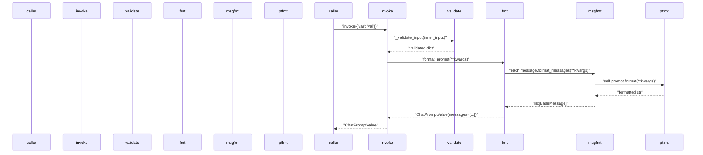

Sources: [libs/core/langchain_core/prompts/base.py:195-255](), [libs/core/langchain_core/prompts/chat.py:698-758]()

---

## Variable Management Summary

**How variables flow through a ChatPromptTemplate**

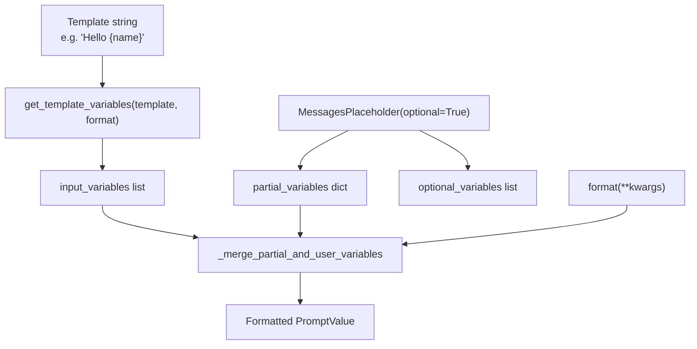

Sources: [libs/core/langchain_core/prompts/base.py:279-300](), [libs/core/langchain_core/prompts/chat.py:971-994](), [libs/core/langchain_core/prompts/string.py:256-308]()

---

## `format_document` Utility

**File:** [libs/core/langchain_core/prompts/base.py:414-470]()

`format_document(doc, prompt)` and its async counterpart `aformat_document` accept a `Document` object and a `BasePromptTemplate[str]`. The document's `page_content` is mapped to the `page_content` variable, and all `metadata` keys are available as additional variables. Raises `ValueError` if the prompt requires metadata keys not present on the document.

---

## Module Summary

| Class / Function | File | Role |
|---|---|---|
| `BasePromptTemplate` | `prompts/base.py` | Root; `Runnable`, `invoke`, `partial`, `save` |
| `StringPromptTemplate` | `prompts/string.py` | Abstract string-producing base |
| `PromptTemplate` | `prompts/prompt.py` | Concrete single-string template |
| `PromptTemplateFormat` | `prompts/string.py` | `Literal["f-string", "mustache", "jinja2"]` |
| `get_template_variables` | `prompts/string.py` | Extracts variable names from any format |
| `BaseChatPromptTemplate` | `prompts/chat.py` | Abstract chat-producing base |
| `ChatPromptTemplate` | `prompts/chat.py` | Primary chat template; message list |
| `MessagesPlaceholder` | `prompts/chat.py` | Pass-through for existing message lists |
| `HumanMessagePromptTemplate` | `prompts/chat.py` | Produces `HumanMessage` |
| `AIMessagePromptTemplate` | `prompts/chat.py` | Produces `AIMessage` |
| `SystemMessagePromptTemplate` | `prompts/chat.py` | Produces `SystemMessage` |
| `ChatMessagePromptTemplate` | `prompts/chat.py` | Produces `ChatMessage` with custom role |
| `FewShotPromptTemplate` | `prompts/few_shot.py` | String prompt with example list |
| `FewShotChatMessagePromptTemplate` | `prompts/few_shot.py` | Chat prompt with example list |
| `FewShotPromptWithTemplates` | `prompts/few_shot_with_templates.py` | Few-shot with prefix/suffix as templates |
| `StructuredPrompt` | `prompts/structured.py` | Chat template with bound output schema |
| `ImagePromptTemplate` | `prompts/image.py` | Image URL block template |
| `format_document` | `prompts/base.py` | Format a `Document` using a `PromptTemplate` |

# Text Splitters


This page documents the `langchain-text-splitters` package: its base class, all concrete implementations, the `Language` enum, chunking parameters, and factory class methods. Text splitters are preprocessing utilities used to break large text into smaller chunks before embedding or retrieval — they are not part of the LCEL chain execution model. For chain composition and the `Runnable` interface, see [2.1](). For vector store ingestion, see [3.4]().

---

## Package Overview

Text splitters live in the independently versioned `langchain-text-splitters` package at `libs/text-splitters/`. The package depends only on `langchain-core` and ships without any ML library dependencies by default. Optional splitters (NLTK, spaCy, sentence-transformers, tiktoken) require additional installs.

```
libs/text-splitters/
├── langchain_text_splitters/
│   ├── __init__.py
│   ├── base.py              # TextSplitter, TokenTextSplitter, Language, Tokenizer
│   ├── character.py         # CharacterTextSplitter, RecursiveCharacterTextSplitter
│   ├── html.py              # HTMLHeaderTextSplitter, HTMLSectionSplitter, HTMLSemanticPreservingSplitter
│   ├── markdown.py          # MarkdownHeaderTextSplitter, MarkdownTextSplitter, ExperimentalMarkdownSyntaxTextSplitter
│   ├── sentence_transformers.py  # SentenceTransformersTokenTextSplitter
│   ├── json.py              # RecursiveJsonSplitter
│   ├── jsx.py               # JSFrameworkTextSplitter
│   ├── nltk.py              # NLTKTextSplitter
│   ├── spacy.py             # SpacyTextSplitter
│   ├── konlpy.py            # KonlpyTextSplitter
│   ├── python.py            # PythonCodeTextSplitter
│   └── latex.py             # LatexTextSplitter
```

Sources: [libs/text-splitters/langchain_text_splitters/__init__.py:1-69]()

---

## Class Hierarchy

**Class hierarchy diagram for langchain-text-splitters**

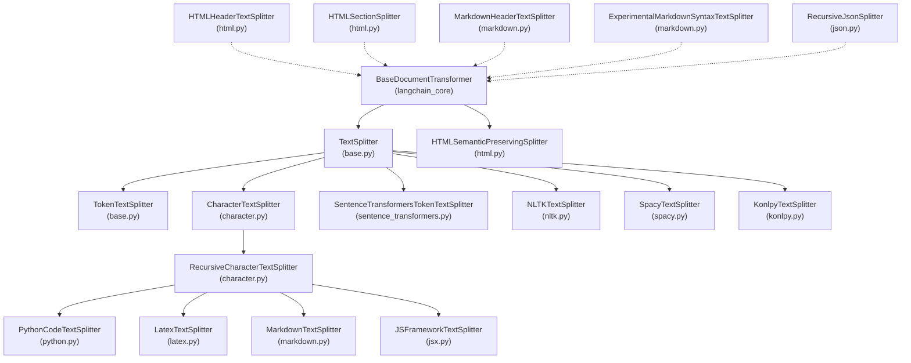

> **Note:** Dashed arrows indicate classes that do **not** extend `TextSplitter` or `BaseDocumentTransformer` directly but follow a compatible interface. `HTMLHeaderTextSplitter`, `HTMLSectionSplitter`, `MarkdownHeaderTextSplitter`, `ExperimentalMarkdownSyntaxTextSplitter`, and `RecursiveJsonSplitter` are standalone classes with their own `split_text` methods that return `list[Document]` instead of `list[str]`.

Sources: [libs/text-splitters/langchain_text_splitters/base.py:44-296](), [libs/text-splitters/langchain_text_splitters/character.py:11-176](), [libs/text-splitters/langchain_text_splitters/__init__.py:1-69]()

---

## `TextSplitter` Base Class

Defined in [libs/text-splitters/langchain_text_splitters/base.py:44-296]().

`TextSplitter` extends `BaseDocumentTransformer` from `langchain_core` and acts as the abstract base for all `list[str]`-returning splitters. It enforces one abstract method and provides the full text-to-document pipeline.

### Constructor Parameters

| Parameter | Type | Default | Description |
|---|---|---|---|
| `chunk_size` | `int` | `4000` | Maximum character length of each chunk |
| `chunk_overlap` | `int` | `200` | Number of characters to overlap between chunks |
| `length_function` | `Callable[[str], int]` | `len` | Function to measure chunk length |
| `keep_separator` | `bool \| Literal["start", "end"]` | `False` | Whether and where to place the separator in each chunk |
| `add_start_index` | `bool` | `False` | If `True`, adds `start_index` key to each chunk's metadata |
| `strip_whitespace` | `bool` | `True` | Strip leading/trailing whitespace from each chunk |

Validation rules (enforced in `__init__`):
- `chunk_size` must be > 0
- `chunk_overlap` must be ≥ 0
- `chunk_overlap` must be < `chunk_size`

Sources: [libs/text-splitters/langchain_text_splitters/base.py:47-90]()

### Core Methods

| Method | Returns | Description |
|---|---|---|
| `split_text(text)` | `list[str]` | **Abstract.** Subclasses implement this. |
| `create_documents(texts, metadatas)` | `list[Document]` | Calls `split_text` per text, wraps in `Document` objects with optional metadata |
| `split_documents(documents)` | `list[Document]` | Calls `create_documents` over an iterable of `Document` objects |
| `transform_documents(documents)` | `Sequence[Document]` | `BaseDocumentTransformer` implementation; delegates to `split_documents` |

`add_start_index=True` causes `create_documents` to locate each chunk in the original text via `str.find` and store its byte offset in `metadata["start_index"]`.

Sources: [libs/text-splitters/langchain_text_splitters/base.py:92-296]()

### Factory Class Methods

**`from_tiktoken_encoder`** — Returns an instance of the calling class with `length_function` set to count tiktoken tokens. Accepts:
- `encoding_name` (default `"gpt2"`) or `model_name` to select a tiktoken encoding
- `allowed_special`, `disallowed_special` for encoding options

When called on `TokenTextSplitter`, it also forwards the encoding parameters to the constructor.

**`from_huggingface_tokenizer`** — Returns an instance with `length_function` set to count tokens via a `PreTrainedTokenizerBase` instance from the `transformers` library.

Sources: [libs/text-splitters/langchain_text_splitters/base.py:196-281]()

---

## Internal Utilities

### `Tokenizer` dataclass

[libs/text-splitters/langchain_text_splitters/base.py:405-419]()

A frozen dataclass bundling the parameters needed for token-based splitting:

| Field | Type | Description |
|---|---|---|
| `chunk_overlap` | `int` | Token overlap between chunks |
| `tokens_per_chunk` | `int` | Max tokens per chunk |
| `decode` | `Callable[[list[int]], str]` | Converts token IDs back to text |
| `encode` | `Callable[[str], list[int]]` | Converts text to token IDs |

### `split_text_on_tokens`

[libs/text-splitters/langchain_text_splitters/base.py:422-450]()

A module-level function used by `TokenTextSplitter` and `SentenceTransformersTokenTextSplitter`. It encodes the full text into token IDs, then slides a window of `tokens_per_chunk` with `chunk_overlap` stride to produce decoded string chunks.

---

## Character-based Splitters

### `CharacterTextSplitter`

[libs/text-splitters/langchain_text_splitters/character.py:11-58]()

Splits on a single fixed separator string. After splitting, adjacent fragments are re-merged using `_merge_splits` to keep chunks near `chunk_size`.

| Parameter | Default | Description |
|---|---|---|
| `separator` | `"\n\n"` | String or regex pattern to split on |
| `is_separator_regex` | `False` | Treat `separator` as a compiled regex |

The helper `_split_text_with_regex` handles three `keep_separator` modes: `False` (discard separator), `"start"` (prepend to next chunk), `"end"` (append to current chunk).

### `RecursiveCharacterTextSplitter`

[libs/text-splitters/langchain_text_splitters/character.py:88-176]()

Tries a prioritized list of separators in sequence. The first separator that matches is used; the remaining separators are applied recursively to any sub-chunk that still exceeds `chunk_size`.

| Parameter | Default | Description |
|---|---|---|
| `separators` | `["\n\n", "\n", " ", ""]` | Ordered list of separators |
| `keep_separator` | `True` | Separator placement (same as base class) |
| `is_separator_regex` | `False` | Treat each separator as a regex |

**Splitting flow:**

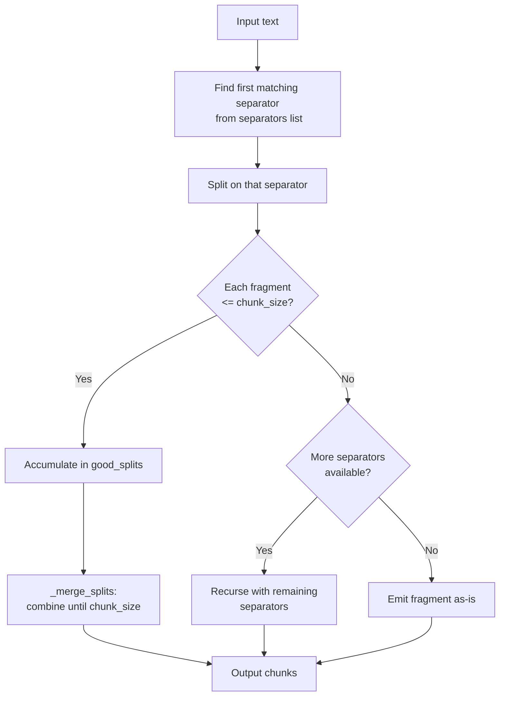

Sources: [libs/text-splitters/langchain_text_splitters/character.py:107-158]()

#### `from_language` class method

```python
RecursiveCharacterTextSplitter.from_language(Language.PYTHON, chunk_size=1000, chunk_overlap=0)
```

Returns a `RecursiveCharacterTextSplitter` pre-configured with language-specific regex separators obtained from `get_separators_for_language`. All separators are treated as regexes (`is_separator_regex=True`).

Sources: [libs/text-splitters/langchain_text_splitters/character.py:160-176]()

---

## Token-based Splitters

### `TokenTextSplitter`

[libs/text-splitters/langchain_text_splitters/base.py:298-369]()

Splits text by actual token boundaries rather than character positions. Uses tiktoken internally.

| Parameter | Default | Description |
|---|---|---|
| `encoding_name` | `"gpt2"` | tiktoken encoding name |
| `model_name` | `None` | If set, derives encoding from model name (overrides `encoding_name`) |
| `allowed_special` | `set()` | Special tokens allowed in encoding |
| `disallowed_special` | `"all"` | Special tokens to disallow |

`chunk_size` and `chunk_overlap` are interpreted as **token counts**, not character counts.

### `SentenceTransformersTokenTextSplitter`

[libs/text-splitters/langchain_text_splitters/sentence_transformers.py:20-126]()

Splits using the tokenizer of a `sentence-transformers` model. Respects the model's `max_seq_length` as an upper bound on `tokens_per_chunk`.

| Parameter | Default | Description |
|---|---|---|
| `model_name` | `"sentence-transformers/all-mpnet-base-v2"` | Model to load |
| `tokens_per_chunk` | `None` | If `None`, uses model's `max_seq_length` |
| `chunk_overlap` | `50` | Token overlap between chunks |
| `model_kwargs` | `None` | Extra kwargs passed to `SentenceTransformer(...)` |

Additional method: `count_tokens(text: str) -> int` returns the raw token count (including start/stop tokens).

---

## Markup and Format-specific Splitters

### `HTMLHeaderTextSplitter`

[libs/text-splitters/langchain_text_splitters/html.py:83-350]()

Parses HTML with BeautifulSoup and yields `Document` objects at header boundaries. Does **not** extend `TextSplitter`; returns `list[Document]`.

| Parameter | Default | Description |
|---|---|---|
| `headers_to_split_on` | required | List of `(tag, metadata_key)` tuples e.g. `[("h1", "Header 1"), ("h2", "Header 2")]` |
| `return_each_element` | `False` | If `True`, each HTML element becomes its own `Document`; otherwise content under a header is aggregated |

Methods: `split_text(text)`, `split_text_from_url(url, timeout)`, `split_text_from_file(file)`. All converge on the internal DFS traversal in `_generate_documents`.

Metadata on each output `Document` is a dict keyed by the user-supplied header names, reflecting the nesting of headers encountered so far.

### `HTMLSectionSplitter`

[libs/text-splitters/langchain_text_splitters/html.py:353-558]()

Alternative HTML splitter that uses an XSLT transformation (via `lxml`) to normalize non-standard heading tags, then splits via BeautifulSoup. After splitting into sections it applies a `RecursiveCharacterTextSplitter` to sections that still exceed `chunk_size`.

Requires: `lxml`, `beautifulsoup4`.

### `HTMLSemanticPreservingSplitter`

[libs/text-splitters/langchain_text_splitters/html.py:561-]()

A `@beta()` splitter extending `BaseDocumentTransformer`. Preserves full HTML semantic structure (links, images, media) as Markdown-like text. Large chunks are further split by a `RecursiveCharacterTextSplitter`.

### `MarkdownHeaderTextSplitter`

[libs/text-splitters/langchain_text_splitters/markdown.py:23-280]()

Splits Markdown text line-by-line, tracking the current heading hierarchy. Returns `list[Document]`. Does **not** extend `TextSplitter`.

| Parameter | Default | Description |
|---|---|---|
| `headers_to_split_on` | required | List of `(marker, metadata_key)` tuples e.g. `[("#", "H1"), ("##", "H2")]` |
| `return_each_line` | `False` | If `True`, yields one `Document` per line |
| `strip_headers` | `True` | Exclude header lines from chunk content |
| `custom_header_patterns` | `None` | Dict mapping non-standard markers (e.g. `"**"`) to numeric heading levels |

Code blocks (fenced with ` ``` ` or `~~~`) are treated as opaque content and not split inside them.

### `MarkdownTextSplitter`

[libs/text-splitters/langchain_text_splitters/markdown.py:14-20]()

A thin subclass of `RecursiveCharacterTextSplitter` that pre-loads the separator list for `Language.MARKDOWN`. Returns `list[str]`.

### `ExperimentalMarkdownSyntaxTextSplitter`

[libs/text-splitters/langchain_text_splitters/markdown.py:298-]()

Experimental. Preserves original whitespace, extracts code blocks as separate chunks with a `"Code"` metadata key, and splits on horizontal rules. Interface is subject to change.

---

## Language-specific Code Splitters

The `Language` enum in [libs/text-splitters/langchain_text_splitters/base.py:372-402]() enumerates programming languages with built-in separator sets:

**Supported `Language` values**

| Value | String key | Splitter subclass |
|---|---|---|
| `Language.PYTHON` | `"python"` | `PythonCodeTextSplitter` |
| `Language.JS` | `"js"` | via `from_language` |
| `Language.TS` | `"ts"` | via `from_language` |
| `Language.GO` | `"go"` | via `from_language` |
| `Language.JAVA` | `"java"` | via `from_language` |
| `Language.KOTLIN` | `"kotlin"` | via `from_language` |
| `Language.CPP` | `"cpp"` | via `from_language` |
| `Language.C` | `"c"` | via `from_language` |
| `Language.RUBY` | `"ruby"` | via `from_language` |
| `Language.RUST` | `"rust"` | via `from_language` |
| `Language.SCALA` | `"scala"` | via `from_language` |
| `Language.SWIFT` | `"swift"` | via `from_language` |
| `Language.PHP` | `"php"` | via `from_language` |
| `Language.R` | `"r"` | via `from_language` |
| `Language.COBOL` | `"cobol"` | via `from_language` |
| `Language.HASKELL` | `"haskell"` | via `from_language` |
| `Language.ELIXIR` | `"elixir"` | via `from_language` |
| `Language.PERL` | `"perl"` | via `from_language` |
| `Language.LUA` | `"lua"` | via `from_language` |
| `Language.POWERSHELL` | `"powershell"` | via `from_language` |
| `Language.VISUALBASIC6` | `"visualbasic6"` | via `from_language` |
| `Language.PROTO` | `"proto"` | via `from_language` |
| `Language.SOL` | `"sol"` | via `from_language` |
| `Language.RST` | `"rst"` | via `from_language` |
| `Language.MARKDOWN` | `"markdown"` | `MarkdownTextSplitter` |
| `Language.LATEX` | `"latex"` | `LatexTextSplitter` |
| `Language.HTML` | `"html"` | via `from_language` |
| `Language.CSHARP` | `"csharp"` | via `from_language` |

Each language has a hand-curated list of regex separators returned by `RecursiveCharacterTextSplitter.get_separators_for_language`. Separators are ordered from coarsest (class/function boundaries) to finest (individual characters).

**Example separator priority for `Language.PYTHON`:**
```
"\nclass " → "\ndef " → "\n\tdef " → "\n\n" → "\n" → " " → ""
```

### Named subclasses

| Class | File | Language |
|---|---|---|
| `PythonCodeTextSplitter` | `python.py` | `Language.PYTHON` |
| `LatexTextSplitter` | `latex.py` | `Language.LATEX` |
| `MarkdownTextSplitter` | `markdown.py` | `Language.MARKDOWN` |

These are purely convenience wrappers that call `get_separators_for_language` in `__init__` and forward `**kwargs` to `RecursiveCharacterTextSplitter`.

Sources: [libs/text-splitters/langchain_text_splitters/base.py:372-402](), [libs/text-splitters/langchain_text_splitters/character.py:178-600](), [libs/text-splitters/langchain_text_splitters/python.py:1-17](), [libs/text-splitters/langchain_text_splitters/latex.py:1-17]()

### `JSFrameworkTextSplitter`

[libs/text-splitters/langchain_text_splitters/jsx.py:9-106]()

Extends `RecursiveCharacterTextSplitter`. On each `split_text` call, it extracts all opening HTML/component tags from the input via regex and prepends them as additional separators (alongside standard JS keywords) for that call only. The internal `self._separators` list is not mutated between calls.

---

## NLP-based Splitters

### `NLTKTextSplitter`

[libs/text-splitters/langchain_text_splitters/nltk.py:19-72]()

Uses NLTK's sentence tokenizer to segment text, then merges sentence-length segments using `_merge_splits`.

| Parameter | Default | Description |
|---|---|---|
| `separator` | `"\n\n"` | Separator used when joining sentences into chunks |
| `language` | `"english"` | NLTK language model for `sent_tokenize` |
| `use_span_tokenize` | `False` | Use `span_tokenize` (preserves whitespace between sentences) instead of `sent_tokenize` |

Requires: `nltk`.

### `SpacyTextSplitter`

[libs/text-splitters/langchain_text_splitters/spacy.py:26-58]()

Uses spaCy's sentence segmentation (`.sents`) to produce splits, then merges with `_merge_splits`.

| Parameter | Default | Description |
|---|---|---|
| `separator` | `"\n\n"` | Separator for merging |
| `pipeline` | `"en_core_web_sm"` | spaCy pipeline name or `"sentencizer"` for a lightweight rule-based version |
| `max_length` | `1_000_000` | Max character length passed to the spaCy model |

Requires: `spacy` and the specified model.

### `KonlpyTextSplitter`

[libs/text-splitters/langchain_text_splitters/konlpy.py:19-51]()

Korean-language splitter using `konlpy.tag.Kkma` for sentence segmentation.

Requires: `konlpy`.

---

## JSON Splitter

### `RecursiveJsonSplitter`

[libs/text-splitters/langchain_text_splitters/json.py:12-190]()

Does **not** extend `TextSplitter`. Recursively splits a JSON dict into sub-dicts that fit within `max_chunk_size` (measured in bytes of serialized JSON), preserving nesting structure.

| Parameter | Default | Description |
|---|---|---|
| `max_chunk_size` | `2000` | Max byte size (as JSON string) per chunk |
| `min_chunk_size` | `max(max_chunk_size - 200, 50)` | Below this size, the splitter continues filling the current chunk |

| Method | Returns | Description |
|---|---|---|
| `split_json(json_data, convert_lists)` | `list[dict]` | Returns a list of JSON-serializable dicts |
| `split_text(json_data, convert_lists, ensure_ascii)` | `list[str]` | Returns JSON-formatted strings |
| `create_documents(texts, ...)` | `list[Document]` | Wraps output in `Document` objects |

The `convert_lists=True` option pre-converts all JSON arrays to dicts keyed by their integer index, enabling the recursive splitting logic to handle array elements.

---

## Splitter Comparison Reference

**Splitters at a glance**

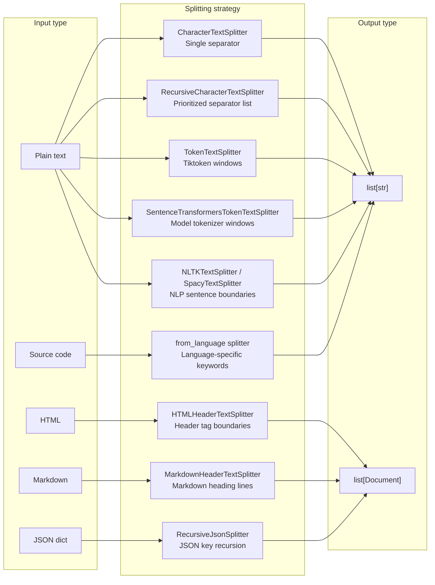

Sources: [libs/text-splitters/langchain_text_splitters/__init__.py:1-69](), [libs/text-splitters/langchain_text_splitters/base.py:44-296](), [libs/text-splitters/langchain_text_splitters/character.py:1-176](), [libs/text-splitters/langchain_text_splitters/html.py:83-558](), [libs/text-splitters/langchain_text_splitters/markdown.py:1-280](), [libs/text-splitters/langchain_text_splitters/json.py:1-190]()

---

## Optional Dependencies

| Splitter | Required package | Install |
|---|---|---|
| `TokenTextSplitter` | `tiktoken` | `pip install tiktoken` |
| `TextSplitter.from_tiktoken_encoder` | `tiktoken` | `pip install tiktoken` |
| `TextSplitter.from_huggingface_tokenizer` | `transformers` | `pip install transformers` |
| `SentenceTransformersTokenTextSplitter` | `sentence-transformers` | `pip install sentence-transformers` |
| `HTMLHeaderTextSplitter`, `HTMLSectionSplitter` | `beautifulsoup4` | `pip install bs4` |
| `HTMLSectionSplitter` | `lxml` | `pip install lxml` |
| `NLTKTextSplitter` | `nltk` | `pip install nltk` |
| `SpacyTextSplitter` | `spacy` + model | `pip install spacy` |
| `KonlpyTextSplitter` | `konlpy` | `pip install konlpy` |

Sources: [libs/text-splitters/pyproject.toml:67-77](), [libs/text-splitters/langchain_text_splitters/base.py:25-37](), [libs/text-splitters/langchain_text_splitters/html.py:30-50]()

# Callbacks and Tracing


The callback system provides observability and instrumentation for LangChain applications. It enables tracking execution flow, debugging, logging, and integration with tracing platforms like LangSmith. This system operates through a hierarchy of callback handlers that receive events at various points during the execution of Runnables, LLMs, tools, and other components.

For information about runtime configuration beyond callbacks, see [Configuration and Runtime Control](#4.4). For testing and standard test suites that use callbacks, see [Standard Testing Framework](#5.1).

## Overview: Callback Architecture

The callback system is built on three core abstractions: handlers that implement callback logic, managers that coordinate multiple handlers, and configuration objects that propagate callbacks through execution chains.

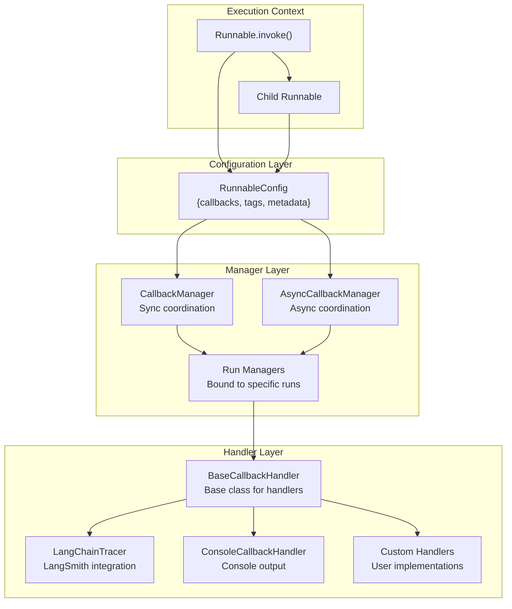

**Sources:** [libs/core/langchain_core/callbacks/manager.py:1-100](), [libs/core/langchain_core/callbacks/base.py:1-50](), [libs/core/langchain_core/runnables/config.py:51-123]()

## BaseCallbackHandler and Event Types

`BaseCallbackHandler` defines the interface for receiving execution events. Handlers can implement any subset of callback methods to track specific events. The system provides specialized mixins for different component types.

### Callback Event Hierarchy

| Mixin | Events | Purpose |
|-------|--------|---------|
| `LLMManagerMixin` | `on_llm_start`, `on_llm_new_token`, `on_llm_end`, `on_llm_error` | Track LLM invocations and streaming |
| `ChainManagerMixin` | `on_chain_start`, `on_chain_end`, `on_chain_error`, `on_agent_action`, `on_agent_finish` | Track chain and agent execution |
| `ToolManagerMixin` | `on_tool_start`, `on_tool_end`, `on_tool_error` | Track tool invocations |
| `RetrieverManagerMixin` | `on_retriever_start`, `on_retriever_end`, `on_retriever_error` | Track document retrieval |
| `CallbackManagerMixin` | `on_chat_model_start`, `on_text`, `on_retry` | Additional events |

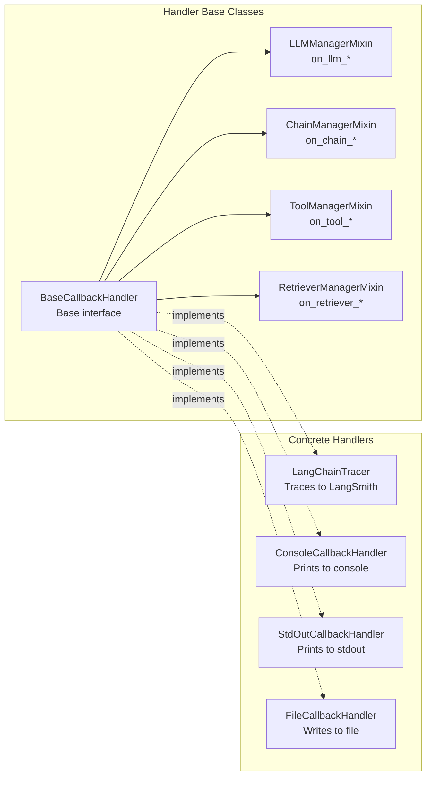

**Sources:** [libs/core/langchain_core/callbacks/base.py:23-236](), [libs/core/langchain_core/callbacks/base.py:238-547]()

### Event Lifecycle and Parameters

Each callback event receives standard parameters:

- `run_id: UUID` - Unique identifier for the current run
- `parent_run_id: UUID | None` - ID of the parent run in the execution hierarchy
- `tags: list[str] | None` - Tags associated with the run
- `metadata: dict[str, Any] | None` - Additional metadata

Event-specific parameters vary by type. For example, `on_llm_start` receives:
- `serialized: dict[str, Any]` - Serialized representation of the LLM
- `prompts: list[str]` - Prompts being sent to the LLM

While `on_llm_new_token` receives:
- `token: str` - The new token
- `chunk: GenerationChunk | ChatGenerationChunk | None` - Structured chunk with additional information

**Sources:** [libs/core/langchain_core/callbacks/base.py:61-126](), [libs/core/langchain_core/callbacks/base.py:238-300]()

## CallbackManager and Event Dispatch

`CallbackManager` and `AsyncCallbackManager` coordinate multiple handlers and dispatch events. They maintain separate lists of `handlers` (for this run only) and `inheritable_handlers` (propagated to child runs).

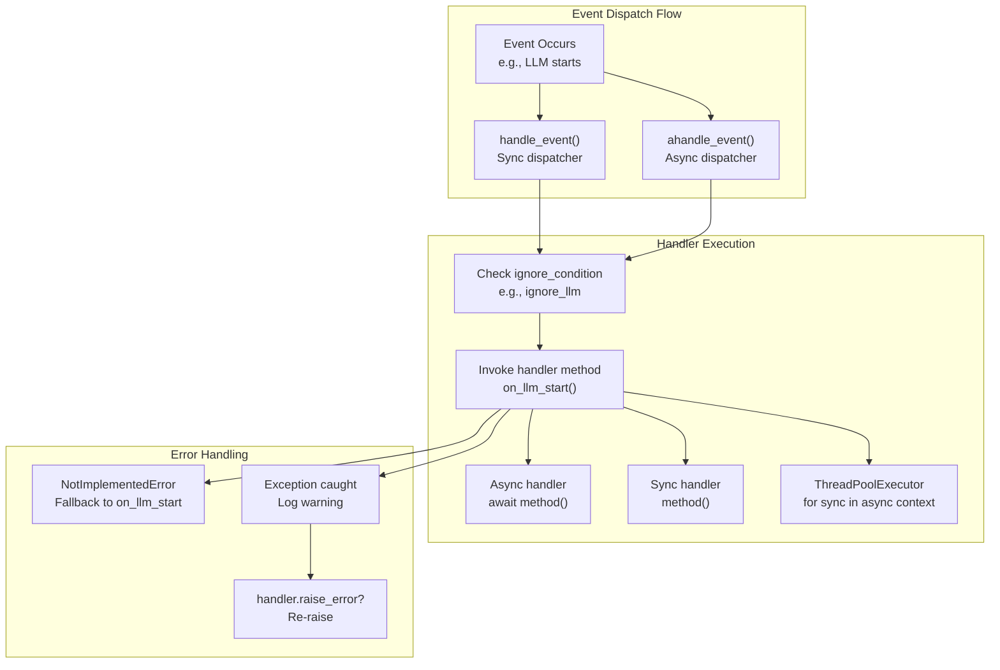

**Sources:** [libs/core/langchain_core/callbacks/manager.py:256-337](), [libs/core/langchain_core/callbacks/manager.py:420-454]()

### Handler Execution Strategy

The `handle_event` function implements sophisticated event dispatch:

1. **Synchronous handlers** in sync context: Called directly
2. **Async handlers** in sync context: Collected as coroutines and run in a new event loop using `asyncio.Runner` (Python 3.11+) or `asyncio.run` (earlier versions)
3. **Async handlers** in async context: Executed via `ahandle_event`, which uses `asyncio.gather` for concurrent execution
4. **Mixed handlers**: `run_inline=True` handlers execute first in order, then others execute concurrently

The system handles the `NotImplementedError` exception specially: when `on_chat_model_start` is not implemented, it falls back to `on_llm_start` with converted message strings.

**Sources:** [libs/core/langchain_core/callbacks/manager.py:256-366](), [libs/core/langchain_core/callbacks/manager.py:368-454]()

## Configuration and Propagation

Callbacks are configured via `RunnableConfig` and propagated through the execution hierarchy. The system merges configs from multiple sources to create a complete callback context.

### RunnableConfig Structure

```python
class RunnableConfig(TypedDict, total=False):
    callbacks: Callbacks  # list[BaseCallbackHandler] | BaseCallbackManager | None
    tags: list[str]
    metadata: dict[str, Any]
    run_name: str
    run_id: uuid.UUID | None
    # ... other fields
```

**Sources:** [libs/core/langchain_core/runnables/config.py:51-123]()

### Config Merging and Context Propagation

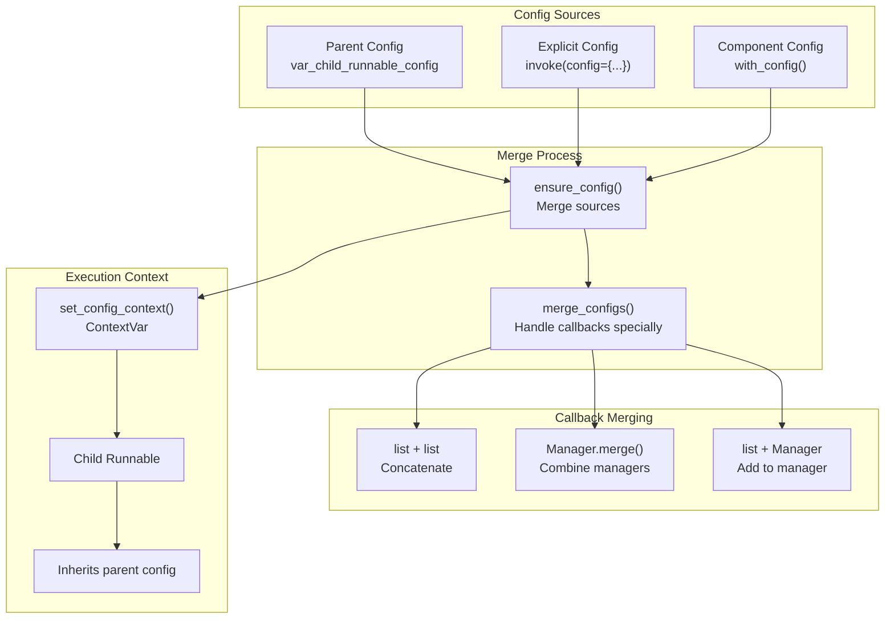

**Sources:** [libs/core/langchain_core/runnables/config.py:216-266](), [libs/core/langchain_core/runnables/config.py:357-420]()

### Callback Manager Creation from Config

Helper functions convert `RunnableConfig` to `CallbackManager`:

- `get_callback_manager_for_config(config)` - Creates sync `CallbackManager`
- `get_async_callback_manager_for_config(config)` - Creates async `AsyncCallbackManager`

These functions call `CallbackManager.configure()` with:
- `inheritable_callbacks` from `config["callbacks"]`
- `inheritable_tags` from `config["tags"]`
- `inheritable_metadata` from `config["metadata"]`

**Sources:** [libs/core/langchain_core/runnables/config.py:489-520]()

## Run Managers and Lifecycle Tracking

Run managers bind callbacks to specific runs and provide methods for emitting events. They maintain run context including `run_id`, `parent_run_id`, `tags`, and `metadata`.

### Run Manager Hierarchy

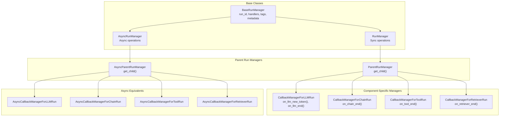

**Sources:** [libs/core/langchain_core/callbacks/manager.py:457-586](), [libs/core/langchain_core/callbacks/manager.py:588-670](), [libs/core/langchain_core/callbacks/manager.py:672-1043]()

### Child Manager Creation

`ParentRunManager.get_child()` creates a new `CallbackManager` for child runs:

1. Creates new manager with `parent_run_id` set to parent's `run_id`
2. Copies `inheritable_handlers` (not `handlers`)
3. Copies `inheritable_tags` and `inheritable_metadata`
4. Optionally adds additional tag via `tag` parameter

This mechanism ensures callbacks can observe the full execution hierarchy while maintaining proper scoping.

**Sources:** [libs/core/langchain_core/callbacks/manager.py:569-585](), [libs/core/langchain_core/callbacks/manager.py:653-669]()

## Tracing with LangSmith

LangSmith tracing is enabled via `LangChainTracer`, which records runs to the LangSmith platform. Tracing is controlled through environment variables and config.

### Enabling Tracing

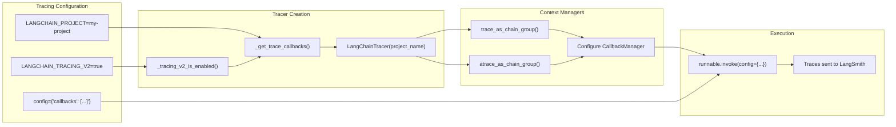

**Sources:** [libs/core/langchain_core/tracers/context.py:1-100](), [libs/core/langchain_core/callbacks/manager.py:64-136]()

### trace_as_chain_group Context Manager

`trace_as_chain_group` groups multiple calls into a single trace, useful when calls aren't composed in a single chain:

```python
with trace_as_chain_group(
    "group_name",
    inputs={"input": llm_input},
    tags=["tag1"],
    metadata={"key": "value"}
) as manager:
    result = llm.invoke(llm_input, {"callbacks": manager})
    manager.on_chain_end({"output": result})
```

The context manager:
1. Gets trace callbacks via `_get_trace_callbacks()`
2. Creates `CallbackManager` with inheritable callbacks, tags, metadata
3. Calls `on_chain_start` to begin the group
4. Yields child `CallbackManager` via `get_child()`
5. Calls `on_chain_end` or `on_chain_error` on exit

**Sources:** [libs/core/langchain_core/callbacks/manager.py:64-136](), [libs/core/langchain_core/callbacks/manager.py:139-215]()

## Event Streaming with astream_events

`astream_events` provides fine-grained streaming of execution events for observability. It's powered by `_AstreamEventsCallbackHandler`, which converts callback events to structured `StreamEvent` objects.

### Event Stream Architecture

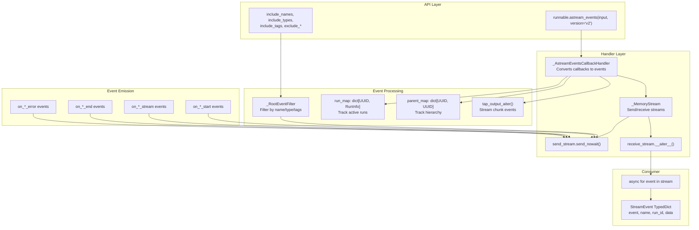

**Sources:** [libs/core/langchain_core/tracers/event_stream.py:101-186](), [libs/core/langchain_core/runnables/base.py:1347-1584]()

### StreamEvent Structure

```typescript
type StreamEvent = {
    event: string;           // e.g., "on_chain_start", "on_llm_stream"
    name: string;            // Name of the runnable
    run_id: string;          // UUID as string
    parent_ids: list[str];   // Parent run IDs from root to immediate parent
    tags: list[str];         // Tags associated with the run
    metadata: dict;          // Metadata
    data: EventData;         // Event-specific data
}

type EventData = {
    input?: any;             // Input to the runnable
    output?: any;            // Final output
    chunk?: any;             // Streaming chunk
    error?: BaseException;   // Error if occurred
}
```

**Sources:** [libs/core/langchain_core/runnables/schema.py:1-109]()

### Event Types and Timing

| Event Type | Timing | Data Fields |
|------------|--------|-------------|
| `on_chain_start` | Runnable begins | `input` |
| `on_chain_stream` | Runnable streams output | `chunk` |
| `on_chain_end` | Runnable completes | `input`, `output` |
| `on_llm_start` | LLM invocation begins | `input` (prompts) |
| `on_llm_stream` | LLM streams token | `chunk` |
| `on_llm_end` | LLM completes | `input`, `output` |
| `on_chat_model_start` | Chat model begins | `input` (messages) |
| `on_chat_model_stream` | Chat model streams | `chunk` |
| `on_tool_start` | Tool execution begins | `input` |
| `on_tool_end` | Tool completes | `input`, `output` |
| `on_retriever_start` | Retriever begins | `input` (query) |
| `on_retriever_end` | Retriever completes | `input`, `output` (documents) |

**Sources:** [libs/core/langchain_core/tracers/event_stream.py:188-735]()

### Filtering Events

The `_RootEventFilter` applies inclusion/exclusion rules:

```python
events = runnable.astream_events(
    input,
    version="v2",
    include_names=["model_name"],      # Include only these names
    include_types=["chat_model"],      # Include only these types
    include_tags=["important"],        # Include if any tag matches
    exclude_names=["helper"],          # Exclude these names
    exclude_types=["retriever"],       # Exclude these types
    exclude_tags=["internal"]          # Exclude if any tag matches
)
```

Filtering logic:
1. Check exclusion rules first (name, type, tags)
2. If not excluded, check inclusion rules
3. If no inclusion rules specified, include all (except excluded)
4. If inclusion rules specified, must match at least one rule

**Sources:** [libs/core/langchain_core/runnables/utils.py:628-791](), [libs/core/langchain_core/tracers/event_stream.py:130-170]()

## Built-in Callback Handlers

LangChain provides several built-in handlers for common use cases.

### Standard Handlers

| Handler | Purpose | Key Features |
|---------|---------|--------------|
| `LangChainTracer` | LangSmith integration | Sends traces to LangSmith platform for visualization |
| `ConsoleCallbackHandler` | Console output | Pretty-printed execution flow for debugging |
| `StdOutCallbackHandler` | Stdout logging | Simple text output of events |
| `FileCallbackHandler` | File logging | Writes events to file, supports context manager |
| `StreamingStdOutCallbackHandler` | Token streaming | Prints LLM tokens as generated |

**Sources:** [libs/core/langchain_core/tracers/langchain.py:1-100](), [libs/core/langchain_core/tracers/stdout.py:1-50](), [libs/core/langchain_core/callbacks/stdout.py:1-100](), [libs/core/langchain_core/callbacks/file.py:1-150](), [libs/core/langchain_core/callbacks/streaming_stdout.py:1-100]()

### FileCallbackHandler Usage

```python