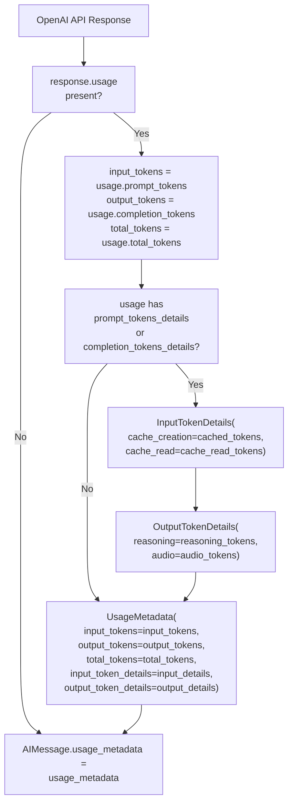

assert isinstance(full_message, AIMessageChunk)
assert full_message.content  # Aggregated content
assert full_message.usage_metadata  # Aggregated usage
```

**Chunk merging behavior:**
- Content strings are concatenated
- Tool call chunks are aggregated by index
- Usage metadata is summed
- Response metadata is updated with latest values

**Sources:**
- [libs/partners/openai/tests/integration_tests/chat_models/test_base.py:156-174]()
- [libs/partners/anthropic/tests/integration_tests/test_chat_models.py:41-85]()

## Usage Metadata Tracking

All providers track token usage through the `UsageMetadata` structure, which is attached to both complete responses and streaming chunks.

**Diagram: Usage Metadata Extraction in `_create_usage_metadata()`**



### Usage Metadata Structure

| Field | Type | Description | Source |
|-------|------|-------------|--------|
| `input_tokens` | `int` | Total input tokens | `usage.prompt_tokens` |
| `output_tokens` | `int` | Total output tokens | `usage.completion_tokens` |
| `total_tokens` | `int` | Sum of input + output | `usage.total_tokens` |
| `input_token_details` | `InputTokenDetails` | Cache hits, audio | `usage.prompt_tokens_details` |
| `output_token_details` | `OutputTokenDetails` | Reasoning, audio | `usage.completion_tokens_details` |

### Streaming Usage Metadata

Providers control usage metadata in streams via the `stream_usage` parameter:

```python