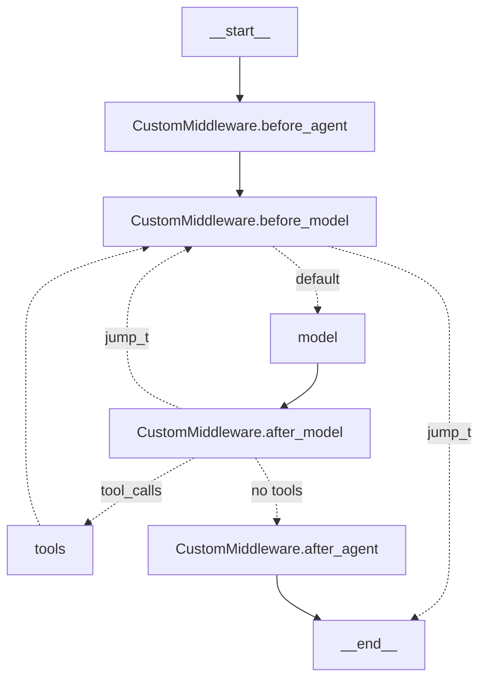

```

Sources: [libs/langchain_v1/langchain/agents/factory.py:629-634]()

### Agent as CompiledStateGraph

The `create_agent` factory from [libs/langchain_v1/langchain/agents/factory.py:920-1337]() constructs a `CompiledStateGraph`:

```python
agent = create_agent(model="openai:gpt-4o", tools=[tool1, tool2])

type(agent)  # <class 'langgraph.graph.state.CompiledStateGraph'>

# Visualize the graph structure
print(agent.get_graph().draw_mermaid())
```

**LangGraph Components**

| Component | Purpose | Source |
|-----------|---------|--------|
| `StateGraph` | Graph builder with nodes and edges | [factory.py:866-874]() |
| State schema | Merged from `AgentState` + middleware schemas | [factory.py:857-864]() |
| Reducers | `add_messages` for conversation history | [types.py:316]() |
| Conditional edges | Created by `can_jump_to` in hooks | [factory.py:332-364]() |

For multi-agent systems or custom routing beyond the agent loop, use raw LangGraph `StateGraph` instead of `create_agent`.

Sources: [libs/langchain_v1/langchain/agents/factory.py:866-1337](), [libs/langchain_v1/langchain/agents/middleware/types.py:313-319]()

## Summary

LangChain provides two primary patterns for building applications:

**Runnable Composition** (deterministic pipelines):
- Use `|` operator to chain components
- `RunnableSequence` for sequential execution
- `RunnableParallel` for concurrent execution
- `RunnableWithMessageHistory` for stateful conversations
- See [Runnable Interface and LCEL](#2.1) for comprehensive details

**Agent-Based Development** (autonomous systems):
- `create_agent` factory creates LangGraph `StateGraph`
- Middleware extends behavior through lifecycle hooks
- Callbacks provide observability
- Checkpointers enable persistence
- See [Agent System with Middleware](#4.1) for comprehensive details

Key architectural patterns:
- All components implement `Runnable` interface for uniform composition
- Middleware provides extension points without modifying core agent logic
- State management uses typed schemas with reducers
- Callbacks enable tracing and observability
- LangGraph integration provides checkpointing and advanced routing

For building production agents, see:
- [Agent System with Middleware](#4.1) - Comprehensive agent guide
- [Middleware Implementations](#4.2) - Built-in middleware and custom implementation
- [Callbacks and Tracing](#4.3) - Observability and debugging

Sources: [libs/core/langchain_core/runnables/base.py:124-256](), [libs/langchain_v1/langchain/agents/factory.py:543-1337](), [libs/langchain_v1/langchain/agents/middleware/types.py:330-689]()

```python
agent = create_agent(
    model="openai:gpt-4o",
    tools=[tool1, tool2],
    middleware=[middleware1, middleware2]
)

mermaid_diagram = agent.get_graph().draw_mermaid()
print(mermaid_diagram)
```

The graph structure varies based on:
- Whether tools are provided (creates tools node and loop)
- Which middleware hooks are implemented (creates middleware nodes)
- Whether hooks use `can_jump_to` (creates conditional edges)
- Whether any tools have `return_direct=True` (creates tools-to-end edge)

Example graph with middleware:



Sources: [libs/langchain_v1/tests/unit_tests/agents/__snapshots__/test_middleware_agent.ambr:319-477](), [libs/langchain_v1/tests/unit_tests/agents/__snapshots__/test_return_direct_graph.ambr:1-70]()

## Execution and Streaming

Agents support multiple execution modes:

### Synchronous Invocation

```python
result = agent.invoke(
    {"messages": [{"role": "user", "content": "Hello"}]},
    config={"configurable": {"session_id": "user-123"}}
)

print(result["messages"][-1].content)
if "structured_response" in result:
    print(result["structured_response"])
```

### Streaming Updates

Stream state updates as each node completes:

```python
for chunk in agent.stream(
    {"messages": [{"role": "user", "content": "Search for AI news"}]},
    stream_mode="updates"
):
    print(chunk)
    # {"model": {"messages": [AIMessage(...)]}}
    # {"tools": {"messages": [ToolMessage(...)]}}
```

### Streaming Messages

Stream individual messages (including chunked AIMessage tokens):

```python
for chunk in agent.stream(
    {"messages": [{"role": "user", "content": "Tell me a story"}]},
    stream_mode="messages"
):
    if isinstance(chunk, tuple):
        message, metadata = chunk
        print(message.content, end="", flush=True)
```

### Async Execution

All methods have async variants:

```python
result = await agent.ainvoke({"messages": [...]})

async for chunk in agent.astream({"messages": [...]}, stream_mode="updates"):
    print(chunk)
```

Sources: [libs/langchain_v1/langchain/agents/factory.py:664-682]()

## Checkpointing and Persistence

Enable conversation memory with a checkpointer:

```python
from langgraph.checkpoint.memory import MemorySaver
from langgraph.checkpoint.postgres import PostgresSaver