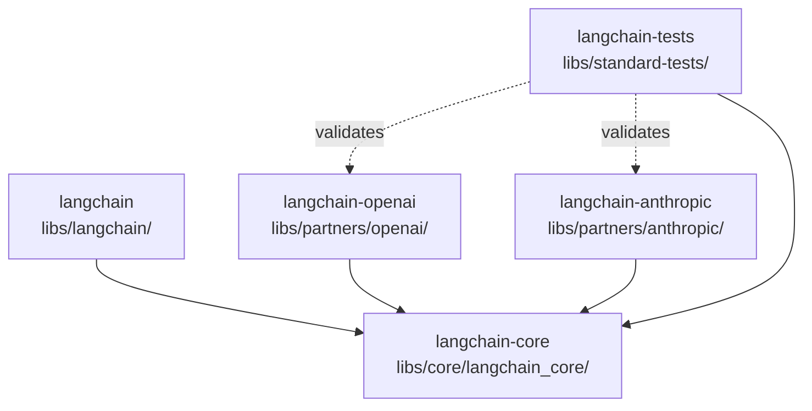
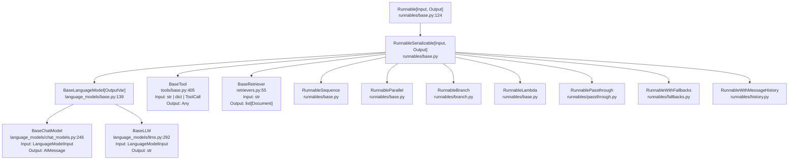
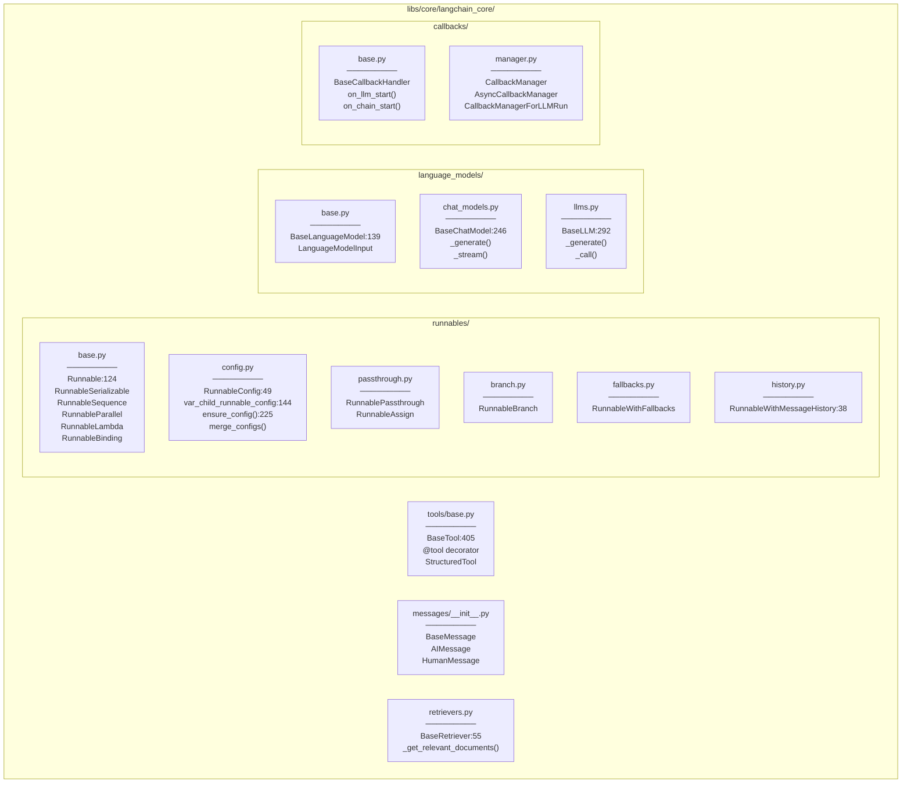
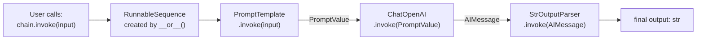
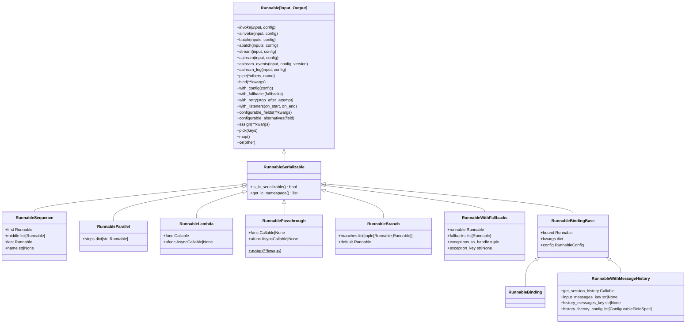
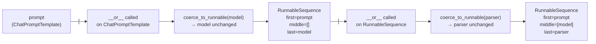

[tool.uv.sources]
langchain-core = { path = "../core", editable = true }
langchain-tests = { path = "../standard-tests", editable = true }
langchain-openai = { path = "../partners/openai", editable = true }
```

This means that during development, changes to `langchain-core` are immediately reflected in `langchain` without a publish step. CI uses the same lock files (`uv.lock`) to ensure reproducible builds.

Sources: [libs/langchain_v1/pyproject.toml:97-101](), [libs/langchain/pyproject.toml:130-134](), [libs/core/pyproject.toml:80-82]()

---

## Relationship Between `langchain` and `langchain-classic`

These two PyPI packages coexist in the monorepo and represent different generations of the top-level LangChain library:

| Aspect | `langchain` (`libs/langchain_v1/`) | `langchain-classic` (`libs/langchain/`) |
|---|---|---|
| PyPI name | `langchain` | `langchain-classic` |
| Version | 1.2.x | 1.0.x |
| Agent system | Yes (`create_agent`, middleware) | No |
| LangGraph dependency | Yes (`langgraph>=1.0.8`) | No |
| text-splitters dep | No (optional) | Yes (required) |
| SQLAlchemy dep | No | Yes |
| Purpose | Current recommended package | Legacy chains and deprecated APIs |

Users should install `langchain` for new projects. `langchain-classic` exists for backwards compatibility with legacy code that depends on chains, the indexing API, or `langchain-community` re-exports.

Sources: [libs/langchain_v1/pyproject.toml:6-30](), [libs/langchain/pyproject.toml:6-34](), [libs/langchain/README.md:20-23](), [libs/langchain_v1/README.md:20-25]()

# Core Architecture


The `langchain-core` package defines the foundational abstractions that power the entire LangChain ecosystem. This page provides an overview of the core interfaces and how they relate to each other.

## Architectural Context

`langchain-core` sits at the foundation of the LangChain package hierarchy:

- **`langchain-core`**: Base abstractions (`Runnable`, `BaseChatModel`, `BaseTool`, etc.) with no provider dependencies
- **Partner packages** (`langchain-openai`, `langchain-anthropic`, etc.): Implement core interfaces for specific providers
- **`langchain` package**: Pre-built chains and agents that compose core abstractions
- **`langchain-tests`**: Standard test suites that validate provider implementations

All code flows in one direction: partner packages and `langchain` import from `langchain-core`, never the reverse.

**Package dependency diagram:**



Sources: [libs/core/langchain_core/runnables/base.py:1-50](), [libs/core/langchain_core/language_models/base.py:1-40]()

---

## The `langchain-core` Package Structure

The package is organized into modules that each define a core abstraction:

| Module Path | Key Exports | Purpose |
|-------------|-------------|---------|
| `langchain_core.runnables` | `Runnable`, `RunnableSequence`, `RunnableParallel` | Execution and composition interface |
| `langchain_core.language_models` | `BaseChatModel`, `BaseLLM`, `BaseLanguageModel` | Language model interface |
| `langchain_core.messages` | `BaseMessage`, `AIMessage`, `HumanMessage` | Message types and content blocks |
| `langchain_core.tools` | `BaseTool`, `@tool` decorator, `StructuredTool` | Tool interface and creation utilities |
| `langchain_core.prompts` | `BasePromptTemplate`, `ChatPromptTemplate` | Prompt templating |
| `langchain_core.callbacks` | `BaseCallbackHandler`, `CallbackManager` | Lifecycle hooks and tracing |
| `langchain_core.retrievers` | `BaseRetriever` | Document retrieval interface |
| `langchain_core.runnables.config` | `RunnableConfig`, `ensure_config` | Runtime configuration |

All major classes inherit from `Runnable` (directly or via `RunnableSerializable`), giving them a uniform execution interface.

Sources: [libs/core/langchain_core/runnables/base.py:1-99](), [libs/core/langchain_core/language_models/chat_models.py:1-75](), [libs/core/langchain_core/tools/base.py:1-74](), [libs/core/langchain_core/callbacks/manager.py:1-50]()

---

## The `Runnable` Abstraction

`Runnable[Input, Output]` is the core interface that unifies all LangChain components. Every chat model, tool, retriever, prompt, and chain implements this interface.

Defined in [libs/core/langchain_core/runnables/base.py:124-256]() as an abstract generic class:

```python
class Runnable(ABC, Generic[Input, Output]):
    """A unit of work that can be invoked, batched, streamed, transformed and composed."""
    
    @abstractmethod
    def invoke(self, input: Input, config: RunnableConfig | None = None, **kwargs: Any) -> Output:
        """Transform a single input into an output."""
```

The `invoke` method is the only required implementation. All other methods have default implementations that delegate to it.

`Runnable` itself is not a Pydantic model. The subclass `RunnableSerializable` (also in `base.py`) extends both `Runnable` and `Serializable`, adding JSON serialization capabilities. Most concrete implementations inherit from `RunnableSerializable`.

### Execution Methods

| Method | Sync/Async | Returns | Default Behavior |
|---|---|---|---|
| `invoke` | sync | `Output` | **Abstract** — must implement |
| `ainvoke` | async | `Output` | Runs `invoke` in thread executor |
| `batch` | sync | `list[Output]` | Runs `invoke` in parallel via `ThreadPoolExecutor` |
| `abatch` | async | `list[Output]` | Runs `ainvoke` via `asyncio.gather` |
| `stream` | sync | `Iterator[Output]` | Yields result of `invoke` |
| `astream` | async | `AsyncIterator[Output]` | Yields result of `ainvoke` |
| `batch_as_completed` | sync | `Iterator[tuple[int, Output]]` | Like `batch`, yields as tasks finish |
| `abatch_as_completed` | async | `AsyncIterator[tuple[int, Output]]` | Like `abatch`, yields as tasks finish |
| `astream_events` | async | `AsyncIterator[StreamEvent]` | Emits structured lifecycle events |

Sources: [libs/core/langchain_core/runnables/base.py:820-1100](), [libs/core/langchain_core/language_models/chat_models.py:479-733](), [libs/core/langchain_core/language_models/llms.py:369-645]()

### Composition and Modifier Methods

`Runnable` provides methods that return new `Runnable` objects:

| Method | Returns | Purpose |
|---|---|---|
| `pipe(*others)` / `\|` | `RunnableSequence` | Chain runnables in sequence |
| `bind(**kwargs)` | `RunnableBinding` | Pre-bind keyword arguments |
| `with_config(config)` | `RunnableBinding` | Attach default config |
| `with_retry(...)` | `RunnableRetry` | Wrap with retry logic |
| `with_fallbacks(...)` | `RunnableWithFallbacks` | Attach fallback runnables |
| `configurable_fields(...)` | `RunnableConfigurableFields` | Expose fields as runtime-configurable |
| `configurable_alternatives(...)` | `RunnableConfigurableAlternatives` | Allow swapping implementations at runtime |
| `assign(**kwargs)` | `RunnableSequence` | Add computed keys to a dict output |
| `pick(keys)` | `RunnableSequence` | Select keys from a dict output |

Sources: [libs/core/langchain_core/runnables/base.py:618-817]()

### Schema Introspection

Every `Runnable` exposes Pydantic model schemas for its inputs and outputs:

- `input_schema` / `get_input_schema(config)` → `type[BaseModel]`
- `output_schema` / `get_output_schema(config)` → `type[BaseModel]`
- `config_schema(include=...)` → `type[BaseModel]`
- `get_input_jsonschema()`, `get_output_jsonschema()`, `get_config_jsonschema()`

These are used for validation, documentation, and LangSmith tracing.

Sources: [libs/core/langchain_core/runnables/base.py:365-582]()

---

## Class Hierarchy

**Inheritance hierarchy of core abstractions (all classes in `langchain_core.*`):**



All classes shown implement the `Runnable` interface. Provider implementations (e.g., `ChatOpenAI`, `ChatAnthropic`) extend `BaseChatModel` and are found in partner packages, not in `langchain-core`.

Sources: [libs/core/langchain_core/runnables/base.py:124-256](), [libs/core/langchain_core/language_models/base.py:139-145](), [libs/core/langchain_core/language_models/chat_models.py:246-294](), [libs/core/langchain_core/language_models/llms.py:292-297](), [libs/core/langchain_core/tools/base.py:405-445](), [libs/core/langchain_core/retrievers.py:55-120]()

---

## Module and Class Map

**Mapping of core abstractions to their source files and key symbols:**



Every class in this diagram implements or extends `Runnable`, giving them the standard execution interface (`invoke`, `stream`, `batch`, etc.).

Sources: [libs/core/langchain_core/runnables/base.py:124-256](), [libs/core/langchain_core/runnables/config.py:49-225](), [libs/core/langchain_core/language_models/base.py:139-200](), [libs/core/langchain_core/language_models/chat_models.py:246-294](), [libs/core/langchain_core/tools/base.py:405-550](), [libs/core/langchain_core/callbacks/base.py:1-400](), [libs/core/langchain_core/callbacks/manager.py:254-500]()

---

## The `RunnableConfig` System

`RunnableConfig` is a `TypedDict` (with `total=False`) defined in [libs/core/langchain_core/runnables/config.py:49-121](). It is the standard way to pass execution-time settings into any `Runnable`.

| Field | Type | Purpose |
|---|---|---|
| `tags` | `list[str]` | Labels propagated to all child runs for filtering |
| `metadata` | `dict[str, Any]` | Key-value pairs attached to tracing data |
| `callbacks` | `Callbacks` | Handlers or a callback manager for this run |
| `run_name` | `str` | Name shown in traces (defaults to class name) |
| `run_id` | `UUID \| None` | Explicit run ID for the trace root |
| `max_concurrency` | `int \| None` | Caps parallel threads/tasks in `batch`/`abatch` |
| `recursion_limit` | `int` | Maximum chain recursion depth (default: `25`) |
| `configurable` | `dict[str, Any]` | Runtime values for fields declared via `configurable_fields` |

Config values are **propagated automatically** down the call stack using a context variable `var_child_runnable_config` defined in [libs/core/langchain_core/runnables/config.py:144-146](). The `ensure_config()` function merges the ambient context config with any locally provided config.

When multiple configs are merged via `merge_configs()`, tags and metadata are unioned, callbacks are combined, and the non-default `recursion_limit` takes precedence.

Sources: [libs/core/langchain_core/runnables/config.py:49-429]()

---

## The Callback System

The callback system provides lifecycle hooks into every `Runnable` execution. It is how tracing, logging, and streaming are implemented.

### Key Classes

| Class | File | Role |
|---|---|---|
| `BaseCallbackHandler` | `callbacks/base.py` | Abstract handler; override event methods |
| `CallbackManager` | `callbacks/manager.py` | Manages a list of sync handlers for a run |
| `AsyncCallbackManager` | `callbacks/manager.py` | Async variant of `CallbackManager` |
| `BaseRunManager` | `callbacks/manager.py` | Bound manager for an active run (has `run_id`) |
| `CallbackManagerForLLMRun` | `callbacks/manager.py` | Specialized for LLM runs |
| `CallbackManagerForChainRun` | `callbacks/manager.py` | Specialized for chain/runnable runs |
| `CallbackManagerForToolRun` | `callbacks/manager.py` | Specialized for tool runs |

### Lifecycle Events

`BaseCallbackHandler` provides hooks grouped by component type:

| Component | Start | Token/Chunk | End | Error |
|---|---|---|---|---|
| LLM / Chat | `on_llm_start` / `on_chat_model_start` | `on_llm_new_token` | `on_llm_end` | `on_llm_error` |
| Chain | `on_chain_start` | — | `on_chain_end` | `on_chain_error` |
| Tool | `on_tool_start` | — | `on_tool_end` | `on_tool_error` |
| Retriever | `on_retriever_start` | — | `on_retriever_end` | `on_retriever_error` |

Sources: [libs/core/langchain_core/callbacks/base.py:23-400](), [libs/core/langchain_core/callbacks/manager.py:254-500]()

### Callback Flow

**Callback lifecycle from config to handler (code paths through `CallbackManager`):**

```mermaid
sequenceDiagram
    participant User
    participant Runnable["Runnable.invoke()"]
    participant CM["CallbackManager.configure()<br/>manager.py:254"]
    participant RM["CallbackManagerForChainRun<br/>manager.py"]
    participant Handler["BaseCallbackHandler<br/>base.py"]

    User->>Runnable: "invoke(input, config={'callbacks': [handler]})"
    Runnable->>CM: "configure(config['callbacks'], ...)"
    CM-->>Runnable: "callback_manager"
    Runnable->>CM: "on_chain_start(serialized, inputs)"
    CM->>RM: "create run_manager"
    RM->>Handler: "on_chain_start(serialized, inputs, run_id=...)"
    Runnable->>Runnable: "execute _invoke / _generate / _run"
    Runnable->>RM: "on_chain_end(outputs)"
    RM->>Handler: "on_chain_end(outputs, run_id=...)"
```

The `CallbackManager.configure()` method (line 254) merges callbacks from `config`, global settings, and inheritable callbacks into a single manager. Each invocation creates a `CallbackManagerForChainRun` that tracks the run ID and dispatches events to all registered handlers.

Sources: [libs/core/langchain_core/callbacks/manager.py:254-500](), [libs/core/langchain_core/callbacks/base.py:23-400](), [libs/core/langchain_core/language_models/chat_models.py:510-597]()

---

## Composition Primitives

The `|` (pipe) operator defined in [libs/core/langchain_core/runnables/base.py:618-637]() allows chaining any `Runnable` objects. Dict literals in a chain are automatically converted to `RunnableParallel`.

| Class | File:Line | Method | Behavior |
|-------|-----------|--------|----------|
| `RunnableSequence` | `runnables/base.py` | `__or__()`, `pipe()` | Sequential execution: output of step N becomes input to step N+1 |
| `RunnableParallel` | `runnables/base.py` | `__init__(steps: dict)` | Parallel execution: all branches receive same input, returns dict of outputs |
| `RunnableBranch` | `runnables/branch.py` | `__init__(branches)` | Conditional routing: evaluates conditions, runs first matching branch |
| `RunnableLambda` | `runnables/base.py` | `__init__(func)` | Wraps a Python function or async function as a `Runnable` |
| `RunnablePassthrough` | `runnables/passthrough.py:74` | `invoke()` | Identity function; optionally adds keys via `.assign()` |
| `RunnableWithFallbacks` | `runnables/fallbacks.py` | `invoke()` | Try/catch: runs primary, falls back to alternates on exception |
| `RunnableWithMessageHistory` | `runnables/history.py:38` | `invoke()` | Wraps another runnable with automatic chat history loading/saving |

**How the pipe operator chains runnables (example: prompt | model | parser):**



The sequence is built via: `prompt | model | parser` → `RunnableSequence(steps=[prompt, model, parser])`. When invoked, each step's output becomes the next step's input.

Sources: [libs/core/langchain_core/runnables/base.py:618-708](), [libs/core/langchain_core/runnables/passthrough.py:50-133](), [libs/core/langchain_core/runnables/branch.py:1-200](), [libs/core/langchain_core/runnables/fallbacks.py:1-150](), [libs/core/langchain_core/runnables/history.py:38-300]()

---

## The `RunnableSerializable` Layer

`RunnableSerializable` (defined in `runnables/base.py`) extends both `Runnable` and `Serializable`. The `Serializable` base class (from `langchain_core.load.serializable`) provides:

- `to_json()` / `dumpd()` / `dumps()` — serialize to a JSON-compatible dict
- `lc_id` — a globally unique class identifier used for safe deserialization
- `lc_attributes` — identifying parameters surfaced to tracing

Most concrete classes in `langchain-core` (models, tools, prompts, retrievers) inherit from `RunnableSerializable`, meaning they are both executable and serializable. `BaseChatModel` and `BaseLLM` both inherit from `BaseLanguageModel`, which inherits from `RunnableSerializable`. For the serialization mechanisms in detail, see [API Stability and Serialization](#6.3).

Sources: [libs/core/langchain_core/language_models/base.py:139-145](), [libs/core/langchain_core/language_models/chat_models.py:246-294]()

---

## Summary of Core Abstractions

| Abstraction | Class | File | Implemented By |
|---|---|---|---|
| Runnable interface | `Runnable` | `runnables/base.py` | All components |
| Serializable runnable | `RunnableSerializable` | `runnables/base.py` | Models, tools, prompts |
| Chat language model | `BaseChatModel` | `language_models/chat_models.py` | `ChatOpenAI`, `ChatAnthropic`, etc. |
| Text completion LLM | `BaseLLM` | `language_models/llms.py` | Legacy text models |
| Tool | `BaseTool` | `tools/base.py` | All tool implementations |
| Document retriever | `BaseRetriever` | `retrievers.py` | Vector stores, search backends |
| Execution config | `RunnableConfig` | `runnables/config.py` | Passed to every `invoke` call |
| Callback handler | `BaseCallbackHandler` | `callbacks/base.py` | Tracers, loggers, streamers |

Sources: [libs/core/langchain_core/runnables/base.py:124-256](), [libs/core/langchain_core/runnables/config.py:49-121](), [libs/core/langchain_core/callbacks/base.py:23-400](), [libs/core/langchain_core/retrievers.py:55-120]()

# Runnable Interface and LCEL


## Purpose and Scope

This page documents the `Runnable` abstract base class and LangChain Expression Language (LCEL) — the composition system defined in `langchain-core` that provides a uniform interface for invoking, streaming, and composing all components. This includes the core execution methods, all composition primitives, the streaming event APIs, and `RunnableConfig`.

For how language models implement this interface (`BaseChatModel`, `BaseLLM`), see [Language Models and Chat Models](#2.2). For tools, see [Tools and Function Calling](#2.3). For runtime `configurable_fields`, `with_retry`, and `with_config` patterns in depth, see [Configuration and Runtime Control](#4.4). For the callback system that powers tracing, see [Callbacks and Tracing](#4.3).

---

## The Runnable Abstract Base Class

`Runnable` is defined as `class Runnable(ABC, Generic[Input, Output])` in `libs/core/langchain_core/runnables/base.py`. Every composable component — models, prompts, tools, retrievers, output parsers — inherits from it.

The only **abstract** method is `invoke`. All other execution methods have default implementations that delegate to `invoke` (e.g., `ainvoke` runs `invoke` in a thread pool via `run_in_executor`; `batch` runs `invoke` in parallel using a `ContextThreadPoolExecutor`).

### Core Execution Methods

| Method | Sync/Async | Description |
|---|---|---|
| `invoke(input, config?)` | sync | Transform one input into one output |
| `ainvoke(input, config?)` | async | Default: runs `invoke` in executor |
| `batch(inputs, config?, return_exceptions?)` | sync | Run over a list; default uses thread pool |
| `abatch(inputs, config?, return_exceptions?)` | async | Default: runs `ainvoke` via `asyncio.gather` |
| `stream(input, config?)` | sync | Yield output chunks as produced |
| `astream(input, config?)` | async | Async version of `stream` |
| `astream_log(input, config?)` | async | Yield `RunLogPatch` objects with intermediate state |
| `astream_events(input, config?, version?)` | async | Yield structured `StreamEvent` dicts |
| `batch_as_completed(inputs, config?)` | sync | Like `batch`, yields `(index, output)` as each completes |
| `abatch_as_completed(inputs, config?)` | async | Async version of `batch_as_completed` |

`batch` respects `RunnableConfig.max_concurrency` to limit parallelism. When `return_exceptions=True`, errors are returned as values rather than raised.

Sources: [libs/core/langchain_core/runnables/base.py:124-260](), [libs/core/langchain_core/runnables/base.py:821-1100]()

---

## Class Hierarchy

**Runnable class hierarchy and key composition types**



Sources: [libs/core/langchain_core/runnables/base.py:124-260](), [libs/core/langchain_core/runnables/passthrough.py:74-134](), [libs/core/langchain_core/runnables/branch.py:42-67](), [libs/core/langchain_core/runnables/fallbacks.py:36-67](), [libs/core/langchain_core/runnables/history.py:38-223]()

---

### RunnableSerializable

`RunnableSerializable` extends both `Runnable` and `Serializable` (from `langchain_core.load.serializable`). Most concrete implementations subclass `RunnableSerializable` rather than `Runnable` directly, gaining JSON serialization support via `dumpd`/`dumps`/`load`/`loads`.

### Schema Introspection

Every `Runnable` exposes Pydantic-based type information:

| Method / Property | Description |
|---|---|
| `input_schema` | `type[BaseModel]` for input |
| `output_schema` | `type[BaseModel]` for output |
| `get_input_schema(config)` | Config-aware version (for `configurable_fields`) |
| `get_output_schema(config)` | Config-aware version |
| `config_schema(include=[...])` | Pydantic model of accepted `RunnableConfig` fields |
| `get_input_jsonschema(config)` | JSON Schema dict for input |
| `get_output_jsonschema(config)` | JSON Schema dict for output |
| `get_config_jsonschema(include=[...])` | JSON Schema dict for config |
| `get_graph(config)` | Returns `Graph` object for visualization |
| `get_prompts(config)` | Finds embedded `BasePromptTemplate` instances |

Sources: [libs/core/langchain_core/runnables/base.py:299-616]()

---

## LCEL: Composition via the Pipe Operator

LangChain Expression Language (LCEL) refers to the declarative chain-building syntax. The `|` operator on a `Runnable` calls `__or__`, which returns a `RunnableSequence`.

**How the `|` operator maps to code types**



The `coerce_to_runnable()` function (defined in `base.py`) wraps non-`Runnable` values automatically:

| Python value type | Wrapped as |
|---|---|
| `Runnable` | unchanged |
| `Callable` | `RunnableLambda` |
| `dict[str, Runnable \| Callable]` | `RunnableParallel` |

Three equivalent ways to build a sequence:

```python
# Using | operator
chain = prompt | model | parser

# Using .pipe()
chain = prompt.pipe(model, parser)

# Explicit constructor
chain = RunnableSequence(prompt, model, parser)
```

Composing two `RunnableSequence` objects with `|` flattens them into a single sequence rather than nesting.

Sources: [libs/core/langchain_core/runnables/base.py:618-707]()

---

## RunnableSequence

`RunnableSequence` is a linear pipeline. It stores the first step, a list of middle steps, and the last step separately (not as a flat list) to support efficient streaming: streaming is applied end-to-end by passing output from earlier steps as input to `transform`/`atransform` on the next step.

Each step in a sequence receives a `seq:step:N` tag automatically added to its `RunnableConfig` (visible in `astream_events` output).

Sources: [libs/core/langchain_core/runnables/base.py:618-638]()

---

## RunnableParallel

`RunnableParallel` (also exported as `RunnableMap`) fans a single input out to multiple `Runnable` objects in parallel and collects results into a `dict`.

```python
parallel = RunnableParallel(
    summary=summarize_chain,
    keywords=keyword_chain,
)
parallel.invoke("Some text...")