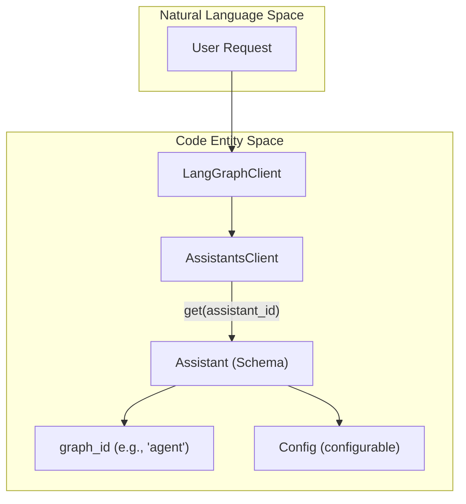
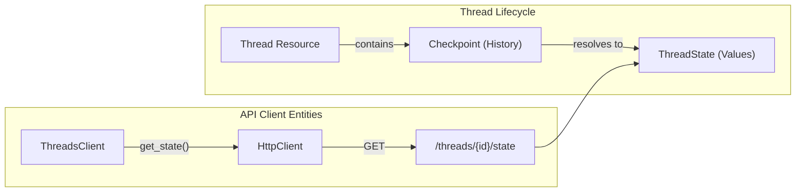

The LangGraph API organizes stateful agentic workflows around two primary resources: **Assistants** and **Threads**. Assistants represent reusable, versioned configurations of a graph (including its logic and parameters), while Threads represent specific stateful sessions or conversations that persist over time.

## Assistants

An **Assistant** is a resource that binds a specific graph (identified by `graph_id`) with a set of configurations, metadata, and optional specialized instructions. In the LangGraph ecosystem, the "Assistant" is the entity that a user interacts with.

### Assistant Resource Structure
The `Assistant` object contains the following key fields:
- `assistant_id`: The unique identifier for the assistant [libs/sdk-py/langgraph_sdk/schema.py:224-225]().
- `graph_id`: The identifier of the underlying compiled graph [libs/sdk-py/langgraph_sdk/schema.py:224-225]().
- `config`: A `Config` object containing `configurable` values used during graph execution [libs/sdk-py/langgraph_sdk/schema.py:185-206]().
- `metadata`: Key-value pairs for categorization or filtering [libs/sdk-py/langgraph_sdk/schema.py:240-241]().

### Managing Assistants
The `AssistantsClient` (and its synchronous counterpart `SyncAssistantsClient`) provides methods to manage these resources:
- **Get/Search**: Retrieve assistant details or search based on metadata and graph IDs [libs/sdk-py/langgraph_sdk/_async/assistants.py:45-88]().
- **Graph Inspection**: Retrieve the visual representation of the graph using `get_graph`, with support for `xray` mode to inspect subgraphs [libs/sdk-py/langgraph_sdk/_async/assistants.py:90-146]().
- **Schema Access**: Retrieve the input, output, and state schemas defined for the graph [libs/sdk-py/langgraph_sdk/_async/assistants.py:148-173]().

### Assistant Logic Flow
The following diagram illustrates how an Assistant acts as a configured instance of a Graph.

**Assistant to Code Entity Mapping**

Sources: [libs/sdk-py/langgraph_sdk/_async/assistants.py:28-43](), [libs/sdk-py/langgraph_sdk/schema.py:221-245]()

---

## Threads

A **Thread** represents a stateful session. It is the primary mechanism for persistence, allowing a graph to maintain its state (via checkpoints) across multiple separate requests.

### Thread State and Status
Threads transition through various statuses during their lifecycle:
- `idle`: No active processing [libs/sdk-py/langgraph_sdk/schema.py:37]().
- `busy`: Currently executing a run [libs/sdk-py/langgraph_sdk/schema.py:38]().
- `interrupted`: Execution paused (e.g., for human-in-the-loop) [libs/sdk-py/langgraph_sdk/schema.py:39]().
- `error`: An exception occurred during the last run [libs/sdk-py/langgraph_sdk/schema.py:40]().

### Thread Management Operations
The `ThreadsClient` handles the lifecycle of these sessions:
- **Creation**: Threads can be created with specific `thread_id` or metadata. They can also be initialized with `supersteps` to restore state from external sources [libs/sdk-py/langgraph_sdk/_async/threads.py:98-173]().
- **TTL (Time-to-Live)**: Threads can be configured with a TTL to automatically delete or prune old state [libs/sdk-py/langgraph_sdk/_async/threads.py:165-170]().
- **State Updates**: Users can manually update the state of a thread using `update_state`, which creates a new checkpoint [libs/sdk-py/langgraph_sdk/_async/threads.py:238-285]().

### Checkpoint History
Every transition in a thread's state is captured as a checkpoint.
- `get_history`: Returns a list of `ThreadState` objects representing the timeline of the thread [libs/sdk-py/langgraph_sdk/_async/threads.py:314-350]().
- `get_state`: Retrieves the current state or state at a specific `checkpoint_id` [libs/sdk-py/langgraph_sdk/_async/threads.py:195-236]().

**Thread Persistence and Checkpointing**

Sources: [libs/sdk-py/langgraph_sdk/_async/threads.py:27-41](), [libs/sdk-py/langgraph_sdk/schema.py:208-220]()

---

## Data Models and Schemas

The interaction between Assistants and Threads is governed by several key TypedDicts defined in `langgraph_sdk.schema`.

| Class | Description | Key Fields |
| :--- | :--- | :--- |
| `Assistant` | Configured graph instance | `assistant_id`, `graph_id`, `config`, `metadata` |
| `Thread` | Stateful session | `thread_id`, `status`, `metadata`, `values` |
| `ThreadState` | Snapshot of thread state | `values`, `next`, `checkpoint_id`, `metadata` |
| `Checkpoint` | Internal persistence marker | `thread_id`, `checkpoint_ns`, `checkpoint_id` |

Sources: [libs/sdk-py/langgraph_sdk/schema.py:208-250](), [libs/sdk-py/langgraph_sdk/schema.py:265-280]()

## Interaction Flow: Runs on Threads

While Assistants and Threads define the "who" and the "where", a **Run** defines the "action". To execute logic, a client creates a run by providing an `assistant_id` and a `thread_id`.

1.  **Selection**: The system fetches the graph and configuration from the **Assistant**.
2.  **Context**: The system loads the latest checkpoint from the **Thread**.
3.  **Execution**: The graph processes the input and updates the thread state.
4.  **Persistence**: A new checkpoint is saved back to the thread upon completion or interruption.

Sources: [libs/sdk-py/langgraph_sdk/_async/runs.py:55-67](), [libs/sdk-py/langgraph_sdk/_async/threads.py:30-33]()