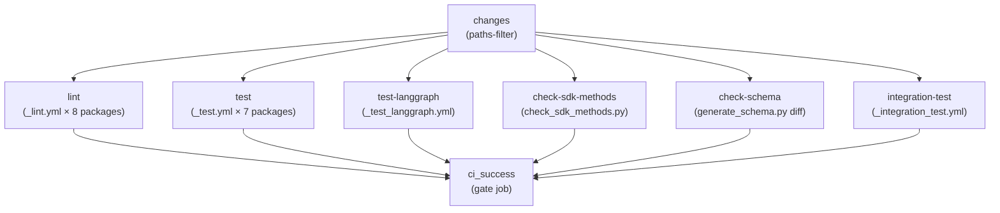
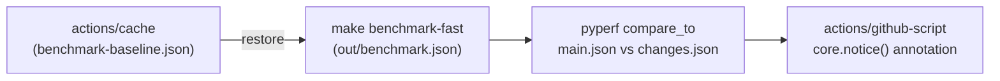
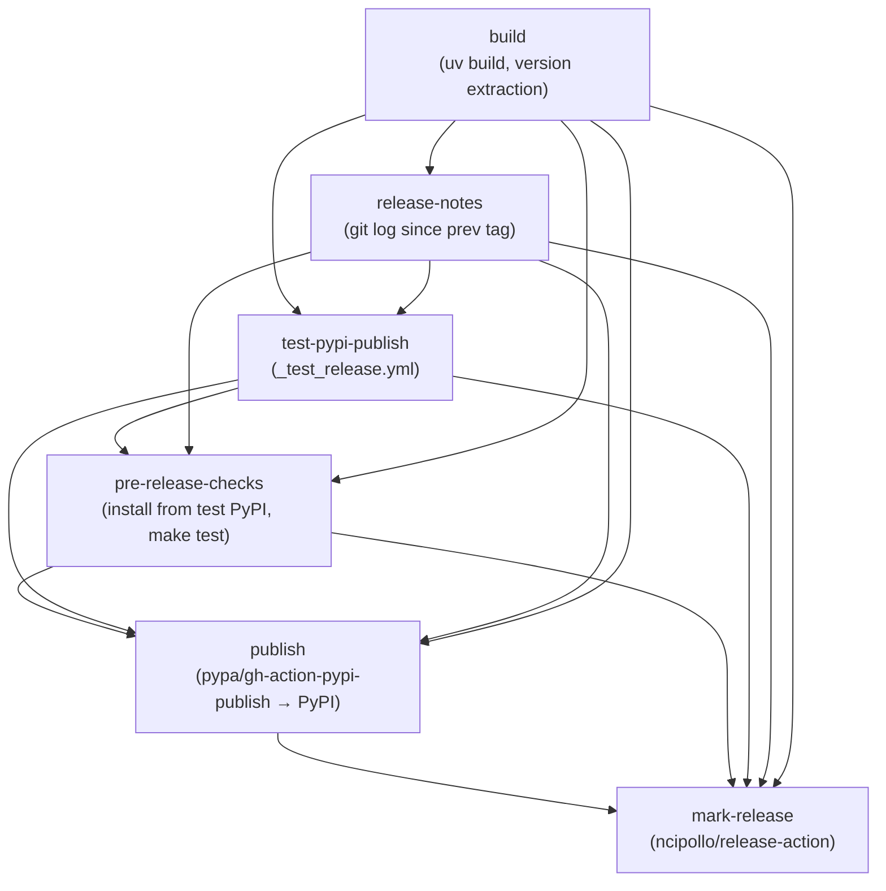
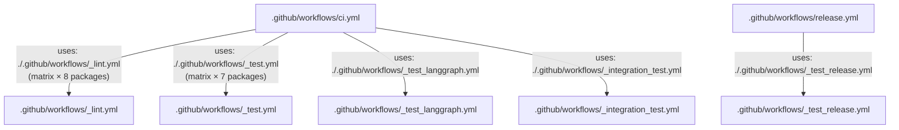

This page documents all GitHub Actions workflows in the LangGraph monorepo: the main CI pipeline, reusable job workflows, benchmarking pipelines, the weekly dependency lock upgrade, and the release workflow. For the release process itself (PyPI publishing, tagging, and release notes), see [9.4](). For test infrastructure details (fixtures, Docker services, conftest setup), see [9.2](). For the monorepo build system and `make` targets that these workflows invoke, see [9.1]().

---

## Workflow Inventory

All workflow files live under `.github/workflows/`. Filenames prefixed with `_` are reusable workflows, invoked via `workflow_call` from other workflows.

| File | Name | Trigger | Purpose |
|---|---|---|---|
| `ci.yml` | CI | `push` to `main`, `pull_request` | Orchestrates lint, test, schema and integration checks |
| `_lint.yml` | lint | `workflow_call` | Runs ruff and mypy per package |
| `_test.yml` | test | `workflow_call` | Runs `make test` per package across Python versions |
| `_test_langgraph.yml` | test | `workflow_call` | Runs `make test_parallel` for `libs/langgraph` specifically |
| `_integration_test.yml` | CLI integration test | `workflow_call` | Builds and smoke-tests Docker images via `langgraph build` |
| `bench.yml` | bench | `pull_request` on `libs/**` | Runs benchmarks and compares to baseline |
| `baseline.yml` | baseline | `push` to `main`, `workflow_dispatch` | Saves benchmark baseline to cache |
| `uv_lock_ugprade.yml` | UV Lock Upgrade | Weekly cron, `workflow_dispatch` | Runs `make lock-upgrade` and opens a PR |
| `release.yml` | release | `workflow_dispatch` | Full release pipeline (build → test PyPI → pre-check → publish → tag) |
| `_test_release.yml` | test-release | `workflow_call` | Builds and publishes to test PyPI |

Sources: [.github/workflows/ci.yml:1-10](), [.github/workflows/_lint.yml:1-10](), [.github/workflows/_test.yml:1-10](), [.github/workflows/_test_langgraph.yml:1-10](), [.github/workflows/_integration_test.yml:1-10](), [.github/workflows/bench.yml:1-10](), [.github/workflows/baseline.yml:1-10](), [.github/workflows/uv_lock_ugprade.yml:1-10](), [.github/workflows/release.yml:1-10]()

---

## Main CI Pipeline (`ci.yml`)

The CI workflow is the primary gate on all pull requests and pushes to `main`.

### Concurrency

A concurrency group keyed on `${{ github.workflow }}-${{ github.ref }}` ensures that if a new push arrives while CI is still running for the same branch, the older run is cancelled [.github/workflows/ci.yml:21-23]().

### Path Filtering (`changes` job)

The first job uses the `dorny/paths-filter` action to determine which areas of the repository changed [.github/workflows/ci.yml:26-50](). Two output flags control downstream jobs:

| Flag | Paths Watched |
|---|---|
| `python` | `libs/langgraph/**`, `libs/sdk-py/**`, `libs/cli/**`, `libs/checkpoint/**`, `libs/checkpoint-sqlite/**`, `libs/checkpoint-postgres/**`, `libs/checkpoint-conformance/**`, `libs/prebuilt/**` |
| `deps` | `**/pyproject.toml`, `**/uv.lock` |

Downstream jobs only run if `python == 'true'` or `deps == 'true'`, which prevents unnecessary work on documentation-only changes [.github/workflows/ci.yml:67]().

### Job Graph

**CI pipeline job dependency diagram:**

Sources: [.github/workflows/ci.yml:25-169]()

### `ci_success` Gate Job

The final `ci_success` job [.github/workflows/ci.yml:159-184]() always runs (via `if: always()`) and exits non-zero if any upstream job resulted in `failure` or `cancelled` [.github/workflows/ci.yml:176](). This provides a single required status check that branch protection rules can target, regardless of which jobs were skipped due to path filtering.

---

## Reusable Workflows

### `_lint.yml` — Per-Package Linting

Triggered via `workflow_call` with a `working-directory` input. Runs on Python 3.12 only (chosen to represent both min and max supported, balancing coverage with CI speed) [.github/workflows/_lint.yml:19-32]().

Steps:

1. **Changed-file detection** — uses `Ana06/get-changed-files` filtered to `${{ inputs.working-directory }}/**` [.github/workflows/_lint.yml:35-40](). Remaining steps are skipped if no files changed.
2. **Install lint deps** — `uv sync --frozen --group lint` [.github/workflows/_lint.yml:52]()
3. **mypy cache restore** — caches `.mypy_cache` keyed on `uv.lock` hash to speed up type checking [.github/workflows/_lint.yml:54-62]()
4. **`lint_package`** — runs `make lint_package` (falls back to `make lint` if target absent) [.github/workflows/_lint.yml:64-73]()
5. **Install test lint deps** — `uv sync --group lint` (adds test deps for type-checking test files) [.github/workflows/_lint.yml:78]()
6. **mypy test cache restore** — separate `.mypy_cache_test` cache [.github/workflows/_lint.yml:80-88]()
7. **`lint_tests`** — runs `make lint_tests` (skipped if target absent) [.github/workflows/_lint.yml:90-98]()

The `RUFF_OUTPUT_FORMAT: github` environment variable causes ruff to emit inline PR annotations [.github/workflows/_lint.yml:16]().

Sources: [.github/workflows/_lint.yml:1-99]()

### `_test.yml` — Per-Package Tests

Triggered via `workflow_call` with a `working-directory` input. Runs a matrix across **Python 3.10, 3.11, 3.12, 3.13, 3.14** [.github/workflows/_test.yml:17-24]().

Steps:

1. **Docker Hub login** — authenticates to avoid pull rate limits (skipped on fork PRs) [.github/workflows/_test.yml:35-40]()
2. **Install deps** — `uv sync --frozen --group test --no-dev` [.github/workflows/_test.yml:45]()
3. **Run tests** — `make test` [.github/workflows/_test.yml:50]()
4. **Clean working tree check** — fails if tests created untracked files [.github/workflows/_test.yml:52-63]()

Sources: [.github/workflows/_test.yml:1-64]()

### `_test_langgraph.yml` — LangGraph-Specific Tests

Nearly identical to `_test.yml` but hardcoded to `libs/langgraph` and invokes `make test_parallel` instead of `make test` [.github/workflows/_test_langgraph.yml:46](), allowing parallelized pytest execution. It also includes a specific run for strict msgpack pregel tests on Python 3.13 [.github/workflows/_test_langgraph.yml:48-53]().

Sources: [.github/workflows/_test_langgraph.yml:1-66]()

---

## Schema and SDK Consistency Checks

### `check-sdk-methods`

Runs the script `.github/scripts/check_sdk_methods.py` [.github/workflows/ci.yml:102-114](). This verifies that methods defined in the SDK match those expected by the server API. It only runs if Python source files changed.

### `check-schema`

Generates the `langgraph.json` configuration schema via `uv run python generate_schema.py` inside `libs/cli`, then diffs the result against the committed `schemas/schema.json` [.github/workflows/ci.yml:116-150](). If the generated schema differs from the committed one, CI fails with instructions to regenerate and commit the file. Runs on Python 3.13 [.github/workflows/ci.yml:124]().

Sources: [.github/workflows/ci.yml:102-150]()

---

## CLI Integration Tests (`_integration_test.yml`)

This reusable workflow builds real Docker images using `langgraph build` and, when a `LANGSMITH_API_KEY` is available, runs the built containers against the LangGraph server API.

### Matrix

The matrix is two-dimensional: Python versions (3.10, 3.14) × example directories [.github/workflows/_integration_test.yml:13-33]():

| Example | Working Dir | Tag |
|---|---|---|
| A | `libs/cli/examples` | `langgraph-test-a` |
| B | `libs/cli/examples/graphs` | `langgraph-test-b` |
| C | `libs/cli/examples/graphs_reqs_a` | `langgraph-test-c` |
| D | `libs/cli/examples/graphs_reqs_b` | `langgraph-test-d` |

### Additional Builds (Example A only)

When the matrix entry is Example A, the workflow also builds:

- A JavaScript service from `libs/cli/js-examples` (tag `langgraph-test-e`) [.github/workflows/_integration_test.yml:76-80]()
- A JS monorepo service from `libs/cli/js-monorepo-example` with custom `--build-command` and `--install-command` (tag `langgraph-test-f`) [.github/workflows/_integration_test.yml:82-86]()
- A Python monorepo service from `libs/cli/python-monorepo-example` (tag `langgraph-test-g`) [.github/workflows/_integration_test.yml:88-92]()
- A pre-release requirements service from `libs/cli/examples/graph_prerelease_reqs` (tag `langgraph-test-h`) [.github/workflows/_integration_test.yml:103-107]()
- A pre-release failure scenario `libs/cli/examples/graph_prerelease_reqs_fail` expected to fail (tag `langgraph-test-i`) [.github/workflows/_integration_test.yml:134-138]()

The test runner script is `.github/scripts/run_langgraph_cli_test.py`, wrapped in a 60-second timeout [.github/workflows/_integration_test.yml:74]().

Sources: [.github/workflows/_integration_test.yml:1-139]()

---

## Benchmarking Workflows

### `baseline.yml` — Save Baseline

**Trigger:** Push to `main` or `workflow_dispatch`, when `libs/**` changes [.github/workflows/baseline.yml:1-8]().

Runs `make benchmark` in `libs/langgraph` and saves the output as `out/benchmark-baseline.json` to the Actions cache under a key of the form `${{ runner.os }}-benchmark-baseline-${{ env.SHA }}` [.github/workflows/baseline.yml:31-37](). This gives each `main` commit its own cached baseline.

### `bench.yml` — PR Comparison

**Trigger:** Pull requests touching `libs/**` [.github/workflows/bench.yml:4-6]().

**Benchmark comparison diagram:**

Steps [.github/workflows/bench.yml:17-71]():

1. Restore baseline from cache [.github/workflows/bench.yml:32-40]().
2. Run `make benchmark-fast` → writes `out/benchmark.json` [.github/workflows/bench.yml:41-48]().
3. Rename files and run `uv run pyperf compare_to out/main.json out/changes.json --table --group-by-speed` [.github/workflows/bench.yml:49-58]().
4. Post both raw results and the comparison table as PR annotations via `core.notice()` [.github/workflows/bench.yml:59-71]().

Sources: [.github/workflows/bench.yml:1-71](), [.github/workflows/baseline.yml:1-37]()

---

## Weekly Dependency Lock Upgrade (`uv_lock_ugprade.yml`)

**Trigger:** Cron at `0 0 * * 0` (midnight every Sunday UTC) or `workflow_dispatch` [.github/workflows/uv_lock_ugprade.yml:4-8]().

Runs `make lock-upgrade` at the repo root [.github/workflows/uv_lock_ugprade.yml:28](), which calls `uv lock --upgrade` across all Python packages. Then uses `peter-evans/create-pull-request` to open a PR on branch `deps/uv-lock-upgrade` with the label `dependencies` [.github/workflows/uv_lock_ugprade.yml:30-46]().

Sources: [.github/workflows/uv_lock_ugprade.yml:1-46]()

---

## Release Pipeline

The release workflow is documented in detail on page [9.4](). The section below covers only the structural relationship between workflow files and job sequencing.

### Job Sequence

**Release workflow job dependency diagram:**

### Permission Isolation

The `build` job runs with only `contents: read` [.github/workflows/release.yml:11-12](). The `test-pypi-publish` job requires `id-token: write` (for PyPI trusted publishing) [.github/workflows/release.yml:145-147](). These permissions are intentionally kept in separate jobs so that a compromised build step cannot access publishing credentials [.github/workflows/release.yml:37-47]().

### `_test_release.yml` Reusable Workflow

Called by the `test-pypi-publish` job in `release.yml` [.github/workflows/release.yml:148-151](). It builds the package with `uv build`, uploads to test PyPI using `pypa/gh-action-pypi-publish` with `repository-url: https://test.pypi.org/legacy/` [.github/workflows/_test_release.yml:84-90]().

Sources: [.github/workflows/release.yml:1-157](), [.github/workflows/_test_release.yml:1-98]()

---

## Reusable Workflow Pattern

All reusable workflows use `on: workflow_call` and accept a `working-directory` input. The main `ci.yml` invokes them with a strategy matrix to fan out across all packages.

**Reusable workflow call structure:**

Secrets are forwarded with `secrets: inherit` in every caller [.github/workflows/ci.yml:71](), so repository secrets (e.g. `DOCKERHUB_USERNAME`, `LANGSMITH_API_KEY`) are available to reusable workflows.

Sources: [.github/workflows/ci.yml:68-157](), [.github/workflows/release.yml:148-151]()

---

## Python Version Coverage Summary

| Workflow | Python Versions |
|---|---|
| `_lint.yml` | 3.12 only |
| `_test.yml` | 3.10, 3.11, 3.12, 3.13, 3.14 |
| `_test_langgraph.yml` | 3.10, 3.11, 3.12, 3.13, 3.14 |
| `_integration_test.yml` | 3.10, 3.14 |
| `bench.yml` | 3.11 |
| `baseline.yml` | 3.11 |
| `release.yml` | 3.11 |
| `_test_release.yml` | 3.10 |
| `uv_lock_ugprade.yml` | 3.10 |

Sources: [.github/workflows/_lint.yml:31](), [.github/workflows/_test.yml:20-24](), [.github/workflows/_test_langgraph.yml:15-19](), [.github/workflows/_integration_test.yml:18-19](), [.github/workflows/bench.yml:24](), [.github/workflows/baseline.yml:22](), [.github/workflows/release.yml:15](), [.github/workflows/_test_release.yml:12](), [.github/workflows/uv_lock_ugprade.yml:24]()