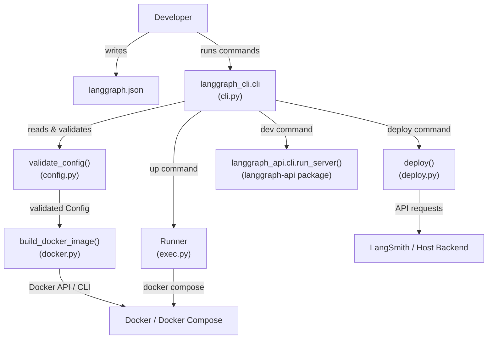
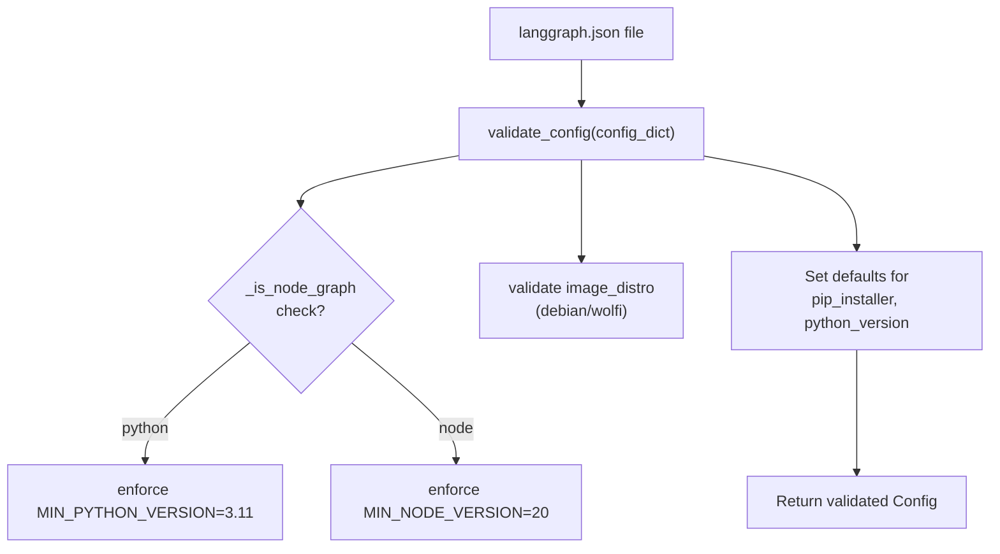
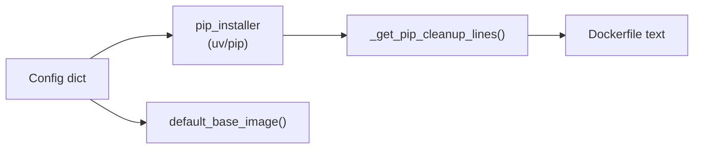
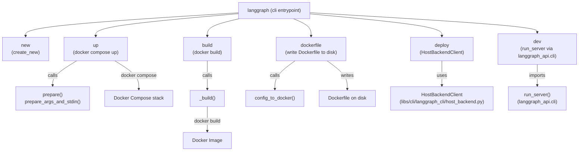
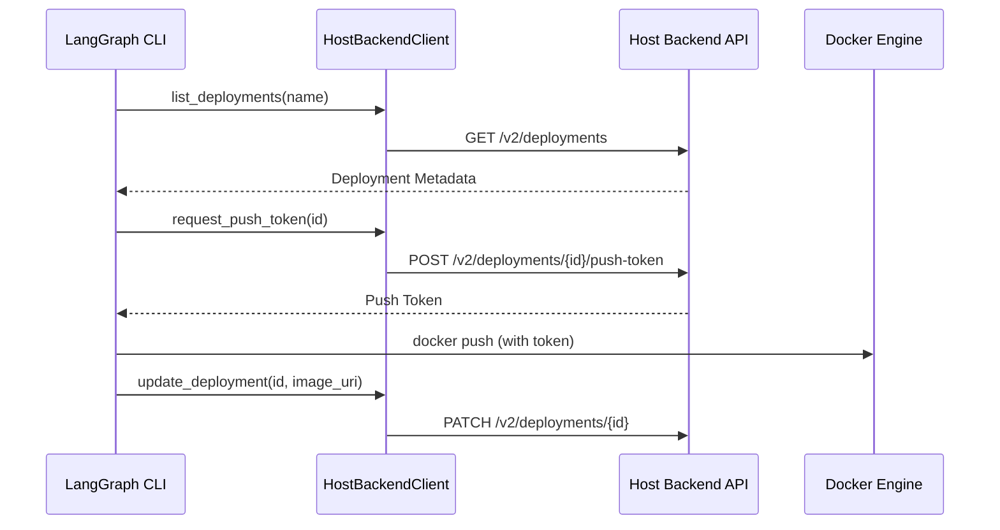

This page covers the `langgraph-cli` package: its purpose, the commands it exposes, how it reads a `langgraph.json` configuration file, and how it translates that configuration into Docker-based deployments or a local in-memory development server.

- For detailed documentation of each CLI command and its flags, see [CLI Commands](#6.1).
- For the full `langgraph.json` schema reference, see [Configuration System (langgraph.json)](#6.2).
- For Dockerfile generation internals, see [Docker Image Generation](#6.3).
- For Docker Compose orchestration, see [Multi-Service Orchestration](#6.4).
- For the `langgraph dev` in-memory server, see [Local Development Server](#6.5).
- For the Kafka-based distributed executor, see [Distributed Execution with Kafka](#6.6).
- For programmatic access to a deployed server, see [Client SDKs and Remote Execution](#5).

---

## Package Overview

The `langgraph-cli` package lives at `libs/cli/` and is installed as the `langgraph` command-line tool. Its entry point is declared in `libs/cli/pyproject.toml` [libs/cli/pyproject.toml:36-37]().

It depends on `click>=8.1.7`, `httpx>=0.24.0`, and `langgraph-sdk>=0.1.0` (for Python ≥ 3.11) [libs/cli/pyproject.toml:14-21](). For the in-memory development server, it requires the `[inmem]` extras group which pulls in `langgraph-api` and `langgraph-runtime-inmem` [libs/cli/pyproject.toml:24-28]().

| Extra group | Additional dependencies |
|---|---|
| *(none)* | `click`, `httpx`, `langgraph-sdk`, `pathspec`, `python-dotenv` |
| `[inmem]` | `langgraph-api>=0.5.35`, `langgraph-runtime-inmem>=0.7` |

Sources: [libs/cli/pyproject.toml:5-37]()

---

## Architectural Position

The CLI bridges local development and production deployment. It reads a `langgraph.json` file, validates it, and either launches a Docker Compose stack (for `up`/`build`/`dockerfile`) or starts an in-process server (for `dev`). It also facilitates deployments to LangSmith via the `deploy` command [libs/cli/langgraph_cli/cli.py:17-18]().

**CLI System Relationships**



Sources: [libs/cli/langgraph_cli/cli.py:1-23](), [libs/cli/langgraph_cli/config.py:152-212](), [libs/cli/langgraph_cli/exec.py:19-20]()

---

## Commands at a Glance

The `cli` group is the root Click group defined in `langgraph_cli/cli.py` [libs/cli/langgraph_cli/cli.py:37](). It uses a `NestedHelpGroup` to display subcommands clearly [libs/cli/langgraph_cli/cli.py:178-203]().

| Command | Function | What it does |
|---|---|---|
| `langgraph new` | `create_new()` | Scaffold a new project from a template [libs/cli/langgraph_cli/cli.py:21]() |
| `langgraph dev` | `dev()` | Start an in-memory dev server with hot reload [libs/cli/README.md:25-35]() |
| `langgraph up` | `up()` | Build and launch full Docker Compose stack [libs/cli/README.md:37-47]() |
| `langgraph build` | `build_docker_image()` | Build a tagged Docker image [libs/cli/langgraph_cli/cli.py:18]() |
| `langgraph dockerfile` | `dockerfile()` | Generate a Dockerfile for custom deployments [libs/cli/README.md:58-63]() |
| `langgraph deploy` | `deploy()` | Deploy the project to LangSmith [libs/cli/langgraph_cli/cli.py:17]() |

Sources: [libs/cli/langgraph_cli/cli.py:17-23](), [libs/cli/README.md:17-63]()

---

## Configuration File (`langgraph.json`)

Every command requires a configuration file (default: `./langgraph.json`). The file is loaded and validated by `validate_config()` in `config.py` [libs/cli/langgraph_cli/config.py:152]().

### Key Top-Level Fields

| Field | Type | Required | Description |
|---|---|---|---|
| `graphs` | `dict` | **Yes** | Mapping from graph ID to implementation path [libs/cli/langgraph_cli/config.py:201]() |
| `dependencies` | `list[str]` | **Yes** | Array of dependencies for the server [libs/cli/langgraph_cli/config.py:199]() |
| `python_version` | `str` | No | Defaults to `3.11` [libs/cli/langgraph_cli/config.py:50]() |
| `node_version` | `str` | No | Required for JS/TS graphs; defaults to `20` [libs/cli/langgraph_cli/config.py:17]() |
| `image_distro` | `str` | No | Distro for the base image (e.g., `debian`, `wolfi`) [libs/cli/langgraph_cli/config.py:198]() |
| `env` | `str \| dict` | No | Path to `.env` file or inline key-value mapping [libs/cli/langgraph_cli/config.py:202]() |
| `dockerfile_lines` | `list[str]` | No | Additional lines to append to the generated Dockerfile [libs/cli/langgraph_cli/config.py:200]() |
| `pip_installer` | `str` | No | One of `auto`, `pip`, or `uv` [libs/cli/langgraph_cli/config.py:195]() |

Sources: [libs/cli/langgraph_cli/config.py:16-212](), [libs/cli/langgraph_cli/cli.py:41-101]()

---

## Config Validation Flow

The validation logic ensures that the specified Python or Node versions meet minimum requirements and that mandatory fields like `graphs` and `dependencies` are present [libs/cli/langgraph_cli/config.py:152-165](). It also detects whether the project contains Python or Node.js graphs based on file extensions [libs/cli/langgraph_cli/config.py:126-141]().

**Config Validation Pipeline**



Sources: [libs/cli/langgraph_cli/config.py:49-52](), [libs/cli/langgraph_cli/config.py:152-212]()

---

## Docker Image Generation

The CLI generates Dockerfiles that include a cleanup phase to remove build tools like `pip`, `setuptools`, and `wheel` unless explicitly kept [libs/cli/langgraph_cli/config.py:58-70](). It also supports `uv` as a high-performance installer [libs/cli/langgraph_cli/config.py:92-95]().

**Dockerfile Generation Data Flow**



Sources: [libs/cli/langgraph_cli/config.py:58-101](), [libs/cli/tests/unit_tests/test_config.py:15-28]()

---

## Multi-Service Orchestration

The `langgraph up` command supports an `engine-runtime-mode` option, which can be `combined_queue_worker` (default) or `distributed` [libs/cli/langgraph_cli/cli.py:165-170](). In `distributed` mode, the system uses separate executor and orchestrator containers, often coordinated via Kafka [libs/cli/langgraph_cli/cli.py:169-170]().

Users can also provide a custom `docker-compose.yml` via the `--docker-compose` flag to launch additional services alongside the LangGraph API [libs/cli/langgraph_cli/cli.py:29-40]().

Sources: [libs/cli/langgraph_cli/cli.py:29-40](), [libs/cli/langgraph_cli/cli.py:165-170]()

# CLI Commands


This page documents all commands provided by the `langgraph-cli` package, covering their options, arguments, and typical usage. The CLI is the primary interface for running, building, and scaffolding LangGraph deployments.

For the `langgraph.json` configuration format consumed by these commands, see page [6.2](). For how the Dockerfile is generated from configuration, see page [6.3](). For the Docker Compose multi-service orchestration behavior, see page [6.4](). For the in-memory development server internals, see page [6.5]().

---

## Overview

The `langgraph` CLI is installed as a script entry point from the `langgraph-cli` package [libs/cli/pyproject.toml:36-37](). It is implemented as a Click group defined in `langgraph_cli.cli:cli` [libs/cli/langgraph_cli/cli.py:214-215]().

The CLI supports the following primary commands:

| Command | Purpose |
|---|---|
| `langgraph new` | Scaffold a new project from a template |
| `langgraph dev` | Run API server locally with hot reloading (no Docker) |
| `langgraph up` | Launch full Docker Compose stack |
| `langgraph build` | Build a Docker image for deployment |
| `langgraph dockerfile` | Write a Dockerfile (and optionally docker-compose.yml) to disk |
| `langgraph deploy` | Deploy a project to LangGraph Cloud/Host Backend |

**Installation:**

```bash
pip install langgraph-cli          # up/build/dockerfile/new only
pip install "langgraph-cli[inmem]" # also enables: langgraph dev
```

The `inmem` extras group adds `langgraph-api` and `langgraph-runtime-inmem` as dependencies [libs/cli/pyproject.toml:24-28]().

---

## Command Flow Diagram

**CLI Command Dispatch and Data Flow**



Sources: [libs/cli/langgraph_cli/cli.py:214-220](), [libs/cli/langgraph_cli/host_backend.py:19-43]()

---

## `langgraph new`

Creates a new project directory from a template.

```bash
langgraph new [PATH] [--template TEMPLATE]
```

**Arguments and Options:**

| Parameter | Type | Description |
|---|---|---|
| `PATH` | argument (optional) | Target directory for the new project |
| `--template` | string option | Template name (see `TEMPLATE_HELP_STRING`) |

Implemented by the `new` function, which delegates to `create_new` from `langgraph_cli.templates` [libs/cli/langgraph_cli/cli.py:21]().

Sources: [libs/cli/langgraph_cli/cli.py:21]()

---

## `langgraph dev`

Runs the LangGraph API server in-process (no Docker) with hot reloading. Requires the `inmem` extras.

**Behavior:**

1. Validates the config file via `validate_config_file`.
2. Raises an error if the config specifies a `node_version` as JS graphs are not supported in the in-memory server.
3. Adds the current working directory and local dependency paths to `sys.path` to ensure graph code is importable.
4. Calls `run_server` imported from `langgraph_api.cli`.

Sources: [libs/cli/pyproject.toml:24-28]()

---

## `langgraph deploy`

Deploys the project to a remote LangGraph host backend.

```bash
langgraph deploy [DEPLOYMENT_NAME] [OPTIONS]
```

**Key Features:**
- **Deployment Resolution:** Resolves existing deployments by name or ID.
- **Environment Management:** Resolves secrets from `.env` or `langgraph.json`, filtering out reserved variables.
- **Push Token Auth:** Requests a temporary push token to authenticate with the registry [libs/cli/langgraph_cli/host_backend.py:107-111]().
- **Log Streaming:** Monitors build and deployment logs in real-time [libs/cli/langgraph_cli/host_backend.py:180-199]().

**Host Backend Interaction**



Sources: [libs/cli/langgraph_cli/host_backend.py:73-136](), [libs/cli/langgraph_cli/host_backend.py:19-43]()

---

## `langgraph up`

Launches the full production-like Docker Compose stack: the LangGraph API service, a PostgreSQL database (with `pgvector`), and Redis.

**Behavior:**

1. Calls `prepare()`, which validates the config and generates Docker Compose YAML via `prepare_args_and_stdin()`.
2. Generates an inline Dockerfile if no image is provided, including automatic installation of local dependencies.
3. Monitors the startup sequence and prints the ready URL once the API reports "Application startup complete".

Sources: [libs/cli/langgraph_cli/cli.py:29-170]()

---

## Config File Validation

All commands that accept `--config` call `validate_config()` from `langgraph_cli.config`. This function enforces strict schema rules:

- **Python Version:** Must be `>=3.11`. Defaults to `3.11` if Python graphs are detected [libs/cli/langgraph_cli/config.py:49-50]().
- **Node Version:** Must be major version only. Defaults to `20` if Node.js graphs are detected [libs/cli/langgraph_cli/config.py:16-17]().
- **Distro:** Supports `debian` (default) and `wolfi` [libs/cli/langgraph_cli/config.py:52]().
- **Security Warning:** If `image_distro` is not `wolfi`, the CLI issues a security recommendation to switch to Wolfi Linux for enhanced security [libs/cli/langgraph_cli/util.py:10-27]().

Sources: [libs/cli/langgraph_cli/config.py:152-211](), [libs/cli/langgraph_cli/util.py:10-27]()

---

## Internal Helper Functions

### `prepare_args_and_stdin()`
This function is the core of the `up` command. It constructs the Docker Compose arguments and the dynamic YAML configuration passed via stdin.

- **Service Mapping:** Configures `langgraph-api`, `langgraph-postgres`, and `langgraph-redis`.
- **Volume Management:** Sets up `langgraph-data` for persistent PostgreSQL storage.
- **Debugger Integration:** Optionally injects the `langgraph-debugger` service if a port is provided.

Sources: [libs/cli/tests/unit_tests/cli/test_cli.py:51-171]()

### `HostBackendClient`
A minimal JSON HTTP client used for remote deployment operations.

- **Authentication:** Uses `X-Api-Key` and optional `X-Tenant-ID` headers [libs/cli/langgraph_cli/host_backend.py:31-36]().
- **Retries:** Implements automatic retries via `httpx.HTTPTransport(retries=3)` [libs/cli/langgraph_cli/host_backend.py:30]().

Sources: [libs/cli/langgraph_cli/host_backend.py:19-43]()