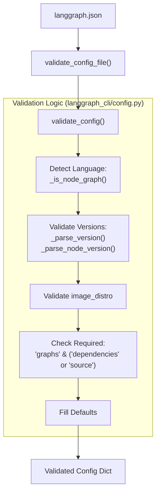
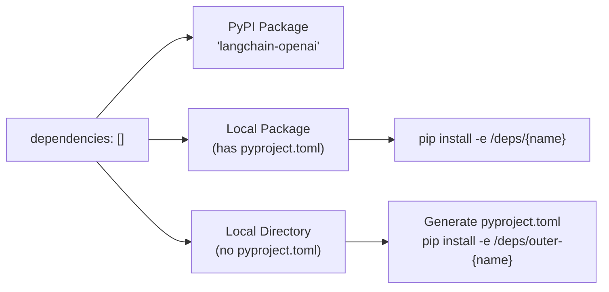

The `langgraph.json` configuration file is the central control mechanism for LangGraph CLI commands. It declares dependencies, graph definitions, runtime settings, and deployment parameters used by `langgraph build`, `langgraph up`, `langgraph dev`, and `langgraph deploy` to construct Docker images and configure the LangGraph API server.

For information about CLI commands that consume this configuration, see [6.1](). For information about the Dockerfile generation process, see [6.3]().

---

## Configuration File Structure

The `langgraph.json` file uses a JSON structure with required and optional fields. The configuration is loaded and validated by `validate_config_file()` and `validate_config()` functions in `langgraph_cli/config.py`.

### Required Fields

| Field | Type | Description |
|-------|------|-------------|
| `dependencies` | `array[string]` | Package dependencies. Can be PyPI names (e.g., `"langchain_openai"`) or local paths starting with `"."` (e.g., `"./my_package"`). Required unless `source` is provided [libs/cli/langgraph_cli/config.py:199](). |
| `graphs` | `object` | Mapping from graph ID to graph location. Values are strings in format `"./path/to/file.py:attribute"` or objects with a `path` key [libs/cli/langgraph_cli/config.py:201](). |

### Optional Fields

| Field | Type | Default | Description |
|-------|------|---------|-------------|
| `python_version` | `string` | `"3.11"` | Python version: `"3.11"`, `"3.12"`, or `"3.13"`. Must be `major.minor` [libs/cli/langgraph_cli/config.py:49-50](). |
| `node_version` | `string` | `"20"` | Node.js major version (e.g., `"20"`). Detected if `.ts`/`.js` files are used [libs/cli/langgraph_cli/config.py:16-17](). |
| `pip_installer` | `string` | `"auto"` | Package installer: `"auto"`, `"pip"`, or `"uv"` [libs/cli/langgraph_cli/config.py:195](). |
| `pip_config_file` | `string` | `null` | Path to pip configuration file [libs/cli/langgraph_cli/config.py:194](). |
| `base_image` | `string` | `null` | Custom base Docker image [libs/cli/langgraph_cli/config.py:197](). |
| `image_distro` | `string` | `"debian"` | Base image distribution: `"debian"`, `"wolfi"`, or `"bookworm"` [libs/cli/langgraph_cli/config.py:52](). |
| `dockerfile_lines` | `array[string]` | `[]` | Additional Dockerfile instructions [libs/cli/langgraph_cli/config.py:200](). |
| `env` | `string \| object` | `{}` | Path to `.env` file or object mapping env vars [libs/cli/langgraph_cli/config.py:202](). |
| `auth` | `object` | `null` | Authentication configuration [libs/cli/langgraph_cli/config.py:204](). |
| `encryption` | `object` | `null` | Encryption configuration [libs/cli/langgraph_cli/config.py:205](). |
| `checkpointer` | `object` | `null` | Checkpointer configuration [libs/cli/langgraph_cli/config.py:209](). |
| `store` | `object` | `null` | Store configuration (TTL, indexing) [libs/cli/langgraph_cli/config.py:203](). |
| `http` | `object` | `null` | HTTP app configuration (custom routes, CORS) [libs/cli/langgraph_cli/config.py:206](). |
| `keep_pkg_tools` | `bool \| array` | `null` | Retain packaging tools (`pip`, `setuptools`, `wheel`) in final image [libs/cli/langgraph_cli/config.py:214](). |

**Sources:** [libs/cli/langgraph_cli/config.py:14-214](), [libs/cli/schemas/schema.json:12-195](), [libs/cli/langgraph_cli/schemas.py:83-200]()

---

## Configuration Loading and Validation Flow

The CLI validates the configuration to ensure compatibility with the LangGraph API server.

### Validation Sequence



**Validation Rules:**
1. **Python Version:** Must be `major.minor` format and ≥ 3.11 [libs/cli/langgraph_cli/config.py:104-111]().
2. **Node Version:** Must be major version only (e.g., `"20"`) [libs/cli/langgraph_cli/config.py:113-123]().
3. **Bullseye Deprecation:** The CLI explicitly blocks `bullseye` images as they are deprecated [libs/cli/tests/unit_tests/test_config.py:229-237]().
4. **Language Detection:** If any graph path ends in `.ts`, `.js`, etc., `node_version` is required [libs/cli/langgraph_cli/config.py:126-141]().

**Sources:** [libs/cli/langgraph_cli/config.py:104-307](), [libs/cli/langgraph_cli/config.py:309-349]()

---

## Dependency Management

The `dependencies` field determines how local code and external packages are bundled into the container.

### Dependency Types



### LocalDeps Assembly
The function `_assemble_local_deps` processes the list and identifies:
- **`real_pkgs`**: Directories with `pyproject.toml`, `setup.py`, or `requirements.txt` [libs/cli/langgraph_cli/config.py:431-456]().
- **`faux_pkgs`**: Raw directories. The CLI generates a minimal `pyproject.toml` for these to make them installable [libs/cli/langgraph_cli/config.py:469-495]().

**Sources:** [libs/cli/langgraph_cli/config.py:352-525](), [libs/cli/tests/unit_tests/test_config.py:425-690]()

---

## Graph Specification

Graphs are the primary entry points for the application.

### Path Resolution
The CLI translates local paths (relative to `langgraph.json`) into container paths. This is handled by `_update_graph_paths()` [libs/cli/langgraph_cli/config.py:528-626]().

**String Format:**
```json
{
  "graphs": {
    "agent": "./src/my_agent.py:graph"
  }
}
```

**Object Format:**
```json
{
  "graphs": {
    "agent": {
      "path": "./src/my_agent.py:graph",
      "description": "Multi-agent supervisor"
    }
  }
}
```

The format `<file_path>:<attribute>` allows the server to import the compiled `StateGraph` or `@entrypoint` object [libs/cli/langgraph_cli/cli.py:52-53]().

**Sources:** [libs/cli/langgraph_cli/config.py:528-626](), [libs/cli/langgraph_cli/cli.py:41-92]()

---

## JSON Schema and IDE Support

The CLI includes a schema generator `generate_schema.py` that produces `schema.json`. This schema provides autocompletion and validation in IDEs like VS Code [libs/cli/generate_schema.py:1-7]().

### Key Schema Definitions
- **`Config`**: The top-level object [libs/cli/schemas/schema.json:4-10]().
- **`StoreConfig`**: Configures long-term memory, including `IndexConfig` for semantic search [libs/cli/langgraph_cli/schemas.py:83-107]().
- **`CheckpointerConfig`**: Configures state persistence and `SerdeConfig` for serialization [libs/cli/langgraph_cli/schemas.py:127-195]().
- **`HttpConfig`**: Configures custom routes and `CorsConfig` [libs/cli/langgraph_cli/schemas.py:202-206]().

**Sources:** [libs/cli/schemas/schema.json:1-195](), [libs/cli/generate_schema.py:135-199](), [libs/cli/langgraph_cli/schemas.py:9-200]()

---

## Environment Variables

The `env` field defines the runtime environment for the graph.

| Type | Example |
|------|---------|
| **Object** | `"env": {"OPENAI_API_KEY": "sk-..."}` [libs/cli/langgraph_cli/cli.py:78-90]() |
| **File** | `"env": "./.env"` [libs/cli/langgraph_cli/cli.py:73]() |

The CLI merges these into the container's environment, but filters out "reserved" keys that are managed by the deployment platform (e.g., `POSTGRES_URI`) to prevent accidental overrides [libs/cli/langgraph_cli/cli.py:41-86]().

**Sources:** [libs/cli/langgraph_cli/cli.py:41-101](), [libs/cli/langgraph_cli/config.py:202]()

---

## Build Customization

The configuration allows fine-grained control over the Docker build process.

### Build Tool Cleanup
By default, the CLI removes build dependencies (`pip`, `setuptools`, `wheel`) from the final image to minimize size and attack surface [libs/cli/langgraph_cli/config.py:63-70]().
- **`keep_pkg_tools: true`**: Retains all tools.
- **`keep_pkg_tools: ["pip"]`**: Retains only `pip`.

### Custom Docker Instructions
The `dockerfile_lines` array allows injecting raw Dockerfile commands (e.g., `RUN apt-get update && apt-get install -y ffmpeg`) immediately after the base image import [libs/cli/langgraph_cli/cli.py:57]().

**Sources:** [libs/cli/langgraph_cli/config.py:58-101](), [libs/cli/langgraph_cli/config.py:214](), [libs/cli/langgraph_cli/cli.py:41-92]()