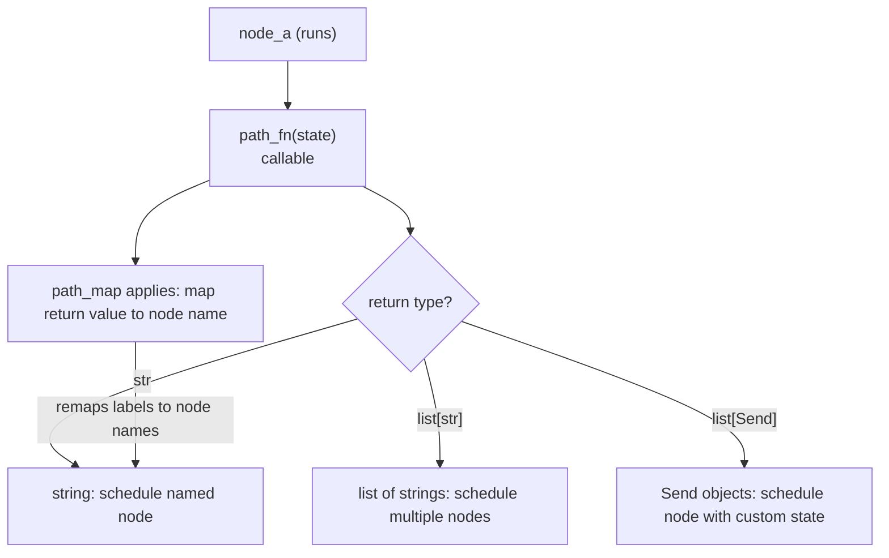
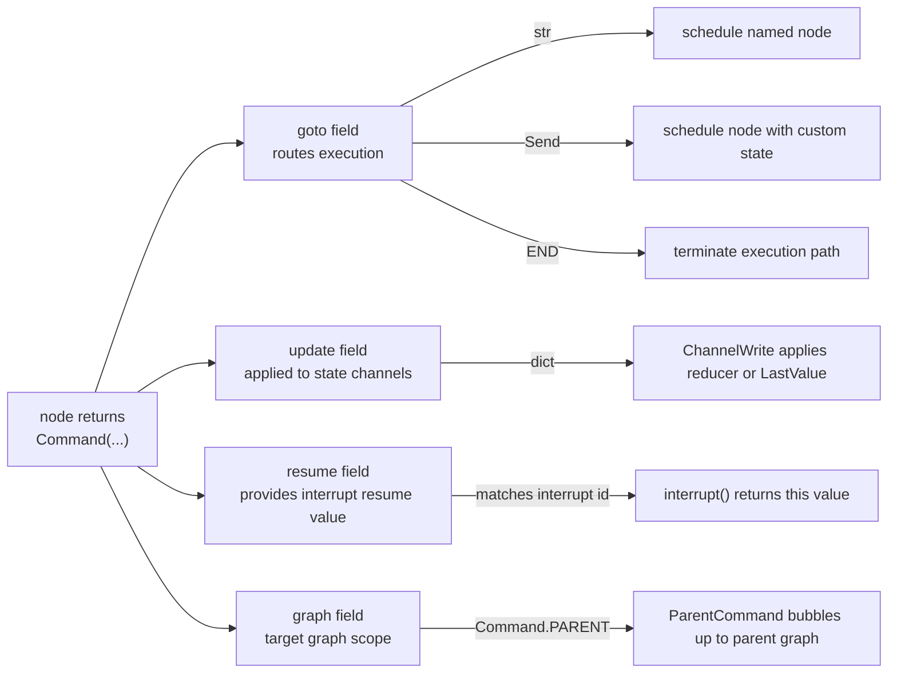

This page documents the mechanisms that control execution order in LangGraph graphs: the `START`/`END` constants, static and conditional edges, the `Send` API for dynamic fan-out, and the `Command` type for combined routing and state updates. For how nodes are executed once routing is resolved, see [3.3 Pregel Execution Engine](). For human-in-the-loop patterns that use `interrupt()` and `Command(resume=...)`, see [3.7 Human-in-the-Loop and Interrupts]().

---

## START and END Constants

`START` and `END` are interned string sentinels that represent the graph's virtual entry and exit points. They are never executed as nodes; they are only used as endpoints in edge declarations.

| Constant | Value | Purpose |
|---|---|---|
| `START` | `"__start__"` | Virtual entry node; source of edges from the graph's input |
| `END` | `"__end__"` | Virtual exit node; any edge to `END` terminates that execution path |

**Source:** [libs/langgraph/langgraph/constants.py:28-31]()

Nodes and edges are always declared relative to these sentinels:

```python
from langgraph.graph import START, END, StateGraph

builder = StateGraph(State)
builder.add_edge(START, "my_node")
builder.add_edge("my_node", END)
```

---

## Static Edges

`StateGraph.add_edge(source, dest)` declares an unconditional dependency: after `source` completes, `dest` is always scheduled. Multiple outgoing static edges from the same node cause the targets to run in the same superstep (in parallel).

```python
builder.add_edge(START, "a")   # run "a" first
builder.add_edge("a", "b")     # run "b" after "a"
builder.add_edge("a", "c")     # also run "c" after "a" (parallel with "b")
```

Running two nodes with a static edge from the same source means both will execute in the same superstep. If both write to the same `LastValue` channel, an `InvalidUpdateError` is raised [libs/langgraph/langgraph/graph/state.py:119-120]() — use a `BinaryOperatorAggregate` channel or `Topic` channel if multiple writers are expected (see [3.4 State Management and Channels]()).

---

## Conditional Edges

`StateGraph.add_conditional_edges(source, path, path_map=None)` allows routing decisions to be made at runtime. The `path` argument is a callable that receives the current graph state and returns one of:

- A single node name string
- A list of node name strings (fan-out)
- A `Send` object
- A list of `Send` objects
- A mixed list of strings and `Send` objects

**Source:** [libs/langgraph/langgraph/graph/state.py:183-191]()

**Diagram: Conditional Edge Resolution**



**Sources:** [libs/langgraph/langgraph/graph/state.py:183-191](), [libs/langgraph/langgraph/types.py:76-76](), [libs/langgraph/tests/test_pregel.py:1105-1128]()

### Path Functions

The path function receives the full graph state and returns a routing decision. The return value is matched against node names registered in the graph.

```python
def route(state: State) -> Literal["node_b", "node_c"]:
    if state["condition"]:
        return "node_b"
    return "node_c"

builder.add_conditional_edges("node_a", route)
```

### Path Maps (Labeled Edges)

`path_map` provides a mapping from the function's return values to actual node names. This is useful for labeled edges in graph visualizations, or when the return values are symbolic rather than exact node names.

```python
builder.add_conditional_edges(
    "agent",
    route,
    path_map={"continue": "tools", "exit": END}
)
```

In the rendered graph, the edge labels (`"continue"`, `"exit"`) appear as dashed arrow annotations.

**Source:** [libs/langgraph/langgraph/graph/state.py:183-191]()

### Conditional Entry Point

`StateGraph.set_conditional_entry_point(path, path_map=None)` is equivalent to `add_conditional_edges(START, path, path_map)`. It defines routing from the graph's input to its first node(s).

```python
builder.set_conditional_entry_point(lambda _: ["node_a", "node_b"])  # fan-out from input
```

**Source:** [libs/langgraph/tests/test_pregel.py:752-755](), [libs/langgraph/tests/test_pregel_async.py:534-535]()

---

## The Send API

`Send` allows a conditional edge function to schedule a node with a *custom state* that differs from the current graph state. This is the primary mechanism for dynamic fan-out (the "map" step in map-reduce workflows).

**Class definition:** [libs/langgraph/langgraph/types.py:289-301]()

| Attribute | Type | Description |
|---|---|---|
| `node` | `str` | Name of the target node to schedule |
| `arg` | `Any` | The state value to pass to that node invocation |

```python
from langgraph.types import Send

def fan_out(state: OverallState):
    return [Send("worker", {"item": x}) for x in state["items"]]

builder.add_conditional_edges(START, fan_out)
```

Each `Send` creates an independent task. Multiple `Send` objects returned from the same edge function execute concurrently in the next superstep.

**Diagram: Map-Reduce with Send API**

```mermaid
flowchart TD
    INPUT["START"]
    FANOUT["fan_out(state)\nadd_conditional_edges(START, fan_out)"]
    W1["worker task\nSend(\"worker\", {\"item\": items[0]})"]
    W2["worker task\nSend(\"worker\", {\"item\": items[1]})"]
    W3["worker task\nSend(\"worker\", {\"item\": items[2]})"]
    REDUCE["aggregate node\nadd_edge(\"worker\", \"aggregate\")"]
    OUTPUT["END"]

    INPUT --> FANOUT
    FANOUT -->|"Send"| W1
    FANOUT -->|"Send"| W2
    FANOUT -->|"Send"| W3
    W1 --> REDUCE
    W2 --> REDUCE
    W3 --> REDUCE
    REDUCE --> OUTPUT
```

**Sources:** [libs/langgraph/langgraph/types.py:289-301](), [libs/langgraph/tests/test_pregel.py:1105-1128](), [libs/langgraph/tests/test_pregel_async.py:914-942]()

### Send Inside Conditional Edge Functions

`Send` can be mixed with plain string node names in the same return value:

```python
def start(state: State) -> list[Send | str]:
    return ["tool_two", Send("tool_one", state)]
```

This schedules `tool_two` with the normal graph state and `tool_one` with the explicitly provided state.

**Source:** [libs/langgraph/tests/test_pregel_async.py:915-916]()

---

## The Command Type

`Command` is a dataclass that allows a node to simultaneously update graph state **and** specify the next node(s) to run. This eliminates the need for a separate conditional edge when the routing decision is made inside the node itself.

**Class definition:** [libs/langgraph/langgraph/types.py:367-417]()

| Field | Type | Description |
|---|---|---|
| `goto` | `str \| Send \| Sequence[str \| Send]` | Node(s) to route to next |
| `update` | `Any \| None` | State update to apply (same format as a normal node return) |
| `resume` | `Any \| None` | Value to inject when resuming a paused `interrupt()` |
| `graph` | `str \| None` | Target graph (`None` = current, `Command.PARENT` = nearest parent) |

**Diagram: Command Type Fields and Their Effects**



**Sources:** [libs/langgraph/langgraph/types.py:367-417](), [libs/langgraph/langgraph/errors.py:111-115]()

### goto: Routing

```python
def node_a(state: State):
    return Command(goto="b", update={"foo": "bar"})

def node_b(state: State):
    return Command(goto=END, update={"bar": "baz"})
```

`goto` can also receive `Send` objects for dynamic fan-out:

```python
def node_a(state: State):
    return Command(goto=[Send("worker", {"item": x}) for x in state["items"]])
```

**Source:** [libs/langgraph/tests/test_pregel.py:139-155]()

### update: State Updates

`update` supports the same formats as a regular node return value:

- A `dict` keyed by state field names
- A list of `(field_name, value)` tuples
- A Pydantic or dataclass model instance (if the state schema uses one)

The update is processed by each field's reducer before the next superstep begins.

### resume: Resuming Interrupts

When `Command` is passed as the graph's *input* (rather than returned from a node), the `resume` field is used to provide values for pending `interrupt()` calls. The runtime matches resume values to interrupts by order.

```python