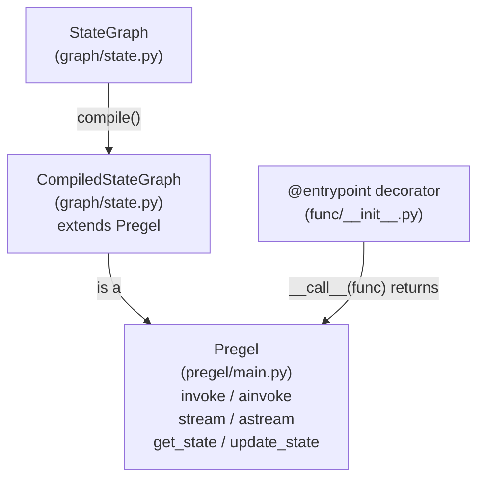

This page describes the architecture of the LangGraph core execution engine: the Pregel computational model, the two user-facing graph definition APIs, and how each internal component participates in running a graph. It covers the **what** and **why** at the system level.

For full API details on each subsystem, see the child pages:
- State schemas, `add_node`, `compile()` → [StateGraph API](#3.1)
- `@task` and `@entrypoint` → [Functional API (@task and @entrypoint)](#3.2)
- Superstep cycle internals → [Pregel Execution Engine](#3.3)
- Channel types and reducers → [State Management and Channels](#3.4)
- `Send`, `Command`, conditional edges → [Control Flow Primitives](#3.5)
- Graph composition and nested structures → [Graph Composition and Nested Graphs](#3.6)
- Interrupts and human-in-the-loop → [Human-in-the-Loop and Interrupts](#3.7)
- `RetryPolicy`, `CachePolicy` → [Error Handling and Retry Policies](#3.8), [Caching System](#3.10)
- Runtime and Dependency Injection → [Runtime and Dependency Injection](#3.9)

---

## Computational Model

LangGraph's execution engine is an implementation of the **Pregel / Bulk Synchronous Parallel (BSP)** model. In this model, a graph is composed of **actors** (nodes) that communicate exclusively through **channels** (shared state slots). Execution is divided into discrete **supersteps**. Within each superstep, no actor can observe another actor's writes — all writes from one superstep become visible at the start of the next.

Each superstep runs three sequential phases:

| Phase | Description | Key code |
|---|---|---|
| **Plan** | Determine which actors are eligible to run based on which channels were updated in the previous superstep. | `prepare_next_tasks()` in `pregel/_algo.py` |
| **Execute** | Run all selected actors concurrently. Each actor reads from its subscribed channels and writes its outputs. | `PregelRunner` in `pregel/_runner.py` |
| **Update** | Commit the actors' writes to channels, applying any reducers. | `apply_writes()` in `pregel/_algo.py` |

The loop continues until no actors are eligible (graph is done), a recursion limit is reached, or an interrupt occurs.

Sources: [libs/langgraph/langgraph/pregel/main.py:324-360](), [libs/langgraph/langgraph/pregel/_loop.py:140-200](), [libs/langgraph/langgraph/pregel/_algo.py:121-122]()

---

## Two Entry Points, One Runtime

Users can define graphs in two ways. Both ultimately produce a `Pregel` instance, which is the actual runtime object that supports `invoke`, `stream`, `ainvoke`, and `astream`.

**Diagram: Graph Definition APIs and Their Compiled Output**



Sources: [libs/langgraph/langgraph/graph/state.py:115-184](), [libs/langgraph/langgraph/func/__init__.py:238-300](), [libs/langgraph/langgraph/pregel/main.py:324-330](), [libs/langgraph/langgraph/graph/state.py:70-71]()

### StateGraph Path

`StateGraph` is a **builder** — it holds node and edge declarations but cannot execute anything directly. Calling `.compile()` validates the graph structure and returns a `CompiledStateGraph`, which subclasses `Pregel`. During compilation, `StateGraph` converts its nodes and channels into the internal `PregelNode` and `BaseChannel` objects that `Pregel` uses at runtime.

```python
# Example: StateGraph -> CompiledStateGraph (Pregel)
builder = StateGraph(State)
builder.add_node("my_node", my_func)
builder.add_edge(START, "my_node")
graph = builder.compile()        # returns CompiledStateGraph
graph.invoke({"key": "value"})   # runs via Pregel
```

Sources: [libs/langgraph/langgraph/graph/state.py:197-250](), [libs/langgraph/tests/test_pregel.py:87-117](), [libs/langgraph/langgraph/graph/state.py:115-130]()

### Functional API Path

The `@entrypoint` decorator wraps a Python function and directly constructs a `Pregel` instance. No explicit `StateGraph` construction is needed. Tasks declared with `@task` become `PregelNode` actors inside the Pregel graph created by `@entrypoint`.

```python