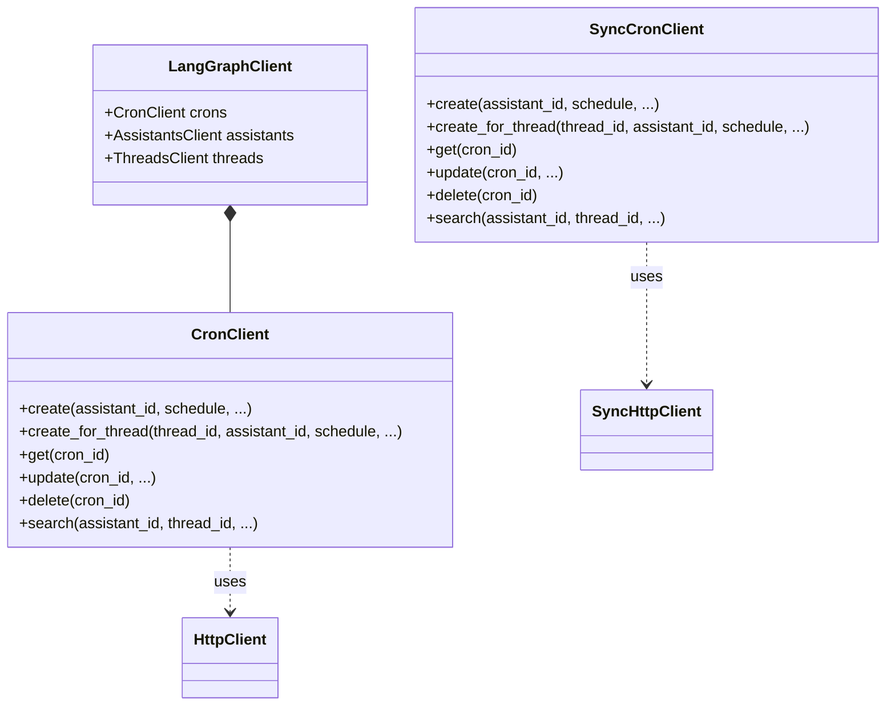

## Purpose and Scope

Cron jobs in LangGraph provide scheduled, recurring execution of assistants. This page documents the cron job data model, API operations, and SDK client methods for managing scheduled tasks via the `CronClient` and `SyncCronClient`. Cron jobs allow for both stateful execution (within a persistent thread) and stateless execution (creating a new thread per run).

**Sources**: [libs/sdk-py/langgraph_sdk/client.py:1-32](), [libs/sdk-py/langgraph_sdk/schema.py:166-177](), [libs/sdk-py/langgraph_sdk/schema.py:383-411]()

---

## Cron Data Model

The `Cron` resource represents a scheduled task. Key fields include:

| Field | Type | Description |
|-------|------|-------------|
| `cron_id` | `str` | Unique identifier for the cron job. |
| `assistant_id` | `str` | ID of the assistant to execute. |
| `thread_id` | `str \| None` | Optional thread ID for stateful execution. |
| `schedule` | `str` | Cron expression (e.g., `0 0 * * *`) defining the schedule. |
| `payload` | `dict` | Run parameters (input, config, etc.) passed to each execution. |
| `on_run_completed` | `OnCompletionBehavior \| None` | Action after completion (stateless only): `"delete"` or `"keep"`. |
| `end_time` | `datetime \| None` | Optional date to stop the recurring execution. |
| `next_run_date` | `datetime \| None` | The next scheduled execution timestamp. |
| `enabled` | `bool` | Whether the cron job is currently active. |
| `timezone` | `str \| None` | IANA timezone for the cron schedule. |

**Sources**: [libs/sdk-py/langgraph_sdk/schema.py:383-411](), [libs/sdk-py/langgraph_sdk/schema.py:97-102](), [libs/sdk-py/langgraph_sdk/_async/cron.py:105-105]()

---

## Cron Job Execution Model

The following diagram illustrates how the `CronClient` interacts with the LangGraph API to manage the lifecycle of scheduled runs.

### Natural Language to Code Entity Space: Execution Flow

```mermaid
graph TB
    subgraph "Client Space (langgraph-sdk)"
        CC["CronClient (async)"]
        SCC["SyncCronClient (sync)"]
        HC["HttpClient / SyncHttpClient"]
    end

    subgraph "API Space (langgraph-api)"
        Endpoint["POST /runs/crons"]
        ThreadEndpoint["POST /threads/{thread_id}/runs/crons"]
        Scheduler["Scheduler Service"]
    end

    subgraph "Resource Space"
        Asst["Assistant"]
        Thread["Thread (Optional)"]
        CronRec["Cron Record (schema.Cron)"]
    end

    CC -->|".create()"| HC
    SCC -->|".create()"| HC
    HC -->| "HTTP POST" | Endpoint
    HC -->| "HTTP POST" | ThreadEndpoint
    
    Endpoint --> CronRec
    ThreadEndpoint --> CronRec
    
    CronRec -->| "references" | Asst
    CronRec -->| "references" | Thread
    
    Scheduler -->| "watches" | CronRec
    Scheduler -->| "triggers" | Run["Run Execution (schema.Run)"]
```

**Sources**: [libs/sdk-py/langgraph_sdk/client.py:12-31](), [libs/sdk-py/tests/test_crons_client.py:34-62](), [libs/sdk-py/tests/test_crons_client.py:100-128](), [libs/sdk-py/langgraph_sdk/schema.py:383-411]()

---

## Stateful vs Stateless Crons

### Stateful Crons
Stateful crons execute within a persistent thread. This is useful for periodic check-ins or tasks that require historical context.
- **`thread_id`**: Must be provided during creation.
- **API Route**: `POST /threads/{thread_id}/runs/crons`
- **Method**: `CronClient.create_for_thread` [libs/sdk-py/langgraph_sdk/_async/cron.py:57-172]()

### Stateless Crons
Stateless crons trigger a run that is independent of a specific persistent thread (though a thread is created for the duration of the run).
- **`thread_id`**: Omitted.
- **`on_run_completed`**: Determines if the temporary thread is kept or deleted.
- **API Route**: `POST /runs/crons`
- **Method**: `CronClient.create` [libs/sdk-py/langgraph_sdk/_async/cron.py:174-279]()

**Sources**: [libs/sdk-py/tests/test_crons_client.py:34-62](), [libs/sdk-py/tests/test_crons_client.py:100-128](), [libs/sdk-py/langgraph_sdk/schema.py:390-391]()

---

## Schedule and Timezone Management

The `schedule` string follows standard cron syntax:
`minute hour day-of-month month day-of-week`

Schedules are interpreted in UTC by default unless a `timezone` is specified. The `timezone` parameter accepts IANA timezone strings (e.g., `'America/New_York'`) or `datetime.tzinfo` instances, which are resolved using the `_resolve_timezone` utility.

| Example | Meaning |
|---------|---------|
| `0 0 * * *` | Every day at midnight |
| `0 9 * * 1-5` | Every weekday at 9:00 AM |
| `*/15 * * * *` | Every 15 minutes |

**Sources**: [libs/sdk-py/langgraph_sdk/schema.py:396-397](), [libs/sdk-py/langgraph_sdk/_async/cron.py:105-105](), [libs/sdk-py/langgraph_sdk/_shared/utilities.py:10-11]()

---

## CronClient SDK Interface

The `CronClient` (async) and `SyncCronClient` (sync) provide the primary interface for managing these resources.

### Class Association Diagram



**Sources**: [libs/sdk-py/langgraph_sdk/client.py:12-31](), [libs/sdk-py/langgraph_sdk/client.py:33-55]()

### Key Methods

#### Create Cron
Creates a cron job for an assistant.
```python