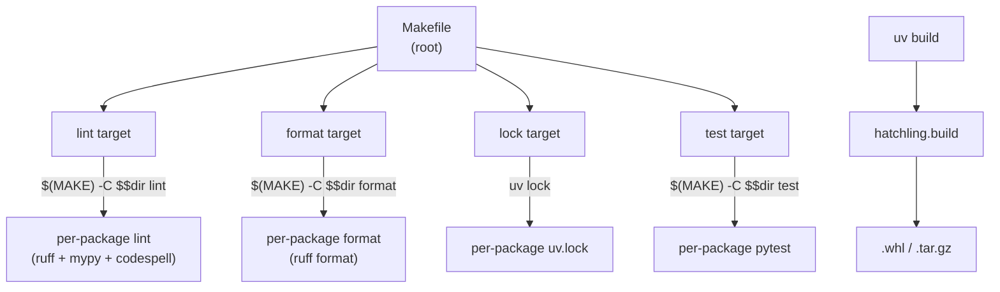
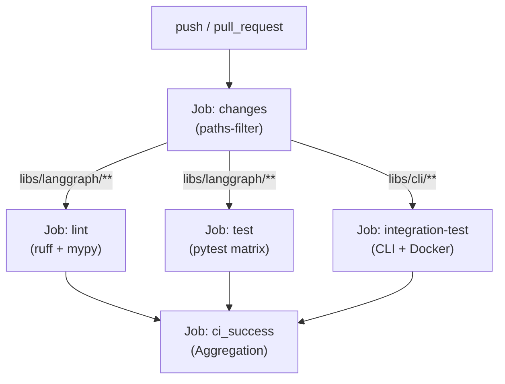

This page provides an overview of the tooling and automation that supports development across the LangGraph monorepo. It covers the monorepo organization, dependency management with `uv`, testing infrastructure, and the automated CI/CD pipelines.

For detailed information on individual topics, see:
- [Monorepo Structure and Build System](#9.1)
- [Testing Infrastructure](#9.2)
- [CI/CD Workflows](#9.3)
- [Release Process](#9.4)

---

## Repository Layout

All publishable packages live under the `libs/` directory. The root of the repository contains a top-level `Makefile` that orchestrates operations across every package.

```
langgraph/               ← repository root
├── Makefile             ← root orchestrator
└── libs/
    ├── langgraph/       ← core library [libs/langgraph/pyproject.toml:6]()
    ├── checkpoint/      ← base checkpoint interfaces
    ├── checkpoint-postgres/
    ├── checkpoint-sqlite/
    ├── checkpoint-conformance/ ← interface compliance tests
    ├── prebuilt/        ← prebuilt nodes and agents [libs/prebuilt/pyproject.toml:6]()
    ├── sdk-py/          ← Python SDK client
    └── cli/             ← Command line interface
```

Each package under `libs/` owns its own `Makefile`, `pyproject.toml`, and `uv.lock`. The root `Makefile` iterates over `libs/*` and delegates to each package's `Makefile`.

Sources: [libs/langgraph/pyproject.toml:1-33](), [libs/prebuilt/pyproject.toml:1-29]()

---

## Build System Overview

LangGraph uses [hatchling](https://hatch.pypa.io/latest/) as the build backend for its Python packages.

**Build System Diagram**



Sources: [libs/langgraph/pyproject.toml:1-3](), [libs/prebuilt/pyproject.toml:1-3]()

### Dependency Management

The monorepo leverages [`uv`](https://github.com/astral-sh/uv) for fast, reproducible dependency resolution.

- **Lock Files**: Each package maintains a standalone `uv.lock` file to ensure consistent environments [libs/langgraph/uv.lock:1](), [libs/prebuilt/uv.lock:1](), [libs/sdk-py/uv.lock:1]().
- **Local Sources**: Packages within the monorepo reference each other using relative paths in the `[tool.uv.sources]` section, enabling seamless local development [libs/langgraph/pyproject.toml:83-89](), [libs/prebuilt/pyproject.toml:64-68]().
- **Dependency Groups**: Development tools are organized into `test`, `lint`, and `dev` groups [libs/langgraph/pyproject.toml:45-80](), [libs/prebuilt/pyproject.toml:37-59]().

---

## Testing Infrastructure

LangGraph employs a comprehensive testing strategy using `pytest` and specialized fixtures to handle multiple persistence backends.

### Test Matrix and Fixtures

The testing infrastructure uses parameterized fixtures to run the same logic against different state managers (Checkpointers) and Stores.

| Component | Implementations Tested |
|---|---|
| **Checkpointers** | Memory, SQLite, SQLite (AES), Postgres (Pipe/Pool/Async) |
| **Stores** | In-Memory, Postgres (Pipe/Pool/Async) |
| **Caches** | SQLite, Memory, Redis |

Sources: [libs/langgraph/pyproject.toml:46-70](), [libs/prebuilt/pyproject.toml:38-50]()

### Benchmarking

Performance is tracked via `pyperf` to prevent regressions in core graph execution logic.

- **Baseline**: A baseline is maintained and stored in the GHA cache [/.github/workflows/bench.yml:32-40]().
- **Comparison**: PRs trigger a `benchmark-fast` run which is compared against the baseline using `pyperf compare_to` [/.github/workflows/bench.yml:41-58]().

---

## CI/CD Workflows

Automation is handled via GitHub Actions, focusing on change detection and validation.

**CI Execution Flow**



Sources: [/.github/workflows/ci.yml:26-50](), [/.github/workflows/ci.yml:159-183]()

### Key Workflow Features
- **Path Filtering**: The `changes` job ensures only modified packages are re-tested, saving CI minutes [/.github/workflows/ci.yml:31-50]().
- **Integration Testing**: The `_integration_test.yml` workflow builds real Docker images of LangGraph services using `langgraph build` and verifies them against a live LangSmith environment [/.github/workflows/_integration_test.yml:57-74]().
- **Schema Validation**: The CLI's configuration schema (`langgraph.json`) is automatically checked for drifts during CI [/.github/workflows/ci.yml:116-151]().

---

## Release Process

Releases are triggered manually via `workflow_dispatch` and follow a strict security-first "Trusted Publishing" model.

1. **Build**: Distribution files are built using `uv build` [/.github/workflows/release.yml:48-49]().
2. **TestPyPI**: Packages are first published to TestPyPI for verification [/.github/workflows/_test_release.yml:84-90]().
3. **Validation**: The published package is installed and imported in a clean environment to ensure no missing dependencies [/.github/workflows/release.yml:182-193]().
4. **Trusted Publishing**: Final release to PyPI uses OIDC tokens (`id-token: write`), removing the need for long-lived secrets [/.github/workflows/_test_release.yml:74]().

Sources: [/.github/workflows/release.yml:1-11](), [/.github/workflows/_test_release.yml:18-98]()