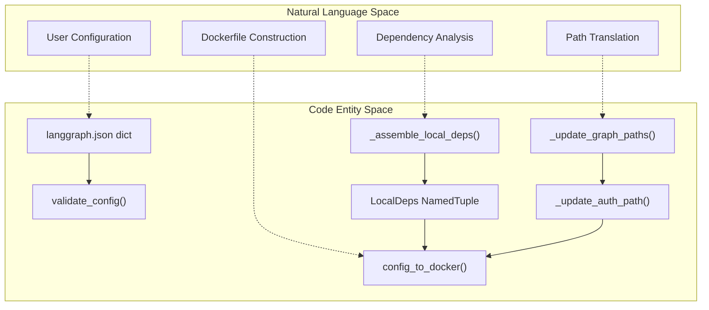
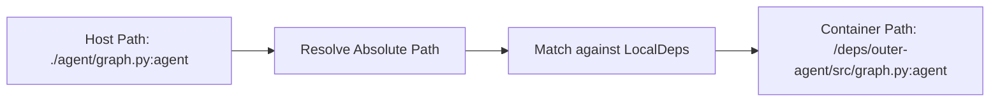

This document covers the Dockerfile generation system in the LangGraph CLI, which transforms a `langgraph.json` configuration into a deployable Docker image. The system analyzes local dependencies, generates appropriate build instructions, and produces a Dockerfile that can be used with `langgraph build` or `langgraph dockerfile` commands.

For information about the overall CLI command structure, see [CLI Commands (6.1)](). For configuration schema and validation, see [Configuration System (6.2)](). For local development workflows, see [Local Development Server (6.5)]().

## Overview

The Docker image generation system converts declarative configuration into imperative Docker build instructions. It handles several complex scenarios:

- **Local dependency packaging**: Distinguishes between Python packages with metadata (`pyproject.toml`/`setup.py`) and directories without, generating minimal packaging metadata for the latter.
- **Path rewriting**: Transforms host filesystem paths to container paths for graph definitions, authentication modules, and encryption handlers.
- **Multi-context builds**: Manages Docker build contexts when dependencies exist outside the configuration directory.
- **Package installer selection**: Chooses between `pip` and `uv` based on base image capabilities.
- **Cleanup optimization**: Removes build tools from final images to reduce size.

The primary entry point is `config_to_docker()` which orchestrates the entire generation process.

**Sources**: [libs/cli/langgraph_cli/config.py:1077-1077]()

## Configuration-to-Dockerfile Flow

The following diagram maps the natural language requirements of a build process to the specific code entities responsible for execution.

### Logic Flow: Natural Language to Code Entity Space



**Sources**: [libs/cli/langgraph_cli/config.py:152-190](), [libs/cli/langgraph_cli/config.py:311-317](), [libs/cli/langgraph_cli/config.py:487-510](), [libs/cli/langgraph_cli/config.py:1077-1077]()

## Local Dependency Classification

The system categorizes local dependencies (those starting with `.`) into three types:

| Type | Detection | Treatment | Container Path |
|------|-----------|-----------|----------------|
| **Real Package** | Contains `pyproject.toml` or `setup.py` | Direct pip install | `/deps/<name>` |
| **Faux Package** | No metadata files, has Python files | Generate minimal `pyproject.toml` | `/deps/outer-<name>/<name>` or `/deps/outer-<name>/src` |
| **Requirements File** | `requirements.txt` in faux package | Install before package | Copied alongside package |

### LocalDeps Structure

The `LocalDeps` NamedTuple encapsulates dependency analysis results:

```python
class LocalDeps(NamedTuple):
    pip_reqs: list[tuple[pathlib.Path, str]]  # (host_path, container_path)
    real_pkgs: dict[pathlib.Path, tuple[str, str]]  # host_path -> (dep_string, container_name)
    faux_pkgs: dict[pathlib.Path, tuple[str, str]]  # host_path -> (dep_string, container_path)
    working_dir: str | None  # If "." in dependencies
    additional_contexts: list[pathlib.Path]  # Dirs in parent directories
```

**Sources**: [libs/cli/langgraph_cli/config.py:311-317]()

### Real Package Handling

Real packages are copied directly and installed with pip/uv in editable mode. The CLI iterates through the `/deps` directory in the container to perform these installs.

**Sources**: [libs/cli/langgraph_cli/config.py:913-922]()

### Faux Package Handling

Faux packages require synthetic packaging metadata. The system generates a minimal `pyproject.toml` using `setuptools` as the backend.

**Flat vs Src Layout**: If `__init__.py` exists at the root, flat layout is used (`/deps/outer-<name>/<name>`). Otherwise, src layout is assumed (`/deps/outer-<name>/src`).

**Sources**: [libs/cli/langgraph_cli/config.py:441-483](), [libs/cli/langgraph_cli/config.py:893-913]()

## Path Rewriting System

Host filesystem paths in `langgraph.json` must be translated to container paths. The system rewrites four categories of paths to ensure the API server can locate code inside the image.

### Path Translation Mapping

| Source Config Key | Transformation Function | Code Pointer |
|-------------------|-------------------------|--------------|
| `graphs` | `_update_graph_paths()` | [libs/cli/langgraph_cli/config.py:487]() |
| `auth` | `_update_auth_path()` | [libs/cli/langgraph_cli/config.py:587]() |
| `encryption` | `_update_encryption_path()` | [libs/cli/langgraph_cli/config.py:628]() |
| `http.app` | `_update_http_app_path()` | [libs/cli/langgraph_cli/config.py:671]() |

### Path Resolution Logic



**Sources**: [libs/cli/langgraph_cli/config.py:487-722]()

## Package Installer Selection

The system supports `pip` and `uv` with automatic selection based on the base image version.

| Mode | Behavior |
|------|----------|
| `auto` | Use `uv` if base image version ≥ `0.2.47`, else `pip`. |
| `pip` | Force traditional `pip` installer. |
| `uv` | Force `uv` installer. |

The `_image_supports_uv` function performs regex matching on the base image tag to determine version compatibility.

**Sources**: [libs/cli/langgraph_cli/config.py:787-799](), [libs/cli/langgraph_cli/config.py:829-841]()

## Build Tool Cleanup

To minimize image size, the system removes build dependencies (pip, setuptools, wheel) unless explicitly kept via `keep_pkg_tools`.

### Cleanup Implementation

The `_get_pip_cleanup_lines` function generates the `RUN` commands for uninstallation. It specifically targets both standard Python site-packages and Wolfi-specific paths (`/usr/lib/python*/site-packages/`).

```python
def _get_pip_cleanup_lines(
    install_cmd: str,
    to_uninstall: tuple[str] | None,
    pip_installer: Literal["uv", "pip"],
) -> str:
    # ... logic to generate RUN pip uninstall and rm -rf ...
```

**Sources**: [libs/cli/langgraph_cli/config.py:58-101]()

## Multi-Platform and Distro Selection

The CLI supports generating images for different Linux distributions, with a default for Debian.

- **Default Distro**: `debian` [libs/cli/langgraph_cli/config.py:52]().
- **Python Versions**: Supports `3.11`, `3.12`, and `3.13` [libs/cli/langgraph_cli/config.py:49-50]().
- **Architecture**: For non-`x86_64` machines, the CLI requires Docker Buildx to cross-compile images for `linux/amd64` [libs/cli/langgraph_cli/docker.py:80-94]().

### Tag Generation Logic

The `docker_tag()` function constructs the final image tag based on the language runtime (Python vs Node.js), version, and distribution.

**Sources**: [libs/cli/langgraph_cli/config.py:1443-1480]()

## Node.js Support

If the `graphs` configuration points to `.js` or `.ts` files, the CLI switches to Node.js image generation.

- **Base Image**: `langchain/langgraphjs-api` [libs/cli/langgraph_cli/config.py:1127]().
- **Package Managers**: Supports `npm`, `yarn`, `pnpm`, and `bun` by detecting corresponding lock files [libs/cli/langgraph_cli/config.py:724-782]().

**Sources**: [libs/cli/langgraph_cli/config.py:126-143](), [libs/cli/langgraph_cli/config.py:1079-1257]()