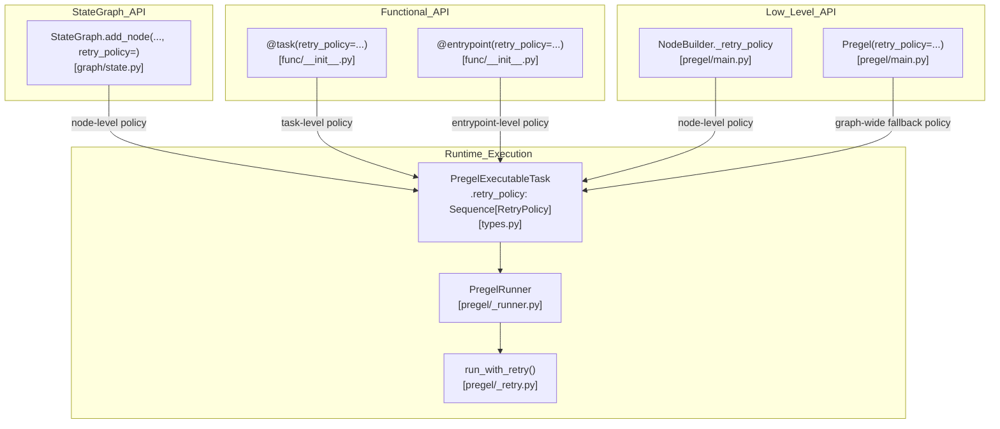
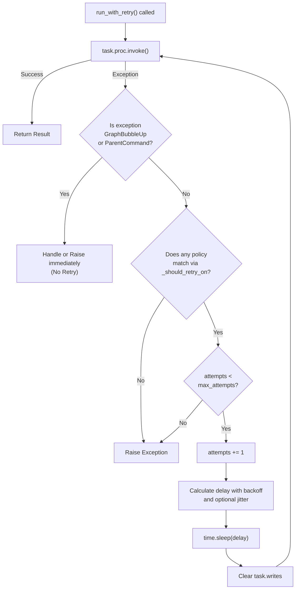

This page documents how LangGraph handles node-level errors, configures automatic retry behavior, and preserves partial execution state when failures occur. The focus is on the `RetryPolicy` type, how it attaches to nodes and tasks, the mechanics of backoff and retry execution, and the relationship between errors and checkpointing.

For human-in-the-loop interrupts (which use `GraphInterrupt` but are not errors), see [3.7](). For the checkpointing system that enables execution resumption, see [4.1]().

---

## RetryPolicy

`RetryPolicy` is a `TypedDict` defined in [libs/langgraph/langgraph/types.py:225-244]() that configures automatic retry behavior for a node or task.

| Field | Type | Default | Description |
|---|---|---|---|
| `initial_interval` | `float` | `0.5` | Seconds to wait before the first retry |
| `backoff_factor` | `float` | `2.0` | Multiplier applied to the interval after each retry |
| `max_interval` | `float` | `128.0` | Maximum seconds between retries |
| `max_attempts` | `int` | `3` | Total attempts, including the first |
| `jitter` | `bool` | `True` | Add random noise to the computed interval |
| `retry_on` | `type[Exception] | Sequence[type[Exception]] | Callable[[Exception], bool]` | `default_retry_on` | Filter determining which exceptions should trigger a retry |

The computed delay for attempt `n` (1-indexed, where 1 is the first retry) is implemented in `run_with_retry` [libs/langgraph/langgraph/pregel/_retry.py:168-177]():

```python
interval = min(
    policy.max_interval,
    policy.initial_interval * (policy.backoff_factor ** (attempts - 1)),
)
if policy.jitter:
    sleep_time = interval + random.uniform(0, 1)
```

### `retry_on` and `default_retry_on`

The `retry_on` field controls which exceptions are retried. It accepts a single exception class, a sequence, or a predicate function. The default value is `default_retry_on`. 

The logic for evaluating `retry_on` is handled by `_should_retry_on` [libs/langgraph/langgraph/pregel/_retry.py:20-22](). By default, it retries transient errors like `ConnectionError` and 5xx HTTP status codes from `httpx` or `requests`, while ignoring common programming errors like `ValueError`, `TypeError`, or `SyntaxError` [libs/langgraph/tests/test_retry.py:113-178](). Control-flow signals like `GraphInterrupt` and `ParentCommand` are never retried regardless of policy [libs/langgraph/langgraph/pregel/_retry.py:127-143]().

### Multiple Policies

Both `StateGraph.add_node` and `@task` accept `retry_policy: RetryPolicy | Sequence[RetryPolicy]`. When a sequence is provided, the execution loop iterates through them and applies the **first policy whose `retry_on` matches the exception** [libs/langgraph/langgraph/pregel/_retry.py:151-155]().

---

## Attaching Retry Policies

**RetryPolicy** can be attached at the graph/`Pregel` level, the node level, or the task (functional API) level.

### Diagram: RetryPolicy Attachment Points



Sources: [libs/langgraph/langgraph/types.py:225-244](), [libs/langgraph/langgraph/pregel/main.py:187-209](), [libs/langgraph/langgraph/pregel/_retry.py:86-90]()

#### `NodeBuilder` and `Pregel`
The `NodeBuilder` class maintains a list of retry policies for a specific node [libs/langgraph/langgraph/pregel/main.py:197](). During graph compilation, these are bundled into the `Pregel` instance, which also supports a global `retry_policy` that acts as a fallback for all nodes [libs/langgraph/langgraph/pregel/main.py:408]().

---

## Retry Execution Mechanics

`PregelRunner` orchestrates the execution of tasks. It calls `run_with_retry` (sync) or `arun_with_retry` (async) for each task [libs/langgraph/langgraph/pregel/_runner.py:167-180]().

### Execution Context and `ExecutionInfo`
Before a retry attempt, the system updates the `ExecutionInfo` in the `Runtime` object to track the attempt number (1-indexed) and the timestamp of the first attempt [libs/langgraph/langgraph/pregel/_retry.py:111-121](). This allows nodes to be aware of their own retry state via `runtime.execution_info.node_attempt` [libs/langgraph/langgraph/runtime.py:47-48]().

### Diagram: Retry Decision Flow



Sources: [libs/langgraph/langgraph/pregel/_retry.py:86-186](), [libs/langgraph/langgraph/runtime.py:47-52](), [libs/langgraph/tests/test_retry.py:180-210]()

### State Isolation during Retries
A critical feature of the retry mechanism is that it calls `task.writes.clear()` before every retry attempt [libs/langgraph/langgraph/pregel/_retry.py:124](). This ensures that partial writes from a failed attempt do not pollute the state when the node is re-run.

---

## Error Propagation and State

When a node fails (after all retries are exhausted), the error is not immediately lost. It is captured by the `PregelRunner` and committed via `self.commit(task, exception)` [libs/langgraph/langgraph/pregel/_runner.py:183]().

### Error Recording
The error is recorded as a write to the reserved `ERROR` channel [libs/langgraph/langgraph/_internal/_constants.py:78](). 
- If a checkpointer is present, the error is stored in `pending_writes` [libs/langgraph/langgraph/pregel/_algo.py:218-224]().
- The checkpoint itself is **not advanced** to a new version. The state remains at the beginning of the superstep that failed.

### Diagram: Error in Pending Writes

```mermaid
sequenceDiagram
    participant Loop as "SyncPregelLoop"
    participant Runner as "PregelRunner"
    participant Retry as "run_with_retry"
    participant CP as "BaseCheckpointSaver"

    Loop->>Runner: "tick(tasks)"
    Runner->>Retry: "Execute task_A"
    Retry-->>Runner: "Exception (Max retries reached)"
    Runner->>Runner: "commit(task_A, exc)"
    Runner->>Loop: "put_writes(task_id, [('__error__', exc)])"
    Loop->>CP: "put_writes(checkpoint_id, task_id, writes)"
    Note over CP: "Checkpoint version NOT incremented"
```

Sources: [libs/langgraph/langgraph/pregel/_runner.py:152-184](), [libs/langgraph/langgraph/pregel/_algo.py:218-224](), [libs/langgraph/langgraph/pregel/main.py:850-865]()

---

## Resumption After Failure

When a graph is resumed (e.g., by calling `invoke` again with the same `thread_id`), the `PregelLoop` checks for `pending_writes` in the latest checkpoint.

1. **Successful Tasks**: If a task in the failed superstep completed successfully before the failure of a sibling, its results are replayed from `pending_writes` [libs/langgraph/langgraph/pregel/_algo.py:71-82]().
2. **Failed Tasks**: Tasks that previously wrote an `ERROR` are re-scheduled for execution.
3. **Resuming Flag**: The configuration is patched with `CONFIG_KEY_RESUMING: True` [libs/langgraph/langgraph/pregel/_retry.py:185](), signaling to subgraphs that they should attempt to resume from their own internal checkpoints.

---

## Error Types Reference

| Class | Definition | Description |
|---|---|---|
| `GraphRecursionError` | [errors.py:111]() | Raised when the number of supersteps exceeds `recursion_limit`. |
| `InvalidUpdateError` | [errors.py:112]() | Raised when multiple nodes write to the same channel without a reducer. |
| `GraphBubbleUp` | [errors.py:141]() | Base class for exceptions that should bypass retries and stop the loop (e.g., Interrupts). |
| `ParentCommand` | [errors.py:127]() | Special exception used to send a `Command` to a parent graph from a nested subgraph [libs/langgraph/tests/test_parent_command.py:18-21](). |

### ParentCommand Handling
When a `ParentCommand` is raised within `run_with_retry`, the system checks if the command is intended for the current graph or needs to be "recast" for a higher-level parent by stripping the current namespace segment [libs/langgraph/langgraph/pregel/_retry.py:127-140](). This is supported by the utility `_checkpoint_ns_for_parent_command` [libs/langgraph/langgraph/pregel/_retry.py:57-83]().

---

## Checkpoint Errors

Errors during the checkpointing process itself (e.g., a database timeout in `SqliteSaver`) are not handled by `RetryPolicy`. These are considered infrastructure failures and propagate immediately to the caller, potentially crashing the execution loop to prevent state corruption [libs/langgraph/langgraph/pregel/_loop.py:132-135]().

Sources: [libs/langgraph/langgraph/pregel/_retry.py](), [libs/langgraph/langgraph/pregel/_runner.py](), [libs/langgraph/langgraph/pregel/_algo.py](), [libs/langgraph/langgraph/runtime.py](), [libs/langgraph/tests/test_retry.py]()