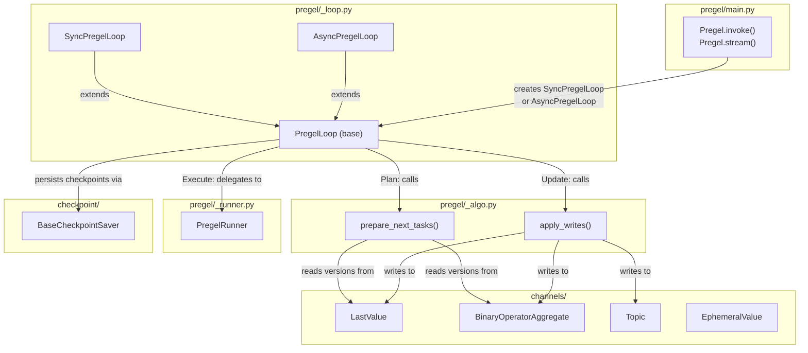
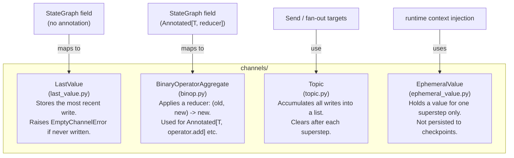
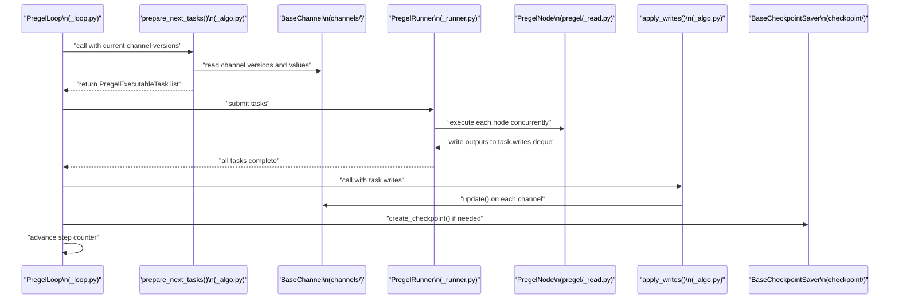
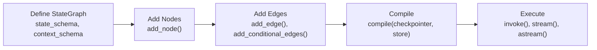
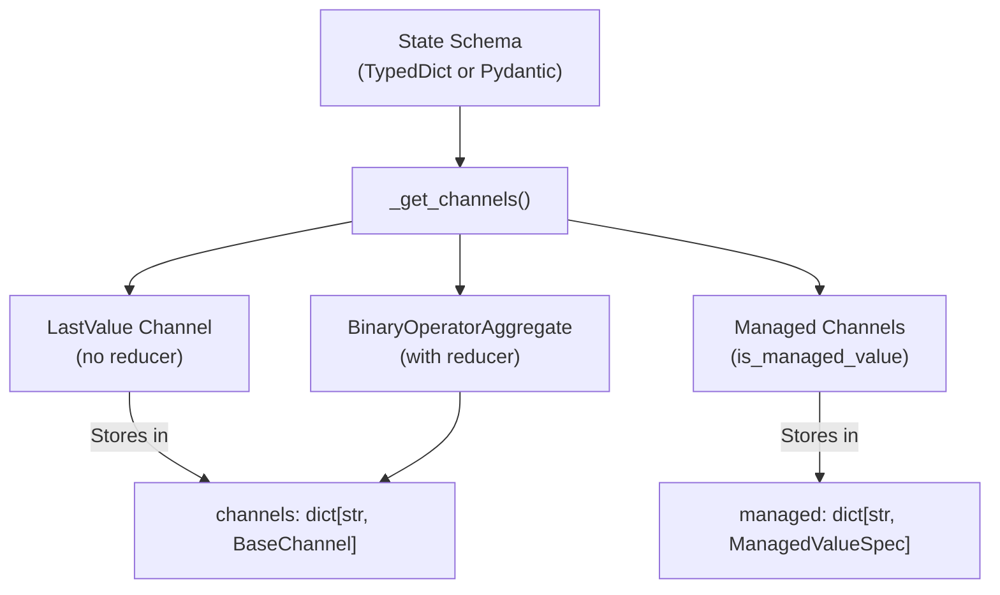
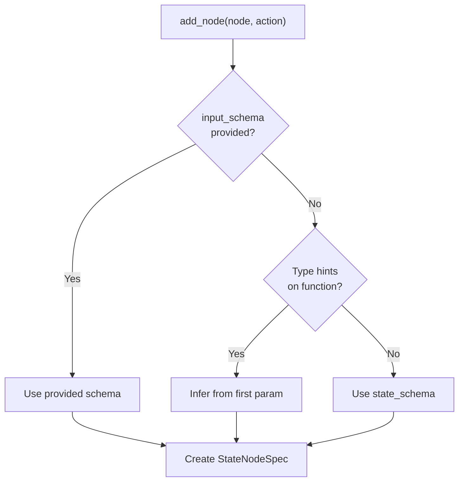
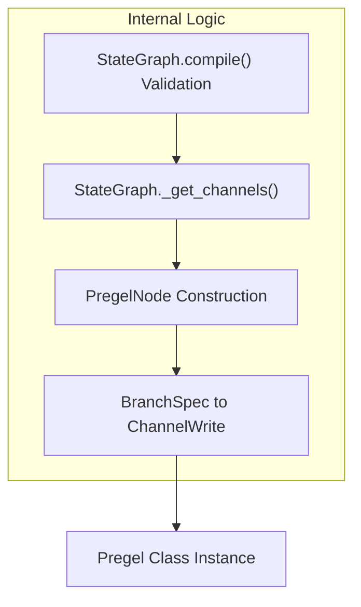
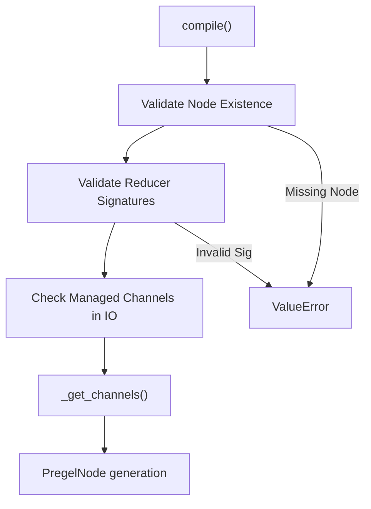

@task
def fetch_data(url: str) -> str: ...

@entrypoint(checkpointer=InMemorySaver())
def my_workflow(input: str) -> str:
    result = fetch_data(input).result()
    return result

my_workflow.invoke("http://...")   # my_workflow IS a Pregel instance
```

The `entrypoint` decorator internally uses `get_runnable_for_entrypoint` to map the function to the underlying Pregel structure.

Sources: [libs/langgraph/langgraph/func/__init__.py:127-190](), [libs/langgraph/langgraph/func/__init__.py:35-39](), [libs/langgraph/langgraph/func/__init__.py:47-80]()

---

## The Pregel Runtime

`Pregel` in [libs/langgraph/langgraph/pregel/main.py:324]() is the central runtime class. It holds:

| Attribute | Type | Purpose |
|---|---|---|
| `nodes` | `Mapping[str, PregelNode]` | All actor definitions |
| `channels` | `Mapping[str, BaseChannel]` | All communication channels |
| `input_channels` | `str \| Sequence[str]` | Which channels accept external input |
| `output_channels` | `str \| Sequence[str]` | Which channels produce final output |
| `checkpointer` | `BaseCheckpointSaver \| None` | Persistence layer |
| `interrupt_before` | `Sequence[str] \| All` | Node names to interrupt before |
| `interrupt_after` | `Sequence[str] \| All` | Node names to interrupt after |
| `retry_policy` | `RetryPolicy \| None` | Default retry behavior |
| `cache_policy` | `CachePolicy \| None` | Default caching behavior |

`Pregel` exposes the public execution interface: `invoke`, `ainvoke`, `stream`, `astream`, `batch`, `get_state`, `update_state`, `get_state_history`.

### NodeBuilder

`NodeBuilder` in [libs/langgraph/langgraph/pregel/main.py:179-322]() is a fluent builder for creating low-level `PregelNode` actors directly — used primarily in tests and advanced scenarios where a `StateGraph` is unnecessary.

```python
node = (
    NodeBuilder()
    .subscribe_only("input")   # read from channel "input"
    .do(my_func)               # run my_func
    .write_to("output")        # write result to channel "output"
    .build()                   # returns PregelNode
)
```

`StateGraph` creates `PregelNode` instances internally during `compile()`, so most users never use `NodeBuilder` directly.

Sources: [libs/langgraph/langgraph/pregel/main.py:179-322](), [libs/langgraph/langgraph/pregel/main.py:1-3]()

---

## Internal Execution Components

**Diagram: Runtime Component Relationships**



Sources: [libs/langgraph/langgraph/pregel/_loop.py:57-58](), [libs/langgraph/langgraph/pregel/_runner.py:57-58](), [libs/langgraph/langgraph/pregel/main.py:324-400](), [libs/langgraph/langgraph/pregel/_algo.py:121-122](), [libs/langgraph/langgraph/pregel/_algo.py:218-224]()

### PregelLoop

`PregelLoop` is the superstep controller. There are two concrete subclasses:

- `SyncPregelLoop` — used by `invoke` and `stream` [libs/langgraph/langgraph/pregel/_loop.py:57]()
- `AsyncPregelLoop` — used by `ainvoke` and `astream` [libs/langgraph/langgraph/pregel/_loop.py:58]()

The loop tracks:
- `step` — current superstep index
- `stop` — maximum allowed step (recursion limit)
- `tasks` — the set of `PregelExecutableTask` objects ready for the current superstep
- checkpoint management (reading initial state, writing after each step)
- interrupt handling (`interrupt_before`, `interrupt_after`)
- stream output emission

Sources: [libs/langgraph/langgraph/pregel/_loop.py:57-58](), [libs/langgraph/tests/test_pregel.py:57-58]()

### prepare_next_tasks

`prepare_next_tasks()` is called at the start of each superstep (Plan phase). It inspects which channels were updated in the previous superstep and returns the set of `PregelExecutableTask` objects whose trigger conditions are satisfied.

A `PregelExecutableTask` carries:
- `name` — node name
- `input` — the channel values the node receives
- `proc` — the `Runnable` to execute
- `writes` — a `deque` for collecting outputs
- `config` — `RunnableConfig` with injected context
- `retry_policy`, `cache_key`, `id`, `path`

Sources: [libs/langgraph/langgraph/types.py:74-80](), [libs/langgraph/langgraph/pregel/_algo.py:121-122](), [libs/langgraph/langgraph/types.py:140-166]()

### PregelRunner

`PregelRunner` executes a set of `PregelExecutableTask` objects concurrently (Execute phase). It:

- Runs sync tasks in a thread pool
- Runs async tasks with `asyncio`
- Applies retry logic from each task's `retry_policy`
- Checks the cache (via `CachePolicy`) before executing
- Cancels all running tasks if any task raises an unrecoverable error

Sources: [libs/langgraph/langgraph/pregel/_runner.py:57-58](), [libs/langgraph/tests/test_pregel.py:58](), [libs/langgraph/langgraph/pregel/_retry.py:86-91]()

### apply_writes

`apply_writes()` processes all the writes accumulated in `PregelExecutableTask.writes` (Update phase). It calls each channel's `update()` method with the new values, applying reducers where applicable. Conflicts (e.g., two nodes writing to the same `LastValue` channel in one superstep without a reducer) raise `InvalidUpdateError`.

Sources: [libs/langgraph/langgraph/errors.py:112-114](), [libs/langgraph/langgraph/pregel/_algo.py:218-224]()

---

## Channels

Channels are the shared state mechanism between nodes. Each state field maps to exactly one channel instance. Channels manage their own values across supersteps.

**Diagram: Channel Types and Their Semantics**



Sources: [libs/langgraph/langgraph/graph/state.py:49-56](), [libs/langgraph/langgraph/channels/last_value.py:52-53](), [libs/langgraph/langgraph/channels/binop.py:50-51](), [libs/langgraph/langgraph/channels/topic.py:46-47](), [libs/langgraph/langgraph/channels/ephemeral_value.py:51-52]()

---

## Key Types

These types from [libs/langgraph/langgraph/types.py]() appear throughout the execution system:

| Type | Purpose |
|---|---|
| `PregelExecutableTask` | Fully-constructed task ready for execution in one superstep. |
| `PregelTask` | Lightweight task info for state snapshots (`get_state()`). |
| `StateSnapshot` | The state of the graph at a given checkpoint (values, next nodes, tasks, interrupts). |
| `Send` | Routes to a node with custom input; enables dynamic fan-out. |
| `Command` | Combines a state update with a routing directive and/or an interrupt resume value. |
| `Interrupt` | Payload produced by the `interrupt()` function; surfaced to the caller. |
| `RetryPolicy` | Configures retry behavior: `max_attempts`, `backoff_factor`, `retry_on`. |
| `CachePolicy` | Configures result caching: `key_func`, `ttl`. |
| `StreamMode` | Selects what the stream emits: `"values"`, `"updates"`, `"messages"`, `"debug"`, `"custom"`, etc. |
| `Durability` | Controls when checkpoints are written: `"sync"`, `"async"`, or `"exit"`. |
| `StreamWriter` | Callable injected into nodes for `stream_mode="custom"` output. |

Sources: [libs/langgraph/langgraph/types.py:51-83](), [libs/langgraph/langgraph/types.py:118-138](), [libs/langgraph/langgraph/types.py:85-91]()

---

## Constants

`START` and `END` are special sentinel node names defined in [libs/langgraph/langgraph/constants.py:57-58]():

- `START = "__start__"` — the virtual entry node. Edges from `START` specify which real nodes run first.
- `END = "__end__"` — the virtual exit node. Edges to `END` mark a termination path.

Both are interned strings, safe to use in `add_edge(START, "my_node")` and `add_edge("my_node", END)`.

Sources: [libs/langgraph/langgraph/constants.py:57-58]()

---

## Data Flow Through a Single Superstep

**Diagram: Data Flow in One Superstep**



Sources: [libs/langgraph/langgraph/pregel/_loop.py:57-58](), [libs/langgraph/langgraph/pregel/_runner.py:57-58](), [libs/langgraph/langgraph/pregel/_algo.py:121-122](), [libs/langgraph/langgraph/pregel/_algo.py:218-224]()

---

## Relationship to the Persistence Layer

`Pregel` accepts an optional `checkpointer: BaseCheckpointSaver`. When present:

1. At the start of `invoke`/`stream`, `PregelLoop` calls `checkpointer.get_tuple()` to restore previous state.
2. After each superstep, the loop calls `checkpointer.put()` (for the full checkpoint) and `checkpointer.put_writes()` (for incremental task writes).
3. The `durability` parameter on `invoke`/`stream` controls how eagerly checkpoints are flushed: `"sync"` (before next step), `"async"` (in background), or `"exit"` (only when the graph exits).

Sources: [libs/langgraph/langgraph/types.py:85-91](), [libs/langgraph/tests/test_pregel.py:158-210](), [libs/langgraph/tests/test_pregel_async.py:92-112]()

# StateGraph API


The `StateGraph` API provides a declarative interface for defining workflows where nodes communicate through a shared state. Each node reads from and writes to state channels, with optional reducer functions controlling how updates are aggregated. This API is the primary entry point for building LangGraph applications.

For information about the compiled graph execution, see [Pregel Execution Engine](#3.3). For control flow mechanisms like `Command` and `Send`, see [Control Flow Primitives](#3.5). For the functional API alternative using `@task` and `@entrypoint` decorators, see [Functional API (@task and @entrypoint)](#3.2).

## Overview

`StateGraph` is a builder class that constructs a graph by:
1. Defining a state schema with optional reducer functions. [libs/langgraph/langgraph/graph/state.py:115-184]()
2. Adding nodes (computation units) that transform state. [libs/langgraph/langgraph/graph/state.py:359-572]()
3. Adding edges (routing) between nodes. [libs/langgraph/langgraph/graph/state.py:574-715]()
4. Compiling to a `CompiledStateGraph` (a `Pregel` instance) for execution. [libs/langgraph/langgraph/graph/state.py:782-1107]()

The graph communicates through channels derived from the state schema, with each state key mapping to a `BaseChannel` implementation that handles value storage and updates. [libs/langgraph/langgraph/graph/state.py:882-967]()

Sources: [libs/langgraph/langgraph/graph/state.py:115-184]()

## StateGraph Lifecycle

The lifecycle involves transitioning from a builder state to an executable `Pregel` instance.

Title: StateGraph construction and execution flow


Sources: [libs/langgraph/langgraph/graph/state.py:115-687](), [libs/langgraph/tests/test_pregel.py:87-121]()

## State Schema and Channels

The state schema defines the structure of shared state and how updates are aggregated. Each key in the schema maps to a `BaseChannel` implementation:

| Channel Type | Usage | Reducer Behavior |
|-------------|-------|-----------------|
| `LastValue` | Single value keys without reducers | Replaces previous value [libs/langgraph/langgraph/channels/last_value.py:1-53]() |
| `BinaryOperatorAggregate` | Keys with reducers (e.g., `operator.add`) | Aggregates values using reducer [libs/langgraph/langgraph/channels/binop.py:1-46]() |
| `Topic` | Multi-writer channels | Accumulates updates in sequence [libs/langgraph/langgraph/channels/topic.py:1-50]() |
| `EphemeralValue` | Temporary data | Not persisted to checkpoints [libs/langgraph/langgraph/channels/ephemeral_value.py:1-40]() |
| `UntrackedValue` | Non-snapshot data | Excluded from state snapshots [libs/langgraph/langgraph/channels/untracked_value.py:1-47]() |

Title: State schema to channel mapping


Sources: [libs/langgraph/langgraph/graph/state.py:257-288](), [libs/langgraph/langgraph/graph/state.py:882-967]()

## Class Definition

The `StateGraph` class maintains internal registries for nodes, edges, and branches before they are finalized during compilation.

```python
class StateGraph(Generic[StateT, ContextT, InputT, OutputT]):
    nodes: dict[str, StateNodeSpec[Any, ContextT]]
    edges: set[tuple[str, str]]
    branches: defaultdict[str, dict[str, BranchSpec]]
    channels: dict[str, BaseChannel]
    managed: dict[str, ManagedValueSpec]
    waiting_edges: set[tuple[tuple[str, ...], str]]
    
    def __init__(
        self,
        state_schema: type[StateT],
        context_schema: type[ContextT] | None = None,
        *,
        input_schema: type[InputT] | None = None,
        output_schema: type[OutputT] | None = None,
    )
```

**Type Parameters:**
- `StateT`: The state schema (TypedDict, Pydantic model, or dataclass) [libs/langgraph/langgraph/graph/state.py:195]()
- `ContextT`: Runtime context schema for run-scoped immutable data [libs/langgraph/langgraph/graph/state.py:196]()
- `InputT`: Input schema (defaults to `StateT`) [libs/langgraph/langgraph/graph/state.py:197]()
- `OutputT`: Output schema (defaults to `StateT`) [libs/langgraph/langgraph/graph/state.py:198]()

Sources: [libs/langgraph/langgraph/graph/state.py:115-250]()

## Adding Nodes

Nodes are computation units that receive state as input and return partial state updates. The `add_node` method handles registration of functions or `Runnable` objects into the graph's `nodes` dictionary. [libs/langgraph/langgraph/graph/state.py:359-572]()

**Input Schema Inference:**
If a node function has type hints, `StateGraph` attempts to infer the input schema from the first parameter using `get_type_hints`. [libs/langgraph/langgraph/graph/state.py:441-445]()

Title: Node input schema resolution


Sources: [libs/langgraph/langgraph/graph/state.py:359-572](), [libs/langgraph/tests/test_pregel.py:255-309]()

## Adding Edges

### Regular Edges
Regular edges define transitions between nodes. They are stored in the `edges` set or `waiting_edges` if multiple source nodes are provided. [libs/langgraph/langgraph/graph/state.py:574-626]()

**Edge Constraints:**
- `START` and `END` are virtual nodes used to mark boundaries. [libs/langgraph/langgraph/constants.py:28-31]()
- All referenced nodes must exist, which is validated during `compile()`. [libs/langgraph/langgraph/graph/state.py:804-814]()

### Conditional Edges
Conditional edges enable dynamic routing based on state or node output. They use `BranchSpec` to manage routing logic. [libs/langgraph/langgraph/graph/state.py:628-715]()

Sources: [libs/langgraph/langgraph/graph/state.py:574-715]()

## Compilation

The `compile` method transforms the builder into a `CompiledStateGraph`, which inherits from `Pregel`. [libs/langgraph/langgraph/graph/state.py:782-1107]()

Title: Compilation stages in Code Entity Space


**Compilation Parameters:**

| Parameter | Type | Description |
|-----------|------|-------------|
| `checkpointer` | `BaseCheckpointSaver` | Enables state persistence. [libs/langgraph/langgraph/graph/state.py:793]() |
| `store` | `BaseStore` | Cross-thread persistent memory. [libs/langgraph/langgraph/graph/state.py:794]() |
| `interrupt_before` | `list[str]` | Nodes to interrupt before execution. [libs/langgraph/langgraph/graph/state.py:795]() |
| `interrupt_after` | `list[str]` | Nodes to interrupt after execution. [libs/langgraph/langgraph/graph/state.py:796]() |

Sources: [libs/langgraph/langgraph/graph/state.py:782-1107](), [libs/langgraph/tests/test_pregel.py:87-121]()

## State Reducers

Reducers control how multiple updates to the same state key are aggregated. If a key is `Annotated` with a function, `StateGraph` creates a `BinaryOperatorAggregate` channel. [libs/langgraph/langgraph/graph/state.py:882-967]()

**Special Reducers:**
- `add_messages`: Merges message lists, handling ID deduplication. [libs/langgraph/langgraph/graph/message.py:52]()
- `operator.add`: Used for simple accumulation. [libs/langgraph/tests/test_pregel.py:186]()

Title: Channel selection logic in Code Entity Space
```mermaid
graph LR
    StateKey["State Schema Key"]
    HasAnnotated{Is Annotated?}
    IsManagedValue{is_managed_value()?}
    
    LastValueChan["LastValue"]
    BinOpChan["BinaryOperatorAggregate"]
    ManagedSpec["ManagedValueSpec"]
    
    StateKey --> HasAnnotated
    HasAnnotated -->|No| IsManagedValue
    HasAnnotated -->|Yes| BinOpChan
    IsManagedValue -->|No| LastValueChan
    IsManagedValue -->|Yes| ManagedSpec
```

Sources: [libs/langgraph/langgraph/graph/state.py:882-967]()

## Graph Validation

Validation occurs during `compile()` to ensure structural integrity. [libs/langgraph/langgraph/graph/state.py:782-860]()

Title: Compilation validation flow


Sources: [libs/langgraph/langgraph/graph/state.py:782-860](), [libs/langgraph/tests/test_pregel.py:87-121]()

## Graph Visualization

`CompiledStateGraph` provides visualization through the `get_graph()` method, which returns a `langchain_core.runnables.graph.Graph` object. [libs/langgraph/langgraph/graph/state.py:1109-1193]()

- `draw_mermaid()`: Generates Mermaid string.
- `to_json()`: Returns JSON representation.

Sources: [libs/langgraph/langgraph/graph/state.py:1109-1193](), [libs/langgraph/tests/test_pregel.py:1105-1129]()