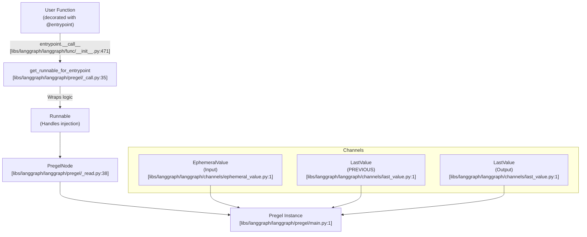
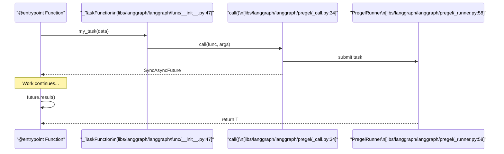

This page documents the `@task` and `@entrypoint` decorators from `langgraph.func`, which allow composing LangGraph workflows entirely in Python without explicitly constructing a `StateGraph`. Like `StateGraph`, both decorators ultimately compile down to a `Pregel` instance—the same core execution engine that powers all LangGraph graphs.

For the explicit graph builder pattern, see [StateGraph API (3.1)](). For the Pregel execution engine that runs both models, see [Pregel Execution Engine (3.3)]().

---

## Overview

Both decorators are defined in `langgraph.func` [[libs/langgraph/langgraph/func/__init__.py:44]](). They provide a functional interface to the underlying Pregel orchestration system.

| Decorator | Role | Returns |
|-----------|------|---------|
| `@task` | Unit of work, schedulable as a concurrent future | `_TaskFunction[P, T]` wrapping a `SyncAsyncFuture[T]` [[libs/langgraph/langgraph/func/__init__.py:47-80]]() |
| `@entrypoint` | Top-level workflow; the graph's entry and exit point | `Pregel` instance [[libs/langgraph/langgraph/func/__init__.py:471-492]]() |

**Comparison with `StateGraph`:**

| Aspect | `StateGraph` | Functional API |
|--------|-------------|----------------|
| Structure definition | Explicit nodes + edges [[libs/langgraph/langgraph/graph/state.py:186-192]]() | Python control flow (loops, if/else) |
| State | Typed dict / schema channels [[libs/langgraph/langgraph/graph/state.py:115-132]]() | Function arguments and return values |
| Parallelism | Multiple nodes in same superstep | Multiple `@task` futures dispatched before `result()` [[libs/langgraph/langgraph/func/__init__.py:133-140]]() |
| Default stream mode | `"updates"` [[libs/langgraph/langgraph/types.py:125]]() | `"updates"` [[libs/langgraph/langgraph/types.py:125]]() |
| Compilation | `builder.compile()` [[libs/langgraph/langgraph/graph/state.py:179]]() | Automatic via decorator [[libs/langgraph/langgraph/func/__init__.py:471]]() |

Sources: [libs/langgraph/langgraph/func/__init__.py:44-80](), [libs/langgraph/langgraph/graph/state.py:115-192](), [libs/langgraph/langgraph/types.py:118-132]()

---

## Key Code Entities

The functional API maps Python functions to `Pregel` nodes and channels.

### Class Relationships

```mermaid
classDiagram
    class entrypoint {
        +checkpointer: BaseCheckpointSaver
        +store: BaseStore
        +cache: BaseCache
        +context_schema: type
        +__call__(func) Pregel
    }
    class final["entrypoint.final[R, S]"] {
        +value: R
        +save: S
    }
    class _TaskFunction {
        +func: Callable
        +retry_policy: Sequence[RetryPolicy]
        +cache_policy: CachePolicy
        +__call__(*args) SyncAsyncFuture
    }
    class SyncAsyncFuture {
        +result() T
    }
    class Pregel {
        +invoke()
        +ainvoke()
        +stream()
        +astream()
    }

    entrypoint --> final : "nested class defined in [libs/langgraph/langgraph/func/__init__.py:430]"
    entrypoint ..> Pregel : "compiles to via __call__ in [libs/langgraph/langgraph/func/__init__.py:471]"
    _TaskFunction ..> SyncAsyncFuture : "returns on call in [libs/langgraph/langgraph/func/__init__.py:72]"
    Pregel ..> SyncAsyncFuture : "managed by PregelRunner in [libs/langgraph/langgraph/pregel/_runner.py:58]"
```

Sources: [libs/langgraph/langgraph/func/__init__.py:47-492](), [libs/langgraph/langgraph/pregel/main.py:1-2](), [libs/langgraph/langgraph/pregel/_runner.py:57-58]()

---

## `@task` Decorator

**Source:** [[libs/langgraph/langgraph/func/__init__.py:116-217]]()

`@task` wraps a sync or async function in a `_TaskFunction`. Calling the wrapped function schedules execution within the current Pregel superstep and returns a `SyncAsyncFuture[T]`.

### Parameters

| Parameter | Type | Default | Description |
|-----------|------|---------|-------------|
| `name` | `str \| None` | `None` | Override task name; defaults to `func.__name__` [[libs/langgraph/langgraph/func/__init__.py:56-66]]() |
| `retry_policy` | `RetryPolicy \| Sequence[RetryPolicy] \| None` | `None` | Retry configuration on failure [[libs/langgraph/langgraph/func/__init__.py:143]]() |
| `cache_policy` | `CachePolicy \| None` | `None` | Cache configuration for results [[libs/langgraph/langgraph/func/__init__.py:144]]() |

### Execution and Parallelism

Calling a task returns a future. To run tasks in parallel, dispatch them and then collect results:

```python
# Dispatched in parallel
futures = [my_task(i) for i in range(3)]
# Block/Await for results
results = [f.result() for f in futures] 
```

Tasks can only be called from inside an `@entrypoint` or a `StateGraph` node [[libs/langgraph/langgraph/func/__init__.py:133-140]]().

---

## `@entrypoint` Decorator

**Source:** [[libs/langgraph/langgraph/func/__init__.py:228-492]]()

The `@entrypoint` decorator transforms a Python function into a `Pregel` instance. It manages the lifecycle of the workflow, including checkpointing and dependency injection.

### Parameters

| Parameter | Type | Description |
|-----------|------|-------------|
| `checkpointer` | `Checkpointer` | Enables persistence across invocations [[libs/langgraph/langgraph/func/__init__.py:255]]() |
| `store` | `BaseStore \| None` | Cross-thread key-value store [[libs/langgraph/langgraph/func/__init__.py:256]]() |
| `context_schema` | `type[ContextT] \| None` | Schema for run-scoped context [[libs/langgraph/langgraph/func/__init__.py:258]]() |

### Runtime Injection

Entrypoints can receive injected parameters by including them in the function signature:

- `config`: The `RunnableConfig` for the current run.
- `previous`: The return value from the prior invocation (requires a checkpointer) [[libs/langgraph/langgraph/func/__init__.py:24]]().
- `runtime`: A `Runtime` object containing `context`, `store`, and `stream_writer`.

Sources: [libs/langgraph/langgraph/func/__init__.py:278-310]()

---

## Compilation to Pregel

When `@entrypoint` is applied to a function, it compiles it into a `Pregel` object by mapping the function logic to a `PregelNode` and setting up appropriate channels.

### Compilation Flow



Sources: [libs/langgraph/langgraph/func/__init__.py:471-492](), [libs/langgraph/langgraph/pregel/_call.py:35](), [libs/langgraph/langgraph/pregel/_read.py:38]()

### Task Scheduling Sequence



Sources: [libs/langgraph/langgraph/func/__init__.py:72-79](), [libs/langgraph/langgraph/pregel/_runner.py:57-58](), [libs/langgraph/langgraph/pregel/_call.py:34]()

---

## State and Persistence

### `entrypoint.final`

To decouple the value returned to the user from the value saved for the next invocation (the `previous` parameter), use `entrypoint.final` [[libs/langgraph/langgraph/func/__init__.py:430-469]]().

| Field | Description |
|-------|-------------|
| `value` | The result returned by `invoke()` or `stream()` |
| `save` | The value persisted to the checkpoint as `PREVIOUS` |

### Channel Layout

The functional API uses a specific channel layout to mimic standard function behavior:

| Channel | Type | Role |
|---------|------|------|
| Input | `EphemeralValue` | Holds the input for the current superstep [[libs/langgraph/langgraph/func/__init__.py:26]]() |
| `PREVIOUS` | `LastValue` | Persists state across threads/checkpoints [[libs/langgraph/langgraph/func/__init__.py:24]]() |
| Output | `LastValue` | Captures the final return value [[libs/langgraph/langgraph/func/__init__.py:27]]() |

Sources: [libs/langgraph/langgraph/func/__init__.py:23-28](), [libs/langgraph/langgraph/channels/ephemeral_value.py:1-5](), [libs/langgraph/langgraph/channels/last_value.py:1-5]()

---

## Streaming and Interrupts

- **Streaming**: Functional API supports all `StreamMode` values. `"values"` mode emits the final result, while `"updates"` emits individual task results [[libs/langgraph/langgraph/types.py:118-132]]().
- **Interrupts**: The `interrupt()` function can be used within tasks or entrypoints to pause execution. Resuming triggers a replay of completed tasks from the checkpoint [[libs/langgraph/langgraph/types.py:79]](), [[libs/langgraph/langgraph/func/__init__.py:312-325]]().

Sources: [libs/langgraph/langgraph/types.py:79-132](), [libs/langgraph/langgraph/func/__init__.py:312-325]()