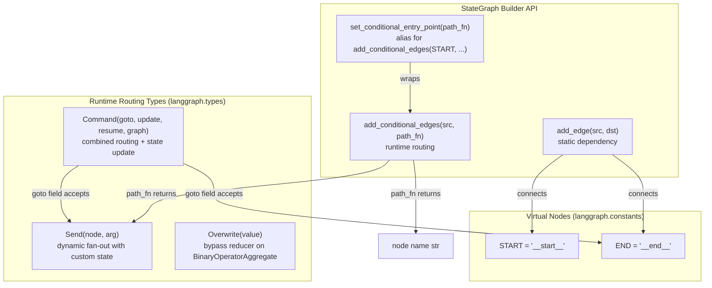
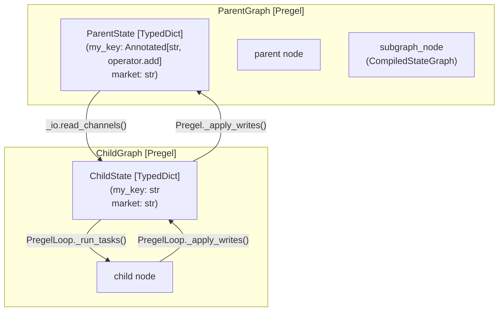
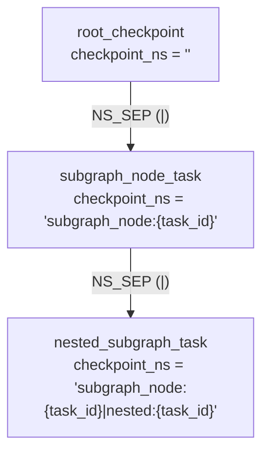
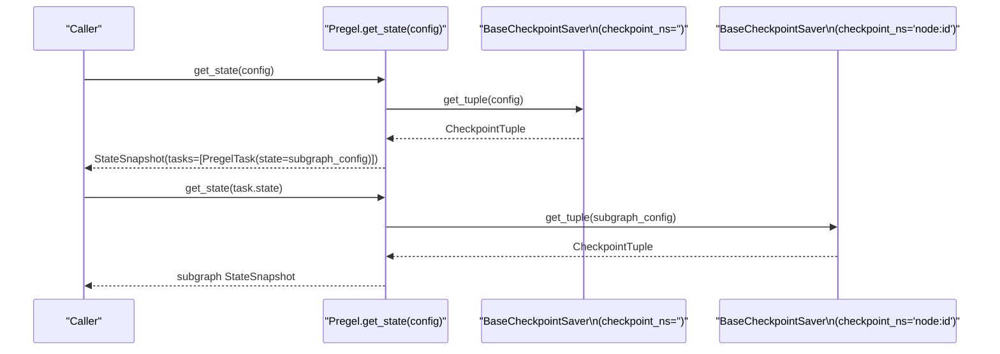

for chunk in graph.stream(Command(resume="user response"), config):
    ...
```

**Source:** [libs/langgraph/langgraph/types.py:367-417](), [libs/langgraph/langgraph/types.py:71-71]()

### graph: Cross-Graph Routing

When a node inside a subgraph needs to update the *parent* graph's state or route within the parent, set `graph=Command.PARENT`.

| Value | Effect |
|---|---|
| `None` (default) | Command applies to current graph |
| `Command.PARENT` (`"__parent__"`) | Command bubbles up via `ParentCommand` exception to nearest parent graph |

Internally, `Command(graph=Command.PARENT, ...)` causes the subgraph to raise a `ParentCommand` exception (defined in [libs/langgraph/langgraph/errors.py:111-115]()), which the parent's execution loop catches and processes.

**Source:** [libs/langgraph/langgraph/types.py:417-417](), [libs/langgraph/langgraph/errors.py:111-115]()

---

## The Overwrite Type

`Overwrite` bypasses the reducer on a `BinaryOperatorAggregate` channel and replaces the channel value directly. Without `Overwrite`, returning a value for an annotated field always invokes its reducer (e.g. `operator.add`).

**Class definition:** [libs/langgraph/langgraph/types.py:546-558]()

```python
from langgraph.types import Overwrite

def node_b(state: State):
    # Bypasses operator.add reducer; replaces list entirely
    return {"messages": Overwrite(value=["b"])}
```

Receiving multiple `Overwrite` values for the same channel in a single superstep raises `InvalidUpdateError`.

---

## Common Routing Patterns

**Diagram: Control Flow Primitives and Code Entities**



**Sources:** [libs/langgraph/langgraph/constants.py:28-31](), [libs/langgraph/langgraph/types.py:289-417](), [libs/langgraph/langgraph/graph/state.py:183-191]()

### If-Else Branching

```python
def route(state: State) -> Literal["tools", "__end__"]:
    if state["needs_tool"]:
        return "tools"
    return END

builder.add_conditional_edges("agent", route)
```

### Self-Loop (Agent Loop)

```python
builder.add_conditional_edges(
    "worker",
    lambda state: "worker" if state["count"] < 6 else END
)
```

**Source:** [libs/langgraph/langgraph/graph/state.py:183-191]()

### Fan-out / Fan-in (Parallel Nodes)

```python
builder.add_edge(START, "retriever_one")   # both start simultaneously
builder.add_edge(START, "retriever_two")
builder.add_edge("retriever_one", "aggregate")
builder.add_edge("retriever_two", "aggregate")
```

When both `retriever_one` and `retriever_two` complete, `aggregate` is scheduled. The state field written by both retrievers must use a reducer (e.g. `Annotated[list, operator.add]`).

### Map-Reduce with Send

```python
class OverallState(TypedDict):
    subjects: list[str]
    jokes: Annotated[list[str], operator.add]

def continue_to_jokes(state: OverallState):
    return [Send("generate_joke", {"subject": s}) for s in state["subjects"]]

builder.add_conditional_edges(START, continue_to_jokes)
builder.add_edge("generate_joke", END)
```

Each `generate_joke` invocation receives its own isolated `{"subject": s}` dict. Results are merged into `jokes` by `operator.add`.

**Source:** [libs/langgraph/langgraph/types.py:289-301]()

---

## Interaction Summary

| Primitive | Defined in | When to use |
|---|---|---|
| `START` | `langgraph.constants` | Source of all entry edges |
| `END` | `langgraph.constants` | Termination of any execution path |
| `add_edge` | `StateGraph` | Unconditional, always-on connection |
| `add_conditional_edges` | `StateGraph` | Runtime routing decided by a function |
| `Send` | `langgraph.types` | Fan-out with per-item custom state |
| `Command` | `langgraph.types` | Node controls both its update and next node |
| `Command.PARENT` | `langgraph.types` | Subgraph communicates with its parent graph |
| `Overwrite` | `langgraph.types` | Replace a reducer channel's value entirely |

**Sources:** [libs/langgraph/langgraph/constants.py:28-31](), [libs/langgraph/langgraph/types.py:289-587](), [libs/langgraph/langgraph/graph/state.py:183-191](), [libs/langgraph/langgraph/errors.py:111-115]()

# Graph Composition and Nested Graphs


This page covers how compiled LangGraph graphs can be embedded as nodes inside other graphs, how state is transferred between parent and child scopes, how checkpointing is namespaced for nested execution, and how to inspect the hierarchical structure of composed graphs.

For background on how the Pregel execution engine works, see [Pregel Execution Engine](#3.3). For the `StateGraph` builder API, see [StateGraph API](#3.1). For human-in-the-loop interrupt handling within nested graphs, see [Human-in-the-Loop and Interrupts](#3.7).

---

## Subgraph Basics

A `CompiledStateGraph` produced by `StateGraph.compile()` implements the `PregelProtocol` and can be passed directly as a node to `StateGraph.add_node()`. The parent graph then treats the subgraph as an opaque node: it calls the subgraph's `invoke`/`ainvoke` during execution, and the subgraph runs its own full `Pregel` loop.

[libs/langgraph/langgraph/graph/state.py:115-199]()
[libs/langgraph/langgraph/pregel/main.py:101-105]()

**Basic pattern:**

```python
# Define and compile the child graph
child_graph = StateGraph(ChildState)
child_graph.add_node("child_node", ...)
compiled_child = child_graph.compile()

# Add it as a node in the parent graph
parent_graph = StateGraph(ParentState)
parent_graph.add_node("subgraph_node", compiled_child)
parent_graph.add_edge(START, "subgraph_node")
parent_graph.add_edge("subgraph_node", END)
parent = parent_graph.compile()
```

The subgraph name used in `add_node` becomes its node identifier in the parent's graph topology.

**Subgraph node type in graph data:**
When `get_graph()` is called on a parent, subgraph nodes are identified by their underlying `Pregel` implementation.

[libs/langgraph/langgraph/pregel/main.py:42-42]()

---

## State Mapping Between Parent and Child

When the parent invokes the subgraph node, state is not passed as a whole; it is projected through schema matching.

**Input projection (parent → child):**
The parent passes a dict of all its current state keys that also appear in the subgraph's `input_schema` (or `state_schema` if no separate `input_schema` is defined).

**Output application (child → parent):**
The subgraph returns values from its `output_schema`. Each returned key is written back into the parent state using **the parent's** channel reducers.

This means the parent and child can have different reducer annotations for the same key. For example, a parent might use `operator.add` to accumulate messages, while the child treats the message list as a simple replacement field.

[libs/langgraph/tests/test_subgraph_persistence.py:85-144]()
[libs/langgraph/langgraph/graph/state.py:115-184]()

**State mapping diagram:**

Title: Parent-Child State Data Flow


Sources: [libs/langgraph/langgraph/pregel/_io.py:125-125](), [libs/langgraph/langgraph/pregel/_algo.py:113-113](), [libs/langgraph/langgraph/graph/state.py:115-184]()

---

## Checkpoint Namespacing

When a parent graph has a checkpointer enabled, each subgraph invocation gets its own checkpoint namespace (`checkpoint_ns`). This allows independent state history for each nested execution.

**Namespace format:**

```
{node_name}:{task_id}
```

For nested subgraphs (depth > 1):

```
{parent_node}:{parent_task_id}|{child_node}:{child_task_id}
```

The separator (`|`) is `NS_SEP` and the delimiter (`:`) is `NS_END`, both defined in `langgraph._internal._constants`.

[libs/langgraph/langgraph/_internal/_constants.py:37-38]()
[libs/langgraph/langgraph/pregel/debug.py:141-151]()

**How it is assembled:**

```python
# From map_debug_checkpoint in debug.py
task_ns = f"{task.name}{NS_END}{task.id}"
if parent_ns:
    task_ns = f"{parent_ns}{NS_SEP}{task_ns}"
```

All checkpoints for both the parent and all subgraphs share the same `thread_id` but differ in `checkpoint_ns`.

**Namespace structure diagram:**

Title: Hierarchical Checkpoint Namespacing


Sources: [libs/langgraph/langgraph/pregel/debug.py:133-152](), [libs/langgraph/langgraph/_internal/_constants.py:37-38]()

---

## Subgraph Checkpointer Configuration

The `compile()` method accepts a `checkpointer` parameter of type `Checkpointer` (defined in `langgraph.types`):

[libs/langgraph/langgraph/types.py:96-102]()

| Value | Behavior |
|-------|----------|
| `None` (default) | Inherit the parent graph's checkpointer. This is the "stateless" pattern where state resets each invocation but supports interrupts. |
| `True` | Enable independent persistent checkpointing for this subgraph (stateful). |
| `False` | Disable checkpointing for this subgraph even if parent has one. |
| `BaseCheckpointSaver` instance | Use this specific saver for the subgraph. |

[libs/langgraph/tests/test_subgraph_persistence_async.py:3-9]()

When `None`, the subgraph checkpoint writes go through the same `BaseCheckpointSaver` as the parent, distinguished by `checkpoint_ns`. This allows the subgraph to support `interrupt()` and resume via the parent's thread ID.

Sources: [libs/langgraph/langgraph/types.py:96-115](), [libs/langgraph/tests/test_subgraph_persistence_async.py:43-49]()

---

## Accessing Subgraph State and X-Ray Mode

When a parent graph has checkpointing and a subgraph is interrupted or running, `get_state()` / `aget_state()` on the parent returns a `StateSnapshot` whose `tasks` field contains `PregelTask` instances.

For tasks that wrap a subgraph, `PregelTask.state` is set to a `RunnableConfig` pointing to the subgraph's checkpoint namespace:

[libs/langgraph/langgraph/types.py:168-190]()

```python
parent_snapshot = parent.get_state(config)
for task in parent_snapshot.tasks:
    if task.state is not None:
        # task.state is a RunnableConfig with checkpoint_ns set
        subgraph_snapshot = parent.get_state(task.state)
```

**X-Ray Mode:**
When calling `get_graph()`, passing `xray=True` (or an integer for depth) allows the caller to see inside subgraphs. The engine recursively traverses the nested `Pregel` instances to build a unified graph representation.

[libs/langgraph/langgraph/pregel/main.py:410-415]()

**State access flow diagram:**

Title: Cross-Namespace State Retrieval


Sources: [libs/langgraph/langgraph/types.py:168-190](), [libs/langgraph/langgraph/pregel/debug.py:121-183](), [libs/langgraph/langgraph/pregel/main.py:149-149]()

---

## Interrupt Propagation

Interrupts raised inside a subgraph via `interrupt()` bubble up to the parent graph. The parent captures them and surfaces them in its own `StateSnapshot.interrupts` and in the relevant `PregelTask.interrupts` list.

The parent does **not** need to know that the interrupt originated in a subgraph; it handles it identically to a top-level interrupt. Resumption is done by passing `Command(resume=value)` to the parent, which routes it down to the correct subgraph task via the checkpoint namespace.

[libs/langgraph/langgraph/errors.py:57-57]()
[libs/langgraph/langgraph/types.py:71-71]()

```python
# Subgraph interrupt bubbles up to parent
result = parent.invoke({"input": "v"}, config)
# result contains interrupts if subgraph called interrupt()

# Resume by passing Command to parent
result = parent.invoke(Command(resume="my answer"), config)
```

Sources: [libs/langgraph/langgraph/types.py:71-71](), [libs/langgraph/langgraph/errors.py:57-57](), [libs/langgraph/tests/test_subgraph_persistence.py:30-39]()

---

## Cross-Graph Commands: `Command.PARENT`

A subgraph node can direct updates and routing decisions to its **parent** graph by returning a `Command` with `graph=Command.PARENT`.

[libs/langgraph/langgraph/types.py:367-417]()

```python