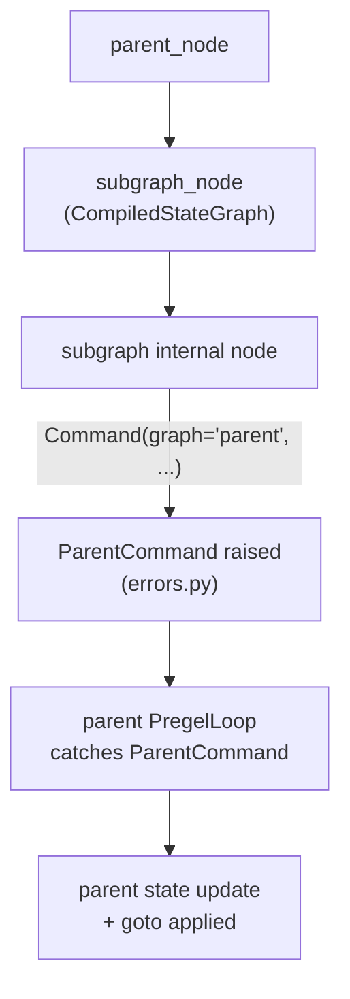

def my_subgraph_node(state: SubgraphState):
    return Command(
        graph="parent",  # Directing to parent
        update={"parent_key": "new_value"},
        goto="some_parent_node",
    )
```

Internally, the subgraph node raises a `ParentCommand` exception which the parent execution loop catches and processes as a `Command` against its own state and routing table.

[libs/langgraph/langgraph/errors.py:49-50]()

**Command routing diagram:**

Title: Subgraph to Parent Command Routing


Sources: [libs/langgraph/langgraph/types.py:367-417](), [libs/langgraph/langgraph/errors.py:49-50]()

---

## Summary Reference

| Concept | Type / Symbol | Location |
|---------|--------------|----------|
| Compiled subgraph type | `CompiledStateGraph` | `langgraph/graph/state.py` |
| Subgraph checkpointer config | `Checkpointer` | `langgraph/types.py` |
| Subgraph state in task | `PregelTask.state` | `langgraph/types.py` |
| Cross-graph command | `Command(graph='parent', ...)` | `langgraph/types.py` |
| Internal cross-graph exception | `ParentCommand` | `langgraph/errors.py` |
| Checkpoint namespace separator | `NS_SEP` (`|`) | `langgraph/_internal/_constants.py` |
| Checkpoint namespace task delimiter | `NS_END` (`:`) | `langgraph/_internal/_constants.py` |
| Subgraph task detection | `PregelExecutableTask.subgraphs` | `langgraph/types.py` |
| Remote graph composition | `RemoteGraph` | `langgraph/pregel/remote.py` |

Sources: [libs/langgraph/langgraph/graph/state.py:115-115](), [libs/langgraph/langgraph/types.py:96-96](), [libs/langgraph/langgraph/errors.py:49-49](), [libs/langgraph/langgraph/_internal/_constants.py:37-38](), [libs/langgraph/langgraph/pregel/remote.py:112-112]()