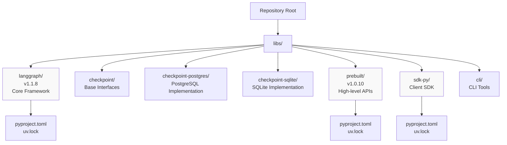
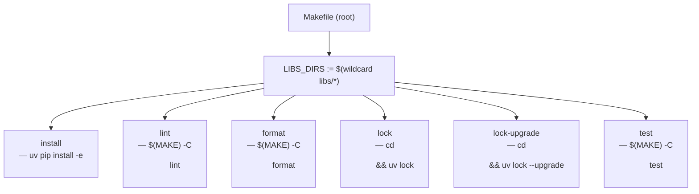
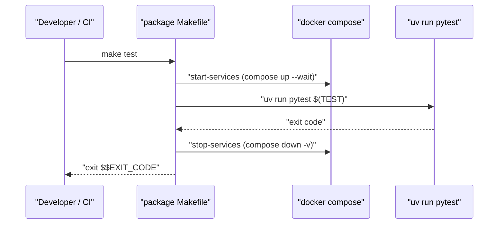
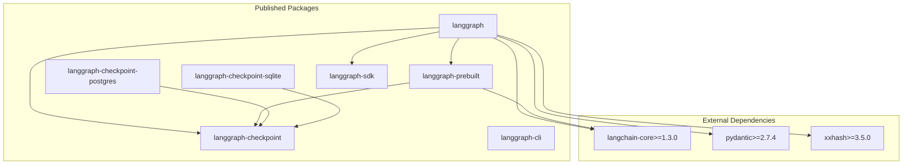
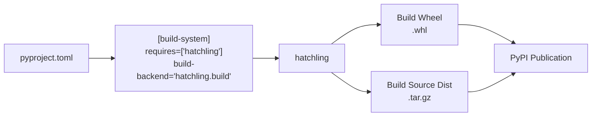

This document describes the organization of the LangGraph repository as a Python monorepo, including the package structure, build system configuration, workspace dependency management, and the role of the `uv` package manager.

---

## Overview

The LangGraph repository is structured as a **monorepo** with multiple independent but related Python packages located in the `libs/` directory. Each package is independently versioned and published to PyPI, but they share a common development environment and build infrastructure. The monorepo uses `uv` as the package manager and supports editable workspace dependencies for efficient local development.

---

## Directory Structure

The repository organizes packages in a flat hierarchy under `libs/`:



**Sources:** [libs/langgraph/pyproject.toml:6-7](), [libs/prebuilt/pyproject.toml:6-7](), [libs/langgraph/uv.lock:1-10](), [libs/prebuilt/uv.lock:1-10](), [libs/sdk-py/uv.lock:1-10]()

Each package directory contains:
- `pyproject.toml` - Package metadata, dependencies, and build configuration.
- `uv.lock` - Locked dependency versions (in packages with dev dependencies).
- Package source code in a subdirectory matching the package name (e.g., `libs/langgraph/langgraph`).
- `README.md` - Package-specific documentation.
- `Makefile` - Local automation for testing and linting.

---

## Makefile Build System

Each package ships a `Makefile` with a consistent set of targets. The repository root also has a `Makefile` that orchestrates targets across all packages.

### Root Makefile Orchestration

The root `Makefile` discovers all packages by globbing `libs/*` and delegates to each package's own `Makefile`.

**Root Makefile target dispatch — `Makefile`**



- `install` — iterates every `libs/*/pyproject.toml` and runs `uv pip install -e <dir>` to create editable installs in the root virtual environment [Makefile:9-18]().
- `lock` — runs `uv lock` in each package directory to regenerate `uv.lock` against current constraints [Makefile:41-48]().
- `lock-upgrade` — same as `lock` but passes `--upgrade` to pull latest compatible versions [Makefile:52-58]().
- `lint`, `format`, `test` — delegates to each package's own `Makefile` via `$(MAKE) -C <dir> <target>` [Makefile:21-38](), [Makefile:61-67]().

### Per-Package Makefiles

Standard targets are maintained across per-package Makefiles to ensure a uniform developer experience.

| Target | What it runs | Notes |
|---|---|---|
| `lint` | `uv run ruff check .`, `uv run mypy` | Fails on any issue [libs/langgraph/Makefile:121-126](). |
| `format` | `uv run ruff format`, `uv run ruff check --fix` | Modifies files in-place [libs/langgraph/Makefile:131-133](). |
| `type` | `uv run mypy langgraph` | Standalone type check [libs/langgraph/Makefile:128-129](). |
| `test` | `uv run pytest` | Orchestrates Docker services if available [libs/langgraph/Makefile:61-74](). |
| `test_watch` | `uv run ptw` | Re-runs tests on file save using `pytest-watcher` [libs/langgraph/Makefile:95-102](). |
| `benchmark` | `uv run python -m bench` | Runs performance benchmarks [libs/langgraph/Makefile:17-20](). |
| `spell_check` | `uv run codespell` | Typo detection using project-specific ignore list [libs/langgraph/Makefile:135-136](). |

**Sources:** [libs/langgraph/Makefile:1-161](), [libs/prebuilt/Makefile:1-86](), [libs/cli/Makefile:1-44](), [libs/sdk-py/Makefile:1-28]()

### Service Management for Tests

Packages whose tests require PostgreSQL or Redis include `start-services` and `stop-services` targets backed by Docker Compose files.

**Service lifecycle in `test` targets**



**Sources:** [libs/langgraph/Makefile:40-44](), [libs/langgraph/Makefile:61-74]()

The `langgraph` package's `test` target also manages a local `langgraph dev` server during execution by tracking its PID in `.devserver.pid` [libs/langgraph/Makefile:46-56](). The `NO_DOCKER` environment variable allows skipping external services when Docker is unavailable, falling back to in-memory or SQLite providers [libs/langgraph/Makefile:59-74](), [libs/langgraph/tests/conftest.py:39-40]().

---

## Package Dependency Graph

The packages have a clear dependency hierarchy designed to minimize coupling:



**Sources:** [libs/langgraph/pyproject.toml:26-33](), [libs/prebuilt/pyproject.toml:26-29]()

### Dependency Constraints

Internal package dependencies use version ranges to allow flexibility and ensure compatibility between monorepo components:

| Package | Checkpoint Version | SDK Version | Prebuilt Version |
|---------|-------------------|-------------|------------------|
| `langgraph` | `>=2.1.0,<5.0.0` | `>=0.3.0,<0.4.0` | `>=1.0.9,<1.1.0` |
| `langgraph-prebuilt` | `>=2.1.0,<5.0.0` | - | - |

**Sources:** [libs/langgraph/pyproject.toml:28-30](), [libs/prebuilt/pyproject.toml:27]()

---

## Build System Architecture

### Build Backend: Hatchling

All packages use `hatchling` as their build backend, configured via `pyproject.toml`:



**Sources:** [libs/langgraph/pyproject.toml:1-3](), [libs/prebuilt/pyproject.toml:1-3]()

### Wheel Configuration

Each package specifies which directories to include in the built wheel. The `langgraph` package explicitly targets the `langgraph` source directory [libs/langgraph/pyproject.toml:120-121](). The `prebuilt` package also includes the core `langgraph` namespace to ensure proper high-level API exposure [libs/prebuilt/pyproject.toml:70-71]().

---

## Package Manager: uv

The repository uses `uv` for fast dependency resolution and cross-platform lock files.

### UV Lock Files

Each package maintains a `uv.lock` file that pins exact versions of all transitive dependencies. These lock files include platform-specific resolution markers (e.g., for Python 3.11 vs 3.14) and hashes for security [libs/langgraph/uv.lock:1-8]().

**Sources:** [libs/langgraph/uv.lock:1-17](), [libs/prebuilt/uv.lock:1-12](), [libs/sdk-py/uv.lock:1-12]()

---

## Workspace Dependencies and Editable Installs

### Workspace Sources Configuration

For local development, packages reference each other as editable workspace dependencies using `[tool.uv.sources]`. This allows changes in a dependency (like `langgraph-checkpoint`) to be immediately reflected in a dependent package (like `langgraph`) without a re-install.

```toml
[tool.uv.sources]
langgraph-prebuilt = { path = "../prebuilt", editable = true }
langgraph-checkpoint = { path = "../checkpoint", editable = true }
langgraph-checkpoint-sqlite = { path = "../checkpoint-sqlite", editable = true }
langgraph-checkpoint-postgres = { path = "../checkpoint-postgres", editable = true }
langgraph-sdk = { path = "../sdk-py", editable = true }
langgraph-cli = { path = "../cli", editable = true }
```

**Sources:** [libs/langgraph/pyproject.toml:83-89](), [libs/prebuilt/pyproject.toml:64-68]()

---

## Dependency Groups

Packages define sets of dependencies for various purposes using `[dependency-groups]`.

| Group | Purpose | Key Dependencies |
|-------|---------|------------------|
| `test` | Testing infrastructure | `pytest`, `pytest-cov`, `syrupy`, `httpx`, `pytest-xdist` [libs/langgraph/pyproject.toml:46-70]() |
| `lint` | Code quality | `mypy`, `ruff`, `types-requests` [libs/langgraph/pyproject.toml:71-75]() |
| `dev` | Complete environment | Includes `test` and `lint` groups, plus `jupyter` [libs/langgraph/pyproject.toml:76-80]() |

---

## Development Tools Configuration

### Ruff (Linting and Formatting)

Linting rules are standardized across packages, selecting for errors (`E`), pyflakes (`F`), isort (`I`), and pyupgrade (`UP`) [libs/langgraph/pyproject.toml:91-97](). It also bans specific imports like `typing.TypedDict` in favor of `typing_extensions.TypedDict` for compatibility [libs/langgraph/pyproject.toml:99-100]().

### Mypy (Type Checking)

Strict type checking is enforced with `disallow_untyped_defs = "True"` and `explicit_package_bases = "True"` [libs/langgraph/pyproject.toml:102-110]().

### Codespell

Spell checking is configured with a extensive ignore-list of domain-specific terms like `checkpointer`, `multiactor`, and `langgraph` [libs/langgraph/pyproject.toml:126-128]().

---

## Python Version Support

All packages require Python 3.10 or higher and explicitly support Python 3.10 through 3.13.

**Sources:** [libs/langgraph/pyproject.toml:10, 21-24](), [libs/prebuilt/pyproject.toml:10, 21-24]()