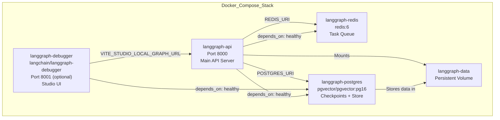
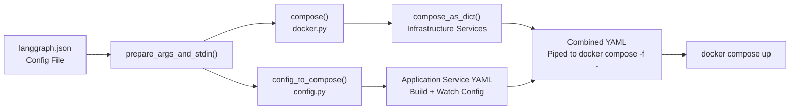
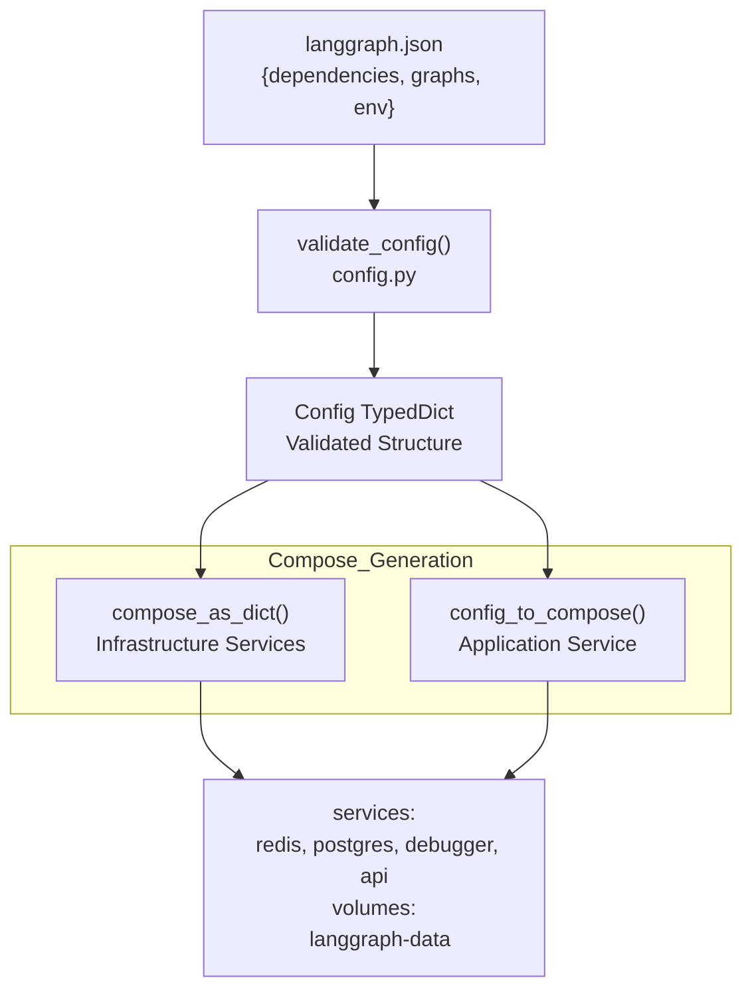
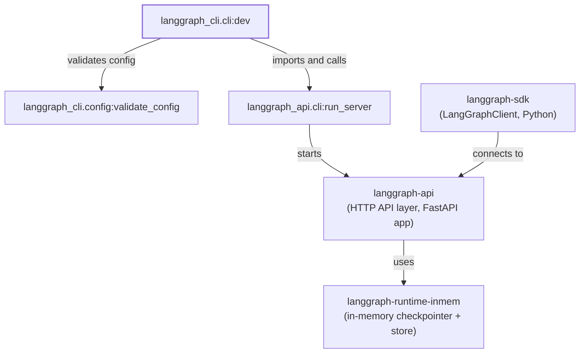
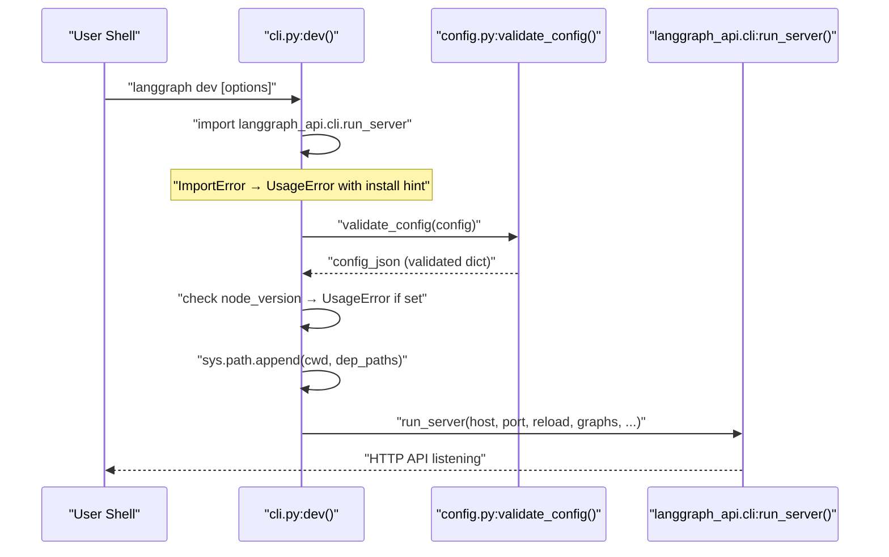
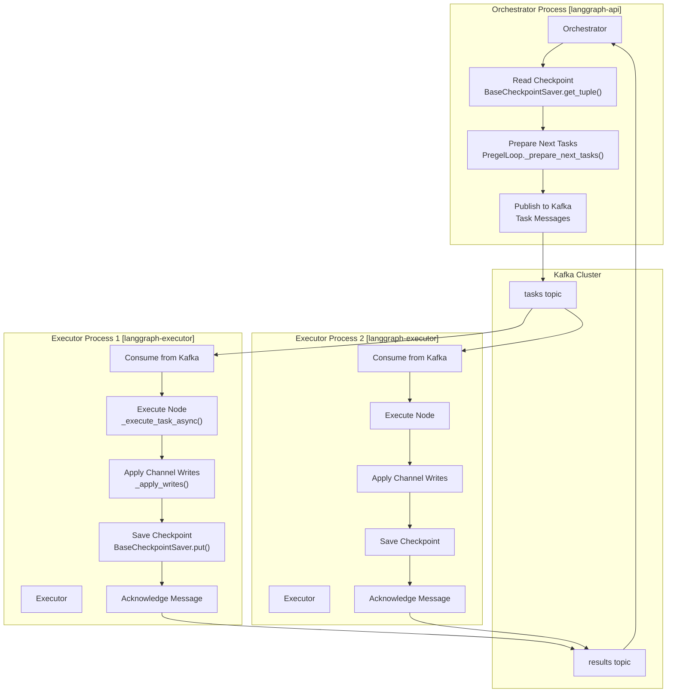
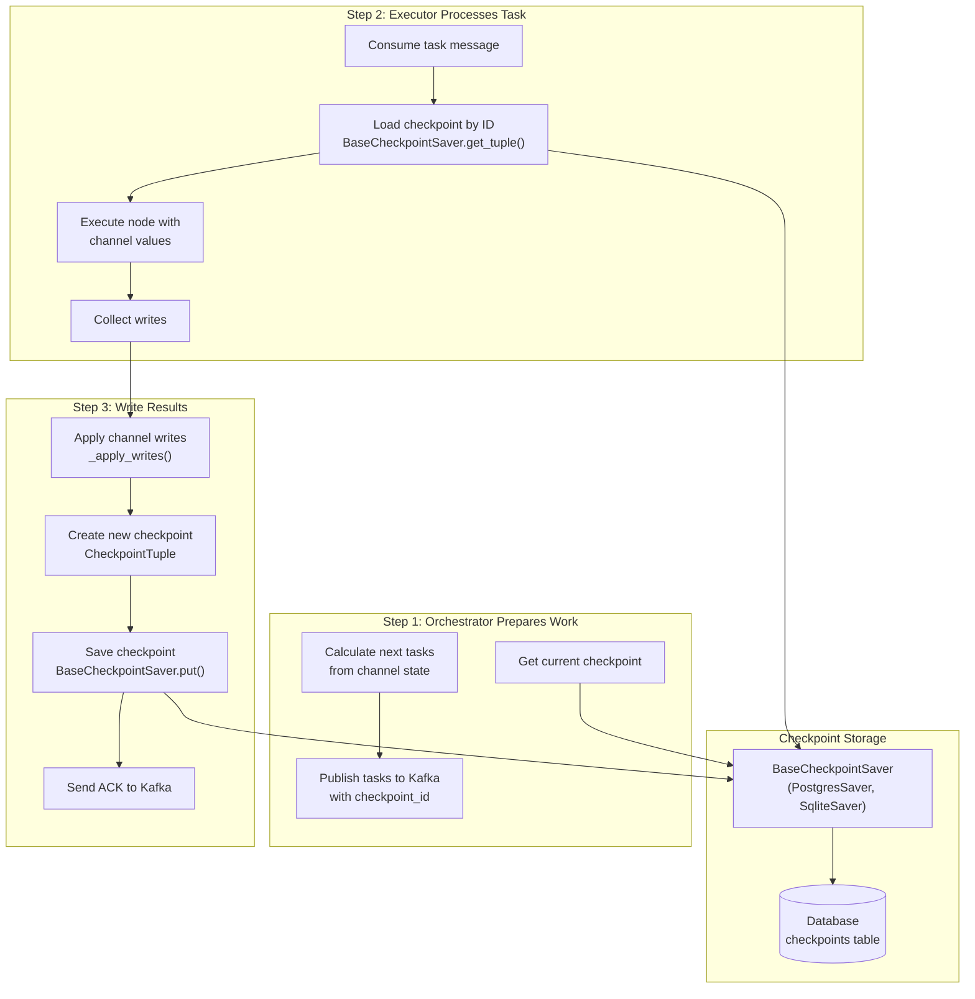
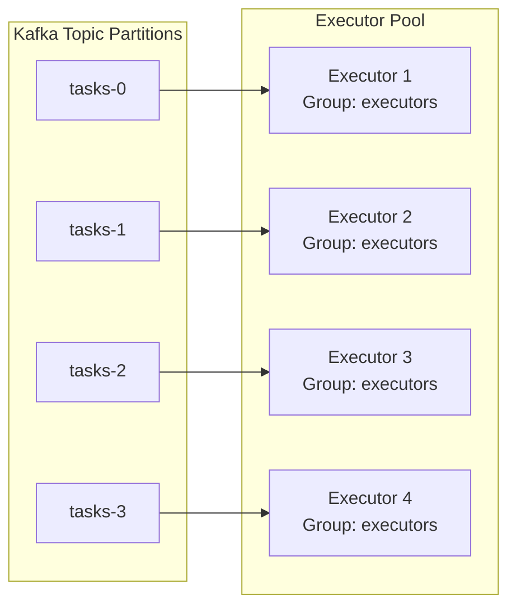
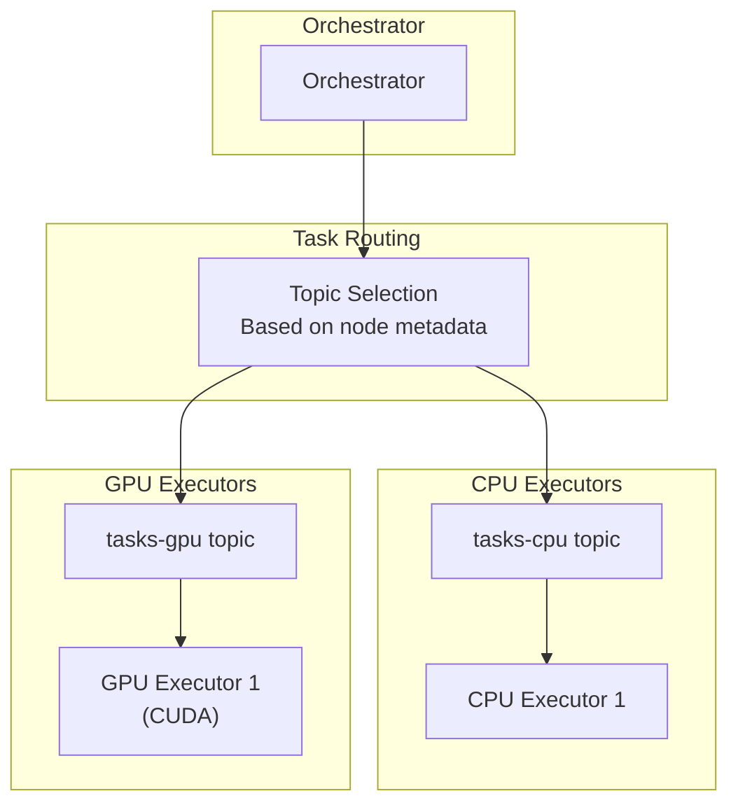

## Purpose and Scope

This document describes how the LangGraph CLI generates and orchestrates multi-service Docker Compose configurations for local development and deployment. The system automatically provisions dependent services (Redis, PostgreSQL, debugger UI) alongside the LangGraph API server, handling service dependencies, health checks, networking, and hot-reloading in watch mode.

For building single Docker images (without orchestration), see [6.3 Docker Image Generation](). For the development server that runs without Docker, see [6.5 Local Development Server]().

## Service Architecture

The CLI generates a multi-service stack with four primary components, each running in its own container with defined health checks and dependencies.



**Service Architecture**

Sources: [libs/cli/langgraph_cli/docker.py:167-220](), [libs/cli/tests/unit_tests/cli/test_cli.py:80-137]()

## Docker Compose Generation Flow

The CLI generates Docker Compose configurations through two main code paths: infrastructure services and application services.



**Compose Generation Pipeline**

The `prepare_args_and_stdin` function in `cli.py` orchestrates the generation by calling infrastructure helpers in `docker.py` and application-specific builders in `config.py`, then combining them into a single YAML document passed via stdin to the Docker subprocess [libs/cli/tests/unit_tests/cli/test_cli.py:61-71]().

Sources: [libs/cli/langgraph_cli/docker.py:138-154](), [libs/cli/tests/unit_tests/cli/test_cli.py:51-171]()

## Infrastructure Services

### Redis Service

The Redis service provides task queue and caching functionality with automatic health checking.

| Property | Value |
|----------|-------|
| Image | `redis:6` |
| Healthcheck | `redis-cli ping` |
| Interval | 5s |
| Timeout | 1s |
| Retries | 5 |
| Network Access | Internal only (no exposed ports) |

The API server connects via `REDIS_URI=redis://langgraph-redis:6379` [libs/cli/langgraph_cli/docker.py:212-212]().

Sources: [libs/cli/langgraph_cli/docker.py:168-177](), [libs/cli/tests/unit_tests/cli/test_cli.py:84-90]()

### PostgreSQL Service

PostgreSQL with pgvector extension stores checkpoints and provides the Store backend.

| Property | Value |
|----------|-------|
| Image | `pgvector/pgvector:pg16` |
| Port | 5433:5432 (host:container) |
| Environment | `POSTGRES_DB=postgres`<br/>`POSTGRES_USER=postgres`<br/>`POSTGRES_PASSWORD=postgres` |
| Command | `postgres -c shared_preload_libraries=vector` |
| Volume | `langgraph-data:/var/lib/postgresql/data` |
| Healthcheck | `pg_isready -U postgres` |
| Start Period | 10s |
| Start Interval | 1s |

The default connection string is defined as `DEFAULT_POSTGRES_URI` [libs/cli/langgraph_cli/docker.py:11-13](), and is configurable via the `postgres_uri` parameter in `compose_as_dict` [libs/cli/langgraph_cli/docker.py:145-145]().

Sources: [libs/cli/langgraph_cli/docker.py:181-203](), [libs/cli/tests/unit_tests/cli/test_cli.py:91-111]()

### Debugger Service (Optional)

When a debugger port is specified, the CLI includes the LangGraph Studio debugger UI via `debugger_compose` [libs/cli/langgraph_cli/docker.py:93-113]().

| Property | Value |
|----------|-------|
| Image | `langchain/langgraph-debugger` |
| Port | User-specified (mapped to 3968) |
| Restart Policy | `on-failure` |
| Environment | `VITE_STUDIO_LOCAL_GRAPH_URL` set to API URL |
| Dependencies | Waits for `langgraph-postgres` to be healthy |

Sources: [libs/cli/langgraph_cli/docker.py:98-111](), [libs/cli/tests/unit_tests/cli/test_cli.py:112-121]()

## Application Service Configuration

### Build Mode vs Image Mode

The `langgraph-api` service can operate in two modes:

**Build Mode** (default): Generates inline Dockerfile and builds image on-demand. It uses `dockerfile_inline` with the `FROM` instruction targeting the appropriate Python version [libs/cli/tests/unit_tests/cli/test_cli.py:144-146]().

**Image Mode**: When an `image` string is provided to `compose_as_dict`, it uses that pre-built image instead of a build context [libs/cli/langgraph_cli/docker.py:147-147]().

Sources: [libs/cli/langgraph_cli/docker.py:138-154](), [libs/cli/tests/unit_tests/cli/test_cli.py:173-193]()

### Service Dependencies and Health

The API service declares dependencies with health conditions to ensure a stable startup sequence.

```yaml
langgraph-api:
  depends_on:
    langgraph-redis:
      condition: service_healthy
    langgraph-postgres:
      condition: service_healthy
  healthcheck:
    test: python /api/healthcheck.py
    interval: 60s
    start_interval: 1s
    start_period: 10s
```

The `start_interval` feature is conditionally enabled based on `DockerCapabilities.healthcheck_start_interval` [libs/cli/langgraph_cli/docker.py:198-200]().

Sources: [libs/cli/langgraph_cli/docker.py:198-203](), [libs/cli/tests/unit_tests/cli/test_cli.py:122-138]()

## Watch Mode and Hot Reloading

When `watch=True` is passed to the generation logic, the CLI configures Docker Compose's `develop` watch mode for automatic rebuilds on file changes [libs/cli/tests/unit_tests/cli/test_cli.py:160-168]().

The watch configuration monitors:
1. **Configuration file** (`langgraph.json`): Triggers `rebuild`.
2. **Local dependencies**: Each dependency in the `dependencies` array gets a watch entry.
3. **Working directory**: Monitors the project context for changes.

Sources: [libs/cli/tests/unit_tests/cli/test_cli.py:160-168]()

## Configuration Transformation

The transformation from `langgraph.json` to compose services involves multiple validation and mapping steps.



**Configuration to Compose Transformation**

### Key Transformations

1. **Dependency Resolution**: Local dependencies are analyzed to determine installation order and mount points [libs/cli/tests/unit_tests/cli/test_cli.py:153-155]().
2. **Environment Injection**: Configuration values like `graphs` are serialized into `LANGSERVE_GRAPHS` [libs/cli/tests/unit_tests/cli/test_cli.py:156-156]().
3. **Security Hardening**: The CLI checks for disallowed characters in build commands to prevent injection [libs/cli/langgraph_cli/config.py:38-44]().
4. **Distro Validation**: Recommends Wolfi Linux for enhanced security [libs/cli/langgraph_cli/util.py:10-27]().

Sources: [libs/cli/langgraph_cli/config.py:142-196](), [libs/cli/langgraph_cli/util.py:10-27]()

## Service Communication

Services communicate through Docker's internal network using service names as hostnames:

| From | To | Connection String / Variable |
|------|-----|-------------------|
| `langgraph-api` | `langgraph-redis` | `REDIS_URI: redis://langgraph-redis:6379` [libs/cli/langgraph_cli/docker.py:212-212]() |
| `langgraph-api` | `langgraph-postgres` | `POSTGRES_URI: ...` [libs/cli/langgraph_cli/docker.py:213-213]() |
| `langgraph-debugger` | `langgraph-api` | `VITE_STUDIO_LOCAL_GRAPH_URL` [libs/cli/langgraph_cli/docker.py:109-111]() |

Sources: [libs/cli/langgraph_cli/docker.py:11-13](), [libs/cli/langgraph_cli/docker.py:211-214]()

## Volume Management

The `langgraph-data` volume provides persistent storage for the database:

```yaml
volumes:
  langgraph-data:
    driver: local
```

This volume is mounted at `/var/lib/postgresql/data` in the `langgraph-postgres` container [libs/cli/langgraph_cli/docker.py:190-190]().

Sources: [libs/cli/langgraph_cli/docker.py:190-190](), [libs/cli/tests/unit_tests/cli/test_cli.py:80-82]()

## Docker Compose CLI Detection

The `check_capabilities` function detects the environment's Docker setup [libs/cli/langgraph_cli/docker.py:48-90]().

- **plugin**: Uses `docker compose` (v2+ plugin).
- **standalone**: Uses `docker-compose` (v1 standalone).
- **Healthcheck support**: Detects if `start_interval` is supported (Docker 25.0.0+) [libs/cli/langgraph_cli/docker.py:88-88]().

Sources: [libs/cli/langgraph_cli/docker.py:25-29](), [libs/cli/langgraph_cli/docker.py:48-90]()

## Multi-Service Execution Modes

The CLI supports different runtime modes for the execution engine via the `--engine-runtime-mode` option [libs/cli/langgraph_cli/cli.py:165-170]().

| Mode | Description |
|------|-------------|
| `combined_queue_worker` | Default mode where the API server handles orchestration and execution in a single container. |
| `distributed` | Splits the engine into separate executor and orchestrator containers for high-scale distributed execution [libs/cli/langgraph_cli/cli.py:169-170](). |

Sources: [libs/cli/langgraph_cli/cli.py:165-171]()

# Local Development Server


This page covers `langgraph dev`, the in-memory development server mode provided by `langgraph-cli`. It is intended for rapid local iteration without Docker. For the Docker-based production-oriented server (using Postgres and Redis), see [Multi-Service Orchestration](#6.4). For all CLI commands at a summary level, see [CLI Commands](#6.1). For the `langgraph.json` configuration file, see [Configuration System (langgraph.json)](#6.2).

---

## Overview

`langgraph dev` starts the LangGraph API server as a native Python process in the current shell, loading graphs directly from source. It does not require Docker. The server uses an in-memory SQLite-backed checkpointer and store rather than Postgres, which makes it unsuitable for production but fast to start.

The command is implemented in `langgraph_cli/cli.py` as the `dev` Click command [libs/cli/langgraph_cli/cli.py:609-768]().

---

## Installation Requirements

`langgraph dev` depends on two optional packages that are not installed by default. They are available via the `inmem` extras group declared in `pyproject.toml` [libs/cli/pyproject.toml:24-28]():

| Package | Minimum Version | Python Constraint | Role |
|---|---|---|---|
| `langgraph-api` | `>=0.5.35,<0.9.0` | `>= 3.11` | Provides `run_server` function and HTTP API layer |
| `langgraph-runtime-inmem` | `>=0.7` | `>= 3.11` | Provides in-memory checkpointer and store |
| `python-dotenv` | `>=0.8.0` | `>= 3.11` | `.env` file loading support |

Install with:

```bash
pip install -U "langgraph-cli[inmem]"
```

**Python version requirement:** The `inmem` extras are only installed for Python 3.11 or higher [libs/cli/pyproject.toml:26-27](). The `dev` command will emit a descriptive error if Python < 3.11 is detected [libs/cli/langgraph_cli/cli.py:703-710]().

**JS graphs are not supported.** If the validated config includes `node_version`, the command immediately raises a `UsageError` [libs/cli/langgraph_cli/cli.py:733-736]().

Sources: [libs/cli/pyproject.toml:24-28](), [libs/cli/langgraph_cli/cli.py:703-736]()

---

## Architecture

The following diagram shows how `langgraph dev` relates to the packages it depends on.

**Dependency and call flow for `langgraph dev`**



Sources: [libs/cli/langgraph_cli/cli.py:700-768](), [libs/cli/pyproject.toml:24-28]()

---

## Command Options

The `dev` command is registered as `langgraph dev` via the Click group [libs/cli/langgraph_cli/cli.py:609-679]().

| Option | Type | Default | Description |
|---|---|---|---|
| `--host` | `str` | `127.0.0.1` | Network interface to bind |
| `--port` | `int` | `2024` | Port to listen on |
| `--no-reload` | flag | off | Disables hot reloading |
| `--config` | path | `langgraph.json` | Config file path |
| `--n-jobs-per-worker` | `int` | `None` | Max concurrent jobs per worker |
| `--no-browser` | flag | off | Skips auto-opening LangGraph Studio |
| `--debug-port` | `int` | `None` | Enables `debugpy` remote debugging on this port |
| `--wait-for-client` | flag | off | Blocks startup until a debugger connects |
| `--studio-url` | `str` | `None` | Override Studio URL (default: `https://smith.langchain.com`) |
| `--allow-blocking` | flag | off | Suppresses errors for synchronous blocking I/O |
| `--tunnel` | flag | off | Expose server via Cloudflare tunnel |

Sources: [libs/cli/langgraph_cli/cli.py:609-679]()

---

## Execution Flow

The following diagram maps the `dev` function's internal execution sequence to the actual code constructs involved.

**`dev` function execution sequence**



Sources: [libs/cli/langgraph_cli/cli.py:698-768](), [libs/cli/langgraph_cli/config.py:152-210]()

---

## Config Propagation

After validation via `validate_config` [libs/cli/langgraph_cli/config.py:152-210](), config fields are extracted and forwarded directly to `run_server`. The mapping includes:

| `langgraph.json` field | Forwarded as `run_server` argument |
|---|---|
| `graphs` | `graphs` |
| `env` | `env` |
| `store` | `store` |
| `auth` | `auth` |
| `http` | `http` |
| `ui` | `ui` |
| `ui_config` | `ui_config` |
| `webhooks` | `webhooks` |

The `dependencies` list is used locally to extend `sys.path` before calling `run_server` [libs/cli/langgraph_cli/cli.py:740-744](). This ensures that relative local packages declared as `"."` or `"./some_dir"` are importable when the graph modules are loaded.

Sources: [libs/cli/langgraph_cli/cli.py:738-768](), [libs/cli/langgraph_cli/config.py:191-208]()

---

## Hot Reloading

Hot reloading is enabled by default (the `--no-reload` flag disables it). When enabled, `run_server` is called with `reload=True` [libs/cli/langgraph_cli/cli.py:748-752]():

```python
run_server(
    host,
    port,
    not no_reload,   # reload=True unless --no-reload
    graphs,
    ...
)
```

The actual file-watching and process restarting is implemented inside `langgraph-api` (not in `langgraph-cli`). The `langgraph-cli` side only passes the boolean flag.

Sources: [libs/cli/langgraph_cli/cli.py:748-768]()

---

## Remote Debugging

When `--debug-port` is specified, the `run_server` function is expected to call `debugpy.listen()` on the given port. The `--wait-for-client` flag causes the server to block until a debugger IDE (e.g., VS Code) attaches before beginning graph execution.

Both `debug_port` and `wait_for_client` are passed directly to `run_server` [libs/cli/langgraph_cli/cli.py:754-755]().

Sources: [libs/cli/langgraph_cli/cli.py:643-655](), [libs/cli/langgraph_cli/cli.py:754-755]()

---

## LangGraph Studio Integration

When the server starts (and `--no-browser` is not set), `run_server` opens a browser to connect LangGraph Studio to the local server. The Studio URL defaults to `https://smith.langchain.com` but can be overridden with `--studio-url` [libs/cli/langgraph_cli/cli.py:656-664]().

When using `--tunnel`, the server is additionally exposed via a Cloudflare tunnel so that remote Studio instances or browsers that block `localhost` can reach the local API [libs/cli/langgraph_cli/cli.py:665-673]().

Sources: [libs/cli/langgraph_cli/cli.py:656-673](), [libs/cli/langgraph_cli/cli.py:762-763]()

---

## Error Handling for Missing Dependencies

If `langgraph-api` is not installed (i.e., `langgraph-cli` was installed without the `inmem` extra), the `dev` command produces a structured error message rather than a raw `ImportError`. The check also detects whether Python is below 3.11 and appends a version-specific note to the error [libs/cli/langgraph_cli/cli.py:703-730]().

Sources: [libs/cli/langgraph_cli/cli.py:700-730]()

---

## Comparison: `langgraph dev` vs `langgraph up`

| Aspect | `langgraph dev` | `langgraph up` |
|---|---|---|
| Requires Docker | No | Yes |
| Persistence backend | In-memory (SQLite) | Postgres |
| Hot reload mechanism | In-process Python reload | Docker Compose `watch` |
| JS graph support | No [libs/cli/langgraph_cli/cli.py:733]() | Yes |
| Config validated by | `validate_config` | `validate_config` |
| Runtime packages | `langgraph-api` [libs/cli/pyproject.toml:26]() | `langchain/langgraph-api` image |
| Default port | `2024` | `8123` |

Sources: [libs/cli/langgraph_cli/cli.py:609-768](), [libs/cli/pyproject.toml:24-28]()

# Distributed Execution with Kafka


## Purpose and Scope

This document describes the Kafka-based distributed execution system for LangGraph graphs. This system enables horizontal scaling of graph execution across multiple worker processes or machines, allowing workloads to be distributed beyond a single process.

The distributed execution system builds on top of the checkpoint persistence layer to orchestrate work across multiple executors. While the core logic of graph traversal resides in the Pregel engine, the Kafka scheduler provides the transport and coordination layer required for multi-node deployments.

The LangGraph CLI supports this mode via the `--engine-runtime-mode distributed` option [libs/cli/langgraph_cli/cli.py:165-170](), which configures the environment to use separate executor and orchestrator containers rather than the default `combined_queue_worker` mode.

## Architecture Overview

The Kafka scheduler implements an orchestrator-executor pattern. In this architecture, the **Orchestrator** manages the state machine and graph topology, while **Executors** handle the actual execution of node functions.

The CLI's `langgraph up` command orchestrates these components using Docker Compose [libs/cli/langgraph_cli/cli.py:29-40](), often pulling specific base images defined by the `api_version` [libs/cli/langgraph_cli/cli.py:159-164]().


**Orchestrator-Executor Pattern for Distributed Graph Execution**

The separation of concerns allows:
- **Orchestrators** to remain lightweight and handle coordination for many graphs.
- **Executors** to scale independently based on compute workload.
- **Work distribution** across heterogeneous machines (e.g., GPU executors for ML nodes).

Sources: `libs/cli/langgraph_cli/cli.py:165-170](), `libs/cli/langgraph_cli/config.py:152-208]().

## Integration with Checkpointing

The distributed execution system relies heavily on the checkpoint persistence layer to maintain consistency across distributed workers. Each step in the execution lifecycle involves checkpoint operations to ensure that state is never lost if a worker fails.


**Checkpoint Lifecycle in Distributed Execution**

Key aspects of checkpoint integration:
1. **Checkpoint ID in Messages**: Each task message includes the `checkpoint_id` of the state from which it was derived, ensuring executors load the correct state.
2. **Atomic Checkpoint Writes**: Executors must write both channel updates and the new checkpoint.
3. **Version Conflict Resolution**: If multiple executors attempt to process the same task (due to retries or consumer rebalancing), the checkpoint system's version tracking detects conflicts. Only the first checkpoint write succeeds.

The CLI manages the configuration for these checkpointers via the `checkpointer` key in `langgraph.json` [libs/cli/langgraph_cli/config.py:208-209]().

Sources: `libs/cli/langgraph_cli/config.py:191-209](), `libs/cli/langgraph_cli/cli.py:154-157]().

## Scaling and Deployment Patterns

### Horizontal Scaling

Executors can be scaled horizontally by increasing consumer instances within a Kafka consumer group. Kafka's partition assignment ensures that work is distributed evenly while maintaining ordering guarantees for specific threads.


**Kafka Partition Assignment for Parallel Execution**

### Resource-Specific Executors

Nodes can be annotated with resource requirements, allowing orchestrators to route tasks to appropriate executor pools via specialized Kafka topics. The CLI supports building these specialized images by injecting custom `dockerfile_lines` [libs/cli/langgraph_cli/config.py:200]().


**Resource-Aware Task Routing**

## Comparison with Local Execution

The distributed execution system differs from local execution in its handling of the Pregel loop.

| Aspect | Local Execution | Distributed Execution |
| :--- | :--- | :--- |
| **Orchestration** | Single `PregelLoop` in-process | Orchestrator process + Kafka |
| **Task Execution** | Direct function calls | Executors consume from Kafka |
| **State Persistence** | Optional (can use `InMemorySaver`) | Required (PostgreSQL) |
| **CLI Mode** | Default (`combined_queue_worker`) | `distributed` [libs/cli/langgraph_cli/cli.py:165-170]() |
| **Fault Tolerance** | Process crash loses in-flight work | Kafka retries + checkpoint recovery |

### Execution Flow Comparison

**Local Execution:**
The loop is managed entirely within the Pregel class.
`Pregel.stream()` → `PregelLoop` → `_execute_task_async()` → `_apply_writes()` → `BaseCheckpointSaver.put()`

**Distributed Execution:**
The loop is broken across the network.
`Orchestrator` → `_prepare_next_tasks()` → Kafka Publish → `Executor` → `_execute_task_async()` → `_apply_writes()` → `BaseCheckpointSaver.put()` → Kafka ACK → `Orchestrator`

Sources: `libs/cli/langgraph_cli/cli.py:165-170](), `libs/cli/langgraph_cli/config.py:191-209]().

## Error Handling and Recovery

The distributed system must handle failures at multiple levels:

1. **Executor Failures**: If an executor crashes mid-execution, the Kafka consumer group rebalances. Unacknowledged messages are redelivered to another executor.
2. **Orchestrator Failures**: If an orchestrator crashes, new instances pick up from the last committed offset in the results topic.
3. **Configuration Validation**: The CLI performs strict validation of the `langgraph.json` config to prevent runtime failures in distributed environments [libs/cli/langgraph_cli/config.py:152-240]().

Sources: `libs/cli/langgraph_cli/config.py:152-240]().

## Infrastructure Requirements

To run the distributed system, a persistent backend is required. The CLI allows specifying an external Postgres URI via `--postgres-uri` [libs/cli/langgraph_cli/cli.py:154-157]().

```yaml
# Example service configuration for distributed testing
services:
  postgres-test:
    image: postgres:16
    ports:
      - "5442:5432"
    environment:
      POSTGRES_DB: postgres
      POSTGRES_USER: postgres
      POSTGRES_PASSWORD: postgres
```

The CLI also manages dependency installation for these environments, supporting both `pip` and `uv` installers [libs/cli/langgraph_cli/config.py:195]().

Sources: `libs/cli/langgraph_cli/cli.py:154-157](), `libs/cli/langgraph_cli/config.py:195]().