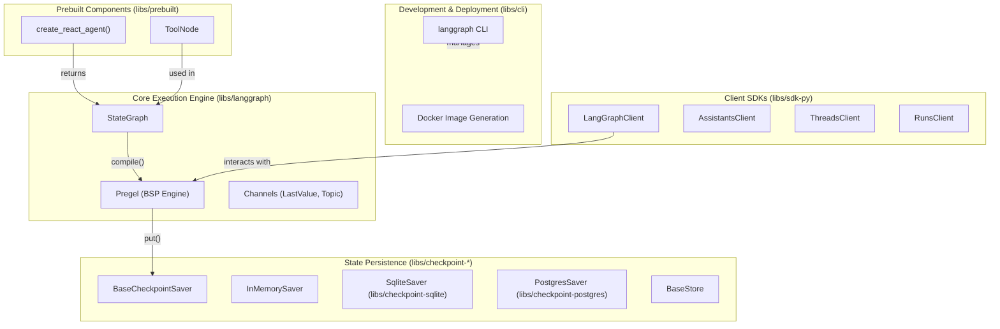
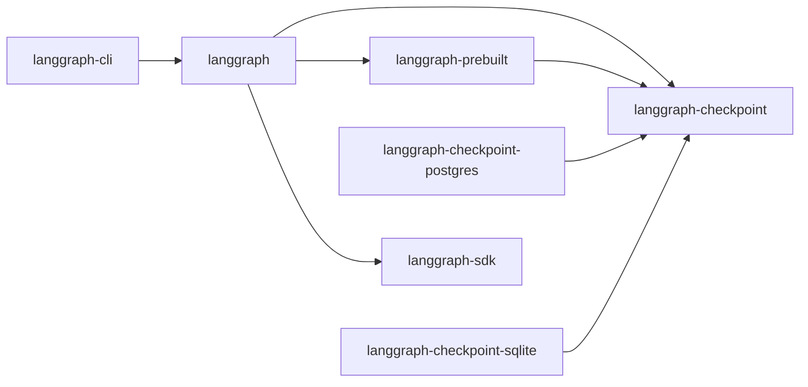
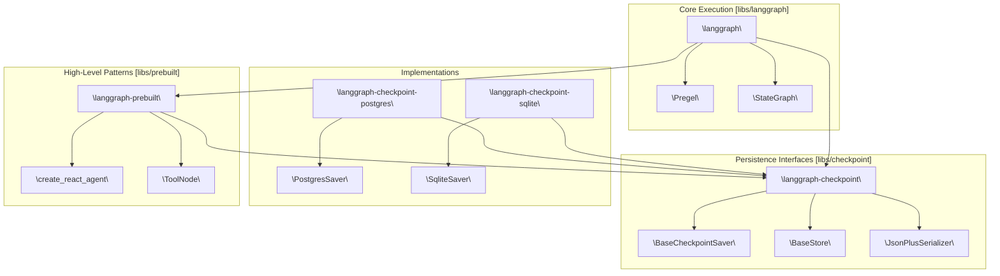
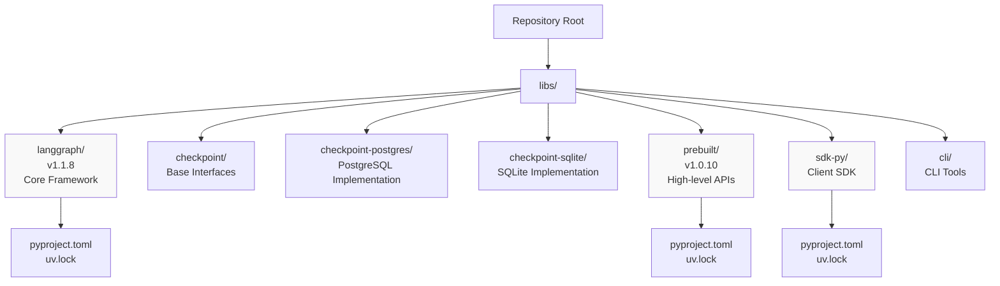
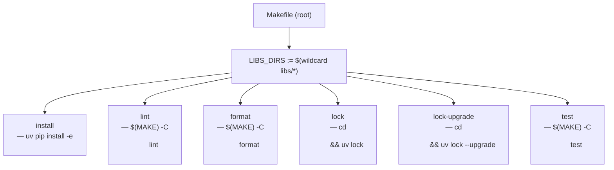
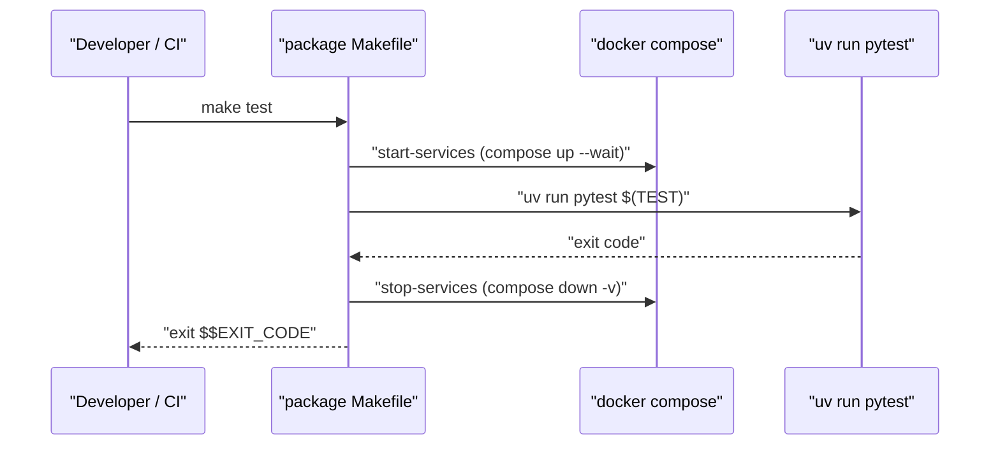
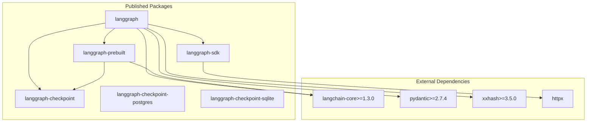
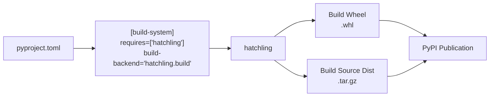
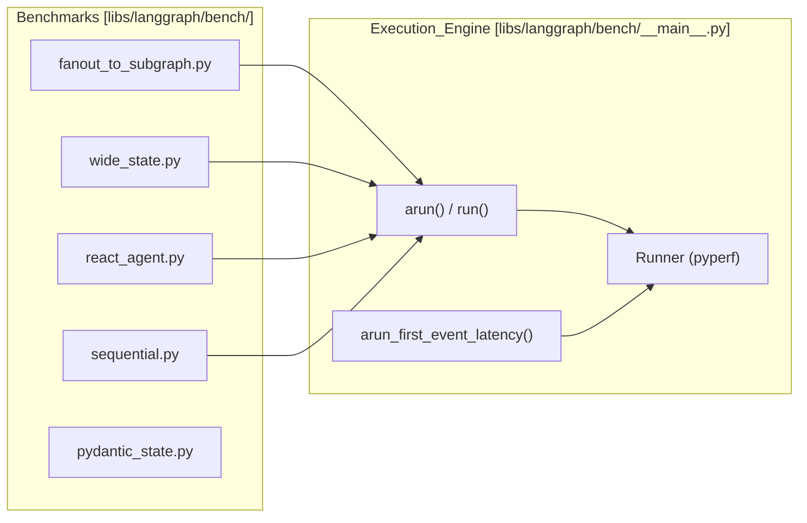

## Purpose and Scope

LangGraph is a low-level orchestration framework for building stateful, multi-actor applications with Large Language Models (LLMs). Unlike high-level abstractions, LangGraph provides infrastructure without abstracting prompts or architecture, giving developers full control over their application logic [libs/langgraph/pyproject.toml:8](). It is specifically designed to handle the unique challenges of long-running agentic workflows, such as persistence, cycle management, and human intervention.

### Core Capabilities

LangGraph provides foundational capabilities for building production-grade agents:

| Capability | Description | Implementation |
|------------|-------------|----------------|
| **Durable Execution** | Agents persist through failures and resume from exact state | `BaseCheckpointSaver` persists `Checkpoint` objects containing channel values and versions after each execution step [README.md:39]() |
| **Human-in-the-Loop** | Inspect and modify agent state at any execution point | Interrupt system allowing state modification via `update_state()` and resumption [README.md:40]() |
| **Comprehensive Memory** | Short-term working memory and long-term persistent storage | Channel system for step-level state + `BaseStore` for cross-thread persistent memory [README.md:41]() |

The framework is built on a Bulk Synchronous Parallel (BSP) execution model inspired by Google's Pregel paper [README.md:82]().

Sources: [README.md:12-43](), [libs/langgraph/pyproject.toml:5-8](), [README.md:80-83]()

## Core Concepts

LangGraph implements a **Bulk Synchronous Parallel (BSP)** execution model. The framework centers on four foundational abstractions:

### Core Abstractions

| Concept | Description | Primary Implementation |
|---------|-------------|----------------------|
| **Graph** | Computational DAG with nodes (functions) and edges (control flow) | `StateGraph` class [libs/langgraph/README.md:39-55]() |
| **State** | Shared data structure managed through typed channels | `TypedDict` schemas [libs/langgraph/README.md:43-45]() |
| **Channels** | Typed state containers with merge semantics | `LastValue`, `Topic`, `BinaryOperatorAggregate` |
| **Checkpoint** | Serialized snapshot containing channel values and execution metadata | `BaseCheckpointSaver` interface [libs/langgraph/pyproject.toml:28]() |

### Graph Definition Approaches

**Declarative API** (StateGraph):
```python
from langgraph.graph import START, StateGraph
from typing_extensions import TypedDict

class State(TypedDict):
    text: str

def node_a(state: State) -> dict:
    return {"text": state["text"] + "a"}

graph = StateGraph(State)
graph.add_node("node_a", node_a)
graph.add_edge(START, "node_a")
```
[libs/langgraph/README.md:39-63]()

### Execution Model

At runtime, the execution engine orchestrates execution in discrete supersteps:
1. **Plan**: Determine which nodes to execute based on channel state.
2. **Execute**: Run nodes in parallel.
3. **Update**: Apply writes to channels using reducers.
4. **Checkpoint**: Persist state via a `BaseCheckpointSaver`.

Sources: [libs/langgraph/README.md:26-63](), [README.md:80-83]()

## Architectural Components

The LangGraph system comprises major subsystems organized as a monorepo.

### High-Level System Architecture



**Code Entity Mapping:**

1. **Core Execution Engine**: 
   - `StateGraph` at [libs/langgraph/README.md:39-55](): Declarative API for graph construction.
   - `Pregel`: The underlying engine implementing the BSP model inspired by Google Pregel [README.md:82]().

2. **Persistence Layer**: 
   - `BaseCheckpointSaver`: Base interface for checkpointing defined in `langgraph-checkpoint` [libs/langgraph/pyproject.toml:28]().
   - `PostgresSaver` at [libs/langgraph/pyproject.toml:60](): Production-grade PostgreSQL persistence.
   - `SqliteSaver` at [libs/langgraph/pyproject.toml:59](): Local SQLite persistence.

3. **Client SDKs**: 
   - `LangGraphClient` at [libs/langgraph/pyproject.toml:29](): Python client for interacting with deployed graphs.

4. **Prebuilt Components**: 
   - `create_react_agent()`: Factory for ReAct-style agents [libs/langgraph/pyproject.toml:30]().
   - `ToolNode`: Standard node for executing LangChain tools.

Sources: [libs/langgraph/pyproject.toml:26-33](), [libs/langgraph/README.md:39-63](), [README.md:80-83]()

## Package Ecosystem

LangGraph is distributed as multiple packages with explicit dependency relationships managed via `uv` [libs/langgraph/pyproject.toml:83-90]().



**Package Descriptions:**

| Package | Purpose | Key Dependencies |
|---------|---------|------------------|
| `langgraph` | Core framework with graph building and execution | `langgraph-checkpoint`, `langchain-core` [libs/langgraph/pyproject.toml:26-28]() |
| `langgraph-checkpoint` | Base interfaces for checkpoint savers | Core persistence logic [libs/langgraph/pyproject.toml:28]() |
| `langgraph-prebuilt` | High-level agent and tool abstractions | `langgraph-checkpoint`, `langchain-core` [libs/prebuilt/pyproject.toml:26-29]() |
| `langgraph-sdk` | Python client for remote graph execution | `httpx`, `pydantic` [libs/langgraph/pyproject.toml:29]() |

Sources: [libs/langgraph/pyproject.toml:26-33](), [libs/prebuilt/pyproject.toml:26-29](), [libs/langgraph/pyproject.toml:83-90]()

## Integration with LangChain Ecosystem

LangGraph is designed to work standalone but provides deep integration with LangChain:

| Component | Role |
|-----------|------|
| **LangChain Core** | Base interfaces for models and messages [libs/langgraph/pyproject.toml:27]() |
| **LangSmith** | Debugging, tracing, and observability [README.md:42]() |
| **LangGraph Studio** | Visual prototyping and debugging [libs/langgraph/README.md:84]() |

Sources: [README.md:42-57](), [libs/langgraph/README.md:79-86]()

## System Requirements

**Python Version**: `>=3.10` [libs/langgraph/pyproject.toml:10]()

**Core Dependencies**:
- `langchain-core>=1.3.0,<2` [libs/langgraph/pyproject.toml:27]()
- `langgraph-checkpoint>=2.1.0,<5.0.0` [libs/langgraph/pyproject.toml:28]()
- `pydantic>=2.7.4` [libs/langgraph/pyproject.toml:32]()
- `xxhash>=3.5.0` [libs/langgraph/pyproject.toml:31]()

Sources: [libs/langgraph/pyproject.toml:10-33]()

# Package Structure and Dependencies


This page enumerates every package in the LangGraph monorepo, describes what each package is responsible for, and documents the inter-package dependency graph. It covers the source layout under `libs/` and the declared runtime dependencies of each package.

For details on the monorepo's build and dependency management system, see [Monorepo Structure and Build System](#2.1). For details on the persistence interfaces, see [Persistence and Memory](#4). For CLI and deployment specifics, see [CLI and Deployment](#6).

---

## Repository Layout

The monorepo organizes all Python packages under the `libs/` directory. Each subdirectory is an independently installable Python package with its own `pyproject.toml` and `uv.lock` file.

```
libs/
├── langgraph/              # Core graph execution library
├── checkpoint/             # Base persistence interfaces
├── checkpoint-postgres/    # PostgreSQL checkpoint/store implementations
├── checkpoint-sqlite/      # SQLite checkpoint implementation
├── prebuilt/               # High-level agent APIs
├── sdk-py/                 # Python client SDK
├── cli/                    # langgraph CLI tool
└── scheduler-kafka/        # Distributed Kafka-based scheduler
```

The root `Makefile` provides targets to orchestrate tasks across all packages, such as `lint`, `format`, and `test`.

Sources: [libs/langgraph/pyproject.toml:83-89](), [libs/checkpoint/pyproject.toml:1-17](), [libs/prebuilt/pyproject.toml:64-68]()

---

## Package Inventory

| Package Name | Directory | Current Version | Primary Role |
|---|---|---|---|
| `langgraph` | `libs/langgraph/` | 1.1.8 | Core graph construction and execution |
| `langgraph-checkpoint` | `libs/checkpoint/` | 4.0.2 | Abstract checkpoint and store interfaces |
| `langgraph-checkpoint-postgres` | `libs/checkpoint-postgres/` | 3.0.5 | PostgreSQL-backed checkpoint and store |
| `langgraph-checkpoint-sqlite` | `libs/checkpoint-sqlite/` | 3.0.3 | SQLite-backed checkpoint implementation |
| `langgraph-prebuilt` | `libs/prebuilt/` | 1.0.10 | Pre-built agent graphs (`create_react_agent`, `ToolNode`) |
| `langgraph-sdk` | `libs/sdk-py/` | ≥0.3.0,<0.4.0 | Python client for the LangGraph API server |
| `langgraph-cli` | `libs/cli/` | — | `langgraph` CLI command group |

Sources: [libs/langgraph/pyproject.toml:6-33](), [libs/checkpoint/pyproject.toml:6-17](), [libs/checkpoint-postgres/pyproject.toml:6-19](), [libs/prebuilt/pyproject.toml:6-29](), [libs/checkpoint-sqlite/pyproject.toml:6-7]()

---

## Package Descriptions

### `langgraph`

The central user-facing library. It provides the `StateGraph` builder, the functional API (`@task`, `@entrypoint`), and the `Pregel` execution engine. It pulls in the SDK and prebuilt components as transitive dependencies to ensure a complete runtime environment.

**Runtime dependencies** declared in [libs/langgraph/pyproject.toml:26-33]():
- `langchain-core>=1.3.0,<2`
- `langgraph-checkpoint>=2.1.0,<5.0.0`
- `langgraph-sdk>=0.3.0,<0.4.0`
- `langgraph-prebuilt>=1.0.9,<1.1.0`
- `xxhash>=3.5.0`
- `pydantic>=2.7.4`

---

### `langgraph-checkpoint`

The abstract persistence layer. It defines the base interfaces that all checkpointers must implement, such as `BaseCheckpointSaver`. It is kept minimal to avoid forcing specific database drivers on users.

**Runtime dependencies** declared in [libs/checkpoint/pyproject.toml:14-17]():
- `langchain-core>=0.2.38`
- `ormsgpack>=1.12.0` (Used for binary serialization via `JsonPlusSerializer`)

---

### `langgraph-checkpoint-postgres`

Implements persistence against PostgreSQL. It provides `PostgresSaver` and `PostgresStore` for state and cross-thread memory.

**Runtime dependencies** declared in [libs/checkpoint-postgres/pyproject.toml:14-19]():
- `langgraph-checkpoint>=2.1.2,<5.0.0`
- `orjson>=3.11.5`
- `psycopg>=3.2.0` (Async-capable PostgreSQL driver)
- `psycopg-pool>=3.2.0`

---

### `langgraph-checkpoint-sqlite`

Implements persistence against SQLite. It provides `SqliteSaver` for local development and lightweight production use cases.

**Runtime dependencies** declared in [libs/checkpoint-sqlite/pyproject.toml:14-18]():
- `langgraph-checkpoint>=3,<5.0.0`
- `aiosqlite>=0.20`
- `sqlite-vec>=0.1.6` (Enables vector search capabilities within SQLite)

---

### `langgraph-prebuilt`

Contains high-level agentic patterns like `create_react_agent` and infrastructure components like `ToolNode`.

**Runtime dependencies** declared in [libs/prebuilt/pyproject.toml:26-29]():
- `langgraph-checkpoint>=2.1.0,<5.0.0`
- `langchain-core>=1.0.0`

Note: `langgraph-prebuilt` does **not** depend on `langgraph` at runtime to avoid circularity. `langgraph` depends on `prebuilt`.

---

## Dependency Graph

The following diagrams illustrate how core packages and their corresponding code entities relate to one another.

**Diagram: System Components to Code Entities**



Sources: [libs/langgraph/pyproject.toml:26-33](), [libs/checkpoint/pyproject.toml:14-17](), [libs/prebuilt/pyproject.toml:26-29]()

---

## Development Dependency Management

During development, the monorepo uses `uv` workspace features to resolve internal dependencies to local file paths rather than PyPI versions.

**Diagram: Local Path Resolution**

```mermaid
graph LR
    subgraph "libs/langgraph/pyproject.toml"
        UV["\"[tool.uv.sources]\""]
    end

    UV -->|"path = ../prebuilt"| P_DIR["\"libs/prebuilt/\""]
    UV -->|"path = ../checkpoint"| C_DIR["\"libs/checkpoint/\""]
    UV -->|"path = ../sdk-py"| S_DIR["\"libs/sdk-py/\""]
    UV -->|"path = ../cli"| CL_DIR["\"libs/cli/\""]
    UV -->|"path = ../checkpoint-sqlite"| CS_DIR["\"libs/checkpoint-sqlite/\""]
    UV -->|"path = ../checkpoint-postgres"| CP_DIR["\"libs/checkpoint-postgres/\""]
```

Sources: [libs/langgraph/pyproject.toml:83-89](), [libs/prebuilt/pyproject.toml:64-68](), [libs/checkpoint-postgres/pyproject.toml:50-51](), [libs/checkpoint-sqlite/pyproject.toml:48-49]()

---

## Python Version Support

All packages in the monorepo target Python `>=3.10`. The project is tested against CPython 3.10 through 3.13 and PyPy.

Sources: [libs/langgraph/pyproject.toml:10-25](), [libs/prebuilt/pyproject.toml:10-25](), [libs/checkpoint/pyproject.toml:10]()

---

## Key External Dependencies

| Package | Used By | Role |
|---|---|---|
| `langchain-core` | Most packages | Message types and Runnable protocol |
| `ormsgpack` | `langgraph-checkpoint` | High-performance binary serialization |
| `psycopg` | `langgraph-checkpoint-postgres` | Non-blocking PostgreSQL communication |
| `aiosqlite` | `langgraph-checkpoint-sqlite` | Async wrapper for SQLite |
| `pydantic` | `langgraph` | Data validation and settings management |
| `xxhash` | `langgraph` | Fast non-cryptographic hashing for state tracking |
| `sqlite-vec` | `langgraph-checkpoint-sqlite` | Vector search capabilities in SQLite |

Sources: [libs/langgraph/pyproject.toml:26-33](), [libs/checkpoint/pyproject.toml:14-17](), [libs/checkpoint-postgres/pyproject.toml:14-19](), [libs/checkpoint-sqlite/pyproject.toml:14-18]()

# Monorepo Structure and Build System


This document describes the organization of the LangGraph repository as a Python monorepo, including the package structure, build system configuration, workspace dependency management, and the role of the `uv` package manager.

---

## Overview

The LangGraph repository is structured as a **monorepo** with multiple independent but related Python packages located in the `libs/` directory. Each package is independently versioned and published to PyPI, but they share a common development environment and build infrastructure. The monorepo uses `uv` as the package manager and supports editable workspace dependencies for efficient local development.

---

## Directory Structure

The repository organizes packages in a flat hierarchy under `libs/`:



**Sources:** [libs/langgraph/pyproject.toml:1-129](), [libs/prebuilt/pyproject.toml:1-97](), [libs/sdk-py/uv.lock:1-64]()

Each package directory contains:
- `pyproject.toml` — Package metadata, dependencies, and build configuration.
- `uv.lock` — Locked dependency versions (in packages with dev dependencies).
- Package source code in a subdirectory matching the package name (e.g., `libs/langgraph/langgraph`).
- `README.md` — Package-specific documentation.
- `Makefile` — Local task runner for linting, testing, and formatting.

---

## Makefile Build System

Each package ships a `Makefile` with a consistent set of targets. The repository root also has a `Makefile` that orchestrates targets across all packages.

### Root Makefile Orchestration

The root `Makefile` discovers all packages by globbing `libs/*` and delegates to each package's own `Makefile`.

**Root Makefile target dispatch — `Makefile`**



- `install` — creates a virtual environment via `uv venv` and iterates every `libs/*/pyproject.toml` to run `uv pip install -e <dir>`, creating editable installs in the root virtual environment [Makefile:9-18]().
- `lock` — runs `uv lock` in each package directory to regenerate `uv.lock` against current constraints [Makefile:42-48]().
- `lock-upgrade` — same as `lock` but passes `--upgrade` to pull latest compatible versions [Makefile:52-58]().
- `lint`, `format`, `test` — delegates to each package's own `Makefile` via `$(MAKE) -C <dir> <target>` [Makefile:21-38, 61-67]().

### Per-Package Makefiles

Standard targets are maintained across per-package Makefiles to ensure a uniform developer experience.

| Target | What it runs | Notes |
|---|---|---|
| `lint` | `uv run ruff check .`, `uv run ruff format --diff`, `uv run mypy` | Fails on any issue. [libs/langgraph/Makefile:121-127]() |
| `format` | `uv run ruff format`, `uv run ruff check --fix` | Modifies files in-place. [libs/langgraph/Makefile:131-133]() |
| `type` | `uv run mypy langgraph` | Standalone type check. [libs/langgraph/Makefile:128-129]() |
| `test` | `uv run pytest` | Orchestrates Docker services if available. [libs/langgraph/Makefile:61-74]() |
| `test_watch` | `uv run ptw` | Re-runs tests on file save using `pytest-watcher`. [libs/langgraph/Makefile:95-102]() |
| `integration_tests` | `uv run pytest integration_tests` | Long-running / external deps. [libs/langgraph/Makefile:85-86]() |
| `coverage` | `uv run pytest --cov` | Generates XML + terminal report. [libs/langgraph/Makefile:34-38]() |
| `spell_check` / `spell_fix` | `uv run codespell --toml pyproject.toml` | Typo detection. [libs/langgraph/Makefile:135-139]() |

**Sources:** [libs/langgraph/Makefile:1-160](), [libs/prebuilt/Makefile:1-86](), [libs/cli/Makefile:1-44](), [libs/sdk-py/Makefile:1-28]()

### Service Management for Tests

Packages whose tests require PostgreSQL or Redis include `start-services` and `stop-services` targets backed by Docker Compose files.

**Service lifecycle in `test` targets**



**Sources:** [libs/langgraph/Makefile:40-44](), [libs/langgraph/Makefile:61-74]()

The `langgraph` package's `test` target also manages a local `langgraph dev` server during execution [libs/langgraph/Makefile:46-56](). The `NO_DOCKER` environment variable allows skipping external services when Docker is unavailable [libs/langgraph/Makefile:59-74](), [libs/langgraph/tests/conftest.py:39]().

---

## Package Dependency Graph

The packages have a clear dependency hierarchy designed to minimize coupling:



**Sources:** [libs/langgraph/pyproject.toml:26-33](), [libs/prebuilt/pyproject.toml:26-29](), [libs/sdk-py/uv.lock:184-210]()

### Dependency Constraints

Internal package dependencies use version ranges to allow flexibility:

| Package | Checkpoint Version | SDK Version | Prebuilt Version |
|---------|-------------------|-------------|------------------|
| `langgraph` | `>=2.1.0,<5.0.0` | `>=0.3.0,<0.4.0` | `>=1.0.9,<1.1.0` |
| `langgraph-prebuilt` | `>=2.1.0,<5.0.0` | - | - |

**Sources:** [libs/langgraph/pyproject.toml:28-30](), [libs/prebuilt/pyproject.toml:27]()

---

## Build System Architecture

### Build Backend: Hatchling

All packages use `hatchling` as their build backend, configured via `pyproject.toml`:



**Sources:** [libs/langgraph/pyproject.toml:1-3](), [libs/prebuilt/pyproject.toml:1-3]()

### Wheel Configuration

Each package specifies which directories to include in the built wheel. For example, `langgraph` includes the `langgraph` package [libs/langgraph/pyproject.toml:120-121](), while `langgraph-prebuilt` also targets the `langgraph` namespace for inclusion [libs/prebuilt/pyproject.toml:70-71]().

---

## Package Manager: uv

The repository uses `uv` for fast dependency resolution and cross-platform lock files.

### UV Lock Files

Each package maintains a `uv.lock` file that pins exact versions of all transitive dependencies. These lock files include SHA256 hashes and platform-specific wheels to ensure reproducible environments. The `uv.lock` files include resolution markers for different Python versions [libs/langgraph/uv.lock:4-8]().

**Sources:** [libs/langgraph/uv.lock:1-17](), [libs/prebuilt/uv.lock:1-12](), [libs/sdk-py/uv.lock:1-12]()

---

## Workspace Dependencies and Editable Installs

### Workspace Sources Configuration

For local development, packages reference each other as editable workspace dependencies using `[tool.uv.sources]`. This allows changes in a dependency (like `langgraph-checkpoint`) to be immediately reflected in a dependent package (like `langgraph`) without a re-install.

```toml
[tool.uv.sources]
langgraph-prebuilt = { path = "../prebuilt", editable = true }
langgraph-checkpoint = { path = "../checkpoint", editable = true }
langgraph-checkpoint-sqlite = { path = "../checkpoint-sqlite", editable = true }
langgraph-checkpoint-postgres = { path = "../checkpoint-postgres", editable = true }
langgraph-sdk = { path = "../sdk-py", editable = true }
langgraph-cli = { path = "../cli", editable = true }
```

**Sources:** [libs/langgraph/pyproject.toml:83-89](), [libs/prebuilt/pyproject.toml:64-68]()

---

## Dependency Groups

Packages define sets of dependencies for various purposes using `[dependency-groups]`.

| Group | Purpose | Key Dependencies |
|-------|---------|------------------|
| `test` | Testing infrastructure | `pytest`, `pytest-cov`, `syrupy`, `httpx`, `pytest-xdist` |
| `lint` | Code quality | `mypy`, `ruff`, `types-requests` |
| `dev` | Complete environment | Includes `test` and `lint` groups, plus `jupyter` |

**Sources:** [libs/langgraph/pyproject.toml:45-80](), [libs/prebuilt/pyproject.toml:37-59]()

---

## Development Tools Configuration

### Ruff (Linting and Formatting)

Linting rules are standardized across packages, selecting for errors (`E`), pyflakes (`F`), isort (`I`), tidy-imports (`TID251`), and pyupgrade (`UP`).

**Sources:** [libs/langgraph/pyproject.toml:91-97](), [libs/prebuilt/pyproject.toml:77-80]()

### Mypy (Type Checking)

Strict type checking is enforced with `disallow_untyped_defs = "True"` and `explicit_package_bases = "True"`. Certain error codes are disabled where necessary, such as `typeddict-item` [libs/langgraph/pyproject.toml:110]().

**Sources:** [libs/langgraph/pyproject.toml:102-110](), [libs/prebuilt/pyproject.toml:88-96]()

### Pytest Configuration

Test execution settings emphasize strict configuration and timing. `langgraph` uses `--full-trace` and `--durations=5` [libs/langgraph/pyproject.toml:124]().

**Sources:** [libs/langgraph/pyproject.toml:123-124](), [libs/prebuilt/pyproject.toml:73-75]()

---

## Python Version Support

All packages require Python 3.10 or higher [libs/langgraph/pyproject.toml:10]() and explicitly support Python 3.10 through 3.13 via classifiers [libs/langgraph/pyproject.toml:21-24](). `langgraph-cli` has specific markers to exclude it from Python 3.14 environments in the current lock configuration [libs/langgraph/pyproject.toml:67-68]().

# Testing Infrastructure


This page documents the testing setup, pytest configuration, test matrices, integration tests, benchmarking, and test helper utilities used across the LangGraph monorepo. The infrastructure is designed to validate the core graph engine, persistence layers, and prebuilt components across multiple Python versions and database backends.

---

## Overview

The test suite is built around a parameterized pytest fixture system that runs the same test against multiple backend implementations (in-memory, SQLite, PostgreSQL). Fixtures are conditionally parameterized at collection time based on the `NO_DOCKER` environment variable, which determines whether Docker-dependent backends like PostgreSQL and Redis are included in the test matrix.

The central configuration resides in `libs/langgraph/tests/conftest.py`, which wires together checkpointer, store, and cache fixtures.

---

## Fixture Architecture

The testing infrastructure uses a layered fixture approach to provide interchangeable components for graphs.

**Fixture Dependency and Data Flow**

```mermaid
graph TD
    subgraph "pytest_Fixtures [libs/langgraph/tests/conftest.py]"
        SC["sync_checkpointer"]
        AC["async_checkpointer"]
        SS["sync_store"]
        AS["async_store"]
        CF["cache"]
        DU["durability"]
        DUUID["deterministic_uuids"]
    end

    subgraph "Checkpointer_Factories [tests/conftest_checkpointer.py]"
        CM["_checkpointer_memory()"]
        CMS["_checkpointer_memory_migrate_sends()"]
        CS["_checkpointer_sqlite()"]
        CSA["_checkpointer_sqlite_aes()"]
        CSAI["_checkpointer_sqlite_aio()"]
        CP["_checkpointer_postgres()"]
        CPP["_checkpointer_postgres_pipe()"]
        CPAIO["_checkpointer_postgres_aio()"]
    end

    subgraph "Store_Factories [tests/conftest_store.py]"
        SM["_store_memory()"]
        SP["_store_postgres()"]
        SPAIO["_store_postgres_aio()"]
    end

    SC --> CM
    SC --> CMS
    SC --> CS
    SC --> CP
    AC --> CM
    AC --> CSAI
    AC --> CPAIO
    SS --> SM
    SS --> SP
    AS --> SM
    AS --> SPAIO
```



Sources: [libs/langgraph/tests/conftest.py:1-227](), [libs/langgraph/tests/conftest.py:42-141]()

---

## The `NO_DOCKER` Environment Variable

A critical control for the testing environment is the `NO_DOCKER` flag. It determines if the test runner expects external services (Postgres, Redis) to be available via Docker.

[libs/langgraph/tests/conftest.py:39]() defines:
```python
NO_DOCKER = os.getenv("NO_DOCKER", "false") == "true"
```

When `NO_DOCKER=true`, fixtures fall back to in-process or file-based backends (SQLite/Memory) to allow testing in restricted environments or for fast local iterations.

**Fixture Parameterization Matrix**

| Fixture | `NO_DOCKER=false` (Default) | `NO_DOCKER=true` |
|---|---|---|
| `sync_checkpointer` | memory, memory_migrate_sends, sqlite, sqlite_aes, postgres, postgres_pipe, postgres_pool | memory, sqlite, sqlite_aes |
| `async_checkpointer` | memory, sqlite_aio, postgres_aio, postgres_aio_pipe, postgres_aio_pool | memory, sqlite_aio |
| `sync_store` | in_memory, postgres, postgres_pipe, postgres_pool | in_memory |
| `async_store` | in_memory, postgres_aio, postgres_aio_pipe, postgres_aio_pool | in_memory |
| `cache` | sqlite, memory, redis | sqlite, memory |

Sources: [libs/langgraph/tests/conftest.py:60-63](), [libs/langgraph/tests/conftest.py:92-96](), [libs/langgraph/tests/conftest.py:144-161]()

---

## Checkpointer and Store Fixtures

### Checkpointer Implementation Testing
The `sync_checkpointer` and `async_checkpointer` fixtures ensure that `StateGraph` persistence works identically across all supported `BaseCheckpointSaver` implementations.

- **Sync variants**: Include `SqliteSaver`, `PostgresSaver` (with pipeline and pool variants), and `InMemorySaver` [libs/langgraph/tests/conftest.py:165-186]().
- **Async variants**: Include `AsyncSqliteSaver` and `AsyncPostgresSaver` [libs/langgraph/tests/conftest.py:209-225]().

### Store Implementation Testing
The `sync_store` and `async_store` fixtures provide instances of `BaseStore` (e.g., `InMemoryStore`, `PostgresStore`) to test cross-thread memory and semantic search capabilities [libs/langgraph/tests/conftest.py:98-141]().

---

## Cache Fixture and Parallelism

The `cache` fixture [libs/langgraph/tests/conftest.py:60-89]() yields `BaseCache` implementations. For `RedisCache`, the infrastructure handles parallel test isolation using `pytest-xdist`.

- **Isolation**: It retrieves the `workerid` from the pytest config [libs/langgraph/tests/conftest.py:71]().
- **Prefixing**: It applies a worker-specific prefix `test:cache:{worker_id}:` to avoid key collisions between parallel processes [libs/langgraph/tests/conftest.py:77]().
- **Cleanup**: Teardown logic ensures only keys with the worker's specific prefix are deleted [libs/langgraph/tests/conftest.py:81-87]().

---

## Benchmarking Infrastructure

LangGraph includes a dedicated benchmarking suite in `libs/langgraph/bench/` to track execution performance, latency, and serialization overhead.

**Benchmarking Components**



### Key Benchmarks
- **Fanout to Subgraph**: Measures performance of `Send` operations and nested graph execution [libs/langgraph/bench/fanout_to_subgraph.py:11-58]().
- **Wide State**: Tests overhead of managing large state objects with many fields and frequent updates [libs/langgraph/bench/wide_state.py:12-135]().
- **Sequential**: Measures the overhead of a graph with thousands of no-op nodes [libs/langgraph/bench/sequential.py:7-28]().
- **Latency**: Measures "Time to First Event" using `arun_first_event_latency` [libs/langgraph/bench/__main__.py:36-55]().

### Running Benchmarks
Benchmarks are executed via the `Makefile`:
- `make benchmark`: Runs the suite rigorously using `pyperf` [libs/langgraph/Makefile:17-20]().
- `make profile`: Generates a flamegraph using `py-spy` for a specific graph [libs/langgraph/Makefile:29-31]().

Sources: [libs/langgraph/bench/__main__.py:99-238](), [libs/langgraph/Makefile:10-31]()

---

## Test Utilities and Helpers

### Matchers for Non-Deterministic Data
Because graph execution involves generated IDs and timestamps, the suite uses custom matchers in `tests/any_str.py`.
- `AnyStr`: Matches any string or strings with specific prefixes [libs/prebuilt/tests/any_str.py:4-17]().
- `_AnyIdHumanMessage`: Creates messages where the `id` field is automatically matched as any string [libs/prebuilt/tests/messages.py:11-14]().

### Deterministic UUIDs
The `deterministic_uuids` fixture [libs/langgraph/tests/conftest.py:47-52]() patches `uuid.uuid4` to return a predictable sequence. This is essential for tests that compare full state snapshots where internal task IDs must be stable.

### Memory Assertion
`MemorySaverAssertImmutable` [libs/prebuilt/tests/memory_assert.py:16-58]() is used to ensure that the execution engine does not mutate state objects stored in the checkpointer, enforcing the framework's immutability guarantees.

### Checkpointer Conformance
The `libs/checkpoint-conformance` package provides a standardized test suite to validate that new `BaseCheckpointSaver` implementations adhere to the required interface and behavior [libs/checkpoint-conformance/pyproject.toml:6-15](). It includes tests for listing checkpoints and managing thread state [libs/checkpoint-conformance/langgraph/checkpoint/conformance/spec/test_list.py:1-50]().

---

## Service Management (Docker)

External services required for integration tests (Postgres, Redis) are managed via Docker Compose.

**Service Topology**
| Service | Image | Port | Configuration File |
|---|---|---|---|
| PostgreSQL | `pgvector/pgvector:pg16` | 5441 | `tests/compose-postgres.yml` |
| Redis | `redis:alpine` | 6379 | `tests/compose-redis.yml` |

The `Makefile` provides targets to orchestrate these:
- `make start-services`: Starts Postgres and Redis with `--wait` to ensure they are ready [libs/langgraph/Makefile:40-41]().
- `make test_pg_version`: Specifically tests against multiple Postgres versions (e.g., 15, 16) by cycling the `POSTGRES_VERSION` env var [libs/checkpoint-postgres/Makefile:18-33]().

Sources: [libs/langgraph/Makefile:40-45](), [libs/checkpoint-postgres/Makefile:7-15]()

---

## Test Execution Summary

| Command | Scope | Features |
|---|---|---|
| `uv run pytest` | Unit Tests | Core logic, Pregel algo, StateGraph builder |
| `make integration_tests` | Integration | End-to-end flows, external service connectivity [libs/langgraph/Makefile:85-86]() |
| `make test_parallel` | All | Uses `pytest-xdist` with `worksteal` distribution [libs/langgraph/Makefile:76-83]() |
| `make coverage` | Unit/Int | Generates XML reports for CI and terminal summaries [libs/langgraph/Makefile:34-38]() |
| `make test-fast` | Prebuilt | Runs tests with in-memory checkpointer only [libs/prebuilt/Makefile:18-19]() |

Sources: [libs/langgraph/Makefile:61-106](), [libs/cli/Makefile:8-11](), [libs/sdk-py/Makefile:3-4](), [libs/prebuilt/Makefile:18-25]()