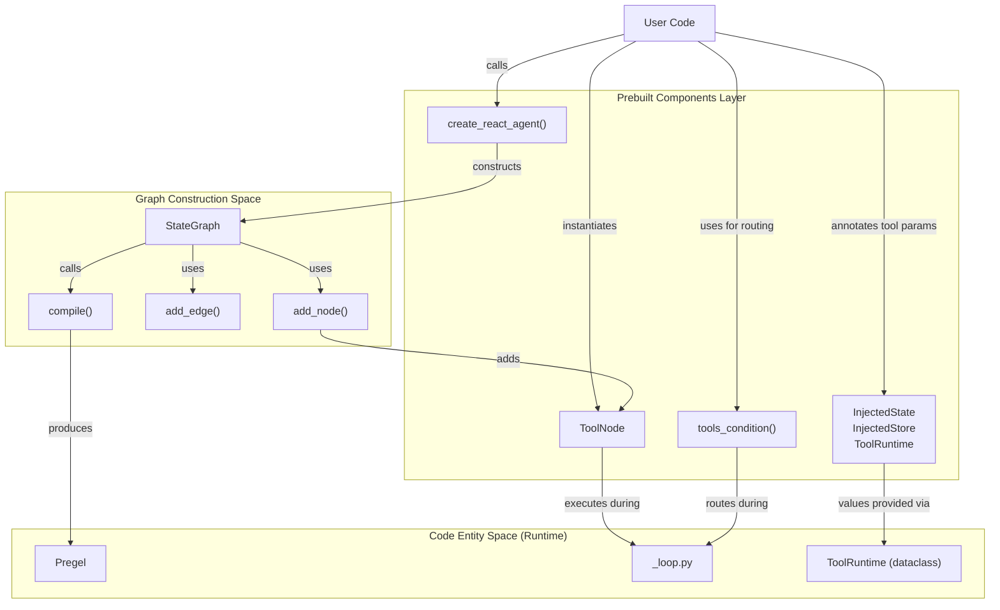
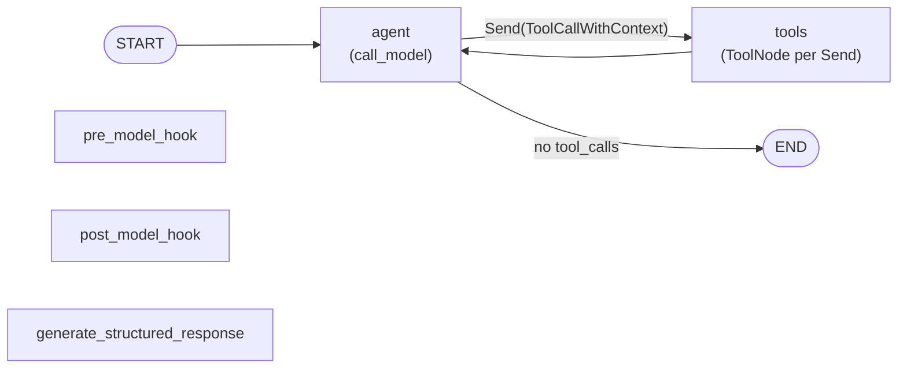
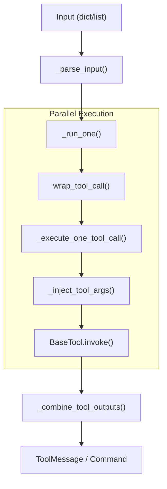

Prebuilt components provide high-level abstractions for common LangGraph patterns, primarily focusing on tool-using agents and tool execution infrastructure. These components abstract away graph construction details while remaining fully customizable through parameters and hooks.

For low-level graph construction APIs, see [StateGraph API](#3.1) and [Functional API (@task and @entrypoint)](#3.2). For deployment of prebuilt agents, see [CLI and Deployment](#6).

**Sources:** [libs/prebuilt/langgraph/prebuilt/__init__.py:1-22]()

## Overview

The prebuilt components module exports the following components from [libs/prebuilt/langgraph/prebuilt/__init__.py:1-22]():

| Component | Status | Purpose |
|-----------|--------|---------|
| `ToolNode` | Active | Execute tool calls with parallel execution, error handling, and injection |
| `tools_condition` | Active | Conditional routing based on tool call presence |
| `InjectedState` | Active | Annotation for injecting graph state into tools |
| `InjectedStore` | Active | Annotation for injecting `BaseStore` into tools |
| `ToolRuntime` | Active | Bundle of runtime context for tools |
| `create_react_agent` | **Deprecated** | Build ReAct agents — use `langchain.agents.create_agent` instead |
| `ValidationNode` | **Deprecated** | Validate tool calls against schemas — use `create_agent` with custom error handling |

> **Migration note:** `create_react_agent` and several related types (`AgentState`, `AgentStatePydantic`, `AgentStateWithStructuredResponse`) were moved to the `langchain` package as of `LangGraphDeprecatedSinceV10`. See the [Deprecated Components](#deprecated-components) section for details.

**Sources:** [libs/prebuilt/langgraph/prebuilt/__init__.py:1-22](), [libs/prebuilt/langgraph/prebuilt/chat_agent_executor.py:53-116](), [libs/prebuilt/langgraph/prebuilt/tool_validator.py:43-47]()

## Architecture: Prebuilt Components in Execution Pipeline

The following diagram bridges the gap between the high-level prebuilt abstractions and the underlying graph execution engine.



**Sources:** [libs/prebuilt/langgraph/prebuilt/chat_agent_executor.py:1-116](), [libs/prebuilt/langgraph/prebuilt/tool_node.py:1-1834](), [libs/prebuilt/langgraph/prebuilt/tool_node.py:1691-1710]()

## create_react_agent Function

> **Deprecated since `LangGraphDeprecatedSinceV10`.** Use [`create_agent`](https://docs.langchain.com/oss/python/migrate/langgraph-v1) from `langchain.agents` instead. The function remains available for backwards compatibility but will be removed in a future version.

The `create_react_agent` function constructs a `CompiledStateGraph` that implements the ReAct (Reasoning and Acting) pattern. It creates a graph with an agent node that calls an LLM and a tools node that executes tool calls.

For details, see [ReAct Agent (create_react_agent)](#8.1).

### Graph Structure

The compiled graph differs based on the `version` parameter. In v1, a single `ToolNode` receives all tool calls. In v2 (default), each individual tool call is dispatched to a separate node instance using the `Send` API (`ToolCallWithContext`), enabling parallel execution and correct pause/resume semantics.

**`create_react_agent` v2 graph topology**



**Sources:** [libs/prebuilt/langgraph/prebuilt/chat_agent_executor.py:843-853](), [libs/prebuilt/langgraph/prebuilt/tool_node.py:282-303]()

## ToolNode Class

`ToolNode` is a `RunnableCallable` that executes tool calls from language model outputs. It handles parallel execution, error handling, state injection, and control flow.

For details, see [ToolNode and Tool Execution](#8.2).

### Tool Execution Pipeline

`ToolNode` processes inputs (either as graph state or direct tool call lists) through a parallelized execution loop.



**Sources:** [libs/prebuilt/langgraph/prebuilt/tool_node.py:786-847](), [libs/prebuilt/langgraph/prebuilt/tool_node.py:1029-1163]()

## Dependency Injection System

`ToolNode` provides injection annotations that allow tools to receive system-provided values without the LLM needing to supply them. These are identified at initialization time by `_get_all_basemodel_annotations` or manual inspection.

| Annotation | Code Entity | Purpose |
|------------|-------------|---------|
| `InjectedState` | `langgraph.prebuilt.InjectedState` | Inject specific fields or the entire graph state into a tool parameter [libs/prebuilt/langgraph/prebuilt/tool_node.py:1495-1601]() |
| `InjectedStore` | `langgraph.prebuilt.InjectedStore` | Inject the `BaseStore` instance for cross-thread persistent storage [libs/prebuilt/langgraph/prebuilt/tool_node.py:1604-1688]() |
| `ToolRuntime` | `langgraph.prebuilt.ToolRuntime` | Inject a bundle containing `state`, `config`, `store`, and `stream_writer` [libs/prebuilt/langgraph/prebuilt/tool_node.py:1691-1834]() |

**Sources:** [libs/prebuilt/langgraph/prebuilt/tool_node.py:1495-1834](), [libs/prebuilt/tests/test_injected_state_not_required.py:1-117]()

## UI Integration

LangGraph provides specialized message types and functions for integrating graph state with user interfaces, allowing for transient UI updates that don't necessarily persist in the core message history.

For details, see [UI Integration](#8.3).

**Sources:** [libs/prebuilt/langgraph/prebuilt/tool_node.py:63-70]()

## Deprecated Components

Several components in this module are deprecated as of `LangGraphDeprecatedSinceV10` and will be removed in a future major version.

### create_react_agent

Deprecated in favor of `create_agent` from `langchain.agents`. The underlying graph construction logic and `ToolNode` integration remain in this package for compatibility.

**Sources:** [libs/prebuilt/langgraph/prebuilt/chat_agent_executor.py:274-278]()

### AgentState / AgentStatePydantic

The default state schemas used by `create_react_agent` define `messages` (with `add_messages` reducer) and `remaining_steps` fields. Both moved to `langchain.agents`.

**Sources:** [libs/prebuilt/langgraph/prebuilt/chat_agent_executor.py:53-116]()

### ValidationNode

`ValidationNode` validated tool calls against Pydantic schemas without executing them. Deprecated in favor of using `create_agent` with custom tool error handling.

**Sources:** [libs/prebuilt/langgraph/prebuilt/tool_validator.py:43-114]()

## Testing Utilities

Test files demonstrate common patterns for using prebuilt components outside graph context, specifically requiring a mock `Runtime` or `ToolRuntime` to be provided in the `RunnableConfig`.

```python
def _create_mock_runtime(store: BaseStore | None = None) -> Mock:
    mock_runtime = Mock()
    mock_runtime.store = store
    mock_runtime.context = None
    mock_runtime.stream_writer = lambda *args, **kwargs: None
    return mock_runtime

def _create_config_with_runtime(store: BaseStore | None = None) -> RunnableConfig:
    return {"configurable": {"__pregel_runtime": _create_mock_runtime(store)}}
```

**Sources:** [libs/prebuilt/tests/test_react_agent.py:67-87](), [libs/prebuilt/tests/test_tool_node.py:55-75](), [libs/prebuilt/tests/test_injected_state_not_required.py:48-80]()