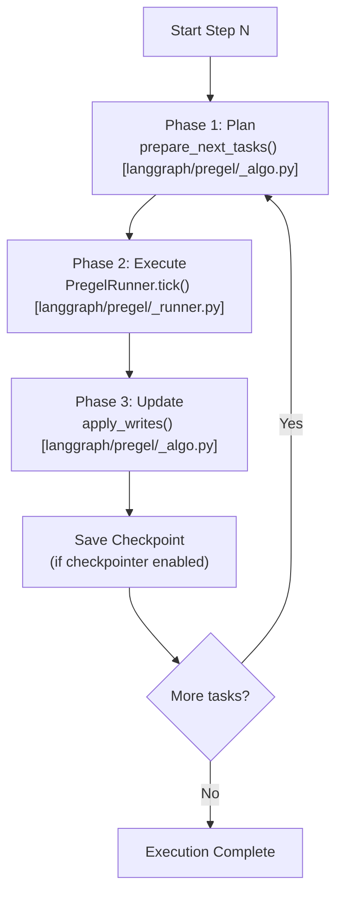
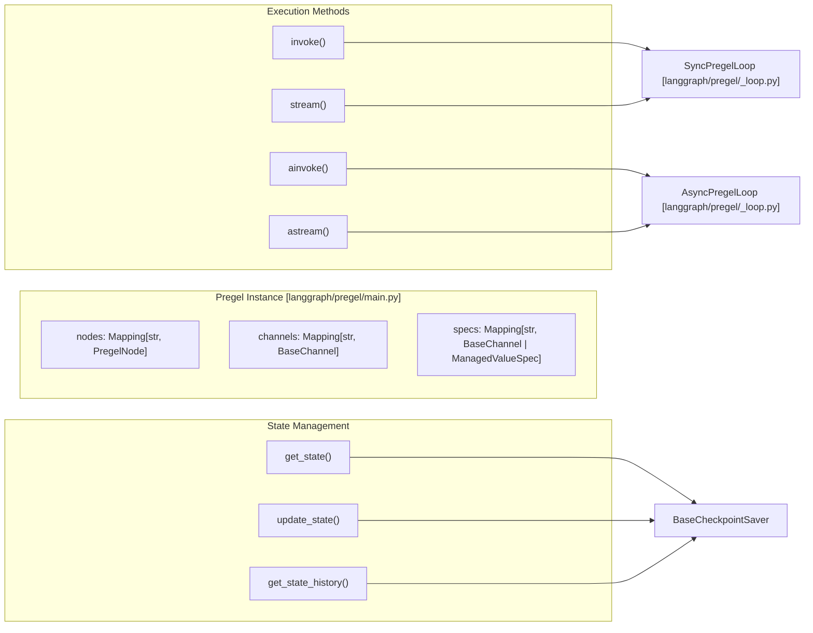
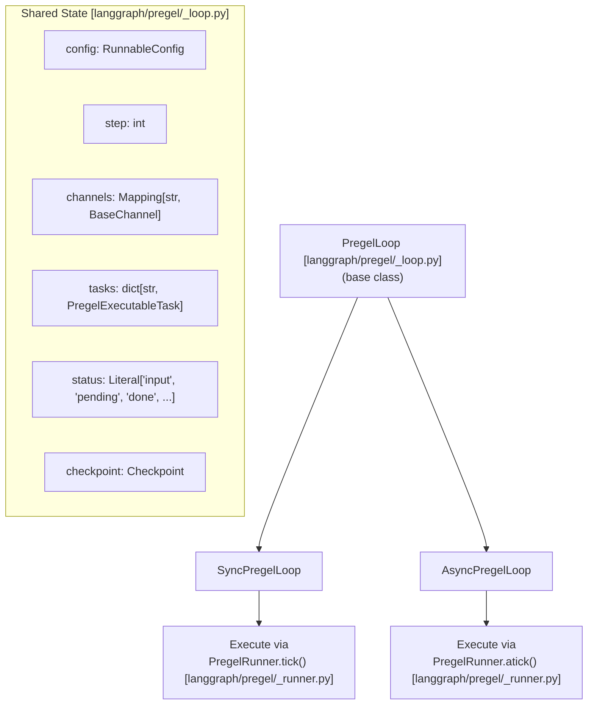
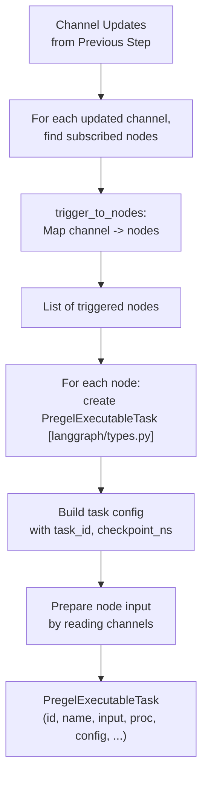

The Pregel execution engine is the core runtime that orchestrates graph execution in LangGraph. It implements a **Bulk Synchronous Parallel (BSP)** model inspired by Google's Pregel algorithm, managing the step-by-step execution of nodes, task scheduling, parallel execution, and state synchronization through channels.

For information about building graphs using the StateGraph API, see [StateGraph API](). For information about the functional API, see [Functional API (@task and @entrypoint)](). For information about state management and channels, see [State Management and Channels]().

## Purpose and Scope

This document covers the internal execution mechanics of the Pregel engine:
- The Bulk Synchronous Parallel execution model
- The `Pregel` class and `PregelLoop` execution lifecycle
- Task scheduling and preparation (`prepare_next_tasks`)
- Parallel task execution via `PregelRunner` and `PregelRunner.tick`
- Runtime state injection via the `Runtime` and `ExecutionInfo` classes
- Integration with checkpointing and durability modes

This does not cover graph construction (see [StateGraph API]()), control flow primitives (see [Control Flow Primitives]()), or interrupt handling (see [Human-in-the-Loop and Interrupts]()).

## Execution Model Overview

The Pregel engine follows the **Bulk Synchronous Parallel (BSP)** model, where execution proceeds in discrete steps. Each step consists of three phases:

**Phase 1: Plan** — Determines which nodes to execute by examining channel updates from the previous step. The `prepare_next_tasks` function selects nodes whose trigger channels were updated.

**Phase 2: Execute** — Runs all selected tasks in parallel using `PregelRunner`. Tasks execute concurrently but cannot see each other's writes until the next step.

**Phase 3: Update** — Applies all writes from completed tasks to channels using `apply_writes`. Updates are atomic within a step.

### Pregel Execution Loop Diagram

Sources: [libs/langgraph/langgraph/pregel/main.py:336-360](), [libs/langgraph/langgraph/pregel/_loop.py:142-206](), [libs/langgraph/langgraph/pregel/_algo.py:121-122](), [libs/langgraph/langgraph/pregel/_runner.py:140-152]()

## Core Components

### Pregel Class

The `Pregel` class is the main entry point for graph execution. It extends `PregelProtocol` and manages the overall execution lifecycle.

**Pregel System Components**

Key attributes:
- `nodes` — Map of node names to `PregelNode` instances [libs/langgraph/langgraph/pregel/main.py:332-500]()
- `channels` — Map of channel names to `BaseChannel` instances [libs/langgraph/langgraph/pregel/main.py:332-500]()
- `checkpointer` — Optional `BaseCheckpointSaver` for persistence [libs/langgraph/langgraph/pregel/main.py:332-500]()
- `retry_policy` — Default retry configuration for all nodes [libs/langgraph/langgraph/pregel/main.py:332-500]()

Sources: [libs/langgraph/langgraph/pregel/main.py:332-500](), [libs/langgraph/langgraph/pregel/_loop.py:158-160]()

### PregelLoop and Execution Variants

Execution is delegated to either `SyncPregelLoop` or `AsyncPregelLoop` depending on the invocation method. These classes manage the state machine of the BSP loop.

The `PregelLoop` manages:
- **Step tracking** — Current step number and maximum steps (`recursion_limit`) [libs/langgraph/langgraph/pregel/_loop.py:142-244]()
- **Channel state** — Current values in all channels [libs/langgraph/langgraph/pregel/_loop.py:190-192]()
- **Task queue** — Tasks scheduled for the current step [libs/langgraph/langgraph/pregel/_loop.py:209-210]()
- **Status** — Execution state (input, pending, done, interrupt, etc.) [libs/langgraph/langgraph/pregel/_loop.py:201-208]()

Sources: [libs/langgraph/langgraph/pregel/_loop.py:142-244](), [libs/langgraph/langgraph/pregel/_loop.py:697-894](), [libs/langgraph/langgraph/pregel/_loop.py:897-1113]()

## Runtime and Execution Metadata

The `Runtime` class (added in v0.6.0) provides nodes with access to execution-scoped metadata and utilities.

| Class | Purpose | Key Fields |
|-------|---------|------------|
| `Runtime` | Bundles run-scoped context | `context`, `store`, `stream_writer`, `execution_info` |
| `ExecutionInfo` | Read-only execution metadata | `checkpoint_id`, `task_id`, `node_attempt`, `node_first_attempt_time` |
| `ServerInfo` | LangGraph Server metadata | `assistant_id`, `graph_id`, `user` |

Nodes can access this by adding a `runtime: Runtime` parameter or calling `get_runtime()`.

Sources: [libs/langgraph/langgraph/runtime.py:24-56](), [libs/langgraph/langgraph/runtime.py:89-187](), [libs/langgraph/tests/test_runtime.py:13-32]()

## Task Preparation and Scheduling

### prepare_next_tasks Function

The `prepare_next_tasks` function determines which nodes to execute in the current step by building a list of `PregelExecutableTask` objects.

**PregelExecutableTask Structure:**

| Field | Type | Description |
|-------|------|-------------|
| `id` | `str` | Unique task identifier (deterministic UUID) |
| `name` | `str` | Node name |
| `input` | `Any` | Input data for the node |
| `proc` | `Runnable` | The actual node to execute |
| `writes` | `deque` | Queue to collect writes |
| `retry_policy` | `Sequence[RetryPolicy]` | Retry configuration |

Sources: [libs/langgraph/langgraph/pregel/_algo.py:442-698](), [libs/langgraph/langgraph/types.py:537-551]()

## Parallel Execution and Retries

### PregelRunner and tick()

The `PregelRunner` executes tasks concurrently. The `tick()` method manages the execution of a batch of tasks, yielding control back to the loop when results are ready.

**Execution Flow:**
1. **Submit tasks** — All tasks are submitted to the executor via `self.submit()` [libs/langgraph/langgraph/pregel/_runner.py:206-224]()
2. **Parallel execution** — Tasks run concurrently using `run_with_retry` [libs/langgraph/langgraph/pregel/_runner.py:167-180]()
3. **Commit writes** — Once a task completes, its writes are committed via `self.commit()` [libs/langgraph/langgraph/pregel/_runner.py:181-183]()

Sources: [libs/langgraph/langgraph/pregel/_runner.py:122-224](), [libs/langgraph/langgraph/pregel/_executor.py:1-100]()

### Retry Logic

`run_with_retry` and `arun_with_retry` implement the retry logic for individual nodes.

- **Attempt Tracking**: Increments `node_attempt` in `ExecutionInfo` for each try [libs/langgraph/langgraph/pregel/_retry.py:112-121]().
- **Exception Filtering**: Uses `_should_retry_on` to check if an exception matches the `RetryPolicy` [libs/langgraph/langgraph/pregel/_retry.py:151-158]().
- **Backoff**: Calculates sleep time using `initial_interval`, `backoff_factor`, and `jitter` [libs/langgraph/langgraph/pregel/_retry.py:166-177]().

Sources: [libs/langgraph/langgraph/pregel/_retry.py:86-187](), [libs/langgraph/tests/test_retry.py:27-80]()

## State Updates and Channel Synchronization

### apply_writes Function

After all tasks complete, `apply_writes` applies their writes to channels atomically.

**Write Application Rules:**
1. **LastValue channels** — Only one write per channel per step is allowed unless it's an overwrite [libs/langgraph/langgraph/pregel/_algo.py:324-440]().
2. **Topic channels** — Accumulates all writes into a sequence [libs/langgraph/langgraph/channels/topic.py:1-100]().
3. **BinaryOperatorAggregate** — Reduces multiple writes using the configured operator [libs/langgraph/langgraph/pregel/_algo.py:324-440]().

Sources: [libs/langgraph/langgraph/pregel/_algo.py:324-440](), [libs/langgraph/langgraph/pregel/_loop.py:395-550]()

### Checkpoint Durability

The loop saves checkpoints between steps based on `Durability` [libs/langgraph/langgraph/_internal/_constants.py:63-64]():
- `sync`: Blocks until checkpoint is saved.
- `async`: Continues execution while checkpoint saves in the background.
- `exit`: Only saves at the end of the run.

Sources: [libs/langgraph/langgraph/pregel/_loop.py:395-550](), [libs/langgraph/langgraph/types.py:85-91]()