class CustomStatePydantic(AgentStatePydantic):
    user_id: str
    context: dict = {}
```

The function validates that required keys exist when `state_schema` is provided, raising `ValueError` if keys are missing. [libs/prebuilt/langgraph/prebuilt/chat_agent_executor.py:548-552]()

**InjectedState Handling**: When using `InjectedState` on tool parameters with `NotRequired` fields in a `TypedDict` state, `ToolNode` handles missing fields by injecting `None` instead of raising a `KeyError`. [libs/prebuilt/tests/test_injected_state_not_required.py:87-116]()

**Sources**: [libs/prebuilt/langgraph/prebuilt/chat_agent_executor.py:538-552](), [libs/prebuilt/tests/test_react_agent.py:525-596](), [libs/prebuilt/tests/test_injected_state_not_required.py:1-46]()

---

## Model Configuration

### Static Model

A static model is provided directly as a `BaseChatModel` instance or string identifier. [libs/prebuilt/langgraph/prebuilt/chat_agent_executor.py:568-588]()

```python
# ChatModel instance
agent = create_react_agent(ChatOpenAI(model="gpt-4"), tools)

# String identifier (requires langchain package)
agent = create_react_agent("openai:gpt-4", tools)
```

The function automatically binds tools to the model unless already bound via `model.bind_tools()`. [libs/prebuilt/langgraph/prebuilt/chat_agent_executor.py:587-588]()

**Sources**: [libs/prebuilt/langgraph/prebuilt/chat_agent_executor.py:568-588]()

### Dynamic Model Selection

A callable can be provided that returns a model based on runtime state and context:

```python
def select_model(state: AgentState, runtime: Runtime[ModelContext]) -> BaseChatModel:
    model_name = runtime.context.model_name
    if model_name == "gpt-4":
        return ChatOpenAI(model="gpt-4").bind_tools(tools)
    else:
        return ChatOpenAI(model="gpt-3.5-turbo").bind_tools(tools)

agent = create_react_agent(select_model, tools, context_schema=ModelContext)
```

The callable receives `state` and `runtime`. [libs/prebuilt/langgraph/prebuilt/chat_agent_executor.py:563-567]() Both sync and async callables are supported. The function detects async callables via `inspect.iscoroutinefunction()` and uses appropriate async resolution. [libs/prebuilt/langgraph/prebuilt/chat_agent_executor.py:599-618]()

**Sources**: [libs/prebuilt/langgraph/prebuilt/chat_agent_executor.py:563-618]()

### Model Resolution Flow

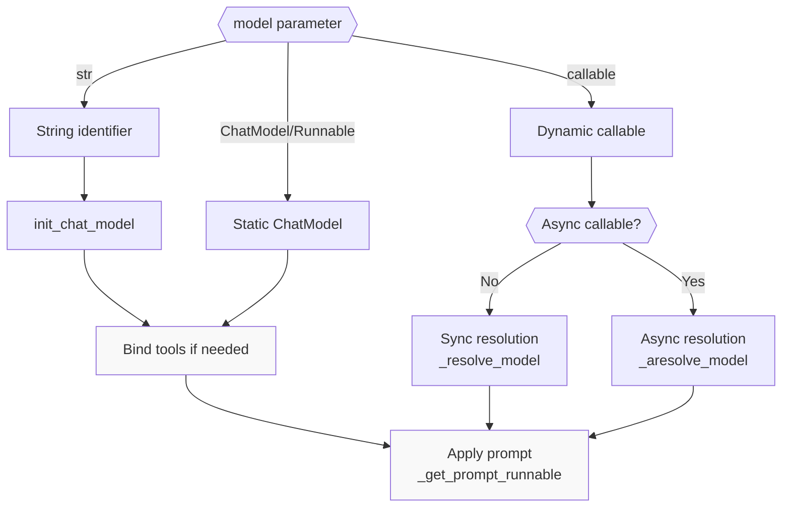

**Diagram: Model Resolution and Binding Process**

**Sources**: [libs/prebuilt/langgraph/prebuilt/chat_agent_executor.py:599-618]()

---

## Prompt Configuration

The `prompt` parameter supports multiple formats:

### Prompt Format Types

| Format | Type | Behavior |
|--------|------|----------|
| `None` | Default | Passes `state["messages"]` directly to model. [libs/prebuilt/langgraph/prebuilt/chat_agent_executor.py:139-142]() |
| `str` | String | Converted to `SystemMessage` and prepended to messages. [libs/prebuilt/langgraph/prebuilt/chat_agent_executor.py:143-148]() |
| `SystemMessage` | Message | Prepended to messages list. [libs/prebuilt/langgraph/prebuilt/chat_agent_executor.py:149-153]() |
| `Callable` | Function | Called with state, returns `LanguageModelInput`. [libs/prebuilt/langgraph/prebuilt/chat_agent_executor.py:160-164]() |
| `Runnable` | Runnable | Invoked with state, returns `LanguageModelInput`. [libs/prebuilt/langgraph/prebuilt/chat_agent_executor.py:165-166]() |

**Sources**: [libs/prebuilt/langgraph/prebuilt/chat_agent_executor.py:119-127, 137-170]()

### Prompt with Store Access

Prompts can access the persistent store for user-specific context:

```python
def prompt_with_store(state, config, *, store):
    user_id = config["configurable"]["user_id"]
    user_data = store.get(("memories", user_id), "user_name")
    system_msg = SystemMessage(user_data.value["data"])
    return [system_msg] + state["messages"]

agent = create_react_agent(
    model,
    tools,
    prompt=prompt_with_store,
    store=InMemoryStore()
)
```

The store parameter is injected via runtime dependency injection when the prompt callable signature includes `store`. [libs/prebuilt/tests/test_react_agent.py:207-251]()

**Sources**: [libs/prebuilt/tests/test_react_agent.py:207-251]()

---

## Agent Node Implementation

### call_model and acall_model Functions

The `agent` node executes one of two functions:

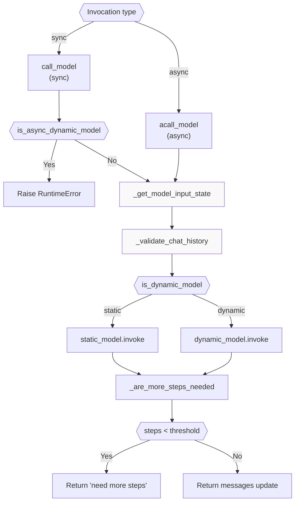

**Diagram: Agent Node Execution Logic**

The `call_model` function performs input validation via `_get_model_input_state` [libs/prebuilt/langgraph/prebuilt/chat_agent_executor.py:636-659]() and `_validate_chat_history`. [libs/prebuilt/langgraph/prebuilt/chat_agent_executor.py:672]() It then invokes the model and performs a step limit check via `_are_more_steps_needed`. [libs/prebuilt/langgraph/prebuilt/chat_agent_executor.py:684-692]()

**Sources**: [libs/prebuilt/langgraph/prebuilt/chat_agent_executor.py:661-721]()

### Message History Validation

The `_validate_chat_history` function ensures all tool calls have corresponding tool messages. [libs/prebuilt/langgraph/prebuilt/chat_agent_executor.py:243-271]()

```python
def _validate_chat_history(messages: Sequence[BaseMessage]) -> None:
    """Validate that all tool calls in AIMessages have a corresponding ToolMessage."""
    all_tool_calls = [
        tool_call
        for message in messages
        if isinstance(message, AIMessage)
        for tool_call in message.tool_calls
    ]
    tool_call_ids_with_results = {
        message.tool_call_id for message in messages if isinstance(message, ToolMessage)
    }
    tool_calls_without_results = [
        tool_call
        for tool_call in all_tool_calls
        if tool_call["id"] not in tool_call_ids_with_results
    ]
    if tool_calls_without_results:
        # Raises ValueError with error code INVALID_CHAT_HISTORY
```

**Sources**: [libs/prebuilt/langgraph/prebuilt/chat_agent_executor.py:243-271]()

### Remaining Steps Check

The `_are_more_steps_needed` function prevents infinite loops by checking `remaining_steps`. [libs/prebuilt/langgraph/prebuilt/chat_agent_executor.py:620-634]()

```python
def _are_more_steps_needed(state: StateSchema, response: BaseMessage) -> bool:
    has_tool_calls = isinstance(response, AIMessage) and response.tool_calls
    all_tools_return_direct = (
        all(call["name"] in should_return_direct for call in response.tool_calls)
        if isinstance(response, AIMessage)
        else False
    )
    remaining_steps = _get_state_value(state, "remaining_steps", None)
    if remaining_steps is not None:
        if remaining_steps < 1 and all_tools_return_direct:
            return True
        elif remaining_steps < 2 and has_tool_calls:
            return True
    return False
```

When remaining steps are insufficient, the agent returns a message: `"Sorry, need more steps to process this request."` [libs/prebuilt/langgraph/prebuilt/chat_agent_executor.py:688]()

**Sources**: [libs/prebuilt/langgraph/prebuilt/chat_agent_executor.py:620-634, 684-692]()

---

## Pre-Model and Post-Model Hooks

### Pre-Model Hook

The `pre_model_hook` executes before the agent node on every iteration. [libs/prebuilt/langgraph/prebuilt/chat_agent_executor.py:876-881]() Common use cases include message trimming or context injection. [libs/prebuilt/langgraph/prebuilt/chat_agent_executor.py:396-424]()

```python
def trim_messages(state):
    messages = state["messages"]
    # Keep only last 10 messages
    return {
        "messages": [RemoveMessage(id=REMOVE_ALL_MESSAGES)] + messages[-10:],
    }

agent = create_react_agent(model, tools, pre_model_hook=trim_messages)
```

**Sources**: [libs/prebuilt/langgraph/prebuilt/chat_agent_executor.py:396-424, 724-742, 876-881]()

### Post-Model Hook

The `post_model_hook` executes after the agent node. [libs/prebuilt/langgraph/prebuilt/chat_agent_executor.py:890-895]() Use cases include human-in-the-loop approval or response validation. Available only with `version="v2"`. [libs/prebuilt/langgraph/prebuilt/chat_agent_executor.py:425-430]()

```python
def require_approval(state):
    last_message = state["messages"][-1]
    if last_message.tool_calls:
        # Pause for approval
        approved = interrupt("Approve tool calls?")
        if not approved:
            return Command(goto=END)
    return state

agent = create_react_agent(
    model, 
    tools, 
    post_model_hook=require_approval,
    version="v2"
)
```

**Sources**: [libs/prebuilt/langgraph/prebuilt/chat_agent_executor.py:425-430, 890-895]()

### Hook Routing Logic

When `post_model_hook` is present, routing becomes more complex:

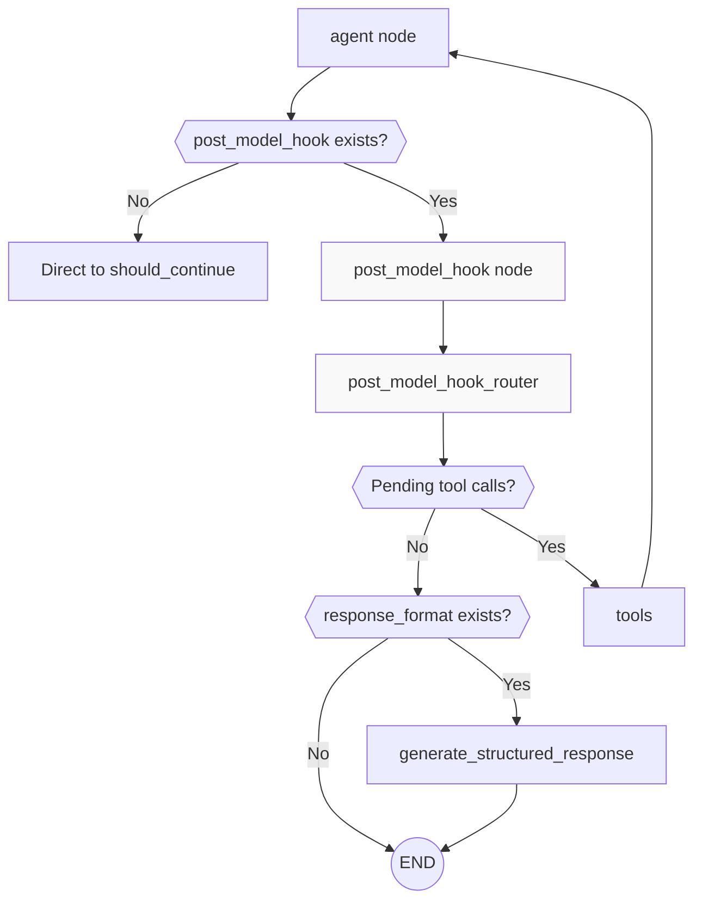

**Diagram: Post-Model Hook Routing Flow**

The `post_model_hook_router` checks for pending tool calls by comparing tool call IDs in AI messages against existing tool messages. [libs/prebuilt/langgraph/prebuilt/chat_agent_executor.py:917-943]()

**Sources**: [libs/prebuilt/langgraph/prebuilt/chat_agent_executor.py:917-943]()

---

## Structured Response Generation

When `response_format` is provided, the agent generates structured output after the agent loop completes. [libs/prebuilt/langgraph/prebuilt/chat_agent_executor.py:744-786]()

### Generation Process

```python
def generate_structured_response(
    state: StateSchema, runtime: Runtime[ContextT], config: RunnableConfig
) -> StateSchema:
    messages = _get_state_value(state, "messages")
    structured_response_schema = response_format
    if isinstance(response_format, tuple):
        system_prompt, structured_response_schema = response_format
        messages = [SystemMessage(content=system_prompt)] + list(messages)

    resolved_model = _resolve_model(state, runtime)
    model_with_structured_output = _get_model(
        resolved_model
    ).with_structured_output(structured_response_schema)
    response = model_with_structured_output.invoke(messages, config)
    return {"structured_response": response}
```

The structured response is stored in `state["structured_response"]`. [libs/prebuilt/langgraph/prebuilt/chat_agent_executor.py:785]()

**Sources**: [libs/prebuilt/langgraph/prebuilt/chat_agent_executor.py:744-786, 898-910]()

### State Schema Requirements

When using `response_format`, the state schema must include a `structured_response` key. [libs/prebuilt/langgraph/prebuilt/chat_agent_executor.py:538-552]()

```python
class AgentStateWithStructuredResponse(AgentState):
    structured_response: StructuredResponse  # dict | BaseModel
```

**Sources**: [libs/prebuilt/langgraph/prebuilt/chat_agent_executor.py:88-91, 538-552]()

---

## Version Differences: v1 vs v2

### Version 1: Batch Tool Execution

In `version="v1"`, the `ToolNode` receives a single message containing all tool calls and executes them in parallel within one node invocation. [libs/prebuilt/langgraph/prebuilt/chat_agent_executor.py:844-845]()

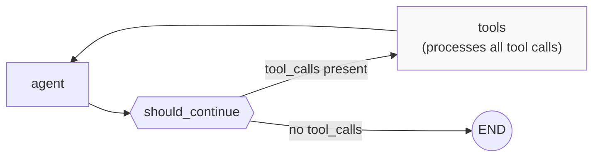

**Diagram: Version 1 Tool Execution Flow**

**Sources**: [libs/prebuilt/langgraph/prebuilt/chat_agent_executor.py:844-845]()

### Version 2: Distributed Tool Execution

In `version="v2"`, each tool call is distributed to a separate `ToolNode` instance using the `Send` API. [libs/prebuilt/langgraph/prebuilt/chat_agent_executor.py:846-859]()

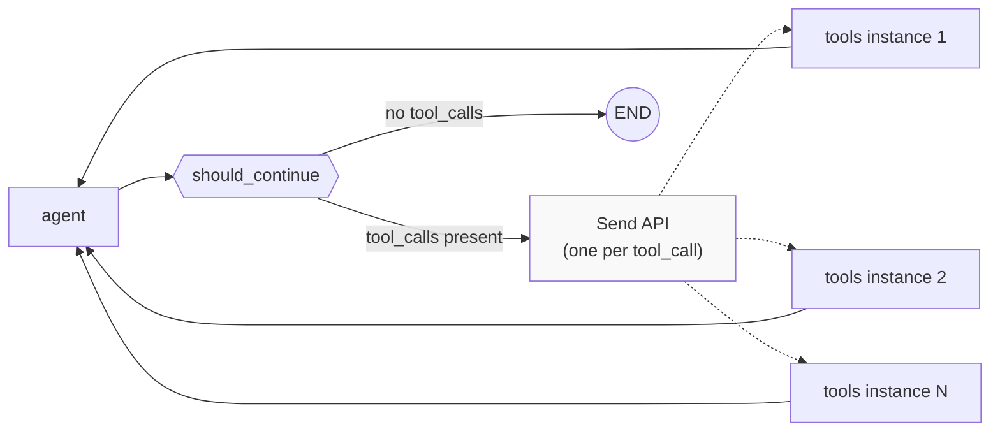

**Diagram: Version 2 Tool Execution with Send API**

The `should_continue` function returns a list of `Send` objects. [libs/prebuilt/langgraph/prebuilt/chat_agent_executor.py:853-858]()

**Sources**: [libs/prebuilt/langgraph/prebuilt/chat_agent_executor.py:846-859]()

---

## Tool Binding and Validation

### Tool Binding Logic

The `_should_bind_tools` function determines whether to bind tools to the model by checking existing `RunnableBinding` kwargs. [libs/prebuilt/langgraph/prebuilt/chat_agent_executor.py:173-217]()

**Sources**: [libs/prebuilt/langgraph/prebuilt/chat_agent_executor.py:173-217]()

### Built-in Tools

The factory supports built-in tools (e.g., MCP tools) passed as dicts. [libs/prebuilt/langgraph/prebuilt/chat_agent_executor.py:554-561]()

**Sources**: [libs/prebuilt/langgraph/prebuilt/chat_agent_executor.py:554-561](), [libs/prebuilt/tests/test_react_agent.py:312-327]()

---

## Execution Patterns

### Basic Invocation

```python
agent = create_react_agent(model, [tool1, tool2])
result = agent.invoke({"messages": [HumanMessage("What's the weather?")]})
```

**Sources**: [libs/prebuilt/tests/test_react_agent.py:91-104]()

### Human-in-the-Loop with Interrupts

```python
@dec_tool
def sensitive_action(x: int) -> Command:
    approval = interrupt("Approve this action?")
    if approval:
        return Command(update={"messages": [ToolMessage("Done", tool_call_id=...)]})
    else:
        return Command(goto=END)

agent = create_react_agent(model, [sensitive_action], checkpointer=checkpointer)
agent.invoke({"messages": [("user", "do action")]}, config)
agent.invoke(Command(resume=True), config)
```

**Sources**: [libs/prebuilt/tests/test_react_agent.py:533-596]()

---

## Graph Construction Code Mapping

| Concept | Code Entity | Location |
|---------|-------------|----------|
| Factory function | `create_react_agent()` | [libs/prebuilt/langgraph/prebuilt/chat_agent_executor.py:278]() |
| Default state | `AgentState` TypedDict | [libs/prebuilt/langgraph/prebuilt/chat_agent_executor.py:57]() |
| Agent node function | `call_model()` / `acall_model()` | [libs/prebuilt/langgraph/prebuilt/chat_agent_executor.py:661, 696]() |
| Tool routing | `should_continue()` | [libs/prebuilt/langgraph/prebuilt/chat_agent_executor.py:831]() |
| Prompt processing | `_get_prompt_runnable()` | [libs/prebuilt/langgraph/prebuilt/chat_agent_executor.py:137]() |
| Message validation | `_validate_chat_history()` | [libs/prebuilt/langgraph/prebuilt/chat_agent_executor.py:243]() |
| Step limit check | `_are_more_steps_needed()` | [libs/prebuilt/langgraph/prebuilt/chat_agent_executor.py:620]() |
| Structured output | `generate_structured_response()` | [libs/prebuilt/langgraph/prebuilt/chat_agent_executor.py:744]() |
| Graph builder | `StateGraph` | [libs/prebuilt/langgraph/prebuilt/chat_agent_executor.py:789, 862]() |

**Sources**: [libs/prebuilt/langgraph/prebuilt/chat_agent_executor.py:1-943]()

# ToolNode and Tool Execution


## Purpose and Scope

This page documents the `ToolNode` class and the tool execution system in LangGraph's prebuilt components. `ToolNode` is a sophisticated execution engine that handles tool invocation, dependency injection, error handling, and control flow for agent workflows.

`ToolNode` provides the low-level tool execution machinery used by higher-level components. For information about building complete ReAct-style agents that use `ToolNode` internally, see [ReAct Agent (create_react_agent)](8.1). For UI-related tool patterns, see [UI Integration](8.3).

**Sources:** [libs/prebuilt/langgraph/prebuilt/tool_node.py:1-38]()

---

## Core Components

### ToolNode Class

`ToolNode` extends `RunnableCallable` to execute tools in LangGraph workflows with parallel execution, dependency injection, and configurable error handling.

**Constructor signature:**
```python
ToolNode(
    tools: Sequence[BaseTool | Callable],
    name: str = "tools",
    tags: list[str] | None = None,
    handle_tool_errors: bool | str | Callable | type[Exception] | tuple = _default_handle_tool_errors,
    messages_key: str = "messages",
    wrap_tool_call: ToolCallWrapper | None = None,
    awrap_tool_call: AsyncToolCallWrapper | None = None,
)
```

**Key attributes:**
- `_tools_by_name: dict[str, BaseTool]` - Maps tool names to tool instances [[libs/prebuilt/langgraph/prebuilt/tool_node.py:773-781]()]
- `_injected_args: dict[str, _InjectedArgs]` - Cached injection metadata per tool [[libs/prebuilt/langgraph/prebuilt/tool_node.py:773-781]()]
- `_handle_tool_errors` - Error handling configuration [[libs/prebuilt/langgraph/prebuilt/tool_node.py:769-769]()]
- `_messages_key` - State key for message list (default: `"messages"`) [[libs/prebuilt/langgraph/prebuilt/tool_node.py:770-770]()]
- `_wrap_tool_call` / `_awrap_tool_call` - Optional interceptor functions [[libs/prebuilt/langgraph/prebuilt/tool_node.py:771-772]()]

**Key methods:**
- `_func(input, config, runtime)` - Synchronous execution entry point [[libs/prebuilt/langgraph/prebuilt/tool_node.py:787-817]()]
- `_afunc(input, config, runtime)` - Asynchronous execution entry point [[libs/prebuilt/langgraph/prebuilt/tool_node.py:819-848]()]
- `_parse_input(input)` - Extracts tool calls from input (dict/list/ToolCall[]) [[libs/prebuilt/langgraph/prebuilt/tool_node.py:916-976]()]
- `_run_one(call, input_type, tool_runtime)` - Executes single tool call [[libs/prebuilt/langgraph/prebuilt/tool_node.py:978-1001]()]
- `_execute_tool_call(request)` - Core execution logic with validation and injection [[libs/prebuilt/langgraph/prebuilt/tool_node.py:1059-1130]()]
- `_combine_tool_outputs(outputs, input_type)` - Formats results by input type [[libs/prebuilt/langgraph/prebuilt/tool_node.py:850-914]()]

**Sources:** [libs/prebuilt/langgraph/prebuilt/tool_node.py:616-1130]()

### ToolRuntime

`ToolRuntime` is a dataclass that bundles runtime context for injection into tools. It provides access to state, tool call metadata, and graph utilities.

**ToolRuntime Structure:**

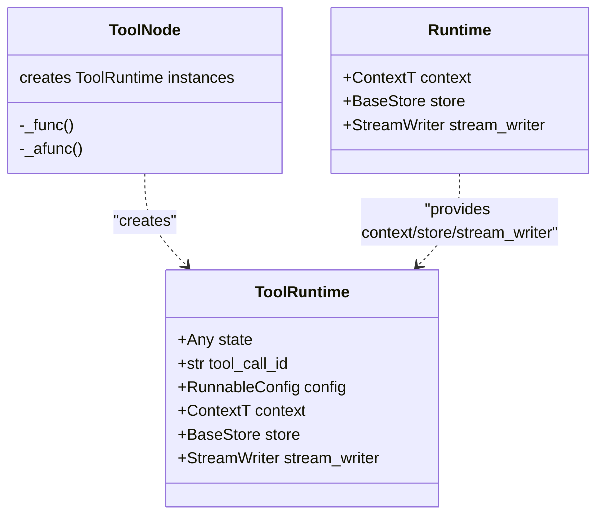

**Sources:** [libs/prebuilt/langgraph/prebuilt/tool_node.py:21-22](), [libs/prebuilt/langgraph/prebuilt/tool_node.py:796-808](), [libs/prebuilt/langgraph/prebuilt/tool_node.py:829-840]()

### Dependency Injection Annotations

Three primary annotations enable dependency injection into tool arguments:

| Annotation | Purpose | Example |
|------------|---------|---------|
| `InjectedState` | Inject entire state or specific field | `state: Annotated[dict, InjectedState]` |
| `InjectedStore` | Inject persistent store | `store: Annotated[BaseStore, InjectedStore()]` |
| `ToolRuntime` | Inject complete runtime bundle | `runtime: ToolRuntime` |

**Sources:** [libs/prebuilt/langgraph/prebuilt/__init__.py:1-22](), [libs/prebuilt/langgraph/prebuilt/tool_node.py:562-614]()

### tools_condition

`tools_condition` is a utility function for conditional routing based on whether the last message contains tool calls. It returns `"tools"` if tool calls are present, otherwise `END`.

**Sources:** [libs/prebuilt/langgraph/prebuilt/tool_node.py:1230-1254]()

---

## Tool Execution Architecture

The following diagram illustrates how tool calls flow through the `ToolNode` execution pipeline:

**Tool Execution Flow**

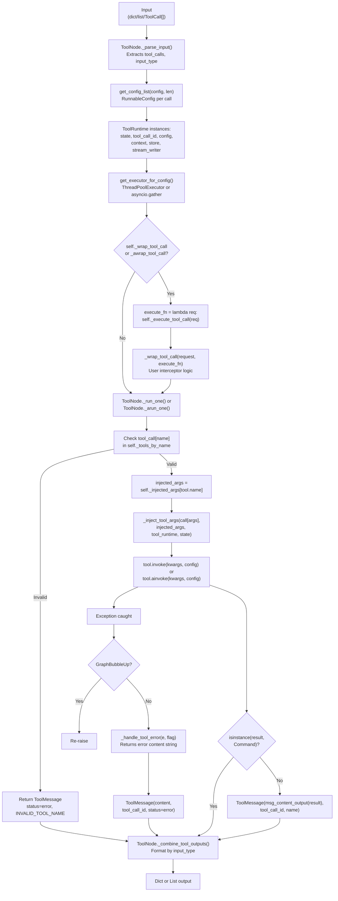

**Sources:** [libs/prebuilt/langgraph/prebuilt/tool_node.py:787-848](), [libs/prebuilt/langgraph/prebuilt/tool_node.py:916-1057]()

---

## Input and Output Formats

### Input Formats

`ToolNode` handles three primary input formats via `_parse_input()`:

**1. Graph State Dictionary**
```python
{
    "messages": [
        AIMessage("", tool_calls=[
            {"name": "tool1", "args": {"x": 1}, "id": "call_1"}
        ])
    ]
}
```

**2. Message List**
```python
[
    AIMessage("", tool_calls=[
        {"name": "tool1", "args": {"x": 1}, "id": "call_1"}
    ])
]
```

**3. Direct Tool Calls**
```python
[
    {"name": "tool1", "args": {"x": 1}, "id": "call_1", "type": "tool_call"}
]
```

**Sources:** [libs/prebuilt/langgraph/prebuilt/tool_node.py:631-656](), [libs/prebuilt/langgraph/prebuilt/tool_node.py:916-976]()

### Output Formats

Output is formatted by `_combine_tool_outputs()` based on the detected `input_type`:

- **Dict input:** Returns `{"messages": [ToolMessage(...)]}` [[libs/prebuilt/langgraph/prebuilt/tool_node.py:850-865]()]
- **List input:** Returns `[ToolMessage(...)]` [[libs/prebuilt/langgraph/prebuilt/tool_node.py:866-871]()]
- **Command output:** If tools return `Command` objects, they are returned directly in the list [[libs/prebuilt/langgraph/prebuilt/tool_node.py:850-914]()]

**Sources:** [libs/prebuilt/langgraph/prebuilt/tool_node.py:850-914]()

---

## Dependency Injection System

### Architecture

The injection system analyzes tool signatures during initialization and stores metadata in `_injected_args`.

**Dependency Injection Flow**

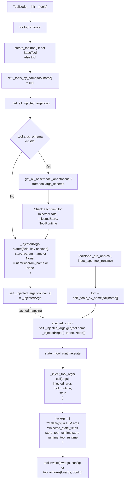

**Sources:** [libs/prebuilt/langgraph/prebuilt/tool_node.py:737-781](), [libs/prebuilt/langgraph/prebuilt/tool_node.py:1132-1228](), [libs/prebuilt/langgraph/prebuilt/tool_node.py:562-614](), [libs/prebuilt/langgraph/prebuilt/tool_node.py:1059-1130]()

### Validation Error Filtering

`ToolNode` implements `_filter_validation_errors()` to remove injected arguments from Pydantic `ValidationError` messages. This ensures the LLM only receives feedback about parameters it controls [[libs/prebuilt/langgraph/prebuilt/tool_node.py:506-560]()].

**Validation Error Processing:**

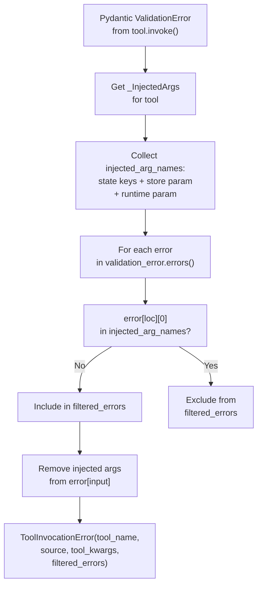

**Sources:** [libs/prebuilt/langgraph/prebuilt/tool_node.py:506-560](), [libs/prebuilt/tests/test_tool_node_validation_error_filtering.py:1-471]()

---

## Error Handling

### Configuration Strategies

The `handle_tool_errors` parameter supports several modes [[libs/prebuilt/langgraph/prebuilt/tool_node.py:668-690]()]:

- **`True`**: Catches all exceptions and returns a default error template [[libs/prebuilt/langgraph/prebuilt/tool_node.py:423-426]()].
- **`str`**: Catches all exceptions and returns the provided string [[libs/prebuilt/langgraph/prebuilt/tool_node.py:421-422]()].
- **`Callable`**: Invokes the function with the exception and returns the result [[libs/prebuilt/langgraph/prebuilt/tool_node.py:419-420]()].
- **`type[Exception]`**: Only catches specific exception types [[libs/prebuilt/langgraph/prebuilt/tool_node.py:423-426]()].

### Error Handler Implementation

**Error Handling Architecture:**

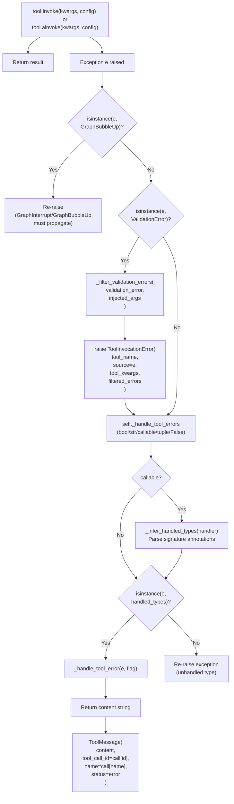

**Sources:** [libs/prebuilt/langgraph/prebuilt/tool_node.py:379-438](), [libs/prebuilt/langgraph/prebuilt/tool_node.py:978-1057](), [libs/prebuilt/langgraph/prebuilt/tool_node.py:440-504]()

---

## Tool Call Interceptors

### ToolCallRequest and Interceptors

Interceptors (`wrap_tool_call`) allow wrapping tool execution with custom logic [[libs/prebuilt/langgraph/prebuilt/tool_node.py:198-273]()]. They receive a `ToolCallRequest` which can be modified using `override()` [[libs/prebuilt/langgraph/prebuilt/tool_node.py:166-196]()].

**ToolCallRequest Class Diagram:**

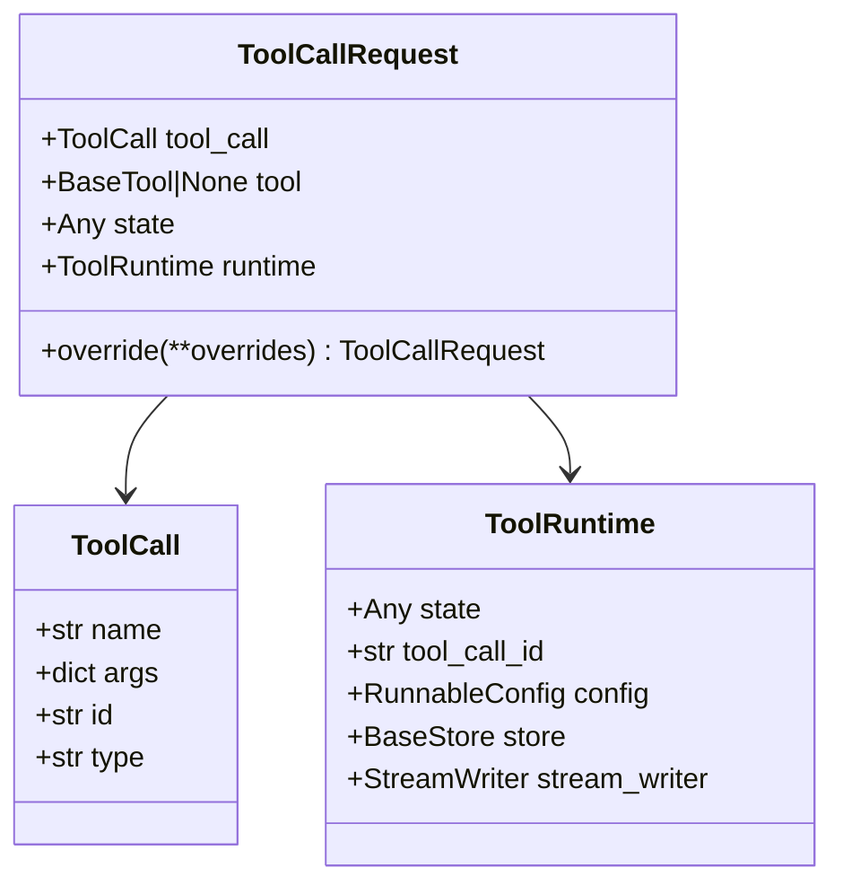

**Sources:** [libs/prebuilt/langgraph/prebuilt/tool_node.py:128-196](), [libs/prebuilt/langgraph/prebuilt/tool_node.py:198-280]()

### Interceptor Execution Flow

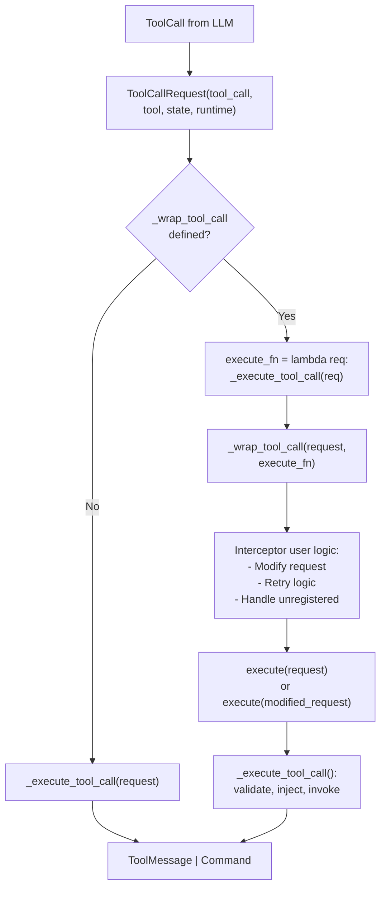

**Sources:** [libs/prebuilt/langgraph/prebuilt/tool_node.py:749-751](), [libs/prebuilt/langgraph/prebuilt/tool_node.py:978-1001](), [libs/prebuilt/tests/test_on_tool_call.py:1-556]()

---

## Command-Based Control Flow

Tools can return `Command` objects to update state or route the graph [[libs/prebuilt/langgraph/prebuilt/tool_node.py:1003-1057]()].

**Command Handling Flow:**

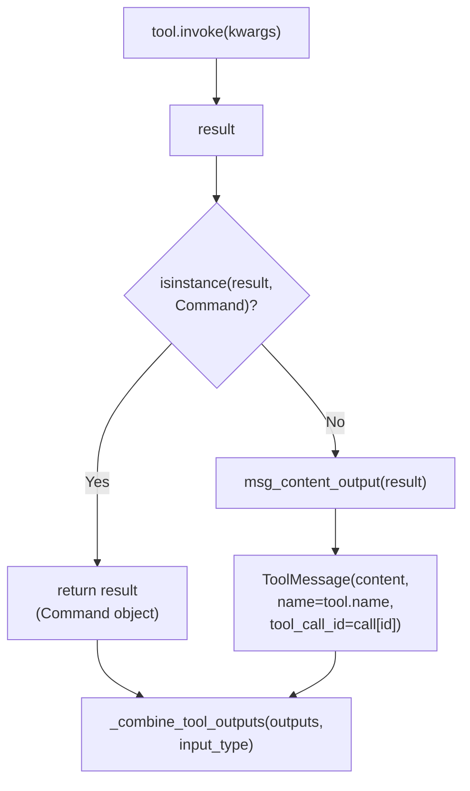

**Sources:** [libs/prebuilt/langgraph/prebuilt/tool_node.py:850-914](), [libs/prebuilt/langgraph/prebuilt/tool_node.py:1003-1057]()

---

## Integration with ReAct Agent

`create_react_agent` uses `ToolNode` to execute tool calls. In `version="v2"`, it uses `Send` to distribute tool calls to the `ToolNode` individually [[libs/prebuilt/langgraph/prebuilt/chat_agent_executor.py:844-860]()].

**ReAct Agent Tool Flow:**

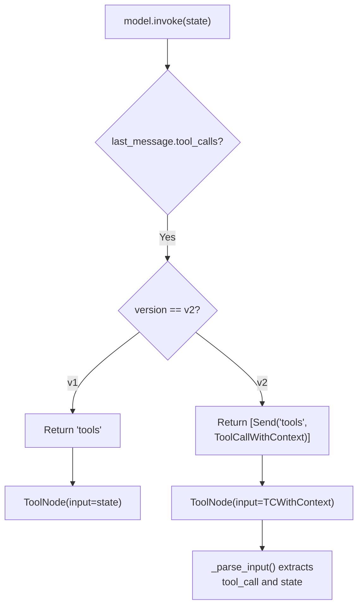

**Sources:** [libs/prebuilt/langgraph/prebuilt/chat_agent_executor.py:787-953](), [libs/prebuilt/langgraph/prebuilt/tool_node.py:282-303](), [libs/prebuilt/langgraph/prebuilt/tool_node.py:916-976]()