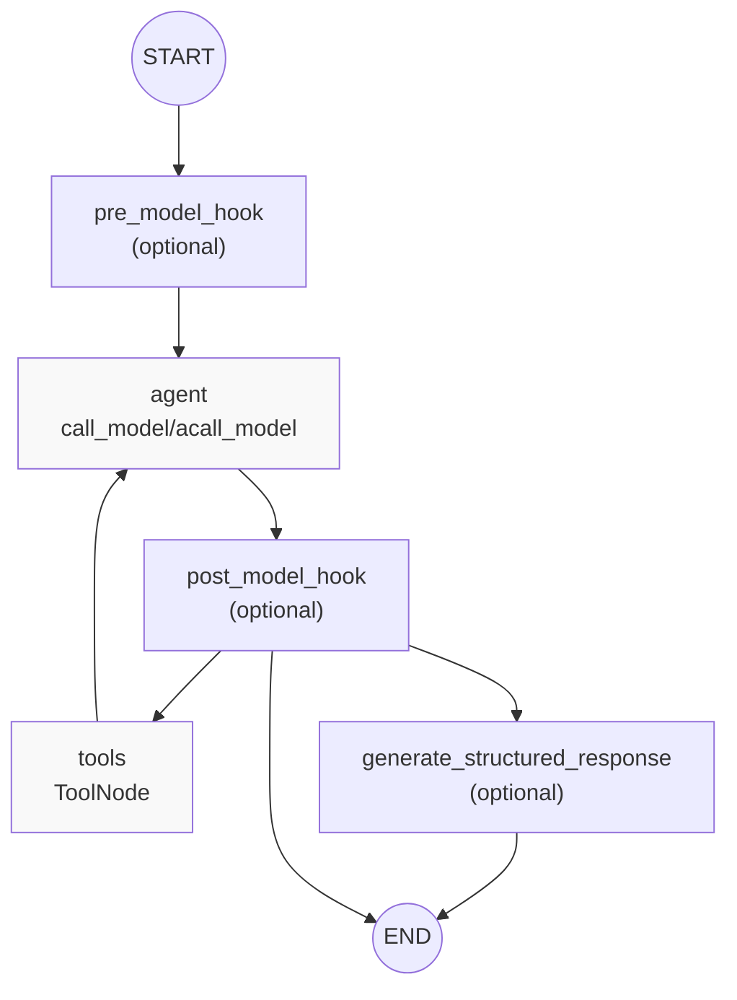
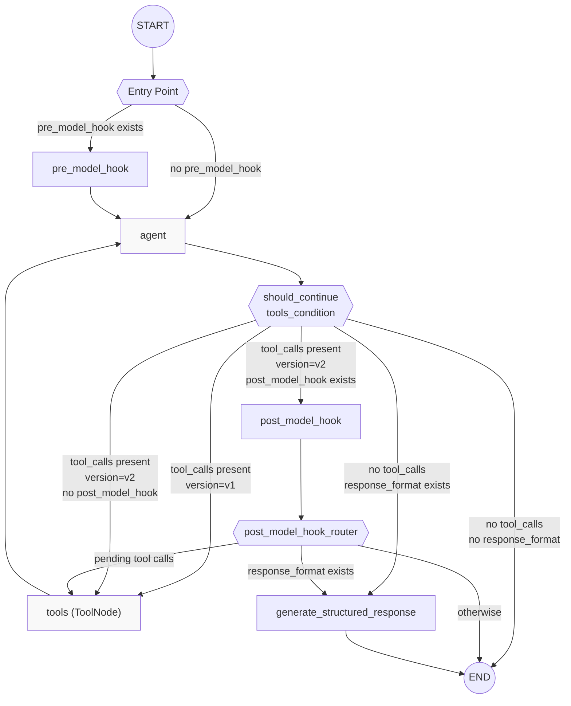

This page documents the `create_react_agent` factory function, which constructs a prebuilt ReAct (Reasoning and Acting) agent graph. This function provides a high-level API for creating agents that loop between calling a language model and executing tools until a stopping condition is met.

**Scope**: This page covers the `create_react_agent` factory function, its parameters, the generated graph structure, and execution patterns. For details on tool execution mechanics, see [ToolNode and Tool Execution (8.2)]().

**Note**: `create_react_agent` is part of the `langgraph-prebuilt` package. It utilizes the `StateGraph` API to orchestrate interactions between LLMs and tools. [libs/prebuilt/langgraph/prebuilt/chat_agent_executor.py:787-828]()

---

## Factory Function Overview

The `create_react_agent` function signature:

```python
def create_react_agent(
    model: LanguageModelLike | Callable,
    tools: Sequence[BaseTool | Callable] | ToolNode,
    *,
    prompt: Prompt | None = None,
    response_format: StructuredResponseSchema | tuple[str, StructuredResponseSchema] | None = None,
    pre_model_hook: RunnableLike | None = None,
    post_model_hook: RunnableLike | None = None,
    state_schema: StateSchemaType | None = None,
    context_schema: type[Any] | None = None,
    checkpointer: Checkpointer | None = None,
    store: BaseStore | None = None,
    interrupt_before: list[str] | None = None,
    interrupt_after: list[str] | None = None,
    debug: bool = False,
    version: Literal["v1", "v2"] = "v2",
    name: str | None = None,
) -> CompiledStateGraph
```

**Sources**: [libs/prebuilt/langgraph/prebuilt/chat_agent_executor.py:278-308]()

---

## Graph Architecture

### Basic Graph Structure

The `create_react_agent` function constructs a `StateGraph` with the following node structure:



**Diagram: Generated Graph Node Structure**

The actual edges depend on optional parameters:
- `pre_model_hook`: If provided, becomes the entry point; otherwise `agent` is the entry point. [libs/prebuilt/langgraph/prebuilt/chat_agent_executor.py:876-881]()
- `post_model_hook`: If provided, inserted after `agent` node. [libs/prebuilt/langgraph/prebuilt/chat_agent_executor.py:890-895]()
- `response_format`: If provided, adds `generate_structured_response` node as terminal node. [libs/prebuilt/langgraph/prebuilt/chat_agent_executor.py:898-910]()

**Sources**: [libs/prebuilt/langgraph/prebuilt/chat_agent_executor.py:787-828, 861-915]()

### Execution Flow with Conditionals



**Diagram: ReAct Agent Execution Flow with Routing Logic**

The `should_continue` function routes execution based on the last message's `tool_calls` attribute:
- If tool calls exist → route to tools. [libs/prebuilt/langgraph/prebuilt/chat_agent_executor.py:843-859]()
- If no tool calls and `response_format` provided → route to structured response generation. [libs/prebuilt/langgraph/prebuilt/chat_agent_executor.py:837-839]()
- Otherwise → `END`. [libs/prebuilt/langgraph/prebuilt/chat_agent_executor.py:841]()

**Sources**: [libs/prebuilt/langgraph/prebuilt/chat_agent_executor.py:831-860, 917-943]()

---

## Agent State Schema

### Default State: AgentState

The default state schema used when `state_schema` is not provided:

```python
class AgentState(TypedDict):
    messages: Annotated[Sequence[BaseMessage], add_messages]
    remaining_steps: NotRequired[RemainingSteps]
```

- **`messages`**: Message list with `add_messages` reducer for automatic message aggregation. [libs/prebuilt/langgraph/prebuilt/chat_agent_executor.py:60]()
- **`remaining_steps`**: Managed channel that tracks remaining execution steps. [libs/prebuilt/langgraph/prebuilt/chat_agent_executor.py:62]()

**Sources**: [libs/prebuilt/langgraph/prebuilt/chat_agent_executor.py:53-62]()

### Custom State Schemas

Custom state schemas must include `messages` and `remaining_steps` keys. Both `TypedDict` and Pydantic `BaseModel` schemas are supported. [libs/prebuilt/langgraph/prebuilt/chat_agent_executor.py:538-552]()

```python