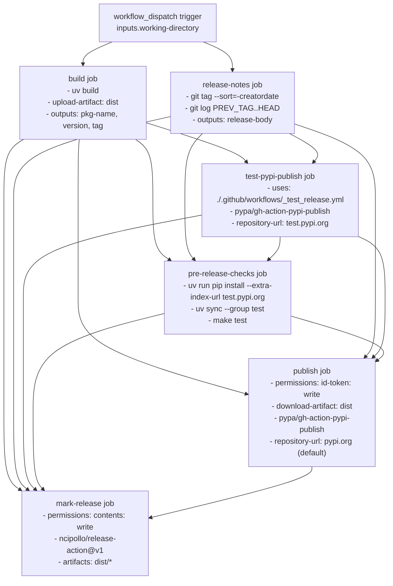
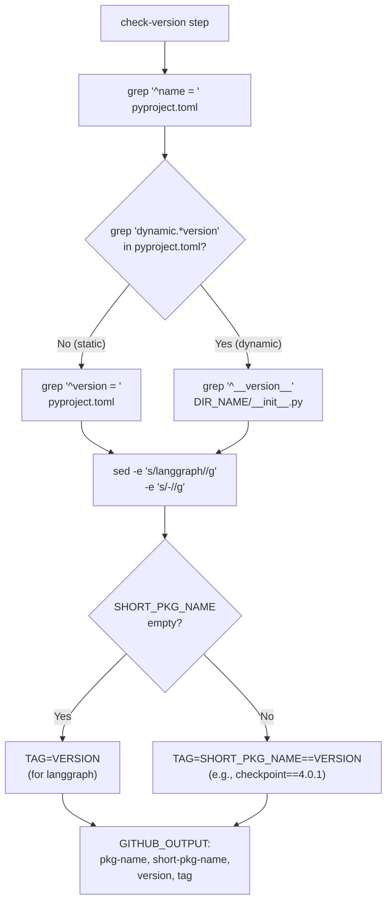
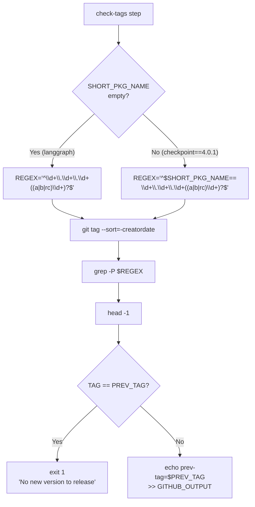
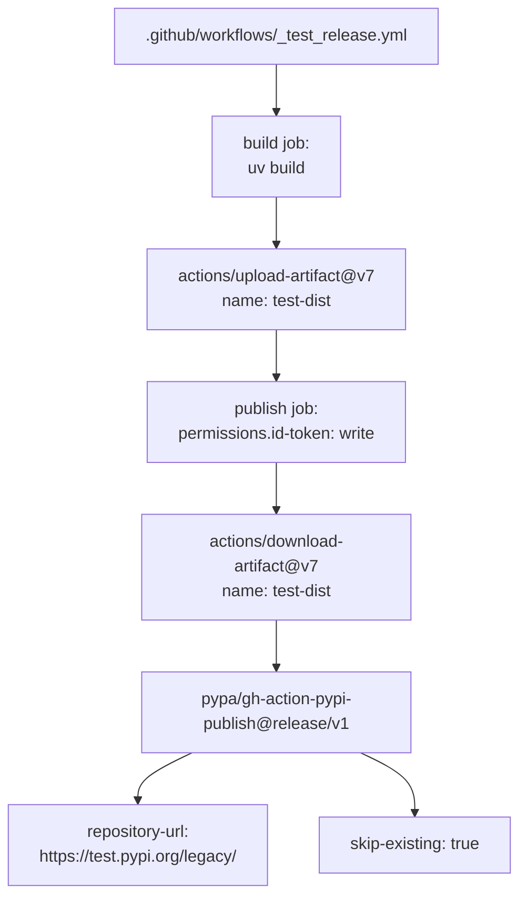
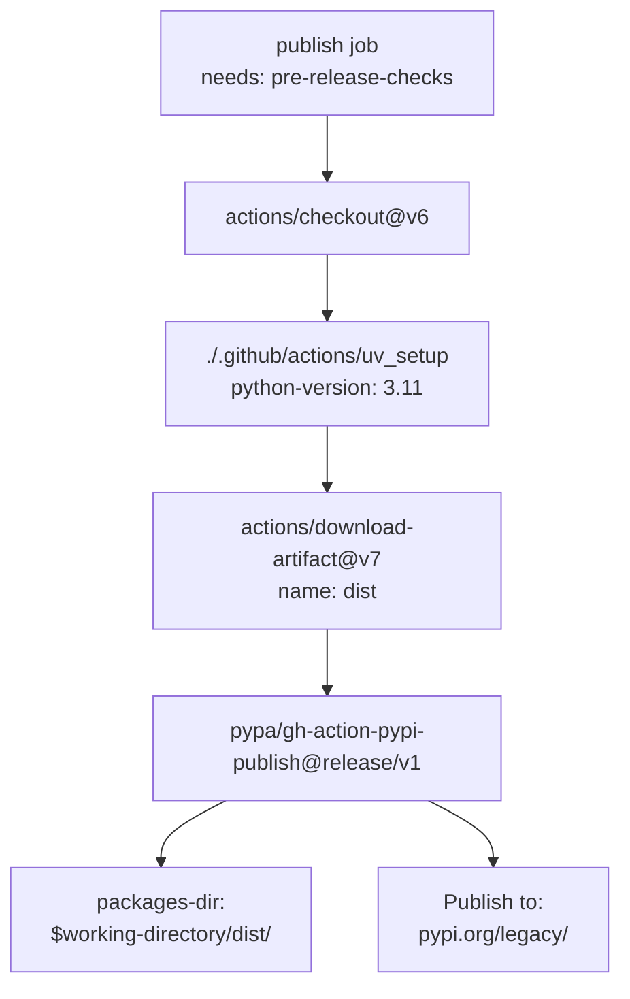
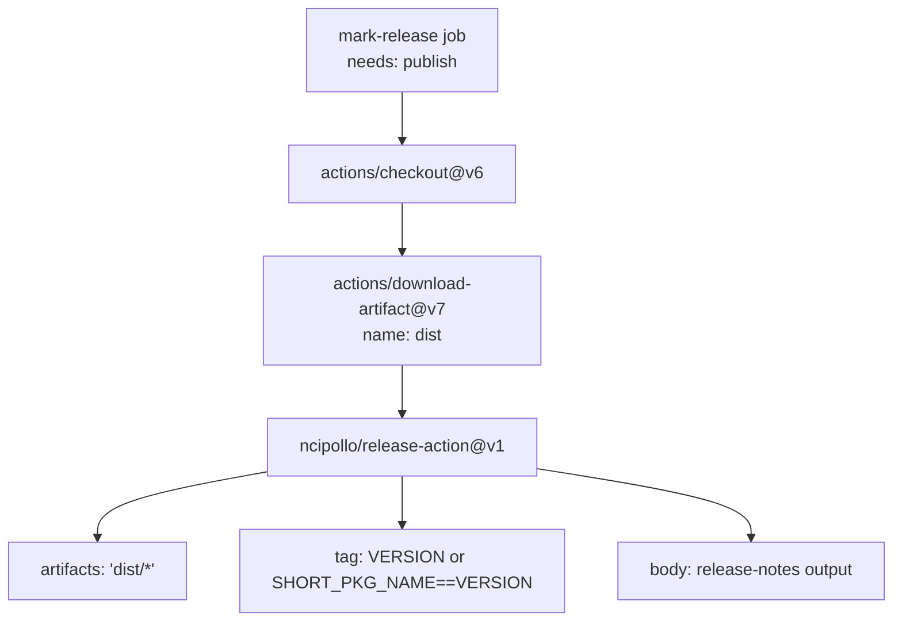

The LangGraph release process is implemented as a manually-triggered GitHub Actions workflow ([.github/workflows/release.yml:1-328]()) that publishes packages to PyPI. The workflow enforces permission isolation between build and publish stages, validates packages on TestPyPI before production release, and creates GitHub releases with git-based changelogs.

## Workflow Jobs

The `release.yml` workflow executes six jobs with strict dependency ordering:

| Job Name | Depends On | Purpose |
|----------|------------|---------|
| `build` | - | Execute `uv build` and extract `pkg-name`, `version`, `tag` outputs |
| `release-notes` | `build` | Compare git tags and generate changelog via `git log` |
| `test-pypi-publish` | `build`, `release-notes` | Invoke `.github/workflows/_test_release.yml` to publish to test.pypi.org |
| `pre-release-checks` | `build`, `release-notes`, `test-pypi-publish` | Install from TestPyPI with `--extra-index-url` and run `make test` |
| `publish` | `build`, `release-notes`, `test-pypi-publish`, `pre-release-checks` | Publish to pypi.org via `pypa/gh-action-pypi-publish@release/v1` |
| `mark-release` | `build`, `release-notes`, `test-pypi-publish`, `pre-release-checks`, `publish` | Create GitHub release via `ncipollo/release-action@v1` |

Sources: [.github/workflows/release.yml:17-328]()

## Job Dependency Graph

**Purpose**: Maps GitHub Actions workflow job dependencies with key actions and permissions used in each job.

Sources: [.github/workflows/release.yml:17-328]()

## Trigger and Inputs

The release workflow is triggered manually via `workflow_dispatch` with a single required input:

| Input | Type | Default | Description |
|-------|------|---------|-------------|
| `working-directory` | string | `libs/langgraph` | Package directory to release |

**Supported packages**:

| Package | Directory | Version File |
|---------|-----------|--------------|
| `langgraph` | `libs/langgraph` | [libs/langgraph/pyproject.toml:7]() |
| `langgraph-checkpoint` | `libs/checkpoint` | [libs/checkpoint/pyproject.toml:7]() |
| `langgraph-prebuilt` | `libs/prebuilt` | [libs/prebuilt/pyproject.toml:7]() |
| `langgraph-cli` | `libs/cli` | [libs/cli/pyproject.toml:7]() |
| `langgraph-sdk` | `libs/sdk-py` | [libs/sdk-py/pyproject.toml:7]() |

Sources: [.github/workflows/release.yml:3-9](), [.github/workflows/ci.yml:58-65]()

## Build Stage

The `build` job extracts version information and creates distribution artifacts using `uv build` ([.github/workflows/release.yml:49]()).

### Version Detection

**Purpose**: Shows bash script logic for extracting version information from `pyproject.toml` or `__init__.py`.

The version detection script performs the following ([.github/workflows/release.yml:58-80]()):

1. **Extract package name**: `PKG_NAME=$(grep -m 1 "^name = " pyproject.toml | cut -d '"' -f 2)`
2. **Check for dynamic versioning**: `grep -q 'dynamic.*=.*\[.*"version".*\]' pyproject.toml`
3. **Extract version**:
   - **Static (e.g., langgraph)**: `VERSION=$(grep -m 1 "^version = " pyproject.toml | cut -d '"' -f 2)`
   - **Dynamic**: `DIR_NAME=$(echo "$PKG_NAME" | tr '-' '_')` then `VERSION=$(grep -m 1 '^__version__' "${DIR_NAME}/__init__.py" | cut -d '"' -f 2)`
4. **Generate short name**: `SHORT_PKG_NAME="$(echo "$PKG_NAME" | sed -e 's/langgraph//g' -e 's/-//g')"` → `checkpoint` for `langgraph-checkpoint`
5. **Create tag**:
   - **langgraph package**: `TAG="$VERSION"`
   - **Other packages**: `TAG="${SHORT_PKG_NAME}==${VERSION}"` → `checkpoint==4.0.1`

### Build Artifacts

The build step uses `uv build` at [.github/workflows/release.yml:49-50]() to create source and wheel distributions. Artifacts are uploaded via `actions/upload-artifact@v7` at [.github/workflows/release.yml:52-56]() with artifact name `dist`.

Build output uses `hatchling` as the build backend, as specified in package configurations:
- `langgraph`: [libs/langgraph/pyproject.toml:1-3]()
- `langgraph-checkpoint`: [libs/checkpoint/pyproject.toml:1-3]()
- `langgraph-prebuilt`: [libs/prebuilt/pyproject.toml:1-3]()

## Release Notes Generation

The `release-notes` job creates a changelog by comparing the current version tag against the most recent previous tag using `git log` ([.github/workflows/release.yml:136]()).

### Tag Comparison Logic

**Purpose**: Shows bash script logic for finding the previous version tag and validating the new release.

The tag comparison at [.github/workflows/release.yml:97-119]() filters existing tags using regex patterns based on whether the package is the core `langgraph` package or a sub-package like `langgraph-checkpoint`.

### Changelog Generation

The `generate-release-body` step ([.github/workflows/release.yml:120-139]()) creates release notes by extracting commit subjects since the last tag. If no previous tag is found, it defaults to "Initial release" ([.github/workflows/release.yml:131-137]()).

## TestPyPI Publishing

The `test-pypi-publish` job ([.github/workflows/release.yml:141-151]()) uses the reusable workflow `_test_release.yml` to publish the package to TestPyPI.

### TestPyPI Workflow

**Purpose**: Shows the TestPyPI release workflow structure and artifact flow.

The workflow uses Trusted Publishing with OIDC, requiring `id-token: write` permissions ([.github/workflows/_test_release.yml:74]()).

## Pre-Release Checks

The `pre-release-checks` job ([.github/workflows/release.yml:153-242]()) verifies the published TestPyPI package by installing it in a fresh environment and running the test suite.

### Package Installation from TestPyPI

The installation logic at [.github/workflows/release.yml:182-221]() performs a `pip install` using `test.pypi.org` as an extra index URL. It includes a retry mechanism with a 5-second sleep to account for TestPyPI indexing delays ([.github/workflows/release.yml:188-200]()).

**Cache Exclusion**: Caching is explicitly disabled for this job ([.github/workflows/release.yml:179]()) to ensure tests are sensitive to missing dependencies that might otherwise be satisfied by a cached environment ([.github/workflows/release.yml:162-173]()).

## PyPI Publishing

The `publish` job ([.github/workflows/release.yml:243-285]()) performs the final production release to PyPI.

### Production Publishing Workflow

**Purpose**: Shows the production publish job steps and `pypa/gh-action-pypi-publish` configuration.

The job uses Trusted Publishing via `id-token: write` permissions ([.github/workflows/release.yml:256]()) and points to the `dist/` directory containing artifacts from the `build` job ([.github/workflows/release.yml:280]()).

## GitHub Release Creation

The `mark-release` job ([.github/workflows/release.yml:286-328]()) creates the final GitHub release.

### Release Creation Workflow

**Purpose**: Shows the `ncipollo/release-action` configuration for creating the GitHub Release.

The release is created using the `GITHUB_TOKEN` with `contents: write` permissions ([.github/workflows/release.yml:297]()). It uploads all artifacts from the `dist/` directory ([.github/workflows/release.yml:321]()) and uses the body generated by the `release-notes` job ([.github/workflows/release.yml:326]()).

Sources: [.github/workflows/release.yml:1-328](), [.github/workflows/_test_release.yml:1-98](), [.github/workflows/ci.yml:58-65]()